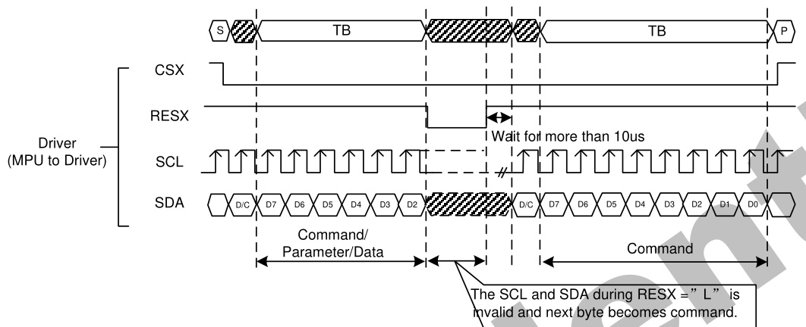
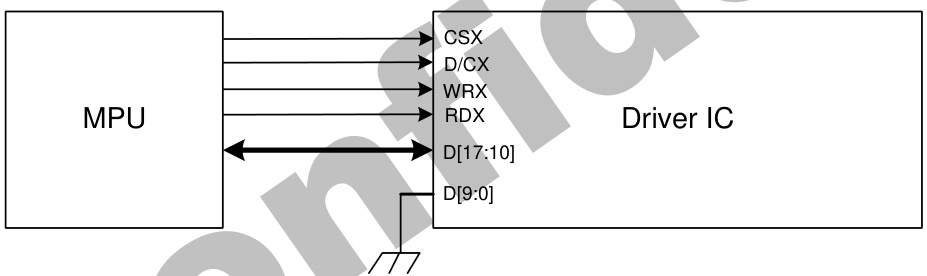
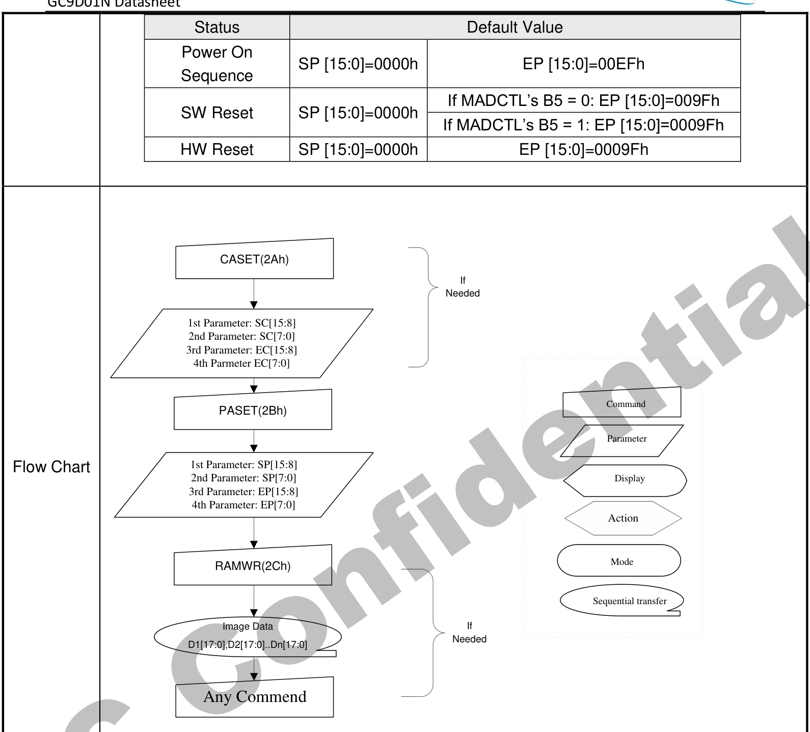
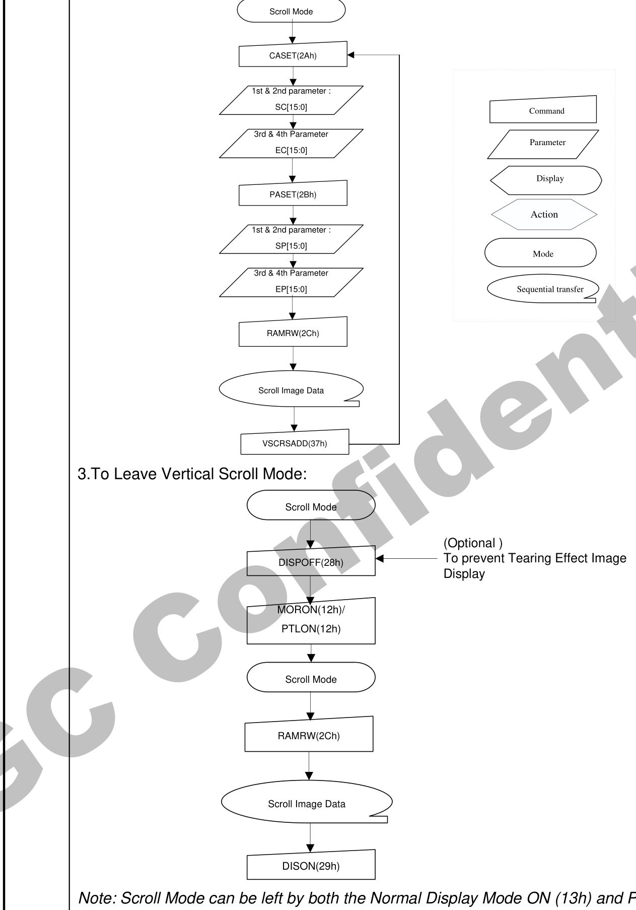
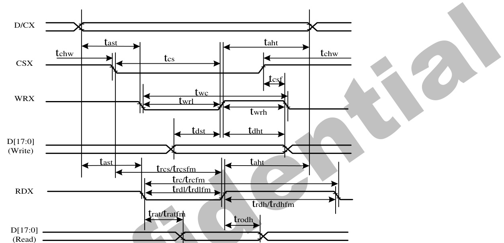

GC9D01N

# a-Si TFT LCD Single Chip Driver 160RGBx160 Resolution

Datasheet

# Ordering Information

# GC9D01N

(a-Si TFT LCD Single Chip Driver 160RGBx160 Resolution)

# GENERATION REVISION HISTORY

<html><body><table><tr><td>Version.</td><td>Effective Date</td><td>Description of Changes</td><td>Prepared bye</td></tr><tr><td>V1.0</td><td>2021-1-15</td><td>Document Release</td><td>Kelly</td></tr><tr><td>V1.1</td><td>2021-4-9</td><td>AE REVIEW</td><td>Evie</td></tr><tr><td></td><td></td><td></td><td></td></tr><tr><td></td><td></td><td></td><td></td></tr><tr><td></td><td></td><td></td><td></td></tr><tr><td></td><td></td><td></td><td></td></tr><tr><td></td><td></td><td></td><td></td></tr><tr><td></td><td></td><td></td><td></td></tr><tr><td></td><td></td><td></td><td></td></tr><tr><td></td><td></td><td></td><td></td></tr><tr><td></td><td></td><td></td><td></td></tr><tr><td></td><td></td><td></td><td></td></tr><tr><td></td><td></td><td></td><td></td></tr><tr><td></td><td></td><td></td><td></td></tr><tr><td></td><td></td><td></td><td></td></tr></table></body></html>

# Galaxycore Incorporation

Galaxycore Inc. reserves the right to change the contents in this document without prior notice

# Table of Content

Table of Content .. 3

Introduction . .6

1. Features .

2. Block Diagram . .8

2.1. Block diagram . .8

2.2. Pin Description . .9   
2.3. PAD coordinates . .15   
3. Interface setting.. .20   
3.1. MCU interfaces . .20   
3.1.1. MCU interface selection . ..21   
3.1.2. 8080-I Series Parallel Interface . .22   
3.1.3. Write Cycle Sequence . .24   
3.1.4. Read Cycle Sequence .. .25   
3.1.5. 8080-Ⅱ Series Parallel Interface .. .26   
3.1.6. Write Cycle Sequence .. ..27   
3.1.7. Read Cycle Sequence ... .28   
3.1.8. Serial Interface .29   
3.1.9. Write Cycle Sequence... .30   
3.1.10. Read Cycle Sequence .32   
3.1.11. Data Transfer Break and Recovery . ..35   
3.1.12. Data Transfer Pause . .37   
3.1.13. Serial Interface Pause (3_wire) . .39   
3.1.14. Parallel Interface Pause .. .40   
3.1.15. Data Transfer Mode . 41   
3.1.16. Data Transfer Method 1 .. ..41   
3.1.17. Data Transfer Method 2 .. .41   
3.2. RGB Interface . .42   
3.2.1. RGB Interface Selection . .42   
3.2.2. RGB Interface Timing .45   
3.3. Display Data RAM (DDRAM) . ..48   
3.4. Display Data Format .. ..48   
3.4.1. 3-line Serial Interface . .49   
3.4.2. 4-line Serial Interface . .52   
3.4.3. 2-data-lane mode .54   
3.4.4. 8-bit Parallel MCU Interface . ..56   
3.4.5. 9-bit Parallel MCU Interface . .59   
3.4.6. 16-bit Parallel MCU Interface ..61   
3.4.7. 18-bit Parallel MCU Interface ..67   
3.4.8. 6-bit Parallel RGB Interface . .72   
3.4.9. 16-bit Parallel RGB Interface.. .73   
3.4.10. 18-bit Parallel RGB Interface.. 74   
4. Function Description .... ..75   
4.1. Display data GRAM mapping .. .75   
4.2. MCU to memory write/read direction . ..76   
4.3. GRAM to display address mapping .... ....78   
4.3.1. Normal display on or partial mode on, vertical scroll off ... .79   
4.3.2. Vertical scroll display mode . ..80   
4.3.3. Updating order on display active area in RGB interface mode .... ...81   
4.4. Tearing effect output line ... ...83   
4.4.1. Tearing effect line modes . ..84   
4.4.2. Tearing effect line timing .... .85   
4.5. Source driver ... ...86   
4.6. Gate driver . .86   
4.7. LCD power generation circuit .... ..87   
4.7.1. Power supply circuit .. ...87   
4.7.2. LCD power generation scheme . ...88   
4.8. Gamma Correction ... ...89   
4.9. Power Level Definition .. ..92   
4.9.1. Power Levels .. .92   
4.9.2. Power Flow Chart ..... ....93   
4.10. Brightness control block .... .94   
4.11. Input/output pin state . .95   
4.11.1. Output pins ..... ..95   
4.11.2. Input pins ... ..95   
Command .... ..96   
5.1. Command List ... ...96   
5.2. Description of Level 1 Command .. ..102   
5.2.1. Read display identification information (04h) .. ..102   
5.2.2. Read Display Status (09h) ... ..104   
5.2.3. Enter Sleep Mode (10h) ... .106   
5.2.4. Sleep Out Mode (11h) ... .108   
5.2.5. Partial Mode ON (12h) ... . 110   
5.2.6. Normal Display Mode ON (13h) . 111   
5.2.7. Display Inversion OFF (20h) ... . 112   
5.2.8. Display Inversion ON (21h) ... .. 113   
5.2.9. Display OFF (28h) .... .. 114   
5.2.10. Display ON (29h) . 115   
5.2.11. Column Address Set (2Ah) ... 116   
5.2.12. Row Address Set (2Bh) .. .. 118   
5.2.13. Memory Write (2Ch) ... ..120   
5.2.14. Partial Area (30h) ... ..122   
5.2.15. Vertical Scrolling Definition (33h) . ..125   
5.2.16. Tearing Effect Line OFF (34h) . ..129   
5.2.17. Tearing Effect Line ON (35h) ... ..130   
5.2.18. Memory Access Control(36h) .... .....132   
5.2.19. Vertical Scrolling Start Address (37h) . 135   
5.2.20. Idle Mode OFF (38h) . ..138   
5.2.21. Idle Mode ON (39h) . .139   
5.2.22. COLMOD: Pixel Format Set (3Ah) . ..142   
5.2.23. Write Memory Contiue (3Ch) . .144   
5.2.24. Set_Tear_Scanline (44h) . 147   
5.2.25. Get_Scanline (45h) . .149   
5.2.26. Write Display Brightness (51h) . .150   
5.2.27. Write CTRL Display (53h) . 151   
5.2.28. Read ID1 (DAh) . ..153   
5.2.29. Read ID2 (DBh) . 155   
5.2.30. Read ID3 (DCh) . .157   
5.3. Description of Level 2 Command . 159   
5.3.1. RGB Interface Signal Control (B0h) . 159   
5.3.2. Blanking Porch Control (B5h) . .162   
5.3.3. Display Function Control (B6h) . .164   
5.3.4. Tearing Effect Control (B4h) . .167   
5.3.5. Interface Control (F6h) .169   
5.4. Description of Level 3 Command . .170   
5.4.1. Inversion (ECh) . .170   
5.4.2. Dual-Single gate select (BFh) ..171   
5.4.3. SPI 2DATA control(B1h) . .172   
5.4.4. Power Control 1 (C1h) 173   
5.4.5. Power Control 2 (C3h) ..174   
5.4.6. Power Control 3 (C4h) .175   
5.4.7. Power Control 4 (C9h) .176   
5.4.8. Inter Register Enable1(FEh) . ..177   
5.4.9. Inter Register Enable2(EFh) .178   
5.4.10. SET_GAMMA1 (F0h) . .179   
5.4.11. SET_GAMMA2 (F1h) .. ..181   
5.4.12. SET_GAMMA3 (F2h) . .183   
5.4.13. SET_GAMMA4 (F3h) . .185   
Electrical Characteristics .187   
6.1. Absolute Maximum Ratings .. .187   
6.2. DC Characteristics .188   
6.2.1. DC Characteristics for Panel Driving . .188

6.3. AC Characteristics .189

6.3.1. Display Parallel $1 8 / 1 6 / 9 / 8$ -bit Interface Timing Characteristics (8080-Ⅰ) .....189   
6.3.2. Display Parallel $1 8 / 1 6 / 9 / 8$ -bit Interface Timing Characteristics (8080-Ⅱ) .....191   
6.3.3. Display Serial Interface Timing Characteristics (3-line SPI system) . ..193   
6.3.4. Display Serial Interface Timing Characteristics (4-line SPI system) .195   
6.3.5. Parallel 18/16/6-bit RGB Interface Timing Characteristics . .197

# Introduction

GC9D01N is a 262,144-color single-chip SOC driver for a-TFT liquid crystal display with resolution of 160RGBx160 dots, comprising a 240-channel source driver, a 32-channel gate driver, 57,600 bytes GRAM for graphic display data of 160RGBx160 dots, and power supply circuit.

GC9D01N supports parallel $8 \mathrm { - } / 9 \mathrm { - } / 1 6 \mathrm { - } / 1 8$ -bit data bus MCU interface, 6-/16-/18-bit data bus RGB interface , 3-/4-line serial peripheral interface (SPI) , 3 line 2data lane interface and MIPI interface . The moving picture area can be specified in internal GRAM by window address function. The specified window area can be updated selectively, so that moving picture can be displayed simultaneously independent of still picture area.

GC9D01N supports full color, 8-color display mode and sleep mode for precise power control by software and these features make the GC9D01N an ideal LCD driver for medium or small size portable products such as digital cellular phones, smart phone, MP3 and PMP where long battery life is a major concern.

# Features

$\blacktriangle$ Dual gate and single gate TFT LCD driver with 0D 0C   
$\spadesuit$ Display resolution: [160 RGB] (H) x 160(V)   
$\blacktriangle$ Output: - 240 source outputs - 32 gate outputs

Resolution: 160RGBx160：S1-S240  Dual gate（default）; 120RGBX160：S31-S210 Dual gate 80RGBX160：S1-S240 Single gate; 40RGBX160：S61-S180 Single gate a-TFT LCD driver with on-chip full display RAM: 57,600 bytes System Interface - 8-bits, 9-bits, 16-bits, 18-bits interface with 8080-I /8080-II series MCU - 6-bits, 16-bits, 18-bits RGB interface with graphic controller - 8-bits, 9-bits Serial Peripheral Interface (SPI) and 2 data lane SPI

Display mode: - Full color mode (Idle mode OFF): 262K-color - Reduce color mode (Idle mode ON): 8-color

Power saving mode: - Sleep mode

Frame rate-Normal mode（ $2 0 H z \sim 6 5 H z$ ）-Idle mode （1Hz\~30Hz）

On chip functions: - Timing generator - Oscillator - DC/DC converter

- Dual Gate Support driving method $1 + 2 H 1 \vee$ ,1 $^ +$ 2column,2column - Single Gate Support Column,1-dot

Low -power consumption architecture - Low operating power supplies:  $\mathsf { V D D l } = 1 . 6 5 \mathsf { V } \sim 3 . 3 \mathsf { V }$ (logic)  $\mathsf { V D D B } = 2 . 5 \mathsf { V } \sim 3 . 3 \mathsf { V }$ (analog)

LCD Voltage drive:   
- Source/Gamma power supply voltage VAP (GVDD) to VAN (GVCL): $+ 6 . 4 \sim - 4 . 4 \lor$   
- Gate driver output voltage

$\blacktriangleright$ VGH voltage range:9V\~14V $\blacktriangleright$ VGL voltage range:-9V\~-14 V - VCOM connect to GND

Operate temperature range: $- 4 0 ^ { \circ } \mathrm { C }$ to $8 5 ^ { \circ } \mathrm { C }$

# 1. Block Diagram

# 1.1. Block diagram

  
Figure1

# 1.2. Pin Description

Table 1.   

<html><body><table><tr><td colspan="4">Power Supply Pins</td></tr><tr><td>Pin Name</td><td>I/0</td><td>Connect Pin</td><td>Descriptions</td></tr><tr><td>VDDI(IOVCC)</td><td></td><td>VDDI</td><td>Low voltage power supply for interface logic circuits(1.65~3.3V)</td></tr><tr><td>VDDB(VCI)</td><td></td><td>VDDB</td><td>High voltage power supply for analog circuit blocks(2.5~3.3V)</td></tr><tr><td>VSSB/VSSR</td><td></td><td>GND</td><td>System ground level</td></tr></table></body></html>

Table 2   

<html><body><table><tr><td colspan="8">Interface Logic Signals</td></tr><tr><td>Pin Name</td><td>I/0 Connect Pin</td><td colspan="7"></td></tr><tr><td rowspan="12"></td><td rowspan="12">(VDDI/ GND) C</td><td colspan="7">Descriptions Select the MCU interface mode</td></tr><tr><td> IM3</td><td>IM2</td><td> IM1</td><td> IMO</td><td> MCU-Interface</td><td>Pins in use Register</td><td>GRAM</td></tr><tr><td>0</td><td>0</td><td>0</td><td>0</td><td>8080- MCU 8bit interface II</td><td>D[17:10]</td><td>D[17:10]</td></tr><tr><td>0</td><td>0</td><td>0</td><td>1</td><td>8080- MCU 9bit bus interface II</td><td>D[17:10]</td><td>D[17:9]</td></tr><tr><td>0</td><td>0</td><td>1</td><td>0</td><td>8080-MCU16-bi t bus interface II</td><td>D[8:1]</td><td>D[17:10] D[8:1]</td></tr><tr><td></td><td>0 0</td><td>1</td><td>1</td><td>8080 MCU18-bit bus</td><td>D[8:1]</td><td>D[17:0]</td></tr><tr><td></td><td>0 1</td><td>0</td><td>0</td><td colspan="2">interface II 8080- MCU 8bit D[7:0]</td><td>D[7:0]</td></tr><tr><td rowspan="6">IM[3:0]</td><td>0</td><td>1 0</td><td>1</td><td>interface I 8080- MCU 9bit bus interface I</td><td></td><td>D[7:0]</td><td>D[8:0]</td></tr><tr><td>0 1</td><td></td><td>0</td><td>8080- MCU 16bit bus</td><td></td><td>D[7:0]</td><td>D[15:0]</td></tr><tr><td>0</td><td></td><td></td><td>1</td><td>interface I 8080- MCU 18bit bus</td><td>D[7:0]</td><td>D[17:0]</td></tr><tr><td>1 0</td><td>0</td><td></td><td>0 x</td><td>interface I</td><td>x</td><td>x</td></tr><tr><td>1 0</td><td>0</td><td>1</td><td></td><td>3-wire 9-bit data serial interface</td><td>SDA</td><td>SDA</td></tr><tr><td>1 0</td><td>1</td><td>0</td><td>II x</td><td></td><td>SDO x</td><td>x</td></tr><tr><td rowspan="7"></td><td>1 0</td><td>1</td><td></td><td></td><td>4-wire 8-bit data serial interface</td><td>SDA</td><td>SDA</td></tr><tr><td>1</td><td>1</td><td>0</td><td>1 0</td><td>II x</td><td>SDO x</td><td>x</td></tr><tr><td rowspan="2">1</td><td rowspan="2">1</td><td rowspan="2">0</td><td rowspan="2">1</td><td>3-wire 9-bit data serial interface I</td><td>SDA</td><td>SDA</td></tr><tr><td>2 data lane</td><td>SDA</td><td>SDA/</td></tr><tr><td rowspan="2">1</td><td rowspan="2">1</td><td></td><td>0 x</td><td>serial interface I</td><td>x</td><td>D/CX x</td></tr><tr><td>1</td><td>1</td><td>4-wire 8-bit data</td><td>SDA</td><td>SDA</td></tr><tr><td>1</td><td rowspan="2">1 1</td><td rowspan="2"></td><td rowspan="2"></td><td rowspan="2">serial interface I</td><td rowspan="2"></td><td rowspan="2"></td></tr><tr><td colspan="7">MPU Parallel interface bus and serial interface select If use RGB Interface must select serial interface.e</td></tr></table></body></html>

<html><body><table><tr><td></td><td></td><td></td><td>Fix this pin at VDDI or GND.</td></tr><tr><td>RESX cSX</td><td></td><td>MCU (VDDI/GND)</td><td>This signal will reset the device and must be applied to properly initialize the chip. Signal is active low. Chip select input pin( "Low" enable).</td></tr><tr><td></td><td></td><td>MCU (VDDI/GND) MCU</td><td>This pin can be permanently fixed "Low" in MPU interface mode only. This pin is used to select "Data or Command" in the parallel interface</td></tr><tr><td>D/CX (SCL)</td><td></td><td>(VDDI/ GND)</td><td>When DCX='1', data is selected.. When DCX='0', command is selected.. This pin is used serial interface clock in 3-wire 9-bit / 4-wire 8-bit /QSPI serial interface. If not used, this pin should be connected to VDDI or GND.</td></tr><tr><td>RDX</td><td></td><td>MCU (VDDI/ GND)</td><td>8080-l/8080-II system (RDX): Serves as a read signal and MCU read data at the rising edge. Fix to VDDI level when not in use. 8080-l/8080-II system (wRX): Serves as a write signal and writes</td></tr><tr><td>WRX (D/CX)</td><td></td><td>MCU (VDDI/ GND)</td><td>data at the rising edge. 4-wire system (D/CX): Serves as command or parameter select. 3-wire 2data mode: Serves as second data pin. Fix to VDDI level when not in use.. 18-bit parallel bi-directional data bus for MCU system and RGB</td></tr><tr><td>D[17:0]</td><td>I/0</td><td>MCU (VDDI/ GND)</td><td>interface mode QSPI 4wire mode D[3:1] Server as SDA[3:1] Fix to GND level when not in use When IM[2]: High, Serial in/out signal in 3-wire 9-bit/4-wire 8-bit</td></tr><tr><td>SDA</td><td>I/0</td><td>MCU (VDDI/ GND)</td><td>serial data interface. When IM[2]: Low, Serial input signal in 3-wire 9-bit/4-wire 8-bit serial data interface. When IM[3:0]= 1100, Serial input signal in QSPI serial data interface. The data is applied on the rising edge of the SCL signal. If not used, fix this pin at VDDI or GND.</td></tr><tr><td>SDO</td><td>0</td><td>MCU (VDDI/GND)</td><td>Serial output signal. The data is outputted on the falling edge of the SCL signal. If not used, open this pin</td></tr><tr><td>TE</td><td>0</td><td>MCU (VDDI/ GND)</td><td>Tearing effect output pin to synchronize MPU to frame writing, activated by S/W command. When this pin is not activated, this pin is low. If not used, open this pin..</td></tr><tr><td>DOTCL K</td><td></td><td>MCU (VDDI/GND)</td><td>Dot clock signal for RGB interface operation.. Fix to VDDI or GND level when not in use..</td></tr></table></body></html>

<html><body><table><tr><td>VSYNC</td><td></td><td>MCU (VDDI/GND)</td><td>Frame synchronizing signal for RGB interface operation. Fix to VDDI or GND level when not in use.</td></tr><tr><td>HSYNC</td><td></td><td>MCU (VDDI/ GND)</td><td>Line synchronizing signal for RGB interface operation. Fix to VDDI or GND level when not in use.</td></tr><tr><td>DE</td><td></td><td>MCU (VDDI/ GND)</td><td>Data enable signal for RGB interface operation. Fix to VDDI or GND level when not in use.</td></tr><tr><td>VCOM</td><td></td><td>GND</td><td>Fix to GND</td></tr></table></body></html>

# Note:

1. If CSX is connected to GND in Parallel interface mode, there will be no abnormal visible effect to the display module. Also there will be no restriction on using the Parallel Read/Write protocols, Power On/Off Sequences or other functions. Further more there will be no influence to the Power   
Consumption of the display module.   
2. When $\cos x = 1$ ‟, there is no influence to the parallel and serial interface.

Table 3   

<html><body><table><tr><td colspan="4">LCD Driver Input/Output Pinse</td></tr><tr><td>Pin Name</td><td>I/0</td><td>Connect Pina</td><td>Descriptionse</td></tr><tr><td rowspan="2">S240~S1</td><td rowspan="2">0</td><td rowspan="2">LCD</td><td>Source output signals..</td></tr><tr><td>Leave the pin to open when not in use.</td></tr><tr><td rowspan="2">G1~G32</td><td rowspan="2">0</td><td rowspan="2">LCD</td><td>Gate output signals.</td></tr><tr><td>Leave the pin to open when not in use.</td></tr><tr><td>VCOM</td><td>0</td><td>GND</td><td>Connect to GND.</td></tr><tr><td>DVDD</td><td>0</td><td>Power</td><td>Regulated Low voltage level for interface circuits Don't apply any external power to this pin.</td></tr><tr><td>VRCL</td><td>0</td><td>Power</td><td>Power of VGH & VGL.</td></tr><tr><td>VGH</td><td>0</td><td>Power</td><td>Power supply for the gate driver (Positive).</td></tr><tr><td>VGL</td><td>0</td><td>Power</td><td>Power supply for the gate driver (Negative).</td></tr><tr><td>BVDD</td><td>0</td><td>Power</td><td>Analog power for Source</td></tr><tr><td>BVEE</td><td>0</td><td>Power</td><td>Analog power for Source</td></tr><tr><td>VREG1A</td><td>0</td><td>Ref</td><td>VREG1A is the highest positive grayscale reference voltage of source driver.</td></tr><tr><td>VREG1B</td><td>0</td><td>Ref</td><td>VREG1B is the lowest positive grayscale reference voltage of source driver. test by VREGP pin</td></tr><tr><td>VREG2B</td><td>0</td><td>Ref</td><td>VREG2B is the lowest negative grayscale reference voltage of source driver, test by VREGP pin</td></tr><tr><td>VREG2A</td><td>0</td><td>Ref</td><td>VREG2A is the highest negative grayscale reference voltage of source driver , test VREGN pin</td></tr><tr><td rowspan="2">BC</td><td rowspan="2"></td><td rowspan="2">Dig IO</td><td>Output pin for PwM (Pulse width Modulation) signal of LED driving.e</td></tr><tr><td>If not used, open this pin..</td></tr></table></body></html>

Table 4   

<html><body><table><tr><td colspan="4"></td></tr><tr><td> Pin Name</td><td>1/O</td><td>Connect Pin</td><td>Test Pins Descriptions</td></tr><tr><td>OSC_IN</td><td>1/0</td><td>Open</td><td>Test pin</td></tr><tr><td>OSC_TES T</td><td>I/0</td><td>Open</td><td>Test pin</td></tr><tr><td>VPP</td><td>I/0</td><td>Open</td><td>Test pin</td></tr><tr><td>DUMMY</td><td></td><td>Open</td><td>Input pads used only for test purpose at IC-side. During normal operation , leave these pads open..</td></tr></table></body></html>

# Liquid crystal power supply specifications Table Table 5

<html><body><table><tr><td>No.</td><td colspan="2">Item</td><td>Description</td></tr><tr><td>1</td><td colspan="2">TFT Source Driver</td><td>support 160*RGB (max)</td></tr><tr><td>2</td><td colspan="2">TFT Gate Driver</td><td>32 pins</td></tr><tr><td>3</td><td colspan="2">TFT Display's Capacitor Structure</td><td colspan="2">Cst structure only (Cs on Common)</td></tr><tr><td rowspan="2">4</td><td rowspan="2">Liquid Crystal Drive Outpute</td><td>S1~S240</td><td colspan="2">V0~V63 grayscales</td></tr><tr><td>G1~G32</td><td>VGH-VGL</td><td></td></tr><tr><td rowspan="2">5</td><td colspan="2">Input Voltage</td><td>VDDI</td><td>1.65~3.30V</td></tr><tr><td colspan="2"></td><td>VDDB</td><td>2.50~3.30V</td></tr><tr><td rowspan="6">6</td><td rowspan="6">Liquid Crystal Voltages</td><td>BVDD</td><td>4.5~6.8V</td><td></td></tr><tr><td>BVEE</td><td>-4.7V~-2.5V</td><td></td></tr><tr><td>Drive VGH</td><td>9.0~14.0V</td><td></td></tr><tr><td>VGL</td><td>-14.0~-9.0V</td><td></td></tr><tr><td>VCL</td><td>-3.0~-1.5V</td><td></td></tr><tr><td>VGH</td><td>VDDB*5</td><td></td></tr><tr><td rowspan="2">7</td><td rowspan="2">Internal Step-up Circuits.</td><td>VGL</td><td>VDDB*-5</td></tr><tr><td>VCL</td><td>VDDB*-1</td></tr></table></body></html>

# 1.3. PAD coordinates

<html><body><table><tr><td>Pad No.</td><td>Text Name</td><td>X-axis</td><td>Y-axis</td><td>Pad No.</td><td>Text Name</td><td>X-axis</td><td>Y-axis</td></tr><tr><td>1</td><td>VCOM</td><td>-2998.01</td><td>-382</td><td>51</td><td>BC</td><td>-475.53</td><td>-382</td></tr><tr><td>2</td><td>VCOM</td><td>-2948.01</td><td>-382</td><td>52</td><td>TE</td><td>-421.43</td><td>-382</td></tr><tr><td>3</td><td>VCOM</td><td>-2898.01</td><td>-382</td><td>53</td><td>DB<17></td><td>-357.845</td><td>-382</td></tr><tr><td>4</td><td>VGL</td><td>-2848.01</td><td>-382</td><td>54</td><td>DB<16></td><td>-285.845</td><td>-382</td></tr><tr><td>5</td><td>VGL</td><td>-2798.01</td><td>-382</td><td>55</td><td>DB<15></td><td>-213.845</td><td>-382</td></tr><tr><td>6</td><td>VGL</td><td>-2748.01</td><td>-382</td><td>56</td><td>DB<14></td><td>-141.845</td><td>-382</td></tr><tr><td>7</td><td>VCL</td><td>-2698.01</td><td>-382</td><td>57</td><td>DB<13></td><td>55.875</td><td>-382</td></tr><tr><td>8</td><td>VRCL</td><td>-2648.01</td><td>-382</td><td>58</td><td>DB<12></td><td>127.875</td><td>-382</td></tr><tr><td>9</td><td>VGH</td><td>-2598.01</td><td>-382</td><td>59</td><td>DB<11></td><td>199.875</td><td>-382</td></tr><tr><td>10</td><td>VGH</td><td>-2548.01</td><td>-382</td><td>60</td><td>DB<10></td><td>271.875</td><td>-382</td></tr><tr><td>11</td><td>VGH</td><td>-2498.01</td><td>-382</td><td>61</td><td>DB<9></td><td>343.875</td><td>-382</td></tr><tr><td>12</td><td>VDDB</td><td>-2448.01</td><td>-382</td><td>62</td><td>DB<8></td><td>415.875</td><td>-382</td></tr><tr><td>13</td><td>VDDB</td><td>-2398.01</td><td>-382</td><td>63</td><td>DB<7></td><td>550.835</td><td>-382</td></tr><tr><td>14</td><td>VDDB</td><td>-2348.01</td><td>-382</td><td>64</td><td>DB<6></td><td>622.835</td><td>-382</td></tr><tr><td>15</td><td>VDDB</td><td>-2298.01</td><td>-382</td><td>65</td><td>DB<5></td><td>694.835</td><td>-382</td></tr><tr><td>16</td><td>VSSB</td><td>-2248.01</td><td>-382</td><td>66</td><td>DB<4></td><td>766.835</td><td>-382</td></tr><tr><td>17</td><td>VSSB</td><td>-2198.01</td><td>-382</td><td>67</td><td>DB<3></td><td>838.835</td><td>-382</td></tr><tr><td>18</td><td>VSSB</td><td>-2148.01</td><td>-382</td><td>68</td><td>DB<2></td><td>910.835</td><td>-382</td></tr><tr><td>19</td><td>VSSB</td><td>-2098.01</td><td>-382</td><td>69</td><td>DB<1></td><td>982.835</td><td>-382</td></tr><tr><td>20</td><td>TESTN</td><td>-2048.01</td><td>-382</td><td>70</td><td>DB<0></td><td>1054.835</td><td>-382</td></tr><tr><td>21</td><td>VREGN</td><td>-1998.01</td><td>-382</td><td>71</td><td>WRX</td><td>1119.815</td><td>-382</td></tr><tr><td>22</td><td>BVEE</td><td>-1948.01</td><td>-382</td><td>72</td><td>CSX</td><td>1177.775</td><td>-382</td></tr><tr><td>23</td><td>BVEE</td><td>-1898.01</td><td>-382</td><td>73</td><td>DCX</td><td>1235.735</td><td>-382</td></tr><tr><td>24</td><td>BVDD</td><td>-1848.01</td><td>-382</td><td>74</td><td>RDX</td><td>1293.695</td><td></td></tr><tr><td>25</td><td>BVDD</td><td>-1798.01</td><td>-382</td><td>75</td><td>SDO</td><td>1356.55</td><td>-382 -382</td></tr><tr><td>26</td><td>VREG1A</td><td>-1748.01</td><td>-382</td><td>76</td><td>SDA</td><td>1419.05</td><td>-382</td></tr><tr><td>27</td><td>VREGP</td><td>-1698.01</td><td>-382</td><td>77</td><td>RESX</td><td>1480.405</td><td></td></tr><tr><td>28</td><td>VREG VREF</td><td>-1648.01</td><td>-382</td><td>78</td><td>VPP</td><td>1530.405</td><td>-382 -382</td></tr><tr><td>29</td><td>TESTP</td><td>-1598.01</td><td>-382</td><td>79</td><td>VSSB</td><td>1580.405</td><td>-382</td></tr><tr><td>30</td><td>VSSR</td><td>-1548.01</td><td>-382</td><td>80</td><td>VSSB</td><td>1630.405</td><td>-382</td></tr><tr><td>31</td><td>VSSR</td><td>-1498.01</td><td>-382</td><td>81</td><td>VSSB</td><td>1680.405</td><td>-382</td></tr><tr><td>32</td><td>VSSR</td><td>-1448.01</td><td>-382</td><td>82</td><td>IM<0></td><td>1730.405</td><td>-382</td></tr><tr><td>33</td><td>VSSR</td><td>-1398.01</td><td>-382</td><td>83</td><td>IM<1></td><td>1780.405</td><td>-382</td></tr><tr><td>34</td><td>VSSB</td><td>-1348.01</td><td>-382</td><td>84</td><td>IM<2></td><td>1830.405</td><td>-382</td></tr><tr><td>35</td><td>VSSB</td><td>-1298.01</td><td>-382</td><td>85</td><td>IM<3></td><td>1880.405</td><td>-382</td></tr><tr><td>36</td><td>VSSB</td><td>-1248.01</td><td>-382</td><td></td><td>VDDI</td><td></td><td></td></tr><tr><td>37</td><td>VSSB</td><td>-1198.01</td><td>-382</td><td>86</td><td>VDDI</td><td>1930.405 1980.405</td><td>-382 -382</td></tr><tr><td>38</td><td>DVDD</td><td>-1148.01</td><td>-382</td><td>87 88</td><td>VDDI</td><td>2030.405</td><td>-382</td></tr><tr><td>39</td><td>VDDB</td><td>-1098.01</td><td>-382</td><td>89</td><td>VDDI</td><td>2080.405</td><td>-382</td></tr><tr><td>40</td><td>VDDB</td><td>-1048.01</td><td>-382</td><td>90</td><td>VDDI</td><td>2130.405</td><td>-382</td></tr><tr><td>41</td><td>VDDB</td><td>-998.01</td><td>-382</td><td>91</td><td>VDDB</td><td>2180.405</td><td>-382</td></tr><tr><td>42</td><td>VDDB</td><td>-948.01</td><td>-382</td><td>92</td><td>VDDB</td><td>2230.405</td><td>-382</td></tr><tr><td>43</td><td>VDDI</td><td>-898.01</td><td>-382</td><td></td><td>VDDB</td><td></td><td>-382</td></tr><tr><td>44</td><td>VDDI</td><td>-848.01</td><td>-382</td><td>93 94</td><td>VDDB</td><td>2280.405 2330.405</td><td>-382</td></tr><tr><td>45</td><td>OSC TEST</td><td>-798.01</td><td>-382</td><td>95</td><td>VDDB</td><td>2380.405</td><td></td></tr><tr><td>46</td><td></td><td></td><td></td><td></td><td></td><td></td><td>-382</td></tr><tr><td>47</td><td>OSC IN DOTCLK</td><td>-748.01</td><td>-382</td><td>96</td><td>VSSB</td><td>2430.405</td><td>-382</td></tr><tr><td>48</td><td> ENABLE</td><td>-691.93 -637.83</td><td>-382 -382</td><td>97 98</td><td>VSSB VSSB</td><td>2480.405 2530.405</td><td>-382 -382</td></tr><tr><td>49</td><td>VSYNC</td><td>-583.73</td><td>-382</td><td>99 100</td><td>VSSB</td><td>2580.405</td><td>-382</td></tr><tr></table></body></html>

<html><body><table><tr><td>Pad No.</td><td>Text Name</td><td>X-axis</td><td>Y-axis</td><td>Pad No.</td><td>Text Name</td><td>X-axis</td><td>Y-axis</td></tr><tr><td>101</td><td>VCOM</td><td>2798.01</td><td>-382</td><td>151</td><td>S<28></td><td>1839.3</td><td>364.5</td></tr><tr><td>102</td><td>VCOM</td><td>2848.01</td><td>-382</td><td>152</td><td>S<29></td><td>1825.305</td><td>243.5</td></tr><tr><td>103</td><td>VCOM</td><td>2898.01</td><td>-382</td><td>153</td><td>S<30></td><td>1811.305</td><td>364.5</td></tr><tr><td>104</td><td>VCOM</td><td>2948.01</td><td>-382</td><td>154</td><td>S<31></td><td>1797.31</td><td>243.5</td></tr><tr><td>105</td><td>VCOM</td><td>2998.01</td><td>-382</td><td>155</td><td>S<32></td><td>1783.31</td><td>364.5</td></tr><tr><td>106</td><td>GOUT<32></td><td>3011.535</td><td>361.5</td><td>156</td><td>S<33></td><td>1769.315</td><td>243.5</td></tr><tr><td>107</td><td>GOUT<31></td><td>2976.255</td><td>361.5</td><td>157</td><td>S<34></td><td>1755.315</td><td>364.5</td></tr><tr><td>108</td><td>GOUT<30></td><td>2940.975</td><td>361.5</td><td>158</td><td>S<35></td><td>1741.32</td><td>243.5</td></tr><tr><td>109</td><td>GOUT<29></td><td>2905.695</td><td>361.5</td><td>159</td><td>S<36></td><td>1727.32</td><td>364.5</td></tr><tr><td>110</td><td>GOUT<28></td><td>2870.415</td><td>361.5</td><td>160</td><td>S<37></td><td>1713.325</td><td>243.5</td></tr><tr><td>111</td><td>GOUT<27></td><td>2835.135</td><td>361.5</td><td>161</td><td>S<38></td><td>1699.325</td><td>364.5</td></tr><tr><td>112</td><td>GOUT<26></td><td>2799.855</td><td>361.5</td><td>162</td><td>S<39></td><td>1685.33</td><td>243.5</td></tr><tr><td>113</td><td>GOUT<25></td><td>2764.575</td><td>361.5</td><td>163</td><td>S<40></td><td>1671.33</td><td>364.5</td></tr><tr><td>114</td><td>GOUT<24></td><td>2729.295</td><td>361.5</td><td>164</td><td>S<41></td><td>1657.335</td><td>243.5</td></tr><tr><td>115</td><td>GOUT<23></td><td>2694.015</td><td>361.5</td><td>165</td><td>S<42></td><td>1643.335</td><td>364.5</td></tr><tr><td>116</td><td>GOUT<22></td><td>2658.735</td><td>361.5</td><td>166</td><td>S<43></td><td>1629.34</td><td>243.5</td></tr><tr><td>117</td><td>GOUT<21></td><td>2623.455</td><td>361.5</td><td>167</td><td>S<44></td><td>1615.34</td><td>364.5</td></tr><tr><td>118</td><td>GOUT<20></td><td>2588.175</td><td>361.5</td><td>168</td><td>S<45></td><td>1601.345</td><td>243.5</td></tr><tr><td>119</td><td>GOUT<19></td><td>2552.895</td><td>361.5</td><td>169</td><td>S<46></td><td>1587.345</td><td>364.5</td></tr><tr><td>120</td><td>GOUT<18></td><td>2517.615</td><td>361.5</td><td>170</td><td>S<47></td><td>1573.35</td><td>243.5</td></tr><tr><td>121</td><td>GOUT<17></td><td>2482.335</td><td>361.5</td><td>171</td><td>S<48></td><td>1559.35</td><td>364.5</td></tr><tr><td>122</td><td>DUM</td><td>2245.23</td><td>243.5</td><td>172</td><td>S<49></td><td>1545.355</td><td>243.5</td></tr><tr><td>123</td><td>DUM</td><td>2231.23</td><td>364.5</td><td>173</td><td>S<50></td><td>1531.355</td><td>364.5</td></tr><tr><td>124</td><td>S<1></td><td>2217.235</td><td>243.5</td><td>174</td><td>S<51></td><td>1517.36</td><td>243.5</td></tr><tr><td>125</td><td>S<2></td><td>2203.235</td><td>364.5</td><td>175</td><td>S<52></td><td>1503.36</td><td>364.5</td></tr><tr><td>126</td><td>S<3></td><td>2189.24</td><td>243.5</td><td>176</td><td>S<53></td><td>1489.365</td><td>243.5</td></tr><tr><td>127</td><td>S<4></td><td>2175.24</td><td>364.5</td><td>177</td><td>S<54></td><td>1475.365</td><td>364.5</td></tr><tr><td>128</td><td>S<5></td><td>2161.245</td><td>243.5</td><td>178</td><td>S<55></td><td>1461.37</td><td>243.5</td></tr><tr><td>129</td><td>S<6></td><td>2147.245</td><td>364.5</td><td>179</td><td>S<56></td><td>1447.37</td><td>364.5</td></tr><tr><td>130</td><td>S<7></td><td>2133.25</td><td>243.5</td><td>180</td><td>S<57></td><td>1433.375</td><td>243.5</td></tr><tr><td>131</td><td>S<8></td><td>2119.25</td><td>364.5</td><td>181</td><td>S<58></td><td>1419.375</td><td>364.5</td></tr><tr><td>132</td><td>S<9></td><td>2105.255</td><td>243.5</td><td>182</td><td>S<59></td><td>1405.38</td><td>243.5</td></tr><tr><td>133</td><td>S<10></td><td>2091.255</td><td>364.5</td><td>183</td><td>S<60></td><td>1391.38</td><td>364.5</td></tr><tr><td>134</td><td>S<11></td><td>2077.26</td><td>243.5</td><td>184</td><td>S<61></td><td>1377.385</td><td>243.5</td></tr><tr><td>135</td><td>S<12></td><td>2063.26</td><td>364.5</td><td>185</td><td>S<62></td><td>1363.385</td><td>364.5</td></tr><tr><td>136</td><td>S<13></td><td>2049.265</td><td>243.5</td><td>186</td><td>S<63></td><td>1349.39</td><td>243.5</td></tr><tr><td>137</td><td>S<14></td><td>2035.265</td><td>364.5</td><td>187</td><td>S<64></td><td>1335.39</td><td>364.5</td></tr><tr><td>138</td><td>S<15></td><td>2021.27</td><td>243.5</td><td>188</td><td>S<65></td><td>1321.395</td><td>243.5</td></tr><tr><td>139</td><td>S<16></td><td>2007.27</td><td>364.5</td><td>189</td><td>S<66></td><td>1307.395</td><td>364.5</td></tr><tr><td>140</td><td>S<17></td><td>1993.275</td><td>243.5</td><td>190</td><td>S<67></td><td>1293.4</td><td>243.5</td></tr><tr><td>141</td><td>S<18></td><td>1979.275</td><td>364.5</td><td>191</td><td>S<68></td><td>1279.4</td><td>364.5</td></tr><tr><td>142</td><td>S<19></td><td>1965.28</td><td>243.5</td><td>192</td><td>S<69></td><td>1265.405</td><td>243.5</td></tr><tr><td>143</td><td>S<20></td><td>1951.28</td><td>364.5</td><td>193</td><td>S<70></td><td>1251.405</td><td>364.5</td></tr><tr><td>144</td><td>S<21></td><td>1937.285</td><td>243.5</td><td>194</td><td>S<71></td><td>1237.41</td><td>243.5</td></tr><tr><td>145</td><td>S<22></td><td>1923.285</td><td>364.5</td><td>195</td><td>S<72></td><td>1223.41</td><td>364.5</td></tr><tr><td>146</td><td>S<23></td><td>1909.29</td><td>243.5</td><td>196</td><td>S<73></td><td>1209.415</td><td>243.5</td></tr><tr><td>147</td><td>S<24></td><td>1895.29</td><td>364.5</td><td>197</td><td>S<74></td><td>1195.415</td><td>364.5</td></tr><tr><td>148</td><td>S<25></td><td>1881.295</td><td>243.5</td><td>198</td><td>S<75></td><td>1181.42</td><td>243.5</td></tr><tr><td>149 150</td><td>S<26> S<27></td><td>1867.295 1853.3</td><td>364.5 243.5</td><td>199 200</td><td>S<76> S<77></td><td>1167.42 1153.425</td><td>364.5 243.5</td></tr></table></body></html>

<html><body><table><tr><td>Pad No.</td><td>Text Name</td><td>X-axis</td><td>Y-axis</td><td>Pad No.</td><td>Text Name</td><td>X-axis</td><td>Y-axis</td></tr><tr><td>201</td><td>S<78></td><td>1139.425</td><td>364.5</td><td>251</td><td>S<124></td><td>-593.525</td><td>243.5</td></tr><tr><td>202</td><td>S<79></td><td>1125.43</td><td>243.5</td><td>252</td><td>S<125></td><td>-607.52</td><td>364.5</td></tr><tr><td>203</td><td>S<80></td><td>1111.43</td><td>364.5</td><td>253</td><td>S<126></td><td>-621.52</td><td>243.5</td></tr><tr><td>204</td><td>S<81></td><td>1097.435</td><td>243.5</td><td>254</td><td>S<127></td><td>-635.515</td><td>364.5</td></tr><tr><td>205</td><td>S<82></td><td>1083.435</td><td>364.5</td><td>255</td><td>S<128></td><td>-649.515</td><td>243.5</td></tr><tr><td>206</td><td>S<83></td><td>1069.44</td><td>243.5</td><td>256</td><td>S<129></td><td>-663.51</td><td>364.5</td></tr><tr><td>207</td><td>S<84></td><td>1055.44</td><td>364.5</td><td>257</td><td>S<130></td><td>-677.51</td><td>243.5</td></tr><tr><td>208</td><td>S<85></td><td>1041.445</td><td>243.5</td><td>258</td><td>S<131></td><td>-691.505</td><td>364.5</td></tr><tr><td>209</td><td>S<86></td><td>1027.445</td><td>364.5</td><td>259</td><td>S<132></td><td>-705.505</td><td>243.5</td></tr><tr><td>210</td><td>S<87></td><td>1013.45</td><td>243.5</td><td>260</td><td>S<133></td><td>-719.5</td><td>364.5</td></tr><tr><td>211</td><td>S<88></td><td>999.45</td><td>364.5</td><td>261</td><td>S<134></td><td>-733.5</td><td>243.5</td></tr><tr><td>212</td><td>S<89></td><td>985.455</td><td>243.5</td><td>262</td><td>S<135></td><td>-747.495</td><td>364.5</td></tr><tr><td>213</td><td>S<90></td><td>971.455</td><td>364.5</td><td>263</td><td>S<136></td><td>-761.495</td><td>243.5</td></tr><tr><td>214</td><td>S<91></td><td>957.46</td><td>243.5</td><td>264</td><td>S<137></td><td>-775.49</td><td>364.5</td></tr><tr><td>215</td><td>S<92></td><td>943.46</td><td>364.5</td><td>265</td><td>S<138></td><td>-789.49</td><td>243.5</td></tr><tr><td>216</td><td>S<93></td><td>929.465</td><td>243.5</td><td>266</td><td>S<139></td><td>-803.485</td><td>364.5</td></tr><tr><td>217</td><td>S<94></td><td>915.465</td><td>364.5</td><td>267</td><td>S<140></td><td>-817.485</td><td>243.5</td></tr><tr><td>218</td><td>S<95></td><td>901.47</td><td>243.5</td><td>268</td><td>S<141></td><td>-831.48</td><td>364.5</td></tr><tr><td>219</td><td>S<96></td><td>887.47</td><td>364.5</td><td>269</td><td>S<142></td><td>-845.48</td><td>243.5</td></tr><tr><td>220</td><td>S<97></td><td>873.475</td><td>243.5</td><td>270</td><td>S<143></td><td>-859.475</td><td>364.5</td></tr><tr><td>221</td><td>S<98></td><td>859.475</td><td>364.5</td><td>271</td><td>S<144></td><td>-873.475</td><td>243.5</td></tr><tr><td>222</td><td>S<99></td><td>845.48</td><td>243.5</td><td> 272</td><td>S<145></td><td>-887.47</td><td></td></tr><tr><td>223</td><td>S<100></td><td>831.48</td><td>364.5</td><td>273</td><td>S<146></td><td>-901.47</td><td>364.5</td></tr><tr><td>224</td><td>S<101></td><td>817.485</td><td>243.5</td><td>274</td><td>S<147></td><td></td><td>243.5</td></tr><tr><td>225</td><td>S<102></td><td>803.485</td><td>364.5</td><td>275</td><td>S<148></td><td>-915.465</td><td>364.5</td></tr><tr><td>226</td><td>S<103></td><td>789.49</td><td>243.5</td><td>276</td><td>S<149></td><td>-929.465</td><td>243.5</td></tr><tr><td>227</td><td>S<104></td><td>775.49</td><td>364.5</td><td>277</td><td>S<150></td><td>-943.46</td><td>364.5</td></tr><tr><td>228</td><td>S<105></td><td>761.495</td><td>243.5</td><td>278</td><td>S<151></td><td>-957.46</td><td>243.5</td></tr><tr><td>229</td><td>S<106></td><td>747.495</td><td>364.5</td><td>279</td><td>S<152></td><td>-971.455</td><td>364.5</td></tr><tr><td>230</td><td>S<107></td><td>733.5</td><td>243.5</td><td>280</td><td>S<153></td><td>-985.455</td><td>243.5</td></tr><tr><td>231</td><td>S<108></td><td>719.5</td><td>364.5</td><td></td><td></td><td>-999.45</td><td>364.5</td></tr><tr><td>232</td><td>S<109></td><td></td><td>243.5</td><td>281</td><td>S<154></td><td>-1013.45</td><td>243.5</td></tr><tr><td>233</td><td>S<110></td><td>705.505 691.505</td><td></td><td>282</td><td>S<155></td><td>-1027.445</td><td>364.5</td></tr><tr><td>234</td><td>S<111></td><td>677.51</td><td>364.5 243.5</td><td>283</td><td>S<156></td><td>-1041.445</td><td>243.5</td></tr><tr><td>235</td><td>S<112></td><td>663.51</td><td>364.5</td><td>284</td><td>S<157> S<158></td><td>-1055.44</td><td>364.5</td></tr><tr><td>236</td><td>S<113></td><td>649.515</td><td>243.5</td><td>285</td><td>S<159></td><td>-1069.44</td><td>243.5</td></tr><tr><td>237</td><td>S<114></td><td>635.515</td><td>364.5</td><td>286</td><td>S<160></td><td>-1083.435</td><td>364.5</td></tr><tr><td>238</td><td>S<115></td><td>621.52</td><td>243.5</td><td>287 288</td><td>S<161></td><td>-1097.435</td><td>243.5</td></tr><tr><td>239</td><td>S<116></td><td>607.52</td><td>364.5</td><td></td><td>S<162></td><td>-1111.43</td><td>364.5</td></tr><tr><td>240</td><td>S<117></td><td>593.525</td><td>243.5</td><td>289 290</td><td>S<163></td><td>-1125.43</td><td>243.5 364.5</td></tr><tr><td>241</td><td>S<118></td><td>579.525</td><td>364.5</td><td>291</td><td>S<164></td><td>-1139.425 -1153.425</td><td>243.5</td></tr><tr><td>242</td><td>S<119></td><td>565.53</td><td>243.5</td><td>292</td><td>S<165></td><td>-1167.42</td><td>364.5</td></tr><tr><td>243</td><td>S<120></td><td>551.53</td><td>364.5</td><td>293</td><td>S<166></td><td></td><td>243.5</td></tr><tr><td>244</td><td>DUM</td><td>537.535</td><td>243.5</td><td>294</td><td>S<167></td><td>-1181.42 -1195.415</td><td>364.5</td></tr><tr><td>245</td><td>DUM</td><td>523.535</td><td>364.5</td><td></td><td>S<168></td><td>-1209.415</td><td>243.5</td></tr><tr><td>246</td><td>DUM</td><td></td><td>364.5</td><td>295</td><td></td><td></td><td></td></tr><tr><td>247</td><td>DUM</td><td>-523.535 -537.535</td><td>243.5</td><td>296 297</td><td>S<169> S<170></td><td>-1223.41 -1237.41</td><td>364.5 243.5</td></tr><tr><td>248</td><td>S<121></td><td>-551.53</td><td>364.5</td><td>298</td><td>S<171></td><td>-1251.405</td><td>364.5</td></tr><tr><td>249</td><td>S<122></td><td>-565.53</td><td>243.5 364.5</td><td>299</td><td>S<172></td><td>-1265.405</td><td>243.5</td></tr><tr></table></body></html>

<html><body><table><tr><td>Pad No.</td><td>Text Name</td><td>X-axis</td><td>Y-axis</td><td>Pad No.</td><td>Text Name</td><td>X-axis</td><td>Y-axis</td></tr><tr><td>301</td><td>S<174></td><td>-1293.4</td><td>243.5</td><td>351</td><td>S<224></td><td>-1993.275</td><td>243.5</td></tr><tr><td>302</td><td>S<175></td><td>-1307.395</td><td>364.5</td><td>352</td><td>S<225></td><td>-2007.27</td><td>364.5</td></tr><tr><td>303</td><td>S<176></td><td>-1321.395</td><td>243.5</td><td>353</td><td>S<226></td><td>-2021.27</td><td>243.5</td></tr><tr><td>304</td><td>S<177></td><td>-1335.39</td><td>364.5</td><td>354</td><td>S<227></td><td>-2035.265</td><td>364.5</td></tr><tr><td>305</td><td>S<178></td><td>-1349.39</td><td>243.5</td><td>355</td><td>S<228></td><td>-2049.265</td><td>243.5</td></tr><tr><td>306</td><td>S<179></td><td>-1363.385</td><td>364.5</td><td>356</td><td>S<229></td><td>-2063.26</td><td>364.5</td></tr><tr><td>307</td><td>S<180></td><td>-1377.385</td><td>243.5</td><td>357</td><td>S<230></td><td>-2077.26</td><td>243.5</td></tr><tr><td>308</td><td>S<181></td><td>-1391.38</td><td>364.5</td><td> 358</td><td>S<231></td><td>-2091.255</td><td>364.5</td></tr><tr><td>309</td><td>S<182></td><td>-1405.38</td><td>243.5</td><td>359</td><td>S<232></td><td>-2105.255</td><td>243.5</td></tr><tr><td>310</td><td>S<183></td><td>-1419.375</td><td>364.5</td><td>360</td><td>S<233></td><td>-2119.25</td><td>364.5</td></tr><tr><td>311</td><td>S<184></td><td>-1433.375</td><td>243.5</td><td>361</td><td>S<234></td><td>-2133.25</td><td>243.5</td></tr><tr><td>312</td><td>S<185></td><td>-1447.37</td><td>364.5</td><td>362</td><td>S<235></td><td>-2147.245</td><td>364.5</td></tr><tr><td>313</td><td>S<186></td><td>-1461.37</td><td>243.5</td><td>363</td><td>S<236></td><td>-2161.245</td><td>243.5</td></tr><tr><td>314</td><td>S<187></td><td>-1475.365</td><td>364.5</td><td>364</td><td>S<237></td><td>-2175.24</td><td>364.5</td></tr><tr><td>315</td><td>S<188></td><td>-1489.365</td><td>243.5</td><td>365</td><td>S<238></td><td>-2189.24</td><td>243.5</td></tr><tr><td>316</td><td>S<189></td><td>-1503.36</td><td>364.5</td><td>366</td><td>S<239></td><td>-2203.235</td><td>364.5</td></tr><tr><td>317</td><td>S<190></td><td>-1517.36</td><td>243.5</td><td>367</td><td>S<240></td><td>-2217.235</td><td>243.5</td></tr><tr><td>318</td><td>S<191></td><td>-1531.355</td><td>364.5</td><td>368</td><td>DUM</td><td>-2231.23</td><td>364.5</td></tr><tr><td>319</td><td>S<192></td><td>-1545.355</td><td>243.5</td><td>369</td><td>DUM</td><td>-2245.23</td><td>243.5</td></tr><tr><td>320</td><td>S<193></td><td>-1559.35</td><td>364.5</td><td>370</td><td>GOUT<16></td><td>-2482.335</td><td>361.5</td></tr><tr><td>321</td><td>S<194></td><td>-1573.35</td><td>243.5</td><td>371</td><td>GOUT<15></td><td>-2517.615</td><td>361.5</td></tr><tr><td>322</td><td>S<195></td><td>-1587.345</td><td>364.5</td><td> 372</td><td>GOUT<14></td><td>-2552.895</td><td>361.5</td></tr><tr><td> 323</td><td>S<196></td><td>-1601.345</td><td>243.5</td><td>373</td><td>GOUT<13></td><td>-2588.175</td><td>361.5</td></tr><tr><td>324</td><td>S<197></td><td>-1615.34</td><td>364.5</td><td>374</td><td>GOUT<12></td><td>-2623.455</td><td>361.5</td></tr><tr><td> 325</td><td>S<198></td><td>-1629.34</td><td>243.5</td><td> 375</td><td>GOUT<11></td><td>-2658.735</td><td>361.5</td></tr><tr><td>326</td><td>S<199></td><td>-1643.335</td><td>364.5</td><td>376</td><td>GOUT<10></td><td>-2694.015</td><td>361.5</td></tr><tr><td> 327</td><td>S<200></td><td>-1657.335</td><td>243.5</td><td>377</td><td>GOUT<9></td><td>-2729.295</td><td>361.5</td></tr><tr><td>328</td><td>S<201></td><td>-1671.33</td><td>364.5</td><td>378</td><td>GOUT<8></td><td>-2764.575</td><td>361.5</td></tr><tr><td>329</td><td>S<202></td><td>-1685.33</td><td>243.5</td><td>379</td><td>GOUT<7></td><td>-2799.855</td><td>361.5</td></tr><tr><td>330</td><td>S<203></td><td>-1699.325</td><td>364.5</td><td>380</td><td>GOUT<6></td><td>-2835.135</td><td>361.5</td></tr><tr><td>331</td><td>S<204></td><td>-1713.325</td><td>243.5</td><td>381</td><td>GOUT<5></td><td>-2870.415</td><td>361.5</td></tr><tr><td> 332</td><td>S<205></td><td>-1727.32</td><td>364.5</td><td>382</td><td>GOUT<4></td><td>-2905.695</td><td>361.5</td></tr><tr><td>333</td><td>S<206></td><td>-1741.32</td><td>243.5</td><td>383</td><td>GOUT<3></td><td>-2940.975</td><td>361.5</td></tr><tr><td> 334</td><td>S<207></td><td>-1755.315</td><td>364.5</td><td> 384</td><td>GOUT<2></td><td>-2976.255</td><td>361.5</td></tr><tr><td>335</td><td>S<208></td><td>-1769.315</td><td>243.5</td><td>385</td><td>GOUT<1></td><td>-3011.535</td><td>361.5</td></tr><tr><td>336</td><td>S<209></td><td>-1783.31</td><td>364.5</td><td></td><td></td><td></td><td></td></tr><tr><td>337</td><td>S<210></td><td>-1797.31</td><td>243.5</td><td></td><td></td><td></td><td></td></tr><tr><td>338</td><td>S<211></td><td>-1811.305</td><td>364.5</td><td></td><td></td><td></td><td></td></tr><tr><td>339</td><td>S<212></td><td>-1825.305</td><td>243.5</td><td></td><td></td><td></td><td></td></tr><tr><td>340</td><td>S<213></td><td>-1839.3</td><td>364.5</td><td></td><td></td><td></td><td></td></tr><tr><td>341</td><td>S<214></td><td>-1853.3</td><td>243.5</td><td></td><td></td><td></td><td></td></tr><tr><td>342</td><td>S<215></td><td>-1867.295</td><td>364.5</td><td></td><td>Name</td><td>X-axis</td><td>Y-axis</td></tr><tr><td>343</td><td>S<216></td><td>-1881.295</td><td>243.5</td><td></td><td>left mark</td><td>-2361.965</td><td>322.7</td></tr><tr><td>344</td><td>S<217></td><td>-1895.29</td><td>364.5</td><td></td><td>right mark</td><td>2361.965</td><td>322.7</td></tr><tr><td>345</td><td>S<218></td><td>-1909.29</td><td>243.5</td><td></td><td></td><td></td><td></td></tr><tr><td>346</td><td>S<219></td><td>-1923.285</td><td>364.5</td><td></td><td colspan="2"></td><td></td></tr><tr><td>347</td><td>S<220></td><td>-1937.285</td><td>243.5</td><td></td><td colspan="2"></td><td></td></tr><tr><td>348</td><td>S<221></td><td>-1951.28</td><td>364.5</td><td>243.5</td><td colspan="2"></td><td></td></tr><tr><td>349</td><td>S<222></td><td>-1965.28 -1979.275</td></table></body></html>

<html><body><table><tr><td>Chip Size (include scribe line): 6360um x 900um</td></tr><tr><td>Chip thickness: 250um</td></tr><tr><td>Bump height: 9um</td></tr></table></body></html>

# 2. nterface setting

# 2.1. MCU interfaces

GC9D01N provides the $8 – / 9 – / 1 6 – / 1 8$ -bit parallel system interface for 8080-I /8080- II series, and $_ { 3 - / 4 }$ -line serial system interface for serial data input. The input system interface is selected by external pins IM [3:0] and the bit formal per pixel color order is selected by DBI [2:0] 3-bits of 3Ah register.

# 2.1.1. MCU interface selection

The selection of interface is done by setting external pins IM [3:0] as shown in the following table.

Table 6   

<html><body><table><tr><td rowspan="2">IM3</td><td rowspan="2">IM2</td><td rowspan="2">Im1</td><td rowspan="2"> IMO</td><td rowspan="2">MCU-Interface Mode</td><td colspan="2">Pins in use</td></tr><tr><td>Register/Content</td><td>GRAM</td></tr><tr><td>0</td><td>0</td><td>0</td><td>0</td><td>8080- MCU 8bit bus interface II</td><td>D[7:10]</td><td>D[17:10],WRX,RDX,CSX,D/CX</td></tr><tr><td>0</td><td>0</td><td>0</td><td>1</td><td>8080- MCU 9bit bus interface II</td><td>D[7:10]</td><td>D[17: 9],WRX,RDX,CSX,D/CX</td></tr><tr><td>0</td><td>0</td><td>1</td><td>0</td><td>8080- MCU 16bit bus interface II</td><td>D[8: 1]</td><td>D[17:10],D[8:1],WRX,RDX,CSX,D/CX</td></tr><tr><td>0</td><td>0</td><td>1</td><td>1</td><td>8080- MCU 18bit bus interface II</td><td>D[8: 1]</td><td>D[17: 0], WRX,RDX,CSX,D/CX</td></tr><tr><td>0</td><td>1</td><td>0</td><td>0</td><td>8080- MCU 8bit bus interface I</td><td>D[7: 0]</td><td>D[ 7: 0], WRX,RDX,CSX,D/CX</td></tr><tr><td>0</td><td>1</td><td>0</td><td>1</td><td>8080- MCU 9bit bus interface I</td><td>D[7: 0]</td><td>D[8: 0], WRX,RDX,CSX,D/CX</td></tr><tr><td>0</td><td>1</td><td>1</td><td>0</td><td>8080- MCU 16bit bus interface I</td><td>D[7: 0]</td><td>D[15: 0], WRX,RDX,CSX,D/CX</td></tr><tr><td>0</td><td>1</td><td>1</td><td>1</td><td>8080- MCU 18bit bus interface I</td><td>D[7: 0]</td><td>D[17: 0] , WRX,RDX,CSX,D/CX</td></tr><tr><td>1</td><td>0</td><td>0</td><td>0</td><td></td><td>x</td><td>x</td></tr><tr><td>1</td><td>0</td><td>0</td><td>1</td><td>3-wire 9-bit data serial interface II</td><td>SDA/SDO</td><td>SCL, SDA, CSX</td></tr><tr><td>1</td><td>0</td><td>1</td><td>0</td><td>x 4-wire 8-bit data</td><td>x</td><td>x</td></tr><tr><td>1</td><td>0</td><td></td><td>1</td><td>serial interface II</td><td>SDA/SDO</td><td>SCL, SDA, D/CX, CSX</td></tr><tr><td>1</td><td>1</td><td>0</td><td>0</td><td>x 3-wire 9-bit data</td><td>x</td><td>x</td></tr><tr><td rowspan="2"></td><td rowspan="2">1</td><td rowspan="2">0</td><td rowspan="2">1</td><td>serial interface I 2data lane serial</td><td>SDA</td><td>SCL, SDA, CSX</td></tr><tr><td>interface I</td><td>SDA</td><td>SCL, SDA, CSX,D/CX</td></tr><tr><td>1</td><td>1</td><td>1</td><td>0</td><td>x</td><td>x</td><td>x</td></tr><tr><td>1</td><td>1</td><td>1</td><td>1</td><td>4-wire 8-bit data serial interface I</td><td>SDA</td><td>SCL, SDA, D/CX, CSX</td></tr></table></body></html>

# 2.1.2. 8080-I Series Parallel Interface

GC9D01N can be accessed via $8 \mathrm { - } / 9 \mathrm { - } / 1 6 \mathrm { - } / 1 8$ -bit MCU 8080-I series parallel interface. The chip select CSX (active low) is used to enable or disable GC9D01N chip. The RESX (active low) is an external reset signal. WRX is the parallel data write strobe, RDX is the parallel data read strobe and D[17:0] is parallel data bus.

GC9D01N latches the input data at the rising edge of WRX signal. The D/CX is the signal of data/command selection. When $\mathsf { D } / \mathsf { C } \mathsf { X } = ^ { , } 1 ^ { , }$ , D [17:0] bits are display RAM data or command‟s parameters. When $\mathsf { D } / \mathsf { C } \mathsf { X } = ^ { \prime } 0 ^ { \prime }$ , D[17:0] bits are commands.

The 8080-I series bi-directional interface can be used for communication between the MCU controller and LCD driver chip. The selection of 8080-I series parallel interface is shown as the table in the following.

# Table 7

<html><body><table><tr><td>IM3</td><td> IM2</td><td>Im1</td><td>IMO</td><td>MCU-Interface</td><td>CSX</td><td>WRX</td><td>RDX</td><td>D/CX</td><td>Function</td></tr><tr><td rowspan="3">0</td><td rowspan="3">1</td><td rowspan="3">0</td><td rowspan="3">0</td><td rowspan="3">8080 MCU 8-bit bus interface I</td><td>L"</td><td>f</td><td>"H"</td><td>""</td><td rowspan="2">Write command code.</td></tr><tr><td>"</td><td>"H"</td><td>f</td><td>"H" Read internal status.</td></tr><tr><td>"L"</td><td>f</td><td>"H"</td><td>Write parameter or "H" display data.</td></tr><tr><td rowspan="3"></td><td rowspan="3">1</td><td rowspan="3">1</td><td rowspan="3">0</td><td rowspan="3">8080 MCU 16-bit bus</td><td>"L" "H" f</td><td>f</td><td>"H" ""</td><td>display data. Write command</td></tr><tr><td>"L" L"</td><td>"H"</td><td>"H" f</td><td>code. "H" Read internal status.</td></tr><tr><td>"L"</td><td>f</td><td>"H" "H"</td><td>Write parameter or display data.</td></tr><tr><td rowspan="3">0</td><td rowspan="3">1</td><td rowspan="3">0</td><td rowspan="3">1</td><td>8080 MCU</td><td>"" "H" f</td><td>"H"</td><td>"H"</td><td>display data. Write command code.</td></tr><tr><td>"L" "L"</td><td>"H"</td><td>f</td><td>"H"</td><td>Read internal status.</td></tr><tr><td></td><td>f</td><td>"H"</td><td>"H"</td><td>Write parameter or display data.</td></tr><tr><td rowspan="3"></td><td rowspan="3"></td><td rowspan="3"></td><td rowspan="3"></td><td>""</td><td>H"</td><td>f</td><td>"H"</td><td>Reads parameter or display data.</td></tr><tr><td>"L"</td><td>f</td><td>"H"</td><td>"L"</td><td>Write command code.</td></tr><tr><td>""</td><td>"H"</td><td>f</td><td>"H"</td><td>Read internal status.</td></tr><tr><td rowspan="3">0</td><td rowspan="3"></td><td rowspan="3"></td><td rowspan="3"></td><td>8080 MCU 18-bit bus interface I</td><td>f</td><td>"H"</td><td>"H"</td><td>Write parameter or</td></tr><tr><td>"L"</td><td></td><td>f</td><td></td><td>display data. Reads parameter or</td></tr><tr><td>L"</td><td>"H"</td><td></td><td>"H"</td><td> display data.</td></tr></table></body></html>

# 2.1.3. Write Cycle Sequence

The WRX signal is driven from high to low and then be pulled back to high during the write cycle. The host processor provides information during the write cycle when the display module captures the information from host processor on the rising edge of WRX. When the D/CX signal is driven to low level, then input data on the interface is interpreted as command information. The D/CX signal also can be pulled high level when the data on the interface is SRAM data or command‟s parameter.

The following figure shows a write cycle for the 8080-I MCU interface.

  
Figure 2.

# Note: WRX is an unsynchronized signal (It can be stopped)

  
Figure 3.

Signals on D[17:0],D/CX,RDX and WRX wires during CSX=”H” are ignored

# 2.1.4. Read Cycle Sequence

The RDX signal is driven from high to low and then allowed to be pulled back to high during the read cycle. The display module provides information to the host processor during the read cycle, while the host processor reads the display module information on the rising edge of RDX signal. When the D/CX signal is driven to low level, then input data on the interface is interpreted as command. The D/CX signal also can be pulled high level when the data on the interface is RAM data or command parameter.

The following figure shows the read cycle for the 8080-I MCU interface.

  
Figure 4.

  
Note: RDX is an unsynchronized signal (It can be stopped).   
Figure 5.

Note: Read data is only valid when the D/CX input is pulled high. If D/CX is driven low during read then the display information outputs will be High-Z.

# 2.1.5. 8080-Ⅱ Series Parallel Interface

GC9D01N can be accessed via $8 \mathrm { - } / 9 \mathrm { - } / 1 6 \mathrm { - } / 1 8$ -bit MCU 8080-Ⅱ series parallel interface. The chip select CSX (active low) is used to enable or disable GC9D01N chip. The RESX (active low) is an external reset signal. WRX is the parallel data write strobe, RDX is the parallel data read strobe and D[17:0] is parallel data bus.

GC9D01N latches the input data at the rising edge of WRX signal. The D/CX is the signal of data/command selection. When $\mathsf { D } / \mathsf { C } \mathsf { X } = ^ { , } 1 ^ { , }$ , D [17:0] bits are display RAM data or command‟s parameters. When $\mathsf { D } / \mathsf { C } \mathsf { X } = ^ { \prime } 0 ^ { \prime }$ , D[17:0] bits are commands.

The 8080-II series bi-directional interface can be used for communication between the MC controller and LCD driver chip.

The selection of 8080-II series parallel interface is shown as the table in the following.

Table 8   

<html><body><table><tr><td> IM3</td><td>IM2</td><td>Im1</td><td>IMO</td><td>MCU-Interface</td><td>CSX</td><td>WRX</td><td>RDX</td><td>D/CX</td><td>Function</td></tr><tr><td rowspan="3"></td><td rowspan="3">0</td><td rowspan="3">1</td><td rowspan="3">0</td><td rowspan="3">8080 MCU 16-bit bus interface II</td><td></td><td>f</td><td>"H"</td><td>"</td><td>Write command code.</td></tr><tr><td>"L"</td><td>"H"</td><td>f</td><td>"H"</td><td>Read internal status.</td></tr><tr><td>"L"</td><td>5</td><td>"H"</td><td>"H"</td><td>Write parameter or display data.</td></tr><tr><td rowspan="3"></td><td rowspan="3">0</td><td rowspan="3">0</td><td rowspan="3"></td><td rowspan="3">8080 MCU 8-bit bus</td><td></td><td>"H"</td><td>f</td><td>"H"</td><td>Reads parameter or display data.</td></tr><tr><td></td><td>"H"</td><td>"H" f</td><td>"L" "H"</td><td>Write command code. Read internal status.</td></tr><tr><td>L" L"</td><td>f</td><td>"H"</td><td>"H"</td><td>Write parameter or</td></tr><tr><td rowspan="3"></td><td rowspan="3"></td><td rowspan="3"></td><td rowspan="3"></td><td rowspan="3"> interface II</td><td>L"</td><td>"H"</td><td>f</td><td>"H"</td><td>display data. Reads parameter or display data.</td></tr><tr><td>"L"</td><td>f</td><td>"H"</td><td>L"</td><td>Write command code.</td></tr><tr><td>L"</td><td>"H"</td><td>f</td><td>"H"</td><td>Read internal status.</td></tr><tr><td rowspan="3"></td><td rowspan="3"></td><td rowspan="3">1</td><td rowspan="3">1</td><td rowspan="3">18-bit bus interface II</td><td>L"</td><td>f</td><td>"H"</td><td>"H"</td><td>Write parameter or display data.</td></tr><tr><td>L"</td><td>"H"</td><td>f</td><td>"H"</td><td>Reads parameter or</td></tr><tr><td></td><td></td><td></td><td></td><td>display data.</td></tr><tr><td rowspan="4">0</td><td rowspan="4">0</td><td rowspan="4">0</td><td rowspan="4">1</td><td rowspan="4"></td><td rowspan="4">8080 MCU 9-bit bus interface II</td><td>L"</td><td></td><td>"H"</td><td>L"</td><td>Write command code. Read internal status.</td></tr><tr><td>"L" L"</td><td>"H" f</td><td>f</td><td>"H"</td><td>Write parameter or</td></tr><tr><td></td><td></td><td>"H" f</td><td>"H"</td><td>display data. Reads parameter or</td></tr><tr><td>"L"</td><td>"H"</td><td></td><td>"H"</td><td>display data.</td></tr></table></body></html>

# 2.1.6. Write Cycle Sequence

The WRX signal is driven from high to low and then be pulled back to high during the write cycle. The host processor provides information during the write cycle when the display module captures the information from host processor on the rising edge of WRX. When the D/CX signal is driven to low level, then input data on the interface is interpreted as command information. The D/CX signal also can be pulled high level when the data on the interface is RAM data or command‟s parameter.

The following figure shows a write cycle for the 8080-II MCU interface.

  
Figure 6.

  
Note: WRX is an unsynchronized signal (It can be stopped)   
Figure 7.

Signals on D[17:0],D/CX,RDX and WRX wires during CSX=”H” are ignored

# 2.1.7. Read Cycle Sequence

The RDX signal is driven from high to low and then allowed to be pulled back to high during the read cycle. The display module provides information to the host processor during the read cycle while the host processor reads the display module information on the rising edge of RDX signal. When the D/CX signal is driven to low level, then input data on the interface is interpreted as command. The D/CX signal also can be pulled high level when the data on the interface is RAM data or command parameter.

The following figure shows the read cycle for the 8080-II MCU interface.

  
Figure 8.

  
Note: RDX is an unsynchronized signal (It can be stopped).   
Figure 9.

Note: Read data is only valid when the D/CX input is pulled high. If D/CX is driven low during read then the display information outputs will be High-Z.

# 2.1.8. Serial Interface

The selection of interface is done by IM [3:0] bits. Please refer to the Table in the following.   
Table 8.

<html><body><table><tr><td>IM3</td><td>IM2</td><td>Im1</td><td>IMO</td><td>MCU-Interface Mode</td><td>cSX</td><td>D/CX</td><td>SCL</td><td>Function</td></tr><tr><td>1</td><td>1</td><td>0</td><td>1</td><td>3-line serial interface I</td><td>L"</td><td></td><td>f</td><td>Read/Write command, parameter or display data.</td></tr><tr><td>1</td><td>1</td><td>1</td><td>1</td><td>4-line serial interface I</td><td>"L"</td><td>"H/L"</td><td>f</td><td>Read/Write command, parameter or display data.</td></tr><tr><td>1</td><td>0</td><td>0</td><td>1</td><td>3-line serial. interface II</td><td>"L"</td><td></td><td>5</td><td>Read/Write command, parameter or display data.</td></tr><tr><td>1</td><td>0</td><td>1</td><td>1</td><td>4-line serial. interface II</td><td>"L"</td><td>"H/L"</td><td>5</td><td>Read/Write command, parameter or display data.</td></tr></table></body></html>

GC9D01N supplies 3-lines/ 9-bit and 4-line/8-bit bi-directional serial interfaces for communication between host and GC9D01N. The 3-line serial mode consists of the chip enable input (CSX), the serial clock input (SCL) and serial data Input/Output (SDA or SDI/SDO). The 4-line serial mode consists of the Data/ Command selection input (D/CX), chip enable input (CSX), the serial clock input (SCL) and serial data Input/Output (SDA or SDI/SDO) for data transmission. The data bus (D [17:0]), which are not used, must be connected to GND. Serial clock (SCL) is used for interface with MCU only, so it can be stopped when no communication is necessary.

# 2.1.9. Write Cycle Sequence

The write mode of the interface means that host writes commands or data to GC9D01N. The 3-lines serial data packet contains a data/command select bit (D/CX) and a transmission byte. If the D/CX bit is “low”, the transmission byte is interpreted as a command byte. If the D/CX bit is “high”, the transmission byte is stored as the display data RAM(Memory write command ),or command register as parameter.

Any instruction can be sent in any order to GC9D01N and the MSB is transmitted first. The serial interface is initialized when CSX is high status. In this state, SCL clock pulse and SDA data are no effect. A falling edge on CSX enables the serial interface and indicates the start of data transmission. See the detailed data format for 3-/4-line serial interface.

  
Figure 10.

Figure11.

Host processor drives the CSX pin to low and starts by setting the D/CX bit on SDA. The bit is read by GC9D01N on the first rising edge of SCL signal. On the next falling edge of SCL, the MSB data bit (D7) is set on SDA by the host. On the next falling edge of SCL, the next bit (D6) is set on SDA. If the optional D/CX signal is used, a byte is eight read cycle width. The $_ { 3 / 4 }$ -line serial interface writes sequence described in the figure as below.

  
Figure 12.

  
Figure 13.

# 2.1.10. Read Cycle Sequence

The read mode of interface means that the host reads register‟s parameter from GC9D01N. The host has to send a command (Read ID or register command) and then the following byte is transmitted in the opposite direction. GC9D01N latches the SDA (input data) at the rising edges of SCL (serial clock), and then shifts SDA (output data) at falling edges of SCL (serial clock). After the read status command has been sent, the SDA line must be set to tri-state and no later than at the falling edge of SCL of the last bit. The read mode has three types of transmitted command data (8-/24-/32-bit) according command code.

  
Figure 14.

  
Figure 15.

  
Figure 16.

  
Figure 17.

  
Figure 18.

  
Figure 19.

# 2.1.11. Data Transfer Break and Recovery

If there is a break in data transmission by RESX pulse, while transferring a command or multiple parameter command data, before Bit D0 of the byte has been completed, then the driver will reject the previous bits and have reset the interface such that it will be ready to receive command data again when the chip select pin (CSX) is activated after RESX have been high state. Figure 20.

If there is a break in data transmission by CSX pulse, while transferring a command or frame memory data or multiple parameter command data, before Bit D0 of the byte has been completed, then the driver will reject the previous bits and have reset the interface such that it will be ready to receive the same byte re-transmitted when the chip select pin (CSX) is next activated.

  
Figure 21.

If two or more parameter command is being sent and a break occurs while sending any parameter before the last one and if the host then sends a new command rather than continue to send the remained parameters that was interrupted, then the parameters which had been successfully sent are stored and the parameter where the break occurred is rejected. The interface is ready to receive next byte as shown below.

  
Figure 22.

If a two or more parameter command is being sent and a break occurs by the other command before the last one is sent, then the parameters which had been successfully sent are stored and the other parameter of that command remains previous value.

  
Figure 23.

# 2.1.12. Data Transfer Pause

It will be possible when transferring a command, frame memory data or multiple parameter data to invoke a pause in the data transmission. If the chip select pin (CSX) is released to high state after a whole byte of a frame memory data or multiple parameter data has been completed, then GC9D01N will wait and continue the frame memory data or parameter data transmission from the point where it was paused. If the chip select pin is released after a whole byte of a command has been completed, then the display module will receive either the command‟s parameters(if appropriate) or a new command when the chip select pin is next enabled as shown below.

This applies to the following 4 conditions:

1) Command-Pause-Command   
2) Command-Pause-Parameter   
3) Parameter-Pause-Command   
4) Parameter-Pause-Parameter

  
Figure 24.

# 2.1.13. Serial Interface Pause (3_wire)

  
Figure 25.

# 2.1.14. Parallel Interface Pause

  
Figure 26.

# 2.1.15. Data Transfer Mode

GC9D01N can provide two different kinds of color depth (16-bit/pixel and 18-bit/pixel) display data to the graphic RAM. The data format is described for each interface. Data can be downloaded to the frame memory by 2 methods.

# 2.1.16. Data Transfer Method 1

The image data is sent to the frame memory in the successive frame writing, each time the frame memory is filled by image data, the frame memory pointer is reset to the start point and the next frame is written.

Figure 27.   

<html><body><table><tr><td colspan="5">Start</td></tr><tr><td>Start Frame Memory Write</td><td>Image Data Frame 1</td><td>Image Data Frame 2</td><td>Image Data Frame 3</td><td>Any Command Stop</td></tr></table></body></html>

# 2.1.17. Data Transfer Method 2

Image data is sent and at the end of each frame memory download, a command is sent to stop frame memory writing. Then start memory write command is sent, and a new frame is downloaded. Figure 28.

<html><body><table><tr><td colspan="2">Start</td><td colspan="2"></td><td colspan="5"></td><td>Stop</td></tr><tr><td></td><td>Image Data</td><td></td><td>Command</td><td></td><td>Image Data</td><td>Comand</td><td></td><td>Command Any</td></tr></table></body></html>

Note 1: These methods are applied to all data transfer color modes on both serial and parallel interfaces.

Note 2: The frame memory can contain both odd and even number of pixels for both methods. Only complete pixel data will be stored in the frame memory.

# 2.2. RGB Interface

# 2.2.1. RGB Interface Selection

GC9D01N has two kinds of RGB interface and these interfaces can be selected by RCM [1:0] bits. When RCM [1:0] bits are set to “10”, the DE mode is selected which utilizes VSYNC, HSYNC, DOTCLK, DE, D [17:0] pins; when RCM [1:0] bits are set to “11”, the SYNC mode is selected which utilizes which utilizes VSYNC, HSYNC,DOTCLK, D [17:0] pins. Using RGB interface must selection serial interface.

GC9D01N supports several pixel formats that can be selected by RIM bit of F6h command. The selection of a given interfaces is done by setting RCM [1:0] as show in the following table.

Table 9   

<html><body><table><tr><td colspan="2">RCM[1:0]</td><td>RIM</td><td colspan="2">DPI[1:0]</td><td colspan="2">RGB interface</td><td>RGB Mode</td><td>Used Pins</td></tr><tr><td>1</td><td>0</td><td>0</td><td>1</td><td>1</td><td>0</td><td>18-bit RGB interface (262K colors)</td><td rowspan="3">DE Mode determined by</td><td>VSYNC,HSYNC,DE,DO TCLK,D[17:0]</td></tr><tr><td>1</td><td>0</td><td>0</td><td>1</td><td>0</td><td>1</td><td>16-bit RGB Valid data is interface (65K colors)</td><td>VSYNC,HSYNC,DE,DO TCLK,D[17:13] & D[11:1]</td></tr><tr><td>1</td><td>0</td><td>1</td><td colspan="2"></td><td>6-bit RGB interface (262K colors)</td><td>the DE signal</td></tr><tr><td>1</td><td>1</td><td>0</td><td></td><td></td><td>0</td><td>18-bit RGB interface (262K colors)</td><td rowspan="3">SYNC Mode In SYNC mode, DE signal is ignored; blanking porch is determined by command</td><td>VSYNC,HSYNC,DOTCL K, D[17:0]</td></tr><tr><td></td><td></td><td>0</td><td>1</td><td>0</td><td>1</td><td>16-bit RGB interface (65K colors)</td><td>VSYNC,HSYNC,DOTCL K, D[17:13] & D[11:1]</td></tr><tr><td>1</td><td>1</td><td>1</td><td colspan="2"></td><td></td><td>6-bit RGB interface (262K B5h colors)</td><td>VSYNC,HSYNC,DOTCL K, D[5:0]</td></tr></table></body></html>

18-bit data bus interface (D[17:0] is used) , ${ \mathsf { R I M } } = 0$

<html><body><table><tr><td></td><td>D17 D16|D15 |D14D13D12D11D10|D9</td><td></td><td></td><td></td><td></td><td></td><td></td><td></td><td></td><td></td><td>D8</td><td>D7</td><td></td><td>D6</td><td>D5</td><td></td><td>D4D3[D2D1D0</td><td></td><td></td><td></td><td></td></tr><tr><td>18bpp Frame Memory WriteR[5]R[4]R[3]R[2]R[1][R[0]G[5][G[4] |G[3][G[2]|G[1][G[0]</td><td></td><td></td><td></td><td></td><td></td><td></td><td></td><td></td><td></td><td></td><td></td><td></td><td></td><td></td><td></td><td></td><td>B[5]B[4]B[3]B[2]B[1]B[O]</td><td></td><td></td><td></td><td></td></tr></table></body></html>

16-bit data bus interface (D[17:13] & D[11:1] is used) , $\mathsf { D P I } [ 2 : 0 ] = 1 0 1$ , and RIM=0 Figure 30.

<html><body><table><tr><td></td><td></td><td>D17D16|D15D14D13D11D10D9 D8D7 D6D5 D4D3 D2D1</td><td></td><td></td><td></td><td></td><td></td><td></td><td></td><td></td><td></td><td></td><td></td><td></td><td></td><td></td><td></td><td></td></tr><tr><td>16bpp Frame Memory WriteR[4] R[3] R[2] R[1] R[0]</td><td></td><td></td><td></td><td></td><td></td><td></td><td></td><td>G[5]|G[4]|G[3][G[2][G[1][G[0]B[4]B[3]B[2]B[1]B[0]]</td><td></td><td></td><td></td><td></td><td></td><td></td><td></td><td></td><td></td><td></td></tr></table></body></html>

The LSB data of red/blue color are same as MSB data.

6-bit data bus interface (D[5:0] is used) , RIM=1 Figure 31.

<html><body><table><tr><td></td><td></td><td></td><td>D5D4D3D2D1D0</td><td></td><td></td><td></td><td></td><td></td><td>D5</td><td>D4</td><td>D3</td><td></td><td></td><td>D1</td><td>DO</td><td></td><td>D5D4|D3|D2D1|D0</td><td></td><td></td><td></td><td></td></tr><tr><td>18bpp Frame Memory WriteR[5]R[4]R[3]R[2]R[1]R[0]</td><td></td><td></td><td></td><td></td><td></td><td></td><td></td><td></td><td>G[5]|G[4] |G[3]|G[2]|G[1] [G[0]]</td><td></td><td></td><td></td><td></td><td></td><td></td><td></td><td>B[5] B[4]B[3]B[2]B[1]B[0]</td><td></td><td></td><td></td><td></td></tr></table></body></html>

Pixel clock (DOTCLK) is running all the time without stopping and used to enter VSYNC, HSYNC, DE and D[17:0] states when there is a rising edge of the DOTCLK. Vertical synchronization (VSYNC) is used to tell when there is received a new frame of the display. This is low enable and its state is read to the display module by a rising edge of the DOTCLK signal.

Horizontal synchronization (HSYNC) is used to tell when there is received a new line of the frame. This is low enable and its state is read to the display module by a rising edge of the DOTCLK signal. In DE mode, Data Enable (DE) is used to tell when there is received RGB information that should be transferred on the display. This is a high enable and its state is read to the display module by a rising edge of the DOTCLK signal. D [17:0] are used to tell what is the information of the image that is transferred on the display (When $\mathsf { D } \mathsf { E } = ^ { \prime } 0 ^ { \prime }$ (low) and there is a rising edge of DOTCLK). D [17:0] can be $" 0 "$ (low) or „1‟ (high). These lines are read by a rising edge of the DOTCLK signal. In SYNC mode, the valid display data in inputted in pixel unit via D [17:0] according to HFP/HBP settings of HSYNC signal and VFP/VBP setting of VSYNC. In both RGB interface modes, the input display data is written to GRAM first then outputs corresponding source voltage according the gray data from GRAM. Figure32.

Table 10.   

<html><body><table><tr><td>Parameters</td><td>Symbols</td><td>Condition</td><td>Min.</td><td>Typ.</td><td>Max.</td><td>Units</td></tr><tr><td>Horizontal Synchronization</td><td>Hsync</td><td></td><td>2</td><td>10</td><td>16</td><td>DOTCLK</td></tr><tr><td>Horizontal Back Porch</td><td>HBP</td><td></td><td>2</td><td>20</td><td>24</td><td>DOTCLK</td></tr><tr><td>Horizontal Address</td><td>HAdr</td><td></td><td>-</td><td>160</td><td>1</td><td>DOTCLK</td></tr><tr><td>Horizontal Front Porch</td><td>HFP</td><td></td><td>2</td><td>10</td><td>16</td><td>DOTCLK</td></tr><tr><td>Vertical Synchronization</td><td>Vsync</td><td></td><td>1</td><td>2</td><td>4</td><td>Line</td></tr><tr><td>Vertical Back Porch</td><td>VBP</td><td></td><td>1</td><td>2</td><td></td><td>Line</td></tr><tr><td>Vertical Address</td><td>VAdr</td><td></td><td></td><td>160</td><td>1</td><td>Line</td></tr><tr><td>Vertical Front Porch</td><td>VFP</td><td></td><td>3</td><td>4</td><td>-</td><td>Line</td></tr></table></body></html>

Notes:   
1. Vertical period (one frame) shall be equal to the sum of $V B P + V A d r + V F P .$   
2. Horizontal period (one line) shall be equal to the sum of $H B P + H A d r + H F P .$   
3. Control signals Hsync shall be transmitted as specified at all times while valid pixels are transferred between the host processor and the display module.

# 2.2.2. RGB Interface Timing

The timing chart of 18/16-bit RGB interface mode1 and mode 2 is shown as below.   
Figure33.

  
Mode2 RGB SYNC+DE mode

Note 1: The DE signal is not needed when RGB interface SYNC mode is selected. Note 2: $V S P L = 3 0$ , $H S P L = 3 0$ , ${ \cal D } P { \cal L } = ^ { \prime } 0 ^ { \prime }$ and $E P L = ^ { \prime } \theta ^ { \prime }$ of “Interface Mode Control (B0h)” command

The timing chart of 6-bit RGB interface mode is shown as below: Figure34.

Note 1: 6-bit RGB interface mode only used in the DE interface.   
Note 2: $V S P L = ^ { , } O ^ { ; }$ , $H S P L = ^ { \prime } O$ , ${ \cal D } P { \cal L } = ^ { \prime } 0 ^ { \prime }$ and EPL $\ c =$ 0‟ of “Interface Mode Control (B0h)” command.   
Note 3: In ${ } _ { 6 }$ -bit RGB interface mode, each dot of one pixel (R, G and B) is transferred in synchronization with DOTCLK.   
Note 4: In ${ } _ { 6 }$ -bit RGB interface mode, set the cycles of VSYNC, HSYNC and DE to 3 multiples of DOTCLK.

# 2.3. Display Data RAM (DDRAM)

GC9D01N has an integrated $3 6 0 \times 3 6 0 \times 1 8$ -bit graphic type static RAM. This 291,600 -bytes memory allows storing a 36xRGBx360 image with an 18-bit resolution (262K-color). There is no abnormal visible effect on the display when there are simultaneous panel display read and interface read/write to the same location of the frame memory.

# 2.4. Display Data Format

GC9D01N supplies 18-/16-/9-/8-bit parallel MCU interface with 8080-Ⅰ/8080-Ⅱ series, 3-/4-line serial interface and 6-/16-18-bit parallel RGB interface. The parallel MCU interface and serial interface mode can be selected by external pins IM [3:0] and RGB interface mode can be selected by software command parameters RCM[1:0].

# 2.4.1. 3-line Serial Interface

The 3-line/9-bit serial bus interface of GC9D01N can be used by setting external pin as IM [3:0] to “1101” for serial interface I, IM [3:0] to “1001” for serial interface II. The shown figure is the example of 3-line SPI interface.

  
Figure39.

  
Figure40.

In 3-line serial interface, different display data format is available for three color depths supported by the LCM listed below.

$- 4 k$ colors, RGB 4, 4, 4 -bits input. -65k colors, RGB 5, 6, 5 -bits input -262k colors, RGB 6, 6, 6 -bits input.

1)4K-Colors:12-bit/pixel(RGB 4, 4, 4 -bits input).   
Figure41. Note 1: The pixel data with 12-bit color depth information.   
Note 2: The most significant bits are: Rx3, Gx3 and Bx3.   
Note 3: The least significant bits are: Rx0, Gx0 and Bx0.   
Note 4: $\stackrel { \iota } { \cdot } \stackrel { \iota } { = }$ Don‟t care –Can be set “0” or “1”.

# 2)65K-Colors:16-bit/pixel(RGB 5, 6, 5 -bits input). Figure41.

Note 1: The pixel data with 16-bit color depth information.   
Note 2: The most significant bits are: Rx4, Gx5 and Bx4.   
Note 3: The least significant bits are: Rx0, Gx0 and Bx0.   
Note 4: „-„= Don‟t care –Can be set “0” or “1”.

3)262K-Colors:18-bit/pixel (RGB 6, 6, 6 -bits input). SHDAE-DS-3033 GC9D01N DataSheet V1.1

  
Figure42.

Note 1: The pixel data with 18-bit color depth information.   
Note 2: The most significant bits are: Rx5, Gx5 and Bx5.   
Note 3: The least significant bits are : Rx0, Gx0 and Bx0.   
Note 4: „-„= Don‟t care - Can be set “0” or “1”.

# 2.4.2. 4-line Serial Interface

The 4-line/8-bit serial bus interface of GC9D01N can be used by setting external pin as IM [3:0] to “1111” for serial interface I , IM [3:0] to “1011” for serial interfaceII . The shown figure is the example of 4-line SPI interface.

  
Figure43.

  
Figure44.

In 4-line serial interface, different display data format is available for two color depths supported by the LCM listed below.

$- 4 k$ colors, RGB 4, 4, 4 -bits input.   
-65k colors, RGB 5, 6, 5 -bits input.   
-262k colors, RGB 6, 6, 6 -bits input.

Figure44.

Note 1: The pixel data with 12-bit color depth information.   
Note 2: The most significant bits are: Rx3, Gx3 and Bx3.   
Note 3: The least significant bits are: Rx0, Gx0 and Bx0.   
Note 4: „-„= Don‟t care –Can be set “0” or “1”. Note 1: The pixel data with 16-bit color depth information.   
Note 2: The most significant bits are: Rx4, Gx5 and Bx4.   
Note 3: The least significant bits are: Rx0, Gx0 and Bx0.   
Note 4: „-„= Don‟t care –Can be set “0” or “1”.

  
Figure45.

Figure46.

Note 1: The pixel data with 18-bit color depth information.   
Note 2: The most significant bits are: Rx5, Gx5 and Bx5.   
Note 3: The least significant bits are: Rx0, Gx0 and Bx0.   
Note 4: $\therefore =$ Don‟t care –Can be set “0” or “1”.

# 2.4.3. 2-data-lane mode

This mode is active when 2data_en (B1h[3]) set to “1” in 3-wire. Only frame pixel data write transitions are sent in 2-data-lane mode, register write/read is still sent in 3-wire.

The chip-select nCS (active low) enables and disables the serial interface. SCL is the serial data clock. SDA and DCX (RS)are serial data lines.

Serial data must be input to SDA in the sequence A0, D15 to D10 and DCX(RS) in the sequence A0, D7 to D0. The GC9D01N reads the data at the rising edge of SCL signal. The first bit of serial data A0 is data/command flag. It must be set to "1", D15 to D0 bits are display RAM data. Figure47.

Five data formats are supported in 2-data-lane mode, which is indicated by 2data_mdt (B1h[2:0])

# 1)RGB565 1pixel/transition(65K color,2data_mdt[2:0]=‟000‟) Figure48.

# 2)RGB666 1pixel/transition(262K color,2data_mdt[2:0]=‟001‟) Figure49.

# 3)RGB666 2/3pixel/transition(262K color,2data_mdt[2:0]=‟010‟)Figure50.

# 2.4.4. 8-bit Parallel MCU Interface

The 8080-Ⅰsystem 8-bit parallel bus interface of GC9D01N can be used by setting external pin as IM [3:0] to $^ { \mathfrak { s } } 0 1 0 0 ^ { \mathfrak { s } }$ .The following shown figure is the example of interface with 8080-ⅠMCU system interface.

Figure53.

Different display data formats are available for two color depths supported by listed below.   
- 65K-Colors, RGB 5, 6, 5 -bits input data.   
- 262K-Colors, RGB 6, 6, 6 -bits input data.

# 1) 65K-Colors:16-bit/pixel(RGB 5, 6, 5 -bits input).

One pixel (3 sub-pixels) display data is sent by 2 byte transfers when DBI [2:0] bits of 3Ah register are set to $" 1 0 1 "$ .

Table 11.   

<html><body><table><tr><td>Count</td><td>0</td><td>1</td><td>2</td><td>3</td><td>4</td><td>...</td><td>317</td><td>318</td><td>319</td><td>320</td></tr><tr><td></td><td></td><td></td><td></td><td>1</td><td>1</td><td></td><td>1</td><td>1</td><td>1</td><td></td></tr><tr><td>D/CX D7</td><td>0</td><td>1 0R4</td><td>1 0G2</td><td>1R4</td><td>1G2</td><td>...</td><td>158R4</td><td>158G2</td><td>159R4</td><td>1 159G2</td></tr><tr><td>D6</td><td>C7 C6</td><td>0R3</td><td>0G1</td><td>1R3</td><td>1G1</td><td></td><td>158R3</td><td>158G1</td><td>159R3</td><td></td></tr><tr><td>D5</td><td>C5</td><td> 0R2</td><td>OGO</td><td>1R2</td><td>1G0</td><td></td><td>158R2</td><td>158G0</td><td>159R2</td><td>159G1 159G0</td></tr><tr><td>D4</td><td>C4</td><td> 0R1</td><td>0B4</td><td>1R1</td><td>1B4</td><td></td><td>158R1</td><td>158B4</td><td>159R1</td><td>159B4</td></tr><tr><td>D3</td><td>C3</td><td>ORO</td><td>0B3</td><td>1R0</td><td>1B3</td><td></td><td>158R0</td><td>158B3</td><td>159R0</td><td>159B3</td></tr><tr><td>D2</td><td>C2</td><td>0G5</td><td>0B2</td><td>1G5</td><td>1B2</td><td></td><td>157G5</td><td>158B2</td><td>158G5</td><td>159B2</td></tr><tr><td>D1</td><td>C1</td><td>0G4</td><td>0B1</td><td>1G4</td><td>1B1</td><td></td><td>157G4</td><td>158B1</td><td>158G4</td><td>159B1</td></tr><tr><td>DO</td><td>CO</td><td>0G3</td><td>OBO</td><td>1G3</td><td>1B0</td><td></td><td>157G3</td><td>158B0</td><td>158G3</td><td>159B0</td></tr></table></body></html>

# 2) 262K-Colors:18-bit/pixel(RGB 6, 6, 6 -bits input).

One pixel (3 sub-pixels) display data is sent by 3 bytes transfer when DBI [2:0] bits of 3Ah register are set to “110”.

Table12.   

<html><body><table><tr><td>Count</td><td>0</td><td>1</td><td>2</td><td>3</td><td>...</td><td>478</td><td>479</td><td>480</td></tr><tr><td>D/CX</td><td>0</td><td>1</td><td>1</td><td>1</td><td>...</td><td>1</td><td>1</td><td>1</td></tr><tr><td>D7</td><td>C7</td><td>0R5</td><td>0G5</td><td>0B5</td><td>...</td><td>159R5</td><td>159G5</td><td>159B5</td></tr><tr><td>D6</td><td>C6</td><td>0R4</td><td>0G4</td><td>0B4</td><td>...</td><td>159R4</td><td>159G4</td><td>159B4</td></tr><tr><td>D5</td><td>C5</td><td>0R3</td><td>0G3</td><td>0B3</td><td>...</td><td>159R3</td><td>159G3</td><td>159B3</td></tr><tr><td>D4</td><td>C4</td><td>0R2</td><td>0G2</td><td>0B2</td><td>...</td><td>159R2</td><td>159G2</td><td>159B2</td></tr><tr><td>D3</td><td>C3</td><td>0R1</td><td>0G1</td><td>0B1</td><td>.:.</td><td>159R1</td><td>159G1</td><td>159B1</td></tr><tr><td>D2</td><td>C2</td><td>ORO</td><td>OGO</td><td>OBO</td><td>...</td><td>159R0</td><td>159G0</td><td>159B0</td></tr><tr><td>D1</td><td>C1</td><td></td><td></td><td></td><td>...</td><td></td><td></td><td></td></tr><tr><td>DO</td><td>CO</td><td></td><td></td><td></td><td>...</td><td></td><td></td><td></td></tr></table></body></html>

The 8080-II system 8-bit parallel bus interface of GC9D01N can be used by settings as IM [3:0] $\boldsymbol { \mathbf { \rho } } = \boldsymbol { \mathbf { \mathit { 0 0 0 0 } } } ^ { \boldsymbol { \mathbf { \prime } } }$ . The following shown figure is the example of interface with 8080-Ⅱ MCU system interface. Figure54.

Different display data formats are available for two color depths supported by listed below.   
- 65K-Colors, RGB 5, 6, 5 -bits input data.   
- 262K-Colors, RGB 6, 6, 6 -bits input data.

# 1) 65K-Colors:16-bit/pixel(RGB 5, 6, 5 -bits input).

One pixel (3 sub-pixels) display data is sent by 2 byte transfers when DBI [2:0] bits of 3Ah register are set to “101”.

Table13.   

<html><body><table><tr><td>Count</td><td>0</td><td>1</td><td>2</td><td>3</td><td>4</td><td></td><td>237</td><td>238</td><td>239</td><td>240</td></tr><tr><td>D/CX</td><td></td><td></td><td>1</td><td>1</td><td>1</td><td></td><td>1</td><td>1</td><td>1</td><td>1</td></tr><tr><td>D17</td><td>0 C7</td><td>1 0R4</td><td>0G2</td><td>1R4</td><td>1G2</td><td></td><td>158R4</td><td>158G2</td><td>159R4</td><td>159G2</td></tr><tr><td>D16</td><td>C6</td><td>0R3</td><td>0G1</td><td>1R3</td><td>1G1</td><td></td><td>158R3</td><td>158G1</td><td>159R3</td><td>159G1</td></tr><tr><td>D15</td><td>C5</td><td>0R2</td><td>OGO</td><td>1R2</td><td>1G0</td><td></td><td>158R2</td><td>158G0</td><td>159R2</td><td>159G0</td></tr><tr><td>D14</td><td>C4</td><td>0R1</td><td>0B4</td><td>1R1</td><td>1B4</td><td></td><td>158R1</td><td>158B4</td><td>159R1</td><td>159B4</td></tr><tr><td>D13</td><td>C3</td><td>ORO</td><td>0B3</td><td>1R0</td><td>1B3</td><td></td><td>158R0</td><td>158B3</td><td>159R0</td><td>159B3</td></tr><tr><td>D12</td><td>C2</td><td>0G5</td><td>0B2</td><td>1G5</td><td>1B2</td><td></td><td>158G5</td><td>158B2</td><td>158G5</td><td>159B2</td></tr><tr><td>D11</td><td>C1</td><td>0G4</td><td>0B1</td><td>1G4</td><td>1B1</td><td>... ...</td><td>158G4</td><td>158B1</td><td>158G4</td><td>159B1</td></tr><tr><td>D10</td><td></td><td>0G3</td><td>OBO</td><td>1G3</td><td>1B0</td><td>...</td><td>158G3</td><td>158B0</td><td>158G3</td><td>159B0</td></tr></table></body></html>

# 2) 262K-Colors:18-bit/pixel(RGB 6, 6, 6 -bits input).

One pixel (3 sub-pixels) display data is sent by 3 bytes transfer when DBI [2:0] bits of 3Ah register are set to“110”.

Table14.   

<html><body><table><tr><td>Count</td><td>0</td><td>1</td><td>2</td><td>3</td><td>...</td><td>478</td><td>479</td><td>480</td></tr><tr><td>D/CX</td><td>0</td><td>1</td><td>1</td><td>1</td><td>...</td><td>1</td><td>1</td><td>1</td></tr><tr><td>D17</td><td>C7</td><td>OR5</td><td>0G5</td><td>0B5</td><td>...</td><td>159R5</td><td>159G5</td><td>159B5</td></tr><tr><td>D16</td><td>C6</td><td>0R4</td><td>0G4</td><td>0B4</td><td>..</td><td>159R4</td><td>159G4</td><td>159B4</td></tr><tr><td>D15</td><td>C5</td><td>0R3</td><td>0G3</td><td>0B3</td><td>...</td><td>159R3</td><td>159G3</td><td>159B3</td></tr><tr><td>D14</td><td>C4</td><td>OR2</td><td>0G2</td><td>0B2</td><td>...</td><td>159R2</td><td>159G2</td><td>159B2</td></tr><tr><td>D13</td><td>C3</td><td>0R1</td><td>0G1</td><td>0B1</td><td>...</td><td>159R1</td><td>159G1</td><td>159B1</td></tr><tr><td>D12</td><td>C2</td><td>ORO</td><td>OGO</td><td>OBO</td><td>...</td><td>159R0</td><td>159G0</td><td>159B0</td></tr><tr><td>D11</td><td>C1</td><td></td><td></td><td></td><td>...</td><td></td><td></td><td></td></tr><tr><td>D10</td><td></td><td></td><td></td><td></td><td>...</td><td></td><td></td><td></td></tr></table></body></html>

# 2.4.5. 9-bit Parallel MCU Interface

The 8080-I system 9-bit parallel bus interface of GC9D01N can be selected by setting hardware pin IM [3:0] to $^ { \mathfrak { s } } 0 1 0 1 ^ { \mathfrak { s } }$ . The following shown figure is the example of interface with 8080-ⅠMCU system interface.

Figure55.

  
1)262K-Colors,:18-bit/pixel(RGB 6, 6, 6 -bits input).

There are 2 pixels (6 sub-pixels) display data is sent by 4 transfers, when DBI [2:0] bits of 3Ah register are set to “1 $1 0 ^ { \prime \prime }$ .

Table15.   

<html><body><table><tr><td>Count</td><td>0</td><td>1</td><td>2</td><td>3</td><td>4</td><td>...</td><td>317</td><td>318</td><td>319</td><td>320</td></tr><tr><td>D/CX</td><td>0</td><td>1</td><td>1</td><td>1</td><td>1</td><td>..</td><td>1</td><td>1</td><td>1</td><td>1</td></tr><tr><td>D8</td><td></td><td>0R5</td><td>0G2</td><td>1R5</td><td>1G2</td><td></td><td>158R5</td><td>158G2</td><td>159R5</td><td>159G2</td></tr><tr><td>D7</td><td>C7</td><td>0R4</td><td>0G1</td><td>1R4</td><td>1G1</td><td></td><td>158R4</td><td>158G1</td><td>159R4</td><td>159G1</td></tr><tr><td>D6</td><td>C6</td><td>0R3</td><td>OGO</td><td>1R3</td><td>1G0</td><td></td><td>358R3</td><td>158G0</td><td>159R3</td><td>159G0</td></tr><tr><td>D5</td><td>C5</td><td>OR2</td><td>0B5</td><td>1R2</td><td>1B5</td><td>:.</td><td>158R2</td><td>158B5</td><td>159R2</td><td>159B5</td></tr><tr><td>D4</td><td>C4</td><td>0R1</td><td>0B4</td><td>1R1</td><td>1B4</td><td>...</td><td>158R1</td><td>158B4</td><td>159R1</td><td>159B4</td></tr><tr><td>D3</td><td>C3</td><td>ORO</td><td>0B3</td><td>1R0</td><td>1B3</td><td>...</td><td>158R0</td><td>158B3</td><td>159R0</td><td>159B3</td></tr><tr><td>D2</td><td>C2</td><td>0G5</td><td>0B2</td><td>1G5</td><td>1B2</td><td>::</td><td>158G5</td><td>158B2</td><td>159G5</td><td>159B2</td></tr><tr><td>D1</td><td>C1</td><td>0G4</td><td>0B1</td><td>1G4</td><td>1B1</td><td></td><td>158G4</td><td>158B1</td><td>159G4</td><td>159B1</td></tr><tr><td>DO</td><td>co</td><td>0G3</td><td> OBO</td><td>1G3</td><td>1B0</td><td>...</td><td>158G3</td><td>158B0</td><td>159G3</td><td>159B0</td></tr></table></body></html>

The 8080- Ⅱ system 9-bit parallel bus interface of GC9D01N can be selected by setting hardware pin IM [3:0] to $^ { \mathfrak { a } } 0 0 0 1 ^ { \mathfrak { n } }$ . The following shown figure is the example of interface with 8080- MCU system interface.

  
Figure56.   
1)262K-Colors,:18-bit/pixel(RGB 6, 6, 6 -bits input).

There are 2 pixels (6 sub-pixels) display data is sent by 4 transfers, when DBI [2:0] bits of 3A register are set to “1 $1 0 "$ .

Table16.   

<html><body><table><tr><td>Count</td><td>0</td><td>1</td><td>2</td><td>3</td><td>4</td><td>...</td><td>317</td><td>318</td><td>319</td><td>320</td></tr><tr><td>D/CX</td><td>0</td><td>1</td><td>1</td><td>1</td><td>1</td><td>...</td><td>1</td><td>1</td><td>1</td><td>1</td></tr><tr><td>D17</td><td>C7</td><td>OR5</td><td>0G2</td><td>1R5</td><td>1G2</td><td>..</td><td>158R5</td><td>158G2</td><td>159R5</td><td>159G2</td></tr><tr><td>D16</td><td>C6</td><td>0R4</td><td>0G1</td><td>1R4</td><td>1G1</td><td>...</td><td>158R4</td><td>158G1</td><td>159R4</td><td>159G1</td></tr><tr><td>D15</td><td>C5</td><td>0R3</td><td>OGO</td><td>1R3</td><td>1G0</td><td>...</td><td>358R3</td><td>158G0</td><td>159R3</td><td>159G0</td></tr><tr><td>D14</td><td>C4</td><td>0R2</td><td>0B5</td><td>1R2</td><td>1B5</td><td></td><td>158R2</td><td>158B5</td><td>159R2</td><td>159B5</td></tr><tr><td>D13</td><td>C3</td><td>0R1</td><td>0B4</td><td>1R1</td><td>1B4</td><td></td><td>158R1</td><td>158B4</td><td>159R1</td><td>159B4</td></tr><tr><td>D12</td><td>C2</td><td>ORO</td><td>0B3</td><td>1R0</td><td>1B3</td><td></td><td>158R0</td><td>158B3</td><td>159R0</td><td>159B3</td></tr><tr><td>D11</td><td>C1</td><td>0G5</td><td>0B2</td><td>1G5</td><td>1B2</td><td></td><td>158G5</td><td>158B2</td><td>159G5</td><td>159B2</td></tr><tr><td>D10</td><td>cO</td><td>0G4</td><td>0B1</td><td>1G4</td><td>1B1</td><td></td><td>158G4</td><td>158B1</td><td>159G4</td><td>159B1</td></tr><tr><td>D9</td><td></td><td>0G3</td><td>0BO</td><td>1G3</td><td>1B0</td><td>...</td><td>158G3</td><td>158B0</td><td>159G3</td><td>159B0</td></tr></table></body></html>

# 2.4.6. 16-bit Parallel MCU Interface

The 8080-Ⅰsystem 16-bit parallel bus interface of GC9D01N can be selected by setting hardware pin IM[3:0] to $^ { \mathfrak { s } } 0 1 1 0 ^ { \mathfrak { s } }$ .The following shown figure is the example of interface with 8080-ⅠMCU system interface.

Figure57.

Different display data format is available for two colors depth supported by listed below.   
- 65K-Colors, RGB 5, 6, 5 -bits input data.   
- 262K-Colors, RGB 6, 6, 6 -bits input data.

1)65K-Colors:16-bit/pixel(RGB 5, 6, 5 -bits input).

One pixel (3 sub-pixels) display data is sent by 1 transfer when DBI [2:0] bits of 3Ah register are set to $" 1 0 1 "$ .

Table17.   

<html><body><table><tr><td>Count</td><td>0</td><td>1</td><td>2</td><td>3</td><td></td><td>158</td><td>159</td><td>160</td></tr><tr><td>D/CX</td><td>0</td><td>1</td><td>1</td><td>1</td><td></td><td>1</td><td>1</td><td>1</td></tr><tr><td>D15</td><td></td><td>0R4</td><td>1R4</td><td>2R4</td><td>...</td><td>157R4</td><td>158R4</td><td>159R4</td></tr><tr><td>D14</td><td></td><td>0R3</td><td>1R3</td><td>2R3</td><td>...</td><td>157R3</td><td>158R3</td><td>159R3</td></tr><tr><td>D13</td><td></td><td>OR2</td><td>1R2</td><td>2R2</td><td>...</td><td>157R2</td><td>158R2</td><td>159R2</td></tr><tr><td>D12</td><td></td><td>0R1</td><td>1R1</td><td>2R1</td><td>...</td><td>157R1</td><td>158R1</td><td>159R1</td></tr><tr><td>D11</td><td></td><td>ORO</td><td>1R0</td><td>2R0</td><td></td><td>157R0</td><td>158R0</td><td>159R0</td></tr><tr><td>D10</td><td></td><td>0G5</td><td>1G5</td><td>2G5</td><td></td><td>157G5</td><td>158G5</td><td>159G5</td></tr><tr><td>D9</td><td></td><td>0G4</td><td>1G4</td><td>2G4</td><td>...</td><td>157G4</td><td>158G4</td><td>159G4</td></tr><tr><td>D8</td><td></td><td>0G3</td><td>1G3</td><td>2G3</td><td>...</td><td>157G3</td><td>158G3</td><td>159G3</td></tr><tr><td>D7</td><td>C7</td><td>0G2</td><td>1G2</td><td>2G2</td><td>...</td><td>157G2</td><td>158G2</td><td>159G2</td></tr><tr><td>D6</td><td>C6</td><td>0G1</td><td>1G1</td><td>2G1</td><td>:</td><td>157G1</td><td>158G1</td><td>159G1</td></tr><tr><td>D5</td><td>C5</td><td>OGO</td><td>1G0</td><td>2G0</td><td></td><td>157G0</td><td>158G0</td><td>159G0</td></tr><tr><td>D4</td><td>C4</td><td>0B4</td><td>1B4</td><td>2B4</td><td></td><td>157B4</td><td>158B4</td><td>159B4</td></tr><tr><td>D3</td><td>C3</td><td>0B3</td><td>1B3</td><td>2B3</td><td></td><td>157B3</td><td>158B3</td><td>159B3</td></tr><tr><td>D2</td><td>C2</td><td>0B2</td><td>1B2</td><td>2B2</td><td></td><td>157B2</td><td>158B2</td><td>159B2</td></tr><tr><td>D1</td><td>C1</td><td>0B1</td><td>1B1</td><td>2B1</td><td></td><td>157B1</td><td>158B1</td><td>159B1</td></tr><tr><td>DO</td><td></td><td>0B0</td><td>1B0</td><td>2B0</td><td></td><td>157B0</td><td>158B0</td><td>159B0</td></tr></table></body></html>

2)262K-Colors:18-bit/pixel(RGB 6, 6, 6 -bits input). One pixel (3 sub-pixels) display data is sent by 2 transfers when DBI [2:0] bits of 3Ah register are set to $" 1 1 0 "$ .

Table18.   

<html><body><table><tr><td>Count</td><td>0</td><td>1</td><td>2</td><td>3</td><td>...</td><td>238</td><td>239</td><td>240</td></tr><tr><td>D/CX</td><td>0</td><td>1</td><td>1</td><td>1</td><td>...</td><td>1</td><td>1</td><td>1</td></tr><tr><td>D15</td><td></td><td>0R5</td><td>0B5</td><td>1G5</td><td>...</td><td>158R5</td><td>158B5</td><td>159G5</td></tr><tr><td>D14</td><td></td><td>0R4</td><td>0B4</td><td>1G4</td><td>...</td><td>158R4</td><td>158B4</td><td>159G4</td></tr><tr><td>D13</td><td></td><td>0R3</td><td>0B3</td><td>1G3</td><td>...</td><td>158R3</td><td>158B3</td><td>159G3</td></tr><tr><td>D12</td><td></td><td>OR2</td><td>0B2</td><td>1G2</td><td>...</td><td>158R2</td><td>158B2</td><td>159G2</td></tr><tr><td>D11</td><td></td><td>0R1</td><td>0B1</td><td>1G1</td><td>...</td><td>158R1</td><td>158B1</td><td>159G1</td></tr><tr><td>D10</td><td></td><td>ORO</td><td>0BO</td><td>1G0</td><td>...</td><td>158R0</td><td>158B0</td><td>159G0</td></tr><tr><td>D9</td><td></td><td></td><td></td><td></td><td></td><td></td><td></td><td></td></tr><tr><td>D8</td><td></td><td></td><td></td><td></td><td></td><td></td><td></td><td></td></tr><tr><td>D7</td><td>C7</td><td>0G5</td><td>1R5</td><td>1B5</td><td>...</td><td>158G5</td><td>159R5</td><td>159B5</td></tr><tr><td>D6</td><td>C6</td><td>0G4</td><td>1R4</td><td>1B4</td><td>...</td><td>158G4</td><td>159R4</td><td>159B4</td></tr><tr><td>D5</td><td>C5</td><td>0G3</td><td>1R3</td><td>1B3</td><td>...</td><td>158G3</td><td>159R3</td><td>159B3</td></tr><tr><td>D4</td><td>C4</td><td>0G2</td><td>1R2</td><td>1B2</td><td>...</td><td>158G2</td><td>159R2</td><td>159B2</td></tr><tr><td>D3</td><td>C3</td><td>0G1</td><td>1R1</td><td>1B1</td><td>...</td><td>158G1</td><td>159R1</td><td>159B1</td></tr><tr><td>D2</td><td>C2</td><td>OGO</td><td>1R0</td><td>1B0</td><td></td><td>158G0</td><td>159R0</td><td>159B0</td></tr><tr><td>D1</td><td>C1</td><td></td><td></td><td></td><td></td><td></td><td></td><td></td></tr><tr><td>DO</td><td>CO</td><td></td><td></td><td></td><td></td><td></td><td></td><td></td></tr></table></body></html>

2)MDT[1:0]=“01” Table19.   

<html><body><table><tr><td>Count</td><td>0</td><td>1</td><td>2</td><td>3</td><td></td><td></td><td>317</td><td>318</td><td>319</td><td>320</td></tr><tr><td>D/CX</td><td>0</td><td>1</td><td>1</td><td>1</td><td></td><td></td><td>1</td><td>1</td><td>1</td><td>1</td></tr><tr><td>D15</td><td></td><td>0R5</td><td>0B5</td><td>1R5</td><td>1B5</td><td></td><td>158R5</td><td>158B5</td><td>159R5</td><td>159B5</td></tr><tr><td>D14</td><td></td><td>0R4</td><td>0B4</td><td>1R4</td><td>1B4</td><td></td><td>158R4</td><td>158B4</td><td>159R4</td><td>159B4</td></tr><tr><td>D13</td><td></td><td>0R3</td><td>0B3</td><td>1R3</td><td>1B3</td><td></td><td>158R3</td><td>158B3</td><td>159R3</td><td>159B3</td></tr><tr><td>D12</td><td></td><td>0R2</td><td>0B2</td><td>1R2</td><td>1B2</td><td></td><td>158R2</td><td>158B2</td><td>159R2</td><td>159B2</td></tr><tr><td>D11</td><td></td><td>0R1</td><td>0B1</td><td>1R1</td><td>1B1</td><td></td><td>158R1</td><td>158B1</td><td>159R1</td><td>159B1</td></tr><tr><td>D10</td><td></td><td>ORO</td><td>0BO</td><td>1R0</td><td>1B0</td><td></td><td>158R0</td><td>158B0</td><td>159R0</td><td>159B0</td></tr><tr><td>D9</td><td></td><td></td><td></td><td></td><td></td><td></td><td></td><td></td><td></td><td></td></tr><tr><td>D8</td><td></td><td></td><td></td><td></td><td></td><td></td><td></td><td></td><td></td><td></td></tr><tr><td>D7</td><td>C7</td><td>0G5</td><td></td><td>1G5</td><td></td><td></td><td>158G5</td><td></td><td>159G5</td><td></td></tr><tr><td>D6</td><td>C6</td><td>0G4</td><td></td><td>1G4</td><td></td><td></td><td>158G4</td><td></td><td>159G4</td><td></td></tr><tr><td>D5</td><td>C5</td><td>0G3</td><td></td><td>1G3</td><td></td><td></td><td>158G3</td><td></td><td>159G3</td><td></td></tr><tr><td>D4</td><td>C4</td><td>0G2</td><td></td><td>1G2</td><td></td><td></td><td>158G2</td><td></td><td>159G2</td><td></td></tr><tr><td>D3</td><td>C3</td><td>0G1</td><td></td><td>1G1</td><td></td><td></td><td>158G1</td><td></td><td>159G1</td><td></td></tr><tr><td>D2</td><td>C2</td><td>OGO</td><td></td><td>1G0</td><td></td><td></td><td>158G0</td><td></td><td>159G0</td><td></td></tr><tr><td>D1</td><td>C1</td><td></td><td></td><td></td><td></td><td></td><td></td><td></td><td></td><td></td></tr><tr><td>DO</td><td>CO</td><td></td><td></td><td></td><td></td><td></td><td></td><td></td><td></td><td></td></tr></table></body></html>

SHDAE-DS-3033 GC9D01N DataSheet V1.1

3)MDT[1:0]=“10” Table20.   

<html><body><table><tr><td>Count</td><td>0</td><td>1</td><td>2</td><td>3</td><td></td><td></td><td>317</td><td>318</td><td>319</td><td>320</td></tr><tr><td>D/CX</td><td>0</td><td>1</td><td>1</td><td>1</td><td></td><td></td><td>1</td><td>1</td><td>1</td><td>1</td></tr><tr><td>D15</td><td></td><td>0R5</td><td>0B1</td><td>1R5</td><td>1B1</td><td></td><td>158R5</td><td>158B1</td><td>159R5</td><td>159B1</td></tr><tr><td>D14</td><td></td><td>0R4</td><td>OBO</td><td>1R4</td><td>1B0</td><td>...</td><td>158R4</td><td>158B0</td><td>159R4</td><td>159B0</td></tr><tr><td>D13</td><td></td><td>0R3</td><td></td><td>1R3</td><td></td><td>...</td><td>158R3</td><td></td><td>159R3</td><td></td></tr><tr><td>D12</td><td></td><td>0R2</td><td></td><td>1R2</td><td></td><td>...</td><td>158R2</td><td></td><td>159R2</td><td></td></tr><tr><td>D11</td><td></td><td>0R1</td><td></td><td>1R1</td><td></td><td>...</td><td>158R1</td><td></td><td>159R1</td><td></td></tr><tr><td>D10</td><td></td><td>ORO</td><td></td><td>1R0</td><td></td><td>...</td><td>158R0</td><td></td><td>159R0</td><td></td></tr><tr><td>D9</td><td></td><td>0G5</td><td></td><td>1G5</td><td></td><td>...</td><td>158G5</td><td></td><td>159G5</td><td></td></tr><tr><td>D8</td><td></td><td>0G4</td><td></td><td>1G4</td><td></td><td>...</td><td>158G4</td><td></td><td>159G4</td><td></td></tr><tr><td>D7</td><td>C7</td><td>0G3</td><td></td><td>1G3</td><td></td><td>...</td><td>158G3</td><td></td><td>159G3</td><td></td></tr><tr><td>D6</td><td>C6</td><td>0G2</td><td></td><td>1G2</td><td></td><td></td><td>158G2</td><td></td><td>159G2</td><td></td></tr><tr><td>D5</td><td>C5</td><td>0G1</td><td></td><td>1G1</td><td></td><td></td><td>158G1</td><td></td><td>159G1</td><td></td></tr><tr><td>D4</td><td>C4</td><td>OGO</td><td></td><td>1G0</td><td></td><td></td><td>158G0</td><td></td><td>159G0</td><td></td></tr><tr><td>D3</td><td>C3</td><td>0B5</td><td></td><td>1B5</td><td></td><td></td><td>158B5</td><td></td><td>159B5</td><td></td></tr><tr><td>D2</td><td>C2</td><td>0B4</td><td></td><td>1B4</td><td></td><td></td><td>158B4</td><td></td><td>159B4</td><td></td></tr><tr><td>D1</td><td>C1</td><td>0B3</td><td></td><td>1B3</td><td></td><td></td><td>158B3</td><td></td><td>159B3</td><td></td></tr><tr><td>DO</td><td></td><td>0B2</td><td></td><td>1B2</td><td></td><td></td><td>158B2</td><td></td><td>159B2</td><td></td></tr></table></body></html>

4)MDT[1:0]=“11” Table21.   

<html><body><table><tr><td></td><td></td><td>1</td><td></td><td></td><td></td><td></td><td></td><td></td><td></td><td></td></tr><tr><td>Count</td><td>0</td><td></td><td>2</td><td>3</td><td></td><td>...</td><td>317</td><td>318</td><td>319</td><td>320</td></tr><tr><td>D/CX</td><td>0</td><td>1</td><td>1</td><td>1</td><td></td><td>...</td><td>1</td><td>1</td><td>1</td><td>1</td></tr><tr><td>D15</td><td></td><td></td><td>0R3</td><td></td><td>1R3</td><td>...</td><td></td><td>158R3</td><td></td><td>159R3</td></tr><tr><td>D14</td><td></td><td></td><td>OR2</td><td></td><td>1R2</td><td>::</td><td></td><td>158R2</td><td></td><td>159R2</td></tr><tr><td>D13</td><td></td><td></td><td>0R1</td><td></td><td>1R1</td><td></td><td></td><td>158R1</td><td></td><td>159R1</td></tr><tr><td>D12</td><td></td><td></td><td>ORO</td><td></td><td>1R0</td><td>...</td><td></td><td>158R0</td><td></td><td>159R0</td></tr><tr><td>D11</td><td></td><td></td><td>0G5</td><td></td><td>1G5</td><td>...</td><td></td><td>158G5</td><td></td><td>159G5</td></tr><tr><td>D10</td><td></td><td></td><td>0G4</td><td></td><td>1G4</td><td>...</td><td></td><td>158G4</td><td></td><td>159G4</td></tr><tr><td>D9</td><td></td><td></td><td>0G3</td><td></td><td>1G3</td><td>...</td><td></td><td>158G3</td><td></td><td>159G3</td></tr><tr><td>D8</td><td></td><td></td><td>0G2</td><td></td><td>1G2</td><td>...</td><td></td><td>158G2</td><td></td><td>159G2</td></tr><tr><td>D7</td><td>C7</td><td></td><td>0G1</td><td></td><td>1G1</td><td>...</td><td></td><td>158G1</td><td></td><td>159G1</td></tr><tr><td>D6</td><td>C6</td><td></td><td>OGO</td><td></td><td>1G0</td><td>...</td><td></td><td>158G0</td><td></td><td>159G0</td></tr><tr><td>D5</td><td>C5</td><td></td><td>0B5</td><td></td><td>1B5</td><td>...</td><td></td><td>158B5</td><td></td><td>159B5</td></tr><tr><td>D4</td><td>C4</td><td></td><td>0B4</td><td></td><td>1B4</td><td></td><td></td><td>158B4</td><td></td><td>159B4</td></tr><tr><td>D3</td><td>C3</td><td></td><td>0B3</td><td></td><td>1B3</td><td>...</td><td></td><td>158B3</td><td></td><td>159B3</td></tr><tr><td>D2</td><td>C2</td><td></td><td>0B2</td><td></td><td>1B2</td><td>.</td><td></td><td>158B2</td><td></td><td>159B2</td></tr><tr><td>D1</td><td>C1</td><td>0R5</td><td>0B1</td><td>1R5</td><td>1B1</td><td>...</td><td>158R5</td><td>158B1</td><td>159R5</td><td>159B1</td></tr></table></body></html>

SHDAE-DS-3033 GC9D01N DataSheet V1.1

<html><body><table><tr><td>DO</td><td>co</td><td>0R4</td><td>OBO</td><td>1R4</td><td>1B0</td><td>.</td><td>158R4</td><td>158B0</td><td>159R4</td><td>159B0</td></tr></table></body></html>

The 8080-II system 16-bit parallel bus interface of GC9D01N can be selected by settings IM [3:0] $\boldsymbol { \mathbf { \rho } } = \boldsymbol { \mathbf { \ " { 0 0 1 0 } ^ { \prime } \cdot } }$ . The following shown figure is the example of interface with 8080- MCU system interface. Figure58.

Different display data format is available for two colors depth supported by listed below.   
- 65K-Colors, RGB 5, 6, 5 -bits input data.   
- 262K-Colors, RGB 6, 6, 6 -bits input data.

# 1) 65K-Colors:16-bit/pixel(RGB 5, 6, 5 -bits input).

One pixel (3 sub-pixels) display data is sent by 1 transfer when DBI [2:0] bits of 3Ah register are set to $" 1 0 1 "$ .

Table22.   

<html><body><table><tr><td>Count</td><td>0</td><td>1</td><td>2</td><td>3</td><td></td><td>158</td><td>159</td><td>160</td></tr><tr><td>D/CX</td><td>0</td><td>1</td><td>1</td><td>1</td><td>I-</td><td>1</td><td>1</td><td>1</td></tr><tr><td>D17</td><td></td><td>0R4</td><td>1R4</td><td>2R4</td><td></td><td>157R4</td><td>158R4</td><td>159R4</td></tr><tr><td>D16</td><td></td><td>0R3</td><td>1R3</td><td>2R3</td><td></td><td>157R3</td><td>158R3</td><td>159R3</td></tr><tr><td>D15</td><td></td><td>0R2</td><td>1R2</td><td>2R2</td><td></td><td>157R2</td><td>158R2</td><td>159R2</td></tr><tr><td>D14</td><td></td><td>0R1</td><td>1R1</td><td>2R1</td><td></td><td>157R1</td><td>158R1</td><td>159R1</td></tr><tr><td>D13</td><td></td><td>ORO</td><td>1R0</td><td>2R0</td><td></td><td>157R0</td><td>158R0</td><td>159R0</td></tr><tr><td>D12</td><td></td><td>0G5</td><td>1G5</td><td>2G5</td><td></td><td>157G5</td><td>158G5</td><td>159G5</td></tr><tr><td>D11</td><td></td><td>0G4</td><td>1G4</td><td>2G4</td><td> ::</td><td>157G4</td><td>158G4</td><td>159G4</td></tr><tr><td>D10</td><td></td><td>0G3</td><td>1G3</td><td>2G3</td><td>...</td><td>157G3</td><td>158G3</td><td>159G3</td></tr><tr><td>D8</td><td>C7</td><td>0G2</td><td>1G2</td><td>2G2</td><td>...</td><td>157G2</td><td>158G2</td><td>159G2</td></tr><tr><td>D7</td><td>C6</td><td>0G1</td><td>1G1</td><td>2G1</td><td></td><td>157G1</td><td>158G1</td><td>159G1</td></tr><tr><td>D6</td><td>C5</td><td>OGO</td><td>1G0</td><td>2G0</td><td></td><td>157G0</td><td>158G0</td><td>159G0</td></tr><tr><td>D5</td><td>C4</td><td>0B4</td><td>1B4</td><td>2B4</td><td></td><td>157B4</td><td>158B4</td><td>159B4</td></tr><tr><td>D4</td><td>C3</td><td>0B3</td><td>1B3</td><td>2B3</td><td></td><td>157B3</td><td>158B3</td><td>159B3</td></tr><tr><td>D3</td><td>C2</td><td>0B2</td><td>1B2</td><td>2B2</td><td></td><td>157B2</td><td>158B2</td><td>159B2</td></tr><tr><td>D2</td><td>C1</td><td>0B1</td><td>1B1</td><td>2B1</td><td></td><td>157B1</td><td>158B1</td><td>159B1</td></tr><tr><td>D1</td><td>CO</td><td>OBO</td><td>1B0</td><td>2B0</td><td></td><td>157B0</td><td>158B0</td><td>159B0</td></tr></table></body></html>

# 2)262K-Colors:18-bit/pixel(RGB 6, 6, 6 -bits input).

One pixel (3 sub-pixels) display data is sent by 2 transfers when DBI [2:0] bits of 3Ah register are set to “110”.

1)MDT[1:0]=00

Table23.

<html><body><table><tr><td>Count</td><td>0</td><td>1</td><td>2</td><td>3</td><td>...</td><td>238</td><td>239</td><td>240</td></tr><tr><td>D/CX</td><td>0</td><td>1</td><td>1</td><td>1</td><td>..</td><td>1</td><td>1</td><td>1</td></tr><tr><td>D17</td><td></td><td>0R5</td><td>0B5</td><td>1G5</td><td>...</td><td>158R5</td><td>158B5</td><td>159G5</td></tr><tr><td>D16</td><td></td><td>0R4</td><td>0B4</td><td>1G4</td><td>...</td><td>158R4</td><td>158B4</td><td>159G4</td></tr><tr><td>D15</td><td></td><td>0R3</td><td>0B3</td><td>1G3</td><td>...</td><td>158R3</td><td>158B3</td><td>159G3</td></tr><tr><td>D14</td><td></td><td>0R2</td><td>0B2</td><td>1G2</td><td>...</td><td>158R2</td><td>158B2</td><td>159G2</td></tr><tr><td>D13</td><td></td><td>0R1</td><td>0B1</td><td>1G1</td><td>...</td><td>158R1</td><td>158B1</td><td>159G1</td></tr><tr><td>D12</td><td></td><td>ORO</td><td>OBO</td><td>1G0</td><td>...</td><td>158R0</td><td>158B0</td><td>159G0</td></tr><tr><td>D11</td><td></td><td></td><td></td><td></td><td></td><td></td><td></td><td></td></tr><tr><td>D10</td><td></td><td></td><td></td><td></td><td></td><td></td><td></td><td></td></tr><tr><td>D8</td><td>C7</td><td>0G5</td><td>1R5</td><td>1B5</td><td></td><td>158G5</td><td>159R5</td><td>159B5</td></tr><tr><td>D7</td><td>C6</td><td>0G4</td><td>1R4</td><td>1B4</td><td></td><td>158G4</td><td>159R4</td><td>159B4</td></tr><tr><td>D6</td><td>C5</td><td>0G3</td><td>1R3</td><td>1B3</td><td></td><td>158G3</td><td>159R3</td><td>159B3</td></tr><tr><td>D5</td><td>C4</td><td>0G2</td><td>1R2</td><td>1B2</td><td></td><td>158G2</td><td>159R2</td><td>159B2</td></tr><tr><td>D4</td><td>C3</td><td>0G1</td><td>1R1</td><td>1B1</td><td></td><td>158G1</td><td>159R1</td><td>159B1</td></tr><tr><td>D3</td><td>C2</td><td>OGO</td><td>1R0</td><td>1B0</td><td></td><td>158G0</td><td>159R0</td><td>159B0</td></tr><tr><td>D2</td><td>C1</td><td></td><td></td><td></td><td></td><td></td><td></td><td></td></tr><tr><td>D1</td><td></td><td></td><td></td><td></td><td></td><td></td><td></td><td></td></tr></table></body></html>

2)MDT[1:0]=01 Table24.

<html><body><table><tr><td>Count</td><td>0</td><td>1</td><td>2</td><td>3</td><td></td><td></td><td>317</td><td>318</td><td>719</td><td>320</td></tr><tr><td>D/CX</td><td>0</td><td>1</td><td>1</td><td>1</td><td></td><td></td><td>1</td><td>1</td><td>1</td><td>1</td></tr><tr><td>D17</td><td></td><td>0R5</td><td>0B5</td><td>1R5</td><td>1B5</td><td></td><td>158R5</td><td>158B5</td><td>159R5</td><td>159B5</td></tr><tr><td>D16</td><td></td><td>0R4</td><td>0B4</td><td>1R4</td><td>1B4</td><td></td><td>158R4</td><td>158B4</td><td>159R4</td><td>159B4</td></tr><tr><td>D15</td><td></td><td>0R3</td><td>0B3</td><td>1R3</td><td>1B3</td><td></td><td>158R3</td><td>158B3</td><td>159R3</td><td>159B3</td></tr><tr><td>D14</td><td></td><td>0R2</td><td>0B2</td><td>1R2</td><td>1B2</td><td></td><td>158R2</td><td>158B2</td><td>159R2</td><td>159B2</td></tr><tr><td>D13</td><td></td><td>0R1</td><td>0B1</td><td>1R1</td><td>1B1</td><td></td><td>158R1</td><td>158B1</td><td>159R1</td><td>159B1</td></tr><tr><td>D12</td><td></td><td>ORO</td><td>0BO</td><td>1R0</td><td>1B0</td><td>...</td><td>158R0</td><td>158B0</td><td>159R0</td><td>159B0</td></tr><tr><td>D11</td><td></td><td></td><td></td><td></td><td></td><td></td><td></td><td></td><td></td><td></td></tr><tr><td>D10</td><td></td><td></td><td></td><td></td><td></td><td></td><td></td><td></td><td></td><td></td></tr><tr><td>D8</td><td>C7</td><td>0G5</td><td></td><td>1G5</td><td></td><td></td><td>158G5</td><td></td><td>159G5</td><td></td></tr><tr><td>D7</td><td>C6</td><td>0G4</td><td></td><td>1G4</td><td></td><td></td><td>158G4</td><td></td><td>159G4</td><td></td></tr><tr><td>D6</td><td>C5</td><td>0G3</td><td></td><td>1G3</td><td></td><td></td><td>158G3</td><td></td><td>159G3</td><td></td></tr><tr><td>D5</td><td>C4</td><td>0G2</td><td></td><td>1G2</td><td></td><td></td><td>158G2</td><td></td><td>159G2</td><td></td></tr><tr><td>D4</td><td>C3</td><td>0G1</td><td></td><td>1G1</td><td></td><td></td><td>158G1</td><td></td><td>159G1</td><td></td></tr><tr><td>D3</td><td>C2</td><td>OGO</td><td></td><td>1G0</td><td></td><td></td><td>158G0</td><td></td><td>159G0</td><td></td></tr><tr><td>D2</td><td>C1</td><td></td><td></td><td></td><td></td><td></td><td></td><td></td><td></td><td></td></tr></table></body></html>

SHDAE-DS-3033 GC9D01N DataSheet V1.1

<html><body><table><tr><td>D1</td><td>Co</td><td></td><td></td><td></td><td></td><td></td><td></td><td></td><td></td><td></td></tr><tr><td></td><td></td><td></td><td></td><td></td><td></td><td>...</td><td></td><td></td><td></td><td></td></tr></table></body></html>

3)MDT[1:0]=10 Table25.

<html><body><table><tr><td>Count</td><td>0</td><td>1</td><td>2</td><td>3</td><td></td><td>...</td><td>317</td><td>318</td><td>319</td><td>320</td></tr><tr><td>D/CX</td><td>0</td><td>1</td><td>1</td><td>1</td><td></td><td>...</td><td>1</td><td>1</td><td>1</td><td>1</td></tr><tr><td>D17</td><td></td><td>0R5</td><td>0B1</td><td>1R5</td><td>1B1</td><td>...</td><td>158R5</td><td>158B1</td><td>159R5</td><td>159B1</td></tr><tr><td>D16</td><td></td><td>0R4</td><td>0B0</td><td>1R4</td><td>1B0</td><td></td><td>158R4</td><td>158B0</td><td>159R4</td><td>159B0</td></tr><tr><td>D15</td><td></td><td>0R3</td><td></td><td>1R3</td><td></td><td></td><td>158R3</td><td></td><td>159R3</td><td></td></tr><tr><td>D14</td><td></td><td>0R2</td><td></td><td>1R2</td><td></td><td></td><td>158R2</td><td></td><td>159R2</td><td></td></tr><tr><td>D13</td><td></td><td>0R1</td><td></td><td>1R1</td><td></td><td></td><td>158R1</td><td></td><td>159R1</td><td></td></tr><tr><td>D12</td><td></td><td>ORO</td><td></td><td>1R0</td><td></td><td>...</td><td>158R0</td><td></td><td>159R0</td><td></td></tr><tr><td>D11</td><td></td><td>0G5</td><td></td><td>1G5</td><td></td><td>...</td><td>158G5</td><td></td><td>159G5</td><td></td></tr><tr><td>D10</td><td></td><td>0G4</td><td></td><td>1G4</td><td></td><td>...</td><td>158G4</td><td></td><td>159G4</td><td></td></tr><tr><td>D8</td><td>C7</td><td>0G3</td><td></td><td>1G3</td><td></td><td>...</td><td>158G3</td><td></td><td>159G3</td><td></td></tr><tr><td>D7</td><td>C6</td><td>0G2</td><td></td><td>1G2</td><td></td><td>...</td><td>158G2</td><td></td><td>159G2</td><td></td></tr><tr><td>D6</td><td>C5</td><td>0G1</td><td></td><td>1G1</td><td></td><td>...</td><td>158G1</td><td></td><td>159G1</td><td></td></tr><tr><td>D5</td><td>C4</td><td>OGO</td><td></td><td>1G0</td><td></td><td></td><td>158G0</td><td></td><td>159G0</td><td></td></tr><tr><td>D4</td><td>C3</td><td>0B5</td><td></td><td>1B5</td><td></td><td></td><td>158B5</td><td></td><td>159B5</td><td></td></tr><tr><td>D3</td><td>C2</td><td>0B4</td><td></td><td>1B4</td><td></td><td></td><td>158B4</td><td></td><td>159B4</td><td></td></tr><tr><td>D2</td><td>C1</td><td>0B3</td><td></td><td>1B3</td><td></td><td></td><td>158B3</td><td></td><td>159B3</td><td></td></tr><tr><td>D1</td><td>CO</td><td>0B2</td><td></td><td>1B2</td><td></td><td></td><td>158B2</td><td></td><td>159B2</td><td></td></tr></table></body></html>

4)MDT[1:0]=11 Table26.   

<html><body><table><tr><td>Count</td><td>0</td><td>1</td><td>2</td><td>3</td><td></td><td>...</td><td>317</td><td>318</td><td>319</td><td>320</td></tr><tr><td>D/CX</td><td>0</td><td>1</td><td>1</td><td>1</td><td></td><td>...</td><td>1</td><td>1</td><td>1</td><td>1</td></tr><tr><td>D17</td><td></td><td></td><td>0R3</td><td></td><td>1R3</td><td></td><td></td><td>158R3</td><td></td><td>159R3</td></tr><tr><td>D16</td><td></td><td></td><td>0R2</td><td></td><td>1R2</td><td>...</td><td></td><td>158R2</td><td></td><td>159R2</td></tr><tr><td>D15</td><td></td><td></td><td>0R1</td><td></td><td>1R1</td><td></td><td></td><td>158R1</td><td></td><td>159R1</td></tr><tr><td>D14</td><td></td><td></td><td>ORO</td><td></td><td>1R0</td><td>::</td><td></td><td>158R0</td><td></td><td>159R0</td></tr><tr><td>D13</td><td></td><td></td><td>0G5</td><td></td><td>1G5</td><td>...</td><td></td><td>158G5</td><td></td><td>159G5</td></tr><tr><td>D12</td><td></td><td></td><td>0G4</td><td></td><td>1G4</td><td>...</td><td></td><td>158G4</td><td></td><td>159G4</td></tr><tr><td>D11</td><td></td><td></td><td>0G3</td><td></td><td>1G3</td><td>...</td><td></td><td>158G3</td><td></td><td>159G3</td></tr><tr><td>D10</td><td></td><td></td><td>0G2</td><td></td><td>1G2</td><td>... ...</td><td></td><td>158G2</td><td></td><td>159G2</td></tr><tr><td>D8</td><td>C7</td><td></td><td> 0G1</td><td></td><td>1G1</td><td>...</td><td></td><td>158G1</td><td></td><td>159G1</td></tr><tr><td>D7</td><td>C6</td><td></td><td>OGO</td><td></td><td>1G0</td><td>...</td><td></td><td>158G0</td><td></td><td>159G0</td></tr><tr><td>D6</td><td>C5</td><td></td><td>0B5</td><td></td><td>1B5</td><td>...</td><td></td><td>358B5</td><td></td><td>159B5</td></tr><tr><td>D5</td><td>C4</td><td></td><td>0B4</td><td></td><td>1B4</td><td>...</td><td></td><td>358B4</td><td></td><td>159B4</td></tr><tr><td>D4</td><td>C3</td><td></td><td>0B3</td><td></td><td>1B3</td><td></td><td></td><td>358B3</td><td></td><td>159B3</td></tr><tr><td>D3</td><td>C2</td><td></td><td>0B2</td><td></td><td>1B2</td><td></td><td></td><td>358B2</td><td></td><td>159B2</td></tr><tr><td>D2</td><td>C1</td><td>0R5</td><td>0B1</td><td>1R5</td><td>1B1</td><td>...</td><td>158R5</td><td>358B1</td><td>159R5</td><td>159B1</td></tr><tr><td>D1</td><td>CO</td><td>0R4</td><td>0BO</td><td>1R4</td><td>1B0</td><td>...</td><td>158R4</td><td>358B0</td><td>159R4</td><td>159B0</td></tr></table></body></html>

# 2.4.7. 18-bit Parallel MCU Interface

The 8080-I system 18-bit parallel bus interface I of GC9D01N can be selected by setting hardware pin IM[3:0] to “0111”.The following shown figure is the example of interface with 8080-I MCU system interface.   
Figure58. Different display data format is available for one color depth only supported by listed below.   
- 65K-Colors, RGB 5, 6, 5 -bits input data.   
- 262K-Colors, RGB 6, 6, 6 -bits input data.

# 1) 65K-Colors:16-bit/pixel(RGB 5, 6, 5 -bits input).

One pixel (3 sub-pixels) display data is sent by 1 transfer when DBI [2:0] bits of 3Ah register are set to “101”.

Table27.   

<html><body><table><tr><td>Count</td><td>0</td><td>1</td><td>2</td><td>3</td><td></td><td>158</td><td>159</td><td>160</td></tr><tr><td>D/CX</td><td>0</td><td>1</td><td>1</td><td>1</td><td>...</td><td>1</td><td>1</td><td>1</td></tr><tr><td>D17</td><td></td><td></td><td></td><td></td><td></td><td></td><td></td><td></td></tr><tr><td>D16</td><td></td><td></td><td></td><td></td><td></td><td></td><td></td><td></td></tr><tr><td>D15</td><td></td><td>0R4</td><td>1R4</td><td>2R4</td><td></td><td>157R4</td><td>158R4</td><td>159R4</td></tr><tr><td>D14</td><td></td><td>0R3</td><td>1R3</td><td>2R3</td><td></td><td>157R3</td><td>158R3</td><td>159R3</td></tr><tr><td>D13</td><td></td><td>0R2</td><td>1R2</td><td>2R2</td><td>...</td><td>157R2</td><td>158R2</td><td>159R2</td></tr><tr><td>D12</td><td></td><td>0R1</td><td>1R1</td><td>2R1</td><td></td><td>157R1</td><td>158R1</td><td>159R1</td></tr><tr><td>D11</td><td></td><td>ORO</td><td>1R0</td><td>2R0</td><td></td><td>157R0</td><td>158R0</td><td>159R0</td></tr><tr><td>D10</td><td></td><td>0G5</td><td>1G5</td><td>2G5</td><td></td><td>157G5</td><td>158G5</td><td>159G5</td></tr><tr><td>D9</td><td></td><td>0G4</td><td>1G4</td><td>2G4</td><td></td><td>157G4</td><td>158G4</td><td>159G4</td></tr><tr><td>D8</td><td></td><td>0G3</td><td>1G3</td><td>2G3</td><td></td><td>157G3</td><td>158G3</td><td>159G3</td></tr><tr><td>D7</td><td>C7</td><td>0G2</td><td>1G2</td><td>2G2</td><td></td><td>157G2</td><td>158G2</td><td>159G2</td></tr><tr><td>D6</td><td>C6</td><td>0G1</td><td>1G1</td><td>2G1</td><td></td><td>157G1</td><td>158G1</td><td>159G1</td></tr><tr><td>D5</td><td>C5</td><td>OGO</td><td>1G0</td><td>2G0</td><td></td><td>157G0</td><td>158G0</td><td>159G0</td></tr><tr><td>D4</td><td>C4</td><td>0B4</td><td>1B4</td><td>2B4</td><td></td><td>157B4</td><td>158B4</td><td>159B4</td></tr><tr><td>D3</td><td>C3</td><td>0B3</td><td>1B3</td><td>2B3</td><td></td><td>157B3</td><td>158B3</td><td>159B3</td></tr><tr><td>D2</td><td>C2</td><td>0B2</td><td>1B2</td><td>2B2</td><td></td><td>157B2</td><td>158B2</td><td>159B2</td></tr><tr><td>D1</td><td>C1</td><td>0B1</td><td>1B1</td><td>2B1</td><td></td><td>157B1</td><td>158B1</td><td>159B1</td></tr><tr><td>DO</td><td>CO</td><td>0B0</td><td>1B0</td><td>2B0</td><td></td><td>157B0</td><td>158B0</td><td>159B0</td></tr></table></body></html>

# 2)262K-Colors:18-bit/pixel(RGB 6, 6, 6 -bits input).

One pixel (3 sub-pixels) display data is sent by 1 transfer when DBI [2:0] bits of 3Ah register are set to “110”.

Table28.   

<html><body><table><tr><td>Count</td><td>0</td><td>1</td><td>2</td><td>3</td><td>...</td><td>158</td><td>159</td><td>160</td></tr><tr><td>D/CX</td><td>0</td><td>1</td><td>1</td><td>1</td><td></td><td>1</td><td>1</td><td>1</td></tr><tr><td>D17</td><td></td><td>0R5</td><td>1R5</td><td>2R5</td><td>...</td><td>157R5</td><td>158R5</td><td>159R5</td></tr><tr><td>D16</td><td></td><td>0R4</td><td>1R4</td><td>2R4</td><td>...</td><td>157R4</td><td>158R4</td><td>159R4</td></tr><tr><td>D15</td><td></td><td>0R3</td><td>1R3</td><td>2R3</td><td>...</td><td>157R3</td><td>158R3</td><td>159R3</td></tr><tr><td>D14</td><td></td><td>0R2</td><td>1R2</td><td>2R2</td><td>...</td><td>157R2</td><td>158R2</td><td>159R2</td></tr><tr><td>D13</td><td></td><td>0R1</td><td>1R1</td><td>2R1</td><td></td><td>157R1</td><td>158R1</td><td>159R1</td></tr><tr><td>D12</td><td></td><td>ORO</td><td>1R0</td><td>2R0</td><td></td><td>157R0</td><td>158R0</td><td>159R0</td></tr><tr><td>D11</td><td></td><td>0G5</td><td>1G5</td><td>2G5</td><td></td><td>157G5</td><td>158G5</td><td>159G5</td></tr><tr><td>D10</td><td></td><td>0G4</td><td>1G4</td><td>2G4</td><td></td><td>157G4</td><td>158G4</td><td>159G4</td></tr><tr><td>D9</td><td></td><td>0G3</td><td>1G3</td><td>2G3</td><td></td><td>157G3</td><td>158G3</td><td>159G3</td></tr><tr><td>D8</td><td></td><td>0G2</td><td>1G2</td><td>2G2</td><td></td><td>157G2</td><td>158G2</td><td>159G2</td></tr><tr><td>D7</td><td>C7</td><td>0G1</td><td>1G1</td><td>2G1</td><td></td><td>157G1</td><td>158G1</td><td>159G1</td></tr><tr><td>D6</td><td>C6</td><td>OGO</td><td>1G0</td><td>2G0</td><td></td><td>157G0</td><td>158G0</td><td>159G0</td></tr><tr><td>D5</td><td>C5</td><td>0B5</td><td>1B5</td><td>2B5</td><td></td><td>157B5</td><td>158B5</td><td>159B5</td></tr><tr><td>D4</td><td>C4</td><td>0B4</td><td>1B4</td><td>2B4</td><td></td><td>157B4</td><td>158B4</td><td>159B4</td></tr></table></body></html>

SHDAE-DS-3033 GC9D01N DataSheet V1.1

<html><body><table><tr><td>D3</td><td>C3</td><td>0B3</td><td>1B3</td><td>2B3</td><td></td><td>157B3</td><td>158B3</td><td>159B3</td></tr><tr><td>D2</td><td>C2</td><td>0B2</td><td>1B2</td><td>2B2</td><td></td><td>157B2</td><td>158B2</td><td>159B2</td></tr><tr><td>D1</td><td>C1</td><td>0B1</td><td>1B1</td><td>2B1</td><td></td><td>157B1</td><td>158B1</td><td>159B1</td></tr><tr><td>DO</td><td>co</td><td>OBO</td><td>1B0</td><td>2B0</td><td></td><td>157B0</td><td>158B0</td><td>159B0</td></tr></table></body></html>

The 8080-II system 18-bit parallel bus interface mode can be selected by settings IM [ $3 { : } 0 ] = " 0 0 1 1 "$ .   
The following shown figure is the example of interface with 8080- MCU system interface.   
Figure59. Different display data format is available for one color depth only supported by listed below.   
- 65K-Colors, RGB 5, 6, 5 -bits input data.   
- 262K-Colors, RGB 6, 6, 6 -bits input data.

# 1)65K-Colors:16-bit/pixel(RGB 5, 6, 5 -bits input).

One pixel (3 sub-pixels) display data is sent by 1 transfer when DBI [2:0] bits of 3Ah register are set to $" 1 0 1 "$ .

Table29.   

<html><body><table><tr><td>Count</td><td>0</td><td>1</td><td>2</td><td>3</td><td>...</td><td>158</td><td>159</td><td>160</td></tr><tr><td>D/CX</td><td>0</td><td>1</td><td>1</td><td>1</td><td>...</td><td>1</td><td>1</td><td>1</td></tr><tr><td>D17</td><td></td><td></td><td></td><td></td><td></td><td></td><td></td><td></td></tr><tr><td>D16</td><td></td><td></td><td></td><td></td><td></td><td></td><td></td><td></td></tr><tr><td>D15</td><td></td><td>0R4</td><td>1R4</td><td>2R4</td><td></td><td>157R4</td><td>158R4</td><td>159R4</td></tr><tr><td>D14</td><td></td><td>0R3</td><td>1R3</td><td>2R3</td><td></td><td>157R3</td><td>158R3</td><td>159R3</td></tr><tr><td>D13</td><td></td><td>0R2</td><td>1R2</td><td>2R2</td><td></td><td>157R2</td><td>158R2</td><td>159R2</td></tr><tr><td>D12</td><td></td><td>0R1</td><td>1R1</td><td>2R1</td><td>...</td><td>157R1</td><td>158R1.</td><td>159R1</td></tr><tr><td>D11</td><td></td><td>ORO</td><td>1R0</td><td>2R0</td><td></td><td>157R0</td><td>158R0</td><td>159R0</td></tr><tr><td>D10</td><td></td><td>0G5</td><td>1G5</td><td>2G5</td><td></td><td>157G5</td><td>158G5</td><td>159G5</td></tr><tr><td>D9</td><td></td><td>0G4</td><td>1G4</td><td>2G4</td><td></td><td>157G4</td><td>158G4</td><td>159G4</td></tr><tr><td>D8</td><td>C7</td><td>0G3</td><td>1G3</td><td>2G3</td><td></td><td>157G3</td><td>158G3</td><td>159G3</td></tr><tr><td>D7</td><td>C6</td><td>0G2</td><td>1G2</td><td>2G2</td><td></td><td>157G2</td><td>158G2</td><td>159G2</td></tr><tr><td>D6</td><td>C5</td><td>0G1</td><td>1G1</td><td>2G1</td><td></td><td>157G1</td><td>158G1</td><td>159G1</td></tr><tr><td>D5</td><td>C4</td><td>OGO</td><td>1G0</td><td>2G0</td><td></td><td>157G0</td><td>158G0</td><td>159G0</td></tr><tr><td>D4</td><td>C3</td><td>0B4</td><td>1B4</td><td>2B4</td><td></td><td>157B4</td><td>158B4</td><td>159B4</td></tr><tr><td>D3</td><td>C2</td><td>0B3</td><td>1B3</td><td>2B3</td><td></td><td>157B3</td><td>158B3</td><td>159B3</td></tr><tr><td>D2</td><td>C1</td><td>0B2</td><td>1B2</td><td>2B2</td><td></td><td>157B2</td><td>158B2</td><td>159B2</td></tr><tr><td>D1</td><td>CO</td><td>0B1</td><td>1B1</td><td>2B1</td><td></td><td>157B1</td><td>158B1</td><td>159B1</td></tr><tr><td>DO</td><td></td><td>OBO</td><td>1B0</td><td>2B0</td><td></td><td>157B0</td><td>158B0</td><td>159B0</td></tr></table></body></html>

# 2)262K-Colors:18-bit/pixel(RGB 6, 6, 6 -bits input).

One pixel (3 sub-pixels) display data is sent by 1 transfer when DBI [2:0] bits of 3Ah register are set to ${ } ^ { \mathfrak { a } } 1 1 0 ^ { \mathfrak { n } }$ .

Table30.   

<html><body><table><tr><td>Count</td><td>0</td><td>1</td><td>2</td><td>3</td><td></td><td>158</td><td>159</td><td>160</td></tr><tr><td></td><td></td><td></td><td></td><td></td><td>...</td><td></td><td></td><td></td></tr><tr><td>D/CX</td><td>0</td><td>1</td><td>1</td><td>1</td><td>...</td><td>1</td><td>1</td><td>1</td></tr><tr><td>D17</td><td></td><td>0R5</td><td>1R5</td><td>2R5</td><td>...</td><td>157R5</td><td>158R5</td><td>159R5</td></tr><tr><td>D16 D15</td><td></td><td>0R4</td><td>1R4</td><td>2R4</td><td>...</td><td>157R4</td><td>158R4</td><td>159R4</td></tr><tr><td>D14</td><td></td><td>0R3</td><td>1R3</td><td>2R3</td><td>...</td><td>157R3</td><td>158R3</td><td>159R3</td></tr><tr><td></td><td></td><td>0R2</td><td>1R2</td><td>2R2</td><td>...</td><td>157R2</td><td>158R2</td><td>159R2</td></tr><tr><td>D13</td><td></td><td>0R1</td><td>1R1</td><td>2R1</td><td>...</td><td>157R1</td><td>158R1</td><td>159R1</td></tr><tr><td>D12 D11</td><td></td><td>ORO</td><td>1R0</td><td>2R0</td><td></td><td>157R0</td><td>158R0</td><td>159R0</td></tr><tr><td>D10</td><td></td><td>0G5</td><td>1G5</td><td>2G5</td><td></td><td>157G5</td><td>158G5</td><td>159G5</td></tr><tr><td>D9</td><td></td><td>0G4 0G3</td><td>1G4 1G3</td><td>2G4</td><td></td><td>157G4</td><td>158G4</td><td>159G4</td></tr><tr><td>D8</td><td>C7</td><td>0G2</td><td>1G2</td><td>2G3 2G2</td><td></td><td>157G3 157G2</td><td>158G3 158G2</td><td>159G3</td></tr><tr><td>D7</td><td>C6</td><td>0G1</td><td>1G1</td><td>2G1</td><td>... ...</td><td>157G1</td><td>158G1</td><td>159G2 159G1</td></tr></table></body></html>

SHDAE-DS-3033 GC9D01N DataSheet V1.1

<html><body><table><tr><td>D6</td><td>C5</td><td>OGO</td><td>1G0</td><td>2G0</td><td></td><td>157G0</td><td></td><td>158G0</td><td>159G0</td></tr><tr><td>D5</td><td>C4</td><td>0B5</td><td>1B5</td><td>2B5</td><td></td><td></td><td>157B5</td><td>158B5</td><td>159B5</td></tr><tr><td>D4</td><td>C3</td><td>0B4</td><td>1B4</td><td>2B4</td><td></td><td></td><td>157B4</td><td>158B4</td><td>159B4</td></tr><tr><td>D3</td><td>C2</td><td>0B3</td><td>1B3</td><td>2B3</td><td></td><td></td><td>157B3</td><td>158B3</td><td>159B3</td></tr><tr><td>D2</td><td>C1</td><td>0B2</td><td>1B2</td><td>2B2</td><td></td><td></td><td>157B2</td><td>158B2</td><td>159B2</td></tr><tr><td>D1</td><td>CO</td><td>0B1</td><td>1B1</td><td>2B1</td><td></td><td></td><td>157B1</td><td>158B1</td><td>159B1</td></tr><tr><td>DO</td><td></td><td>OBO</td><td>1B0</td><td>2B0</td><td></td><td></td><td>157B0</td><td>158B0</td><td>159B0</td></tr></table></body></html>

# 2.4.8. 6-bit Parallel RGB Interface

The 6-bit RGB interface is selected by setting the RIM bit to “1”. When RCM [1:0] are set to “10” and DE mode is selected, the display operation is synchronized with VSYNC, HSYNC and DOTCLK signals. The display data are transferred to the internal GRAM in synchronization with the display operation via 6-bit RGB data bus (D [5:0]) according to the data enable signal (DE) when RCM [1:0] are set to “10”. the valid display data is inputted in pixel unit via D [5:0] according to the VFP/VBP and HFP/HBP settings. Unused pins must be connected to GND to ensure normally operation. Registers can be set by the SPI system interface.

# 1)262K-Colors:18-bit/pixel(RGB 6, 6, 6 -bits input). Figure60.

GC9D01N has data transfer counters to count the first, second, third data transfer in 6-bit RGB interface mode. The transfer counter is always reset to the state of first data transfer on the falling edge of VSYNC. If a mismatch arises in the number of each data transfer, the counter is reset to the state of first data transfer at the start of the frame (i.e. on the falling edge of VSYNC) to restart data transfer in the correct order from the next frame. This function is expedient for moving picture display, which requires consecutive data transfer in light of minimizing effects from failed data transfer and enabling the system to return to a normal state.

Note that internal display operation is performed in units of pixels (RGB: taking 3 inputs of DOTCLK).Accordingly, the number of DOTCLK inputs in one frame period must be a multiple of 3 to complete data transfer correctly. Otherwise it will affect the display of that frame as well as the next

# 2.4.9. 16-bit Parallel RGB Interface

The 16-bit RGB interface is selected by setting the DPI [2:0] bits to “101”. When RCM [1:0] are set to “10” and DE mode is selected, the display operation is synchronized with VSYNC, HSYNC and DOTCLK signals. The display data is transferred to the internal GRAM in synchronization with the display operation via 16-bit RGB data bus (D[17:13] & D[11:0]) according to the data enable signal (DE). The RGB interface SYNC mode is selected by setting the RCM [1:0] to “11”, the valid display data is inputted in pixel unit via D[17:13] & D[11:0] according to the VFP/VBP and HFP/HBP settings. The unused D12 and D0 pins must be connected to GND for ensure normally operation. Registers can be set by the SPI system interface.

Input D17 D16 D15 D14 D13 D11 D10 D9 D8 D7 D6 D5 D4 D3 D2 D1 Data Write ? ? Data D17 D16 D15 D14 D13 D11 D10 D9 D8 D7 D6 D5 D4 D3 D2 D Register Look-up Table for 65k colors mapping (16-bit to 18-bit)   
GRAM Data &   
RGB Mapping R5 R4 R3 R2 R1 R0 G5 B3 B2 B1 B0

# 2.4.10. 18-bit Parallel RGB Interface

The 18-bit RGB interface is selected by setting the DPI [2:0] bits to “110”. When RCM [1:0] are set to “10” and DE mode is selected, the display operation is synchronized with VSYNC, HSYNC and DOTCLK signals. The display data are transferred to the internal GRAM in synchronization with the display operation via 18-bit RGB data bus (D [17:0]) according to the data enable signal (DE) when RCM [1:0] are set to “10”. The RGB interface SYNC mode is selected by setting the RCM [1:0] to “11”, the valid display data is inputted in pixel unit via D[17:0] according to the VFP/VBP and HFP/HBP settings. Registers can be set by the SPI system interface.

Input Data D17 D16 D15 D14 D13 D12 D11 D10 D9 D8 D7 D6 D5 D4 D3 D2 D1 D0 RGB Assignment R5 R4 R3 R2 R1 R0 G5 G4 G3 G2 G1 G0 B5 B4 B3 B2 B1 B0

# 3. Function Description

# 3.1. Display data GRAM mapping

The display data RAM stores display dots and consists of $1 6 0 \times 1 6 0 \times 1 8$ bits. There is no restriction on access to the RAM even when the display data on the same address is loaded to DAC. There will be no abnormal visible effect on the display when there is a simultaneous Panel Read and Interface Read or Write to the same location of the Frame Memory.

Every pixel (18-bit) data in GRAM is located by a (Page, Column) address (Y, X). By specifying the arbitrary window address SC, EC bits and SP, EP bits, it is possible to access the GRAM by setting RAMWR or RAMRD commands from start positions of the window address.

GRAM address for display panel position as shown in the following table Table31.

<html><body><table><tr><td>(00,00)h</td><td>(00,01)h</td><td></td><td>(00, 9D)h</td><td>(00, 9E)h</td><td>(00,9F)h</td></tr><tr><td>(01,00)h</td><td>(01,01)h</td><td></td><td>(01, 9D)h</td><td>(01, 9E)h</td><td>(01, 9F)h</td></tr><tr><td>(02,00)h</td><td>(02,01)h</td><td></td><td>(02, 9D)h</td><td>(02, 9E)h</td><td>(02, 9F)h</td></tr><tr><td>(03,00)h</td><td>(03,01)h</td><td></td><td>(03, 9D)h</td><td>(03, 9E)h</td><td>(03, 9F)h</td></tr><tr><td></td><td></td><td></td><td></td><td></td><td></td></tr><tr><td>(9D,00)h</td><td>(9D,01)h</td><td></td><td>(9D,9D)h</td><td>(9D, 9E)h</td><td>(9D,9E)h</td></tr><tr><td>(9E,00)h</td><td>(9E,01)h</td><td></td><td>(9E,9E)h</td><td>(9E, 9E)h</td><td>(9E, 9E)h</td></tr><tr><td>(9F,00)h</td><td>(9F,01)h</td><td></td><td>(9F,9F)h</td><td>(9F, 9F)h</td><td>(9F, 9F)h</td></tr></table></body></html>

<html><body><table><tr><td>D5</td><td>D6</td><td>D7</td><td colspan="3">CASET</td><td colspan="2">PASET</td></tr><tr><td>0</td><td>0</td><td>0</td><td colspan="3">Direct to Physical Column Pointer.</td><td colspan="2">Direct to Physical Page Pointer</td></tr><tr><td>0</td><td>0</td><td>1</td><td colspan="3">Direct to Physical Column Pointer.</td><td colspan="2">Direct to (159-Physical Page Pointer)</td></tr><tr><td>0</td><td>1</td><td>0</td><td colspan="3">Direct to (159-Physical Column Pointer)</td><td colspan="2">Direct to Physical Page Pointer</td></tr><tr><td>0</td><td>1</td><td>1</td><td colspan="3">Direct to (159-Physical Column Pointer)</td><td colspan="2">Direct to (159-Physical Page Pointer)</td></tr><tr><td>1</td><td>0</td><td>0</td><td colspan="3">Direct to Physical Page Pointer</td><td colspan="2">Direct to Physical Column Pointer.</td></tr><tr><td>1</td><td>0</td><td>1</td><td colspan="3">Direct to (159-Physical Page Pointer)</td><td colspan="2">Direct to Physical Column Pointer.</td></tr><tr><td>1</td><td>1</td><td>0</td><td colspan="2">Direct to Physical Page Pointer</td><td colspan="2">Direct to (159-Physical Column Pointer)</td></tr><tr><td>1</td><td>1</td><td>1 Condition</td><td colspan="2">Direct to (159-Physical Page Pointer)</td><td colspan="2">Direct to (159-Physical Column Pointer)</td></tr><tr><td colspan="4"></td><td colspan="3">Column Counter</td></tr><tr><td colspan="4">When RAMW R/RAMRD command is accepted</td><td colspan="2">Return to "Start column"..</td><td>Page counter Return to "Start Page'</td></tr><tr><td colspan="4">Complete Pixel Read/Write action</td><td colspan="2">Increment by 1.</td><td>No changee</td></tr><tr><td colspan="4">The Column values is large than "End Column"</td><td colspan="2">Return to "Start column".</td><td></td></tr><tr><td colspan="4">The Page counter is large than "End Page"</td><td colspan="2">Return to "Start column".</td><td>Increment by 1. Return to "Start Page".</td></tr></table></body></html>

<html><body><table><tr><td>D17</td><td>D16</td><td>D15</td><td>D14</td><td>D13</td><td>D12</td><td>D11</td><td>D10</td><td></td><td>D9</td><td>D8</td><td>D7</td><td>D6</td><td>D5</td><td>D4</td><td>D3</td><td>D2</td><td>D1</td><td></td><td>DO</td></tr><tr><td>R5</td><td>R4</td><td>R3</td><td>R2</td><td>R1</td><td>R0</td><td>G5</td><td>G4</td><td></td><td>G3</td><td>G2</td><td>G1</td><td>GO</td><td>B5</td><td>B4</td><td>B3</td><td>B2</td><td>B1</td><td></td><td>B0</td></tr></table></body></html>

One pixel unit represents 1 column and 1 page counter value on the Frame Memory.

<html><body><table><tr><td rowspan="2">Display Data Direction</td><td colspan="3">MADCTR Parameter</td><td rowspan="2">Image in the Memory (MCU)</td><td rowspan="2">Image in the Driver (Frame Memory)</td><td rowspan="2"></td></tr><tr><td>MV</td><td>MX</td><td>MY</td></tr><tr><td>Normal</td><td>0</td><td>0</td><td>0</td><td>B E E</td><td>Memory(0,0) Counter(0,0)</td><td rowspan="2"></td></tr><tr><td>Y-Mirror</td><td>0</td><td>0</td><td>1</td><td>B E</td><td>Memory(0,0) 4 Counter(0,0) B</td></tr><tr><td>X-Mirror</td><td>0</td><td>1</td><td>0</td><td>B E</td><td> Memory(0,0)</td><td rowspan="2">B Counter(0,0)</td></tr><tr><td>X-Mirror Y-Mirror</td><td>0</td><td>1</td><td>1</td><td>B CACAA</td><td>Memory(0,0) E B</td></tr><tr><td>Exhange</td><td></td><td>0</td><td>0</td><td>B CACHAE E</td><td>Memor(0,0) Counter(0,0)</td><td></td></tr><tr><td>Exhange Y-Mirror</td><td>1</td><td>0</td><td>1</td><td>B</td><td>Memory(0,0) Counter(0,0)</td><td></td></tr><tr><td>Exchange X-Mirror</td><td>1</td><td>1</td><td>0</td><td>B F E</td><td>Memory(0,0) A.A</td><td>B Counter(0,0)</td></tr><tr><td>X-Y Exchange Y-Mirror</td><td></td><td>1</td><td>1</td><td>BJ E</td><td>Memory(0,0) 00d</td><td>B Counter(0,0)</td></tr></table></body></html>

# 3.3. GRAM to display address mapping

By setting the SS, the relation between the source output channel and the GRAM address can be changed as reverse display. By setting the GS , the relation between the gate output channel and the GRAM address can be changed as reverse display. By setting the BGR, the relation between the source output channel and the $\angle A >$ , $< G >$ , $\angle B >$ dot allocation can be reversed for different LCD color filter arrangement.

The following Tables show relations among the GRAM data allocation, the source output channel, and the R, G, B dot allocation.

GRAM X address and display panel position:

GC9D01N supports three kinds of display mode: one is Normal Display Mode, the other is P Display Mode, and Scrolling Display Mode.

# 3.3.1. Normal display on or partial mode on, vertical scroll off

In this mode, content of the frame memory within an area where column pointer is 0000h to 0167h and page pointer is 0000h to 0167h is displayed.   
To display a dot on leftmost top corner, store the dot data at (column pointer, page pointer) $\mathbf { \sigma } = \mathbf { \sigma }$ (0,0) Figure66.

# 3.3.2. Vertical scroll display mode

When setting R37h, the scrolling display mode is active, and the vertical scrolling display is specified by TFA, VSA ,BFA bits (R33h) and VSP bits (R37h).

Note: When Vertical Scrolling Definition Parameters(TFA $. +$ VSA+BFA) $\neq 1 6 0$ ，scrolling mode is undefined.

# 3.3.3. Updating order on display active area in RGB interface mode

There is defined different kind of updating orders for display in RGB interface mode (RCM $[ 1 : 0 ] = " 1 \times \phantom { " }$ ).

These updating are controlled by MY and MX bits. Data streaming direction from the host to the display is described in the following figure.

Figure74.

Updating order when $\mathbf { M } \mathbf { Y } = \mathbf { \ell } ^ { 4 } \mathbf { 0 } ^ { 3 }$ and $\mathbf { \nabla } M \mathbf { \times } = \mathbf { \nabla } \cdot \mathbf { 0 } ^ { \mathrm { { \prime } } }$ Figure75.

Updating order when $\mathbf { M } \mathbf { Y } = \mathbf { \{ 0 ^ { \circ } \} }$ and MX $\mathbf { \lambda } = \mathbf { \lambda }$ „1‟ Figure76.

Updating order when MY $\mathbf { \lambda } =$ „1‟ and $\mathbf { \nabla } \mathbf { M } \mathbf { X } = \mathbf { \nabla } \cdot \mathbf { 0 } ^ { \mathrm { { \prime } } }$ Figure77.

Updating order when $\mathbf { M } \mathbf { Y } = \mathbf { \cdots } \mathbf { l } ^ { 3 }$ and MX = „1‟ Figure78.

Rules for updating order on display active area in RGB interface display mode: Table37.

<html><body><table><tr><td>Condition</td><td>Horizontal Counter</td><td>Vertical Counter</td></tr><tr><td>An active VS signal is received</td><td>Return to 0</td><td>Return to 0</td></tr><tr><td>Single Pixel information of the active area is received</td><td>Increment by 1</td><td> No change</td></tr><tr><td>An active HS signal between two active area lines</td><td>Return to 0</td><td>Increment by 1</td></tr><tr><td>The Horizontal counter value is larger than X and the Vertical counter value is larger than Y</td><td>Return to 0 "Start Column"</td><td>Return to "Start Page"</td></tr></table></body></html>

Note: Pixel order is RGB on the display.

# 3.4. Tearing effect output line

The Tearing Effect output line supplies to the MPU a Panel synchronization signal. This signal can be enabled or disabled by the Tearing Effect Line Off & On commands. The mode of the Tearing Effect signal is defined by the parameter of the Tearing Effect Line On command. The signal can be used by the MPU to synchronize Frame Memory Writing when displaying video images.

# 3.4.1. Tearing effect line modes

Mode 1, The Tearing Effect Output signal consists of V-Blanking Information only: Figure79.

tVdh $\ c =$ The LCD display is not updated from the Frame Memory tvdl $\mathbf { \sigma } = \mathbf { \sigma }$ The LCD display is updated from the Frame Memory (except Invisible Line – see below)

Mode 2, The Tearing Effect Output signal consists of V-Blanking and H-Blanking Information, there is one V-sync and $1 6 0 \mathsf { H }$ -sync pulses per field. Figure80.

thdh $\mid =$ The LCD display is not updated from the Frame Memory thdl $\mid =$ The LCD display is updated from the Frame Memory (except Invisible Line – see above)

# 3.4.2. Tearing effect line timing

The Tearing Effect signal is described below.   
Figure81.

Idle Mode Off (Frame Rate $\mathbf { \sigma } = \mathbf { \sigma }$ 20\~65 Hz)

Table38.   

<html><body><table><tr><td rowspan="2">Symbol</td><td rowspan="2">Parameter</td><td colspan="3">Spec.</td><td rowspan="2">Description</td></tr><tr><td>Min.</td><td>Max.</td><td>Unit</td></tr><tr><td>tvdl</td><td>Vertical Timing Low Duration</td><td>TBD</td><td></td><td>ms</td><td></td></tr><tr><td>tvdh</td><td>Vertical Timing High Duration</td><td>1000</td><td></td><td>us</td><td></td></tr><tr><td>thdl</td><td>Horizontal Timing Low Duration</td><td>TBD</td><td></td><td>us</td><td></td></tr><tr><td>thdh</td><td>Horizontal Timing High Duration</td><td>TBD</td><td>500</td><td>us</td><td></td></tr></table></body></html>

Note: Idle Mode Off (Frame Rate $= 2 0 { \sim } 6 5 \mathsf { H z }$ ) ,The signal‟s rise and fall times (tf, tr) are stipulated to be equal to or less than 15ns.

Figure82.

The Tearing Effect Output Line is fed back to the MCU and should be used to avoid Tearing Effect.

# 3.5. Source driver

The GC9D01N contains a 240 channels of source driver $( \mathsf { S } 1 \sim \mathsf { S } 2 4 0 )$ which is used for driving the source line of TFT LCD panel. The source driver converts the digital data from GRAM into the analog voltage for 240 channels and generates corresponding   
gray scale voltage output, which can realize a 262K colors display simultaneously. Since the output circuit of this source driver incorporates an operational amplifier, a positive and a negative voltage can be alternately outputted from each channel.

# 3.6. Gate driver

The GC9D01N contains a 32 gate channels of gate driver $( \ G 1 \sim \ G 3 2 )$ which is used for driving the gate. The gate driver level is VGH when scan some line, VGL the other lines.

# 3.7. LCD power generation circuit

# 3.7.1. Power supply circuit

The power circuit of GC9D01N is used to generate supply voltages for LCD panel driving.   
Figure83.

# 3.7.2. LCD power generation scheme

The boost voltage generated is shown as below.   
Figure84.

# 3.8. Gamma Correction

GC9D01N incorporates the γ-correction function to display 262,144 colors for the LCD panel. The γ-correction is performed with 3 groups of registers determining eight reference grayscale levels, which are gradient adjustment, amplitude adjustment and fine-adjustment registers for positive and negative polarities, to make GC9D01N available with liquid crystal panels of various characteristics. Figure85.

  
Figure86.   
Grayscale Voltage Generation

  
Figure87.Dot inversion   
Relationship between Source Output and VCOM

  
Figure88.

# 3.9. Power Level Definition

# 3.9.1. Power Levels

6 level modes are defined they are in order of Maximum Power consumption to Minimum Power Consumption:

1. Normal Mode On (full display), Idle Mode Off, Sleep Out. In this mode, the display is able to show maximum 262,144 colors.   
2. Partial Mode On, Idle Mode Off, Sleep Out. In this mode part of the display is used with maximum 262,144 colors.   
3. Normal Mode On (full display), Idle Mode On, Sleep Out. In this mode, the full display area is used but with 8 colors.   
4. Partial Mode On, Idle Mode On, Sleep Out. In this mode, part of the display is used but with 8 colors.   
5. Sleep In Mode. In this mode, the DC : DC converter, Internal oscillator and panel driver circuit are stopped. Only the MCU interface and memory works with VDDI power supply. Contents of the memory are safe.   
6. Power Off Mode. In this mode, both VDDB and VDDI are removed.

Note1: Transition between modes 1-5 is controllable by MCU commands. Mode 6 is entered only when both Power supplies are removed.

# 3.9.2. Power Flow Chart

  
Figure89.

Note 1: There is not any abnormal visual effect when there is changing from one power mode to another power mode.

Note 2: There is not any limitation, which is not specified by User, when there is changing from one power mode to another power mode.

# 3.10. Brightness control block

There is an external output signal from brightness block, LEDPWM to control the LED driver IC in order to control display brightness.

There are resister bits, DBV[7:0] of R51h, for display brightness of manual brightness setting. The LEDPWM duty is calculated as DBV[7:0]/255 x period (affected by OSC frequency).

For example: LEDPWM period $\mathbf { \tau } = \mathbf { \tau }$ 3ms, and $\mathsf { D B V } [ 7 : 0 ] = \mathsf { \Omega } ^ { \mathrm { 2 0 0 D E C } }$ . Then LEDPWM duty $= 2 0 0 /$ $2 5 5 { = } 7 8 . 1 \%$ . Correspond to the LEDPWM period $= 3$ ms, the high-level of LEDPWM (high effective) $\mathbf { \sigma } = \mathbf { \sigma }$ 2.344ms, and the low-level of LEDPW $I _ { \mathsf { M } } = 0 . 6 5 6 \mathsf { m s }$ .

  
Figure90.

# 3.11. Input/output pin state

# 3.11.1. Output pins

Table40.   

<html><body><table><tr><td>Output or Bi-directional pins</td><td>After Power On</td><td>After Hardware Reset</td></tr><tr><td>DB17 to DB0 (Output driver)</td><td>High-Z (Inactive)</td><td>High-Z (Inactive ).</td></tr><tr><td>SDA</td><td>High-Z (Inactive).</td><td>High-Z (Inactive)</td></tr><tr><td>SDO</td><td>High-Z (Inactive).</td><td>High-Z (Inactive).</td></tr><tr><td>TE</td><td>Low</td><td>Low</td></tr><tr><td>LEDPWM</td><td>Low</td><td>Low</td></tr></table></body></html>

Characteristics of output pins

# 3.11.2. Input pins

Table41.   

<html><body><table><tr><td>Input pins</td><td>During Power On Process</td><td>After Power On</td><td>After Hardware Reset</td><td>During Power Off Process</td></tr><tr><td>RESX</td><td>Input valid</td><td>Input valid</td><td>Input valid</td><td>Input valid</td></tr><tr><td>CSX</td><td>Input invalid</td><td> Input valid</td><td>Input valid</td><td>Input invalid</td></tr><tr><td>WRX</td><td>Input invalid</td><td>Input valid</td><td>Input valid</td><td>Input invalid</td></tr><tr><td>RDX</td><td> Input invalid</td><td>Input valid</td><td>Input valid</td><td>Input invalid</td></tr><tr><td>D/CX</td><td>Input invalid</td><td>Input valid</td><td>Input valid</td><td> Input invalid</td></tr><tr><td>SDA</td><td>Input invalid</td><td> Input valid</td><td>Input valid</td><td>Input invalid</td></tr><tr><td>VSYNC</td><td>Input invalid</td><td> Input valid</td><td>Input valid</td><td>Input invalid</td></tr><tr><td>HSYNC</td><td>Input invalid</td><td>Input valid</td><td>Input valid</td><td>Input invalid</td></tr><tr><td>DE</td><td>Input invalid</td><td>Input valid</td><td>Input valid</td><td>Input invalid</td></tr><tr><td>DOTCLK</td><td>Input invalid</td><td>Input valid</td><td>Input valid</td><td>Input invalid</td></tr><tr><td>D[17:0]</td><td>Input invalid</td><td>Input valid</td><td>Input valid</td><td>Input invalid</td></tr><tr><td>IM[3:0]</td><td>Input invalid</td><td>Input valid</td><td>Input valid</td><td>Input invalid</td></tr></table></body></html>

Characteristics of input pins

# 4. Command

# 4.1. Command List

<html><body><table><tr><td colspan="15">Regulative Command Set</td></tr><tr><td>Command Function</td><td>D/CX</td><td>RDX</td><td>WRX</td><td>D17-8</td><td>D7</td><td>D6</td><td>D5</td><td>D4</td><td>D3</td><td>D2</td><td>D1</td><td>DO</td><td>HEX</td></tr><tr><td rowspan="5">Read Display Identification Information 2</td><td>0</td><td>1</td><td>T</td><td>XX</td><td>0</td><td>0</td><td>0</td><td>0</td><td>0</td><td>1</td><td>0</td><td>0</td><td>04h</td></tr><tr><td>1</td><td></td><td>1</td><td>XX</td><td>x</td><td>x</td><td>x</td><td>x ID_1[7:0]</td><td></td><td>x</td><td>x</td><td>x</td><td>xx</td></tr><tr><td>1</td><td>T</td><td>1</td><td>XX</td><td colspan="7"></td><td></td><td>00</td></tr><tr><td>1</td><td></td><td>1</td><td>XX</td><td colspan="7">ID_2[7:0]</td><td></td><td>9D</td></tr><tr><td>1</td><td></td><td>1</td><td>XX</td><td></td><td></td><td></td><td>ID_3[7:0]</td><td></td><td></td><td></td><td></td><td>01</td></tr><tr><td rowspan="5">Read Display Status</td><td>0</td><td>1</td><td></td><td>XX</td><td>0</td><td>0</td><td>0</td><td>0</td><td>1</td><td></td><td>0</td><td>1</td><td>09h</td></tr><tr><td>1</td><td></td><td>1</td><td>XX</td><td>x</td><td>x</td><td>x</td><td>X</td><td>x</td><td>x</td><td>x</td><td>x</td><td>XX</td></tr><tr><td>1</td><td></td><td>1</td><td>XX</td><td></td><td></td><td></td><td>D[31:25]</td><td></td><td>D[19:16]</td><td></td><td>x</td><td>00</td></tr><tr><td>1</td><td>T</td><td>1</td><td>XX</td><td>x</td><td colspan="2">D[22:20]</td><td colspan="4"></td><td></td><td>61</td></tr><tr><td>1</td><td>T</td><td>1</td><td>XX</td><td>x</td><td>x</td><td>x</td><td></td><td>x</td><td></td><td>D[10:8]</td><td></td><td>00</td></tr><tr><td></td><td>1</td><td></td><td>1</td><td>XX</td><td colspan="2">D[7:5]</td><td></td><td>x</td><td>x</td><td>x</td><td>x</td><td>x</td><td>00</td></tr><tr><td>Enter Sleep Mode</td><td>0</td><td>1</td><td>T</td><td>XX</td><td>0</td><td>0</td><td>0</td><td>1</td><td>0</td><td>0</td><td>0</td><td>0</td><td>10h</td></tr><tr><td> Sleep OUT</td><td>0</td><td>1</td><td>1</td><td>xx</td><td>0</td><td>0</td><td>0</td><td>1</td><td>0</td><td>0</td><td>0</td><td>1</td><td>11h</td></tr><tr><td>Partial Mode ON</td><td>0</td><td>1</td><td>T</td><td>xX</td><td>0</td><td>0</td><td>0</td><td>1</td><td>0</td><td>0</td><td>1</td><td>0</td><td>12h</td></tr><tr><td>Normal Display Mode ON Display</td><td>0</td><td>1</td><td></td><td>XX</td><td>0</td><td>0</td><td>0</td><td>1</td><td>0</td><td>0</td><td>1</td><td>1</td><td>13h</td></tr><tr><td>Inversion OFF Display</td><td>0</td><td>1</td><td>T</td><td>XX</td><td>0</td><td>0</td><td>1</td><td>0</td><td>0</td><td>0</td><td>0</td><td>0</td><td>20h</td></tr><tr><td>Inversion ON</td><td>0</td><td>1</td><td></td><td>XX</td><td>0</td><td>0</td><td>1</td><td>0</td><td>0</td><td>0</td><td>0</td><td>1</td><td>21h</td></tr><tr><td>Display OFF</td><td>0</td><td>1</td><td></td><td>XX</td><td>0</td><td>0</td><td>1</td><td>0</td><td>1</td><td></td><td>0</td><td>0</td><td>28h</td></tr><tr><td>Display ON</td><td>0</td><td>1</td><td></td><td>Xx</td><td>0</td><td>0</td><td>1</td><td>0</td><td>1</td><td>0</td><td>0</td><td>1</td><td>29h</td></tr><tr><td rowspan="5">Column Address Set</td><td>0</td><td>1</td><td></td><td>XX</td><td>0 0</td><td>1</td><td>0</td><td>1</td><td>0</td><td>1</td><td>0</td><td>2Ah</td></tr><tr><td>1</td><td>1</td><td></td><td>XX</td><td colspan="7">SC[15:8] SC[7:0]</td><td>00</td></tr><tr><td>1</td><td>1</td><td></td><td>XX</td><td colspan="7"></td><td>00</td></tr><tr><td>1</td><td>1</td><td>T</td><td>XX</td><td colspan="7">EC[15:8]</td><td>01</td></tr><tr><td>1</td><td>1</td><td></td><td>XX</td><td colspan="7">EC[7:0]</td><td>67h</td></tr><tr><td>Page</td><td>0</td><td>1</td><td></td><td>XX 0</td><td></td><td>0 1</td><td>0</td><td>1</td><td></td><td>0 1</td><td>1</td><td>2Bh</td></tr><tr><td>Address Set</td><td>1</td><td>1</td><td></td><td>XX</td><td></td><td></td><td></td><td>SP[15:8]</td><td></td><td></td><td></td><td></td><td>00</td></tr></table></body></html>

<html><body><table><tr><td>Get Scanline</td><td></td><td>Set Tear</td><td></td><td>Continue Memory</td><td>Write</td><td>Pie Fomat</td><td>ON</td><td>Idlo ode</td><td> Idle Mode</td><td></td><td></td><td>Control Memory</td><td> ON</td><td>ETearine</td><td></td><td></td><td></td><td></td><td></td><td></td><td></td><td> Partial Area</td><td></td><td></td><td>Memory</td><td></td><td></td></tr><tr><td></td><td>0</td><td>1</td><td>0</td><td></td><td></td><td></td><td></td><td></td><td></td><td></td><td></td><td></td><td></td><td></td><td></td><td></td><td>1 1</td><td></td><td></td><td>0</td><td></td><td></td><td></td><td></td><td>0</td><td></td><td>GC9D01N Datasheet</td></tr><tr><td>></td><td></td><td></td><td>1</td><td></td><td></td><td></td><td></td><td></td><td></td><td>4</td><td>1</td><td></td><td>1</td><td></td><td>1</td><td></td><td>1 1</td><td>1</td><td></td><td>1</td><td></td><td></td><td></td><td></td><td></td><td></td><td></td></tr><tr><td></td><td>></td><td></td><td></td><td></td><td></td><td>1</td><td></td><td>-</td><td>-</td><td></td><td></td><td></td><td></td><td>-</td><td></td><td>-</td><td>></td><td>></td><td></td><td></td><td></td><td></td><td>></td><td>></td><td>></td><td></td><td>></td></tr><tr><td>*</td><td></td><td></td><td></td><td></td><td></td><td></td><td></td><td></td><td></td><td></td><td></td><td>+</td><td>*</td><td></td><td></td><td></td><td></td><td>* *</td><td></td><td>*</td><td>x</td><td>x *</td><td></td><td>*</td><td></td><td>xx</td><td></td></tr><tr><td></td><td>x</td><td></td><td>x</td><td></td><td></td><td>x</td><td></td><td></td><td></td><td></td><td></td><td>MY</td><td>0</td><td></td><td></td><td></td><td></td><td></td><td></td><td>0</td><td></td><td></td><td></td><td>0</td><td></td><td></td><td></td></tr><tr><td>x x</td><td>x</td><td>x</td><td rowspan="5">1</td><td></td><td></td><td></td><td></td><td></td><td></td><td></td><td></td><td></td><td></td><td>0 +</td><td></td><td rowspan="5"></td><td rowspan="5"></td><td rowspan="5"></td><td></td><td rowspan="5"></td><td rowspan="5"></td><td rowspan="5"></td><td colspan="11">0</td></tr><tr><td>x</td><td></td><td>x</td><td></td><td>1 DPI[2:0]</td><td></td><td></td><td></td><td></td><td></td><td>mV</td><td></td><td></td><td>1</td><td></td><td></td><td></td><td></td><td></td><td></td><td></td><td></td></tr><tr><td>x x x</td><td></td><td>x</td><td>0</td><td></td><td></td><td></td><td></td><td></td><td>VSP[15:8]</td><td></td><td>F</td><td>+</td><td></td><td>1</td><td>VSA[7:0]</td><td>TFA[7:0] TFA[15:8]</td><td></td><td></td><td></td><td>D[17:0] 0</td><td>EP[7:0]</td><td></td></tr><tr><td>x x</td><td>STS[7:0]</td><td>x</td><td></td><td>x</td><td></td><td></td><td></td><td>VSP[7:0]</td><td></td><td></td><td>BGR</td><td>x</td><td></td><td></td><td>VSA[15:8]</td><td></td><td>0</td><td></td><td></td><td></td><td></td><td></td></tr><tr><td>x x</td><td></td><td>x</td><td></td><td>1</td><td></td><td></td><td></td><td></td><td colspan="2"></td><td></td><td></td><td>x</td><td></td><td></td><td></td><td></td><td>0</td><td></td><td></td><td colspan="2">0</td><td></td><td></td><td></td></tr><tr><td>x</td><td>x</td><td>x</td><td colspan="2">0</td><td>0</td><td>DBI[2:0]</td><td></td><td></td><td colspan="2"></td><td></td><td>x</td><td></td><td>x</td><td></td><td></td><td></td><td></td><td></td><td></td><td></td><td></td><td></td><td></td><td></td><td></td><td></td><td></td></tr><tr><td>GTS x</td><td></td><td></td><td>STS[8] 0</td><td></td><td></td><td></td><td></td><td></td><td></td><td></td><td></td><td></td><td>x</td><td></td><td>3</td><td></td><td></td><td></td><td></td><td></td><td></td><td></td><td></td><td></td><td></td><td></td><td></td><td></td><td></td></tr><tr><td>00 Xx</td><td>45h</td><td> 00</td><td>00 44h</td><td></td><td>3Ch</td><td>66</td><td>3Ah</td><td>39h</td><td>38h</td><td>8</td><td>00 37h</td><td></td><td></td><td>36h 8</td><td>35h</td><td>34h</td><td>67</td><td>01</td><td>00</td><td>00 33h</td><td>67</td><td>o 00</td><td> 00</td><td>30h</td><td></td><td>2Ch</td><td>67h</td><td>01h</td><td> 00</td></tr></table></body></html>

<html><body><table><tr><td rowspan="2"></td><td></td><td></td><td></td><td></td><td></td><td></td><td></td><td></td><td></td><td></td><td></td><td>[8]</td><td></td></tr><tr><td>1</td><td></td><td>1</td><td>XX</td><td colspan="3"></td><td colspan="4">GTS[7:0]</td><td></td><td>00</td></tr><tr><td rowspan="2">Write Display Brightness</td><td>0</td><td>1</td><td></td><td>XX</td><td>0</td><td>1</td><td>0</td><td>1</td><td>0</td><td>0</td><td>0</td><td>1</td><td>51h</td></tr><tr><td>1</td><td></td><td>1</td><td>XX</td><td colspan="3"></td><td colspan="4">DBV[7:0]</td><td></td><td>00</td></tr><tr><td rowspan="2">Write CTRL Display</td><td>0</td><td>1</td><td></td><td>XX</td><td>0</td><td>1</td><td>0</td><td>1</td><td>0</td><td>0</td><td>1</td><td>1</td><td>53h</td></tr><tr><td>1</td><td>1</td><td></td><td>XX</td><td>x</td><td>x</td><td>BCTRL</td><td>x</td><td>DD</td><td>BL</td><td>x</td><td>x</td><td>00</td></tr><tr><td rowspan="3">Read ID1</td><td>0</td><td>1</td><td>T</td><td>XX</td><td>1</td><td>1</td><td>0</td><td>1</td><td>1</td><td>0</td><td>1</td><td>0</td><td>DAh</td></tr><tr><td>1</td><td>T</td><td>1</td><td>Xx</td><td>x</td><td>x</td><td>x</td><td>x</td><td>x</td><td>x</td><td>x</td><td>x</td><td>XX</td></tr><tr><td>1</td><td></td><td>1</td><td>XX</td><td></td><td>LCD Module / Driver ID [7:0]</td><td></td><td></td><td></td><td></td><td></td><td></td><td>00</td></tr><tr><td rowspan="4">Read ID2</td><td>0</td><td>1</td><td></td><td>xx</td><td>1</td><td>1</td><td>0</td><td>1</td><td>1</td><td></td><td>0 1</td><td>1</td><td></td><td>DBh</td></tr><tr><td>1</td><td></td><td>1</td><td>xx</td><td>x</td><td>x</td><td>x</td><td>x</td><td>x</td><td>x</td><td>x</td><td>x</td><td></td><td>xx</td></tr><tr><td>1</td><td></td><td>1</td><td>XX</td><td></td><td>LCD Module / Driver ID [7:0]</td><td></td><td></td><td></td><td></td><td></td><td></td><td></td><td>9D</td></tr><tr><td></td><td></td><td>1</td><td></td><td></td><td></td><td></td><td></td><td>1</td><td>1</td><td>1</td><td>0</td><td>0</td><td>DCh</td></tr><tr><td rowspan="3">Read ID3</td><td>0</td><td></td><td></td><td>XX</td><td>1 x</td><td>1 x</td><td>0</td><td></td><td></td><td></td><td></td><td></td><td>x</td><td>XX</td></tr><tr><td>1</td><td></td><td>1</td><td>XX</td><td></td><td></td><td>x</td><td>x</td><td>x</td><td></td><td>x</td><td>x</td><td></td><td></td></tr><tr><td>1</td><td></td><td>1</td><td>XX</td><td colspan="3"></td><td></td><td>LCD Module / Driver ID [7:0]</td><td></td><td></td><td></td><td></td><td>01</td></tr></table></body></html>

<html><body><table><tr><td colspan="14">Extended Command Set</td></tr><tr><td>Comman d</td><td>D/C x</td><td>RD x</td><td>WR x</td><td>D17 -8</td><td>D7</td><td></td><td>D6</td><td>D5 D4</td><td>D3</td><td>D2</td><td></td><td>D1</td><td>DO</td><td>HE x</td></tr><tr><td rowspan="2">Function RGB Interface Signal Control</td><td>0</td><td>1</td><td></td><td>XX</td><td>1</td><td></td><td>0 1</td><td>1</td><td>0</td><td>0</td><td>0</td><td></td><td>0</td><td>B0h</td></tr><tr><td>1</td><td>1</td><td></td><td>XX</td><td>0</td><td colspan="2">RCM[1:0]</td><td>x</td><td>VSPL</td><td>HSP L</td><td>DPL</td><td>EPL</td><td></td><td>01</td></tr><tr><td rowspan="4">Blanking Porch Control</td><td>0</td><td>1</td><td></td><td>XX</td><td>1</td><td>0</td><td colspan="2">1</td><td>1</td><td colspan="4">0 1</td><td>B5h</td></tr><tr><td>1</td><td>1</td><td></td><td>XX</td><td>0</td><td>0</td><td>0 0</td><td colspan="4">VFP[3:0]</td><td>0 1</td><td></td><td>08</td></tr><tr><td>1</td><td>1</td><td></td><td>XX</td><td>0</td><td colspan="6">VBP[6:0]</td><td></td><td>02</td></tr><tr><td>1</td><td>1</td><td></td><td>XX</td><td>0</td><td colspan="2">0 0</td><td colspan="5">HBP[4:0]</td><td>14</td></tr><tr><td rowspan="3">Display Function Control</td><td>0</td><td>1</td><td>1</td><td>XX</td><td>1</td><td>0</td><td>1</td><td>1</td><td>0</td><td>1</td><td>1</td><td>0</td><td>B6</td></tr><tr><td>1</td><td>1</td><td>1</td><td>XX</td><td>X</td><td>x</td><td>x</td><td>X</td><td>x</td><td>x</td><td>x</td><td>x</td><td>00</td></tr><tr><td>1</td><td>1</td><td>1</td><td>XX</td><td>x</td><td>GS</td><td>ss</td><td>x</td><td>x</td><td>x</td><td>x</td><td>x</td><td>00</td></tr><tr><td rowspan="3">TE Control</td><td>0</td><td>1</td><td></td><td>XX</td><td>1</td><td>0</td><td>1</td><td>1</td><td>1</td><td>0</td><td>1</td><td>0</td><td>B4h</td></tr><tr><td>1</td><td>1</td><td></td><td>XX</td><td colspan="4">te_width[7:0]</td><td colspan="4"></td><td>00</td></tr><tr><td>1</td><td>1</td><td></td><td>XX</td><td>x</td><td>x</td><td>x</td><td>x X</td><td></td><td>x</td><td>x</td><td>te_po</td><td>00</td></tr><tr><td rowspan="2">Interface Control</td><td>0</td><td>1</td><td></td><td>XX</td><td>1</td><td>1</td><td>1</td><td>1</td><td>0</td><td>1</td><td>1</td><td>0</td><td>F6h</td></tr><tr><td>1</td><td>1</td><td></td><td>XX</td><td colspan="3">epf[1:0]</td><td colspan="2">Mdt[1 :0]</td><td colspan="2">DM[1:0]</td><td>RM</td><td>RIM</td><td>CO</td></tr></table></body></html>

<html><body><table><tr><td colspan="15">Inter Command Set</td></tr><tr><td>Command Function</td><td>D/C x</td><td>RD x</td><td>WR x</td><td>D17 -8</td><td>D7</td><td>D6</td><td>D 5</td><td>D4</td><td>D3</td><td>D2</td><td>D1</td><td>DO</td><td>HEX</td></tr><tr><td rowspan="2">Power Criterion</td><td>0</td><td>1</td><td>1</td><td>xx</td><td>1</td><td>1</td><td>0</td><td>0</td><td>0</td><td>0</td><td>0</td><td>1</td><td>C1h</td></tr><tr><td>1</td><td>1</td><td></td><td>xx</td><td>0</td><td>0</td><td>0</td><td>0</td><td>0</td><td>0</td><td>vcire</td><td>0</td><td>00</td></tr><tr><td rowspan="2">Control Vreg1a voltage Control</td><td>0</td><td>1</td><td></td><td>xx</td><td>1</td><td>1</td><td>0</td><td>0</td><td>0</td><td>0</td><td>1</td><td>1</td><td>C3h</td></tr><tr><td>1</td><td>1</td><td></td><td>xx</td><td>0</td><td colspan="7">vreg1_vbp_d[6:0]</td><td>3C</td></tr><tr><td rowspan="2">Vreg1b voltage Control</td><td>0</td><td>1</td><td></td><td>XX</td><td>1</td><td>1</td><td>0</td><td>0</td><td>0</td><td>1</td><td>0</td><td>0</td><td>C4h</td></tr><tr><td>1</td><td>1</td><td></td><td>XX</td><td>0</td><td colspan="6">vreg1_vbn_d[6:0]</td><td></td><td>3C</td></tr><tr><td rowspan="2">Vreg2a voltage Control</td><td>0</td><td>1</td><td></td><td>XX</td><td>1</td><td>1</td><td>0</td><td>0</td><td>1</td><td>0</td><td>0</td><td>1</td><td>C9h</td></tr><tr><td>1</td><td>1</td><td></td><td>XX</td><td>0</td><td>0</td><td colspan="5">vrh[5:0]</td><td></td><td>28</td></tr><tr><td rowspan="2">Inversion</td><td>0</td><td>1</td><td></td><td>Xx</td><td>1</td><td>1</td><td>1</td><td>0</td><td>1</td><td>1</td><td>0</td><td>0</td><td>ECh</td></tr><tr><td>1</td><td>1</td><td></td><td>XX</td><td>x</td><td colspan="3">DINV[2:0]</td><td>x</td><td></td><td>x</td><td></td><td>77</td></tr><tr><td rowspan="2">Dual-Single e gate select</td><td>0</td><td>1</td><td></td><td>XX</td><td>1</td><td>0</td><td>1</td><td>1</td><td>1</td><td>1</td><td>1</td><td>1</td><td>BFh</td></tr><tr><td>1</td><td>1</td><td></td><td>xx</td><td>0</td><td>0</td><td>0</td><td>0</td><td>0</td><td>0</td><td>0</td><td>Dual- gate</td><td>01</td></tr></table></body></html>

<html><body><table><tr><td colspan="2">MA4 SET_GAM</td><td colspan="7">MA3 SET_GAM</td><td colspan="7">MA2 SET_GAM</td><td colspan="7">MA1 SET_GAM</td><td></td><td>register Inner</td><td>control</td><td></td><td>SPI 2data</td></tr><tr><td></td><td></td><td></td><td></td><td></td><td>1</td><td></td><td></td><td></td><td>0</td><td></td><td></td><td></td><td></td><td>1</td><td>0</td><td></td><td></td><td></td><td>1</td><td></td><td></td><td></td><td> enable 2</td><td></td><td></td><td></td><td>0</td><td></td></tr><tr><td></td><td></td><td>1</td><td>1</td><td>1</td><td></td><td>1</td><td></td><td></td><td>1</td><td></td><td></td><td>1</td><td></td><td></td><td>1</td><td>1</td><td>1</td><td></td><td>1</td><td></td><td></td><td></td><td>1</td><td></td><td></td><td></td><td></td><td> GC9D01N Datasheet</td></tr><tr><td></td><td>></td><td></td><td>*</td><td></td><td></td><td></td><td></td><td>-</td><td></td><td></td><td></td><td></td><td></td><td></td><td></td><td></td><td>></td><td></td><td></td><td></td><td></td><td>-</td><td></td><td></td><td>-</td><td>-</td><td></td><td></td></tr><tr><td>XX</td><td>xx</td><td>XX</td><td>XX</td><td>xx</td><td>XX</td><td>XX</td><td></td><td></td><td>XX</td><td>XX</td><td>xx +</td><td>*</td><td></td><td></td><td></td><td>XX</td><td>XX</td><td>XX</td><td>XX XX</td><td></td><td></td><td></td><td>xx</td><td></td><td></td><td></td><td></td><td>XX</td></tr><tr><td colspan="3">dig2gam_vr27</td><td></td><td></td><td>0</td><td>0</td><td rowspan="4">dig2gam</td><td rowspan="4"></td><td rowspan="4">dig2gam</td><td rowspan="4">1 dig2gam_vr50_n[3:0]</td><td rowspan="4">o</td><td rowspan="4">_n[2:0]</td><td rowspan="4"></td><td rowspan="4">dig2gam_v27</td><td rowspan="4">1 11</td><td rowspan="4">dig2gam_vr0_n[3:0]</td><td rowspan="4">0 0</td><td rowspan="4"></td><td rowspan="4">dig2gam</td><td rowspan="4"></td><td rowspan="4">1</td><td rowspan="4"></td><td rowspan="4"></td><td rowspan="4"></td><td rowspan="4">*</td><td rowspan="4"></td><td></td></tr><tr><td rowspan="3">dig2gam_vr57_p[4:0]</td><td rowspan="3">0</td><td rowspan="3"></td><td rowspan="3"></td><td rowspan="3">dig2gam_vr0_p[3:0]</td><td rowspan="3"></td><td rowspan="3"></td><td rowspan="3"></td><td></td><td>0 0</td><td>dig2gam_vr36</td></tr><tr><td rowspan="2"></td><td rowspan="2"></td><td rowspan="2">1</td><td rowspan="2"></td><td rowspan="2"></td><td rowspan="2">dig2gam_vr43_n[6:0] 0</td><td rowspan="2">dig2gam_vr20_n[6:0]</td><td rowspan="2">dig2gam_vr4_n[4:0]</td><td rowspan="2"></td><td rowspan="2"></td><td rowspan="2"></td></tr><tr><td rowspan="2">dig2gam_vr1_p[5:0]</td><td rowspan="2"></td><td rowspan="2">dig2gam_vr61_n[5:0]</td><td rowspan="2">dig2gam_vr59_n[4:0]</td><td rowspan="2"></td><td rowspan="2"></td><td rowspan="2"></td><td rowspan="2">dig2gam_vr2_n[5:0]</td><td rowspan="2">dig2gam_vr1_n[5:0]</td><td rowspan="2">0</td></tr><tr><td rowspan="2">dig2gam_vr43_p[6:0] 0 0</td><td rowspan="2">dig2gam_vr20_p[6:0]</td><td rowspan="2">dig2gam_vr13_p[3:0]</td><td rowspan="2">dig2gam_vr2_p[5:0]</td><td rowspan="2"></td><td rowspan="2">0 dig2gam_vr63_n[3:0]</td><td rowspan="2">dig2gam_vr62_n[5:0]</td><td rowspan="2"></td><td rowspan="2">dig2gam_vr57_n[4:0]</td><td rowspan="2"></td><td rowspan="2">0 0</td><td rowspan="2">dig2gam_vr13_n[3:0]</td><td rowspan="2">dig2gam_vr6_n[4:0]</td><td rowspan="2"></td><td rowspan="2"></td><td rowspan="2"></td><td></td><td></td><td></td><td>a_en</td><td>2dat</td><td></td></tr><tr><td rowspan="2"></td><td rowspan="2">dig2gam_vr4_p[4:0]</td><td rowspan="2"></td><td rowspan="2">0 F2h</td><td rowspan="2">CD</td><td rowspan="2">4</td><td rowspan="2"></td><td rowspan="2">41</td><td rowspan="2">F1h</td><td rowspan="2">2B 05</td><td rowspan="2">06</td><td rowspan="2">08</td><td rowspan="2">8</td><td rowspan="2"></td><td></td><td></td><td></td><td></td><td>2data_mdt</td><td></td><td></td></tr></table></body></html>

<html><body><table><tr><td rowspan="7"></td><td></td><td></td><td></td><td></td><td colspan="2">p[2:0]</td><td colspan="2"></td><td></td></tr><tr><td></td><td></td><td></td><td>XX</td><td colspan="2">dig2gam_vr36</td><td colspan="2"></td><td>B4</td></tr><tr><td>1</td><td>1</td><td></td><td></td><td>p[2:0]</td><td></td><td colspan="2">dig2gam_vr59_p[4:0]</td><td></td></tr><tr><td>1 1</td><td>1 1</td><td></td><td>XX XX</td><td>0 0 0 0</td><td colspan="2"></td><td>dig2gam_vr61_p[5:0]</td><td>14 18</td></tr><tr><td></td><td></td><td></td><td></td><td colspan="3"></td><td>dig2gam_vr62_p[5:0]</td><td></td></tr><tr><td>1</td><td>1</td><td></td><td>XX</td><td colspan="3">dig2gam_vr50_p[3:0]</td><td>dig2gam_vr63_p[3:0]</td><td>CD</td></tr></table></body></html>

# 4.2. Description of Level 1 Command

# 4.2.1. Read display identification information (04h)

<html><body><table><tr><td colspan="11"> Read display identification information 2.</td></tr><tr><td>04h</td><td>D/CX</td><td>RDX</td><td>WRX</td><td>D17-8</td><td>D7</td><td>D6</td><td>D5</td><td>D4</td><td>D3</td><td>D2 D1</td><td>DO</td><td>HEX</td></tr><tr><td>Command</td><td>0</td><td>1</td><td></td><td>XX</td><td>0</td><td>0</td><td>0</td><td>0</td><td>0</td><td>1 0</td><td>0</td><td>04h</td></tr><tr><td>1 st</td><td>1</td><td></td><td>1</td><td>XX</td><td>x</td><td>x</td><td>x x</td><td>x</td><td>x</td><td>x</td><td>x</td><td>x</td></tr><tr><td>Parameter 2nd Parameter</td><td>1</td><td></td><td>1</td><td>xX</td><td colspan="7">ID_1[7:0]</td></tr><tr><td>3rd Parameter</td><td>1</td><td></td><td>1</td><td>XX</td><td colspan="7">ID_2[7:0] 9C</td></tr><tr><td>4th Parameter</td><td>1</td><td></td><td>1</td><td>XX</td><td colspan="7">ID_3[7:0] 01</td></tr><tr><td>Description</td><td colspan="10">This read byte returns 24 bits display identification information. The 1st parameter is dummy data. The 2nd parameter (ID2_1 [7:0]): LCD module's manufacturer ID. The 3rd parameter (ID2_2 [7:0]): LCD module/driver version ID. The 4th parameter (ID2_3 [7:0]): LCD module/driver ID.</td></tr><tr><td>Restriction</td><td colspan="10"></td></tr><tr><td rowspan="6">Register Availability</td><td colspan="7">Status</td><td>Availability Yes</td><td rowspan="6"></td></tr><tr><td colspan="7">Normal Mode On, Idle Mode Off, Sleep Out.</td></tr><tr><td colspan="5">Normal Mode On, Idle Mode On, Sleep Out.</td><td>Yes</td></tr><tr><td colspan="5">Partial Mode On, Idle Mode Off, Sleep Out.</td><td>Yes</td></tr><tr><td colspan="5">Partial Mode On, Idle Mode On, Sleep Out.</td><td>Yes</td></tr><tr><td colspan="5">Sleep In</td><td>Yes</td></tr><tr><td colspan="7"></td></tr><tr><td rowspan="4">Default</td><td rowspan="4"></td><td colspan="5">Status</td><td>Default Value.</td><td></td><td rowspan="4"></td></tr><tr><td colspan="6">Power On Sequence</td></tr><tr><td colspan="2"></td><td colspan="2"></td><td>24'h009C01 24'h009C01</td></tr><tr><td colspan="2"></td><td colspan="2">Sw Reset HW Reset</td><td>24'h009C01</td><td></td></tr><tr><td>Flow Chart</td><td colspan="8"></td></tr></table></body></html>

# 4.2.2. Read Display Status (09h)

<html><body><table><tr><td>09h</td><td colspan="12">Read Display Status</td></tr><tr><td></td><td>D/CX</td><td>RDX</td><td>WRX</td><td>D17-8</td><td>D7</td><td>D6</td><td>D5</td><td>D4</td><td>D3 D2</td><td>D1</td><td>DO</td><td>HEX</td></tr><tr><td>Command</td><td>0</td><td>1</td><td></td><td>XX</td><td>0</td><td>0</td><td>0</td><td>0</td><td>1 0</td><td>0</td><td>1</td><td>09h</td></tr><tr><td>Parameter 1 st</td><td>1</td><td></td><td>1</td><td>xx</td><td>x</td><td>x</td><td>x</td><td>x x</td><td>x</td><td>x</td><td>x</td><td>x</td></tr><tr><td>Parameter 2nd</td><td>1</td><td></td><td>1</td><td>XX</td><td colspan="5">D[31:25]</td><td></td><td>x</td><td>00</td></tr><tr><td>Parameter 3rd</td><td>1</td><td></td><td>1</td><td>xx</td><td>0</td><td colspan="3">D[22:20]</td><td colspan="3">D[19:16]</td><td>61</td></tr><tr><td>4th Parameter</td><td>1</td><td></td><td>1</td><td>XX</td><td>0</td><td>0</td><td>0 0</td><td></td><td>0</td><td colspan="2">D[10:8]</td><td>00</td></tr><tr><td>5th Parameter</td><td>1</td><td></td><td>1</td><td>xx</td><td colspan="2">D[7:5]</td><td>0</td><td>0</td><td>0</td><td colspan="2">0 0</td><td>00</td></tr><tr><td></td><td colspan="9">This command indicates the current status of the display as described in the table</td><td></td></tr></table></body></html>

below:

<html><body><table><tr><td rowspan="9">Description</td><td>Bit</td><td>Description</td><td>Value</td><td>Status</td></tr><tr><td rowspan="2">D31</td><td rowspan="2">Booster voltage status</td><td>0</td><td>Booster OFF</td></tr><tr><td>1</td><td>Booster ON</td></tr><tr><td rowspan="2">D30</td><td rowspan="2">Row address order</td><td>0</td><td>Top to Bottom (When MADCTL B7='0')</td></tr><tr><td>1</td><td>Bottom to Top (When MADCTL B7=1')</td></tr><tr><td rowspan="2">D29</td><td rowspan="2">Column address order</td><td>0</td><td>Left to Right (When MADCTL B6='0'). Right to Left (When MADCTL</td></tr><tr><td>1</td><td>B6='1'). Normal Mode (When MADCTL</td></tr><tr><td rowspan="2">D28 D27</td><td rowspan="2">Row/column exchange</td><td>0</td><td>B5='0'). Reverse Mode (When MADCTL</td></tr><tr><td>1</td><td>B5='1'). LCD Refresh Top to BoUom (When</td></tr><tr><td rowspan="2"></td><td rowspan="2">Vertical refresh</td><td>0</td><td>MADCTL B4='0') LCD Refresh BoUom to Top (When</td></tr><tr><td>1</td><td>MADCTL B4='1').</td></tr><tr><td rowspan="2">D26</td><td rowspan="2">RGB/BGR order</td><td>0</td><td>RGB (When MADCTL B3='0')</td></tr><tr><td>1</td><td>BGR (When MADCTL B3='1') LCD Refresh Left to Right (When</td></tr><tr><td rowspan="2">D25</td><td rowspan="2">order</td><td>Horizontal refresh 0</td><td>MADCTL B2='0')</td></tr><tr><td>1</td><td>LCD Refresh Right to Left (When</td></tr></table></body></html>

<html><body><table><tr><td rowspan="14"></td><td rowspan="5"></td><td></td><td></td><td>MADCTL B2='1')</td></tr><tr><td>D24</td><td>Not used 0</td><td></td></tr><tr><td>D23</td><td>Not used 0</td><td></td></tr><tr><td>D22 D21</td><td>Interface color pixel format</td><td>101 16-bit/pixel</td></tr><tr><td>D20</td><td>definition 110 0</td><td>18-bit/pixel</td></tr><tr><td>D19</td><td> Idle mode ON/OFF</td><td>Idle Mode OFF Idle Mode ON</td></tr><tr><td rowspan="3">D18</td><td>Partial mode</td><td>1 0</td></tr><tr><td>ON/OFF</td><td>Partial Mode OFF 1 Partial Mode ON</td></tr><tr><td></td><td>Sleep IN Mode</td></tr><tr><td rowspan="2">D17</td><td rowspan="2">Sleep IN/OUT</td><td>0</td></tr><tr><td>1 Sleep OUT Mode</td></tr><tr><td rowspan="2">D16</td><td>Display normal mode ON/OFF</td><td>0 Display Normal Mode OFF. 1 Display Normal Mode ON.</td></tr><tr><td>Vertical scrolling</td><td></td></tr><tr><td>D15 D14</td><td>status</td><td>0 Scroll OFF</td></tr><tr><td>D13</td><td>Not used 0 Inversion status</td><td></td></tr><tr><td>D12</td><td>0 All pixel ON 0</td><td>Not defined Not defined</td></tr><tr><td>D11</td><td>All pixel OFF 0</td><td>Not defined</td></tr><tr><td>D10</td><td>0 Display ON/OFF</td><td></td></tr><tr><td>D9</td><td>1 Tearing effect line 0</td><td>Display is ON Tearing Effect Line OFF.</td></tr><tr><td></td><td>ON/OFF 1</td><td>Tearing Effect ON</td></tr><tr><td>D5</td><td>0 Tearing effect line. 1</td><td>Mode 1, V-Blanking only Mode 2, both H-Blanking and.</td></tr><tr><td>D4</td><td>mode</td><td>V-Blanking</td></tr><tr><td>D3</td><td>Not used 0</td><td></td></tr><tr><td>D2</td><td>Not used 0 0</td><td></td></tr><tr><td>D1</td><td>Not used</td><td></td></tr><tr><td>DO</td><td>Not used 0</td><td></td></tr><tr><td> Restriction</td><td>Not used</td><td>0</td></tr><tr><td></td><td></td><td></td><td></td></tr><tr><td rowspan="6">Register Availability</td><td rowspan="6"></td><td colspan="2"></td><td></td></tr><tr><td colspan="2">Status</td><td>Availability</td></tr><tr><td colspan="2">Normal Mode On, Idle Mode Off, Sleep Out.</td><td>Yes</td></tr><tr><td colspan="2">Partial Mode On, Idle Mode Off, Sleep Out</td><td>Yes</td></tr><tr><td colspan="2">Partial Mode On, Idle Mode On, Sleep Out.</td><td>Yes</td></tr><tr><td colspan="2">Sleep In</td><td>Yes</td></tr></table></body></html>

# 4.2.3. Enter Sleep Mode (10h)

<html><body><table><tr><td>10h</td><td colspan="18">Enter Sleep Mode</td></tr><tr><td></td><td>D/CX</td><td>RDX</td><td>WRX</td><td>D17-8</td><td>D7</td><td>D6</td><td>D5</td><td>D4</td><td></td><td>D3</td><td>D2</td><td>D1</td><td>DO</td><td></td><td>HEX</td></tr><tr><td>Command</td><td></td><td>0</td><td>1</td><td>XX</td><td></td><td>0</td><td>0</td><td>0</td><td>1</td><td>0</td><td>0</td><td></td><td>0</td><td>0</td><td>10h</td></tr><tr><td>Parameter</td><td> No Parameter</td><td></td><td></td></tr><tr><td rowspan="2">Description</td><td colspan="9">This command causes the LCD module to enter the minimum power consumption mode. In this mode e.g. the DC/DC converter is stopped, Internal oscillator is stopped, and panel scanning is stopped.</td><td colspan="7"></td></tr><tr><td colspan="9">Out Blank STOP</td></tr><tr><td></td><td colspan="9">MCU interface and memory are still working and the memory keeps its contents. X = Don't care</td></tr><tr><td>Restriction</td><td colspan="9">This command has no effect when module is already in sleep in mode. Sleep In Mode can only be left by the Sleep Out Command (11h). It will be necessary to wait 5msec before sending next to command, this is to allow time for the supply voltages and clock circuits to stabilize. It will be necessary to wait 120msec after sending Sleep Out command (when in Sleep In Mode) before Sleep In command can be</td></tr><tr><td></td><td colspan="9">sent.</td></tr><tr><td rowspan="6">Register Availability</td><td rowspan="8"></td><td colspan="9">Status. Availability</td></tr><tr><td colspan="9">Normal Mode On, Idle Mode Off, Sleep Out</td></tr><tr><td rowspan="8"></td><td colspan="5"></td><td>Yes</td><td>Yes</td></tr><tr><td colspan="2">Normal Mode On, Idle Mode On, Sleep Out</td><td colspan="2"></td><td></td><td></td><td></td></tr><tr><td colspan="3">Partial Mode On, Idle Mode Off, Sleep Out</td><td colspan="2"></td><td></td><td>Yes</td><td></td></tr><tr><td colspan="5">Partial Mode On, Idle Mode On, Sleep Out</td><td>Yes</td><td>Yes</td><td></td></tr><tr><td colspan="9">Sleep In</td></tr><tr><td colspan="9"></td></tr><tr><td colspan="9"></td></tr><tr><td rowspan="5">Default</td><td rowspan="7"></td><td colspan="5">Status</td><td>Default Value</td><td></td><td></td></tr><tr><td colspan="2"></td><td colspan="2">Power On Sequence</td><td></td><td>Sleep IN Mode</td><td></td><td></td><td></td><td></td></tr><tr><td colspan="9">SW Reset</td></tr><tr><td colspan="2"></td><td colspan="3">HW Reset</td><td></td><td>Sleep IN Mode Sleep IN Mode</td><td></td><td colspan="2"></td></tr><tr><td colspan="8"></td></tr></table></body></html>

# 4.2.4. Sleep Out Mode (11h)

<html><body><table><tr><td>11h</td><td colspan="18">Sleep Out Mode</td></tr><tr><td></td><td>D/CX 0</td><td>RDX</td><td>WRX</td><td>D17-8</td><td>D7</td><td>D6</td><td></td><td>D5</td><td>D4</td><td>D3</td><td>D2</td><td></td><td>D1</td><td>DO</td><td>HEX</td></tr><tr><td>Command</td><td></td><td>1</td><td></td><td></td><td>XX</td><td>0</td><td>0</td><td>0</td><td>1</td><td>0</td><td></td><td>0</td><td>0</td><td>1</td><td>11h</td></tr><tr><td>Parameter</td><td></td><td></td><td></td><td></td><td></td><td>No Parameter</td><td></td><td></td><td></td><td></td><td></td><td></td><td></td><td></td><td></td></tr><tr><td>Description</td><td colspan="13">This command turns off sleep mode. the DC/DC converter is enabled, Internal oscillator is started, and panel scanning is started. X = Don't care</td></tr><tr><td>Restriction</td><td colspan="13">This command has no effect when module is already in sleep out mode. Sleep Out Mode can only be left by the Sleep In Command (10h). It will be necessary to wait 5msec before sending next command, this is to allow time for the supply voltages and clock circuits stabilize. The display module loads all display supplier's factory default values to the registers during this 5msec and there cannot be any abnormal visual effect on the display image if factory default and register values are same when this load is done and when the display module is already Sleep Out -mode. The display module is doing self-diagnostic functions during this 5msec. It will be</td></tr><tr><td></td><td colspan="13"></td></tr><tr><td rowspan="6">Register Availability</td><td rowspan="6"></td><td rowspan="7"></td><td colspan="3"></td><td>mode) before Sleep Out command can be sent.</td><td></td><td></td><td></td><td></td><td></td></tr><tr><td>Status</td><td></td><td></td><td></td><td> Availability</td><td></td><td></td></tr><tr><td>Normal Mode On, Idle Mode Off, Sleep Out</td><td></td><td></td><td></td><td>Yes</td><td></td></tr><tr><td>Normal Mode On, Idle Mode On, Sleep Out</td><td></td><td></td><td></td><td>Yes</td><td></td><td></td><td></td></tr><tr><td>Partial Mode On, Idle Mode Off, Sleep Out</td><td></td><td></td><td></td><td></td><td>Yes</td><td></td><td></td><td></td></tr><tr><td></td><td>Partial Mode On, Idle Mode On, Sleep Out</td><td></td><td></td><td></td><td>Yes</td><td></td><td></td><td></td></tr><tr><td></td><td>Sleep In</td><td></td><td></td><td></td><td></td><td>Yes</td><td></td><td></td></tr><tr><td rowspan="6">Default</td><td colspan="19"></td></tr><tr><td rowspan="5"></td><td colspan="4"></td><td></td><td></td><td></td><td></td><td></td><td></td><td></td></tr><tr><td colspan="7">Status</td><td>Default Value</td><td></td><td></td></tr><tr><td colspan="7">Power On Sequence</td><td>Sleep IN Mode Sleep IN Mode</td><td></td><td></td><td></td></tr><tr><td colspan="3"></td><td>Sw Reset</td><td colspan="7"></td></tr><tr><td colspan="4">HW Reset</td><td></td><td>Sleep IN Mode</td><td></td><td></td><td></td><td></td><td></td></tr></table></body></html>

# 4.2.5. Partial Mode ON (12h)

<html><body><table><tr><td>12h</td><td colspan="12">Partial Mode ON</td></tr><tr><td></td><td>D/CX</td><td>RDX</td><td>WRX</td><td>D17-8</td><td>D7</td><td>D6</td><td>D5</td><td>D4 D3</td><td>D2</td><td>D1</td><td>DO HEX</td></tr><tr><td>Command</td><td>0</td><td>1</td><td></td><td>XX</td><td>0</td><td>0 0</td><td>1</td><td>0</td><td>0</td><td>1</td><td>0 12h</td></tr><tr><td>Parameter</td><td colspan="9">No Parameter</td></tr><tr><td>Description</td><td colspan="10">This command turns on partial mode The partial mode window is described by th Partial Area command (30H). To leave Partial mode, the Normal Display Mode O command (13H) should be written.. X = Don't care</td></tr><tr><td>Restriction</td><td colspan="10">This command has no effect when Partial mode is active.</td></tr><tr><td rowspan="7">Register Availability</td><td rowspan="7"></td><td colspan="3">Status</td><td colspan="7">Availability</td></tr><tr><td colspan="5"></td><td colspan="5"></td></tr><tr><td colspan="5">Normal Mode On, Idle Mode Off, Sleep Out</td><td colspan="5">Yes</td></tr><tr><td colspan="5">Normal Mode On, Idle Mode On, Sleep Out</td><td colspan="5">Yes Yes</td></tr><tr><td colspan="5">Partial Mode On, Idle Mode Off, Sleep Out Partial Mode On, Idle Mode On, Sleep Out.</td><td colspan="5">Yes</td></tr><tr><td colspan="5">Sleep In</td><td colspan="5">Yes</td></tr><tr><td colspan="8"></td></tr><tr><td colspan="8"></td></tr><tr><td rowspan="4">Default</td><td rowspan="6"></td><td colspan="5">Status</td><td colspan="5">Default Value</td></tr><tr><td colspan="5">Power On Sequence</td><td colspan="5">Normal Display Mode ON</td></tr><tr><td colspan="5">Sw Reset</td><td colspan="5">Normal Display Mode</td></tr><tr><td colspan="5">HW Reset</td><td colspan="5">Normal Display Mode</td></tr><tr><td colspan="8">ON</td></tr></table></body></html>

# 4.2.6. Normal Display Mode ON (13h)

<html><body><table><tr><td rowspan="2">13h</td><td colspan="12">Normal Display Mode ON</td></tr><tr><td>D/CX</td><td>RDX WRX</td><td></td><td>D17-8 D7</td><td></td><td>D6</td><td>D5</td><td>D4</td><td>D3 D2</td><td>D1</td><td>DO</td><td>HE</td></tr><tr><td>Command</td><td>0</td><td>1</td><td></td><td>XX</td><td>0</td><td>0</td><td>0</td><td>1</td><td>0</td><td>0 1</td><td>1</td><td>131</td></tr><tr><td>Parameter</td><td colspan="11">No Parameter</td></tr><tr><td>Description</td><td colspan="11">This command returns the display to normal mode. Normal display mode on means Partial mode off. Exit from NORON by the Partial mode On command (12h)</td></tr><tr><td>Restriction</td><td colspan="11">X = Don't care This command has no effect when Normal Display mode is active.</td></tr><tr><td></td><td colspan="11"></td></tr><tr><td rowspan="6">Register Availability</td><td rowspan="8"></td><td colspan="3"></td><td colspan="3">Status</td><td colspan="3">Availability</td><td></td></tr><tr><td>Normal Mode On, Idle Mode Off, Sleep Out</td><td colspan="3"></td><td></td><td colspan="3">Yes</td><td></td><td></td></tr><tr><td>Normal Mode On, Idle Mode On, Sleep Out</td><td colspan="3"></td><td></td><td colspan="5">Yes</td></tr><tr><td>Partial Mode On, Idle Mode Off, Sleep Out</td><td colspan="3"></td><td></td><td colspan="5">Yes</td></tr><tr><td>Partial Mode On, Idle Mode On, Sleep Out</td><td colspan="3"></td><td></td><td colspan="5">Yes</td></tr><tr><td colspan="5">Sleep In</td><td colspan="5">Yes</td></tr><tr><td colspan="8"></td></tr><tr><td colspan="2"></td><td colspan="6"></td><td colspan="4">Default Value.</td></tr><tr><td rowspan="4">Default</td><td rowspan="6"></td><td colspan="5">Status</td><td colspan="5">Normal Display Mode</td></tr><tr><td colspan="5">Power On Sequence</td><td colspan="5">ON</td></tr><tr><td colspan="5">Sw Reset</td><td colspan="5">Normal Display Mode</td></tr><tr><td colspan="5">HW Reset</td><td colspan="5">Normal Display Mode ON</td></tr><tr><td colspan="11"></td></tr><tr><td>Flow Chart</td><td colspan="8">See Partial Area (30h)</td><td colspan="2"></td></tr></table></body></html>

<html><body><table><tr><td colspan="14">4.2.7. Display Inversion OFF (20h) 20h No Parameter</td></tr><tr><td></td><td></td><td>WRX</td><td>D17-8</td><td></td><td></td><td></td><td></td><td> Display Inversion OFF</td><td></td><td></td><td></td><td></td><td></td><td></td><td></td><td></td><td></td></tr><tr><td>Command</td><td>D/CX</td><td>RDX</td><td></td><td></td><td></td><td>D7</td><td>D6</td><td></td><td>D5</td><td>D4</td><td>D3</td><td></td><td>D2</td><td>D1</td><td></td><td>DO</td><td></td><td> HEX</td><td></td></tr><tr><td> Parameter</td><td>0</td><td>1</td><td></td><td></td><td>XX</td><td>0</td><td>0</td><td></td><td>1</td><td>0</td><td></td><td>0</td><td></td><td>0</td><td>0</td><td></td><td>0</td><td></td><td>20h</td></tr><tr><td>Description</td><td colspan="18">This command is used to recover from display inversion mode.. This command makes no change of the content of frame memory.. This command doesn't change any other status.. memory Display Panel</td></tr></table></body></html>

<html><body><table><tr><td colspan="14">4.2.8. Display Inversion ON (21h)</td></tr><tr><td>21h</td><td colspan="13">Display Inversion ON</td></tr><tr><td></td><td>D/CX</td><td>RDX WRX</td><td></td><td>D17-8</td><td>D7</td><td>D6</td><td></td><td>D5</td><td></td><td></td><td></td><td></td><td></td><td></td><td></td></tr><tr><td>Command</td><td>0</td><td>1</td><td></td><td>xx</td><td></td><td>0</td><td>0</td><td></td><td>D4 0</td><td>D3</td><td></td><td>D2</td><td>D1</td><td>DO</td><td>HEX 21h</td></tr><tr><td> Parameter</td><td colspan="15">0 0 No Parameter This command is used to enter into display inversion mode. This command makes no change of the content of frame memory. Every bit is inverted from the frame memory to the display.. This command doesn't change any other status.</td></tr><tr><td>written.. Description</td><td colspan="13">To exit Display inversion mode, the Display inversion OFF command (20h) should be memory Display Pane!</td></tr><tr><td>Restriction</td><td colspan="13">X = Don't care</td></tr><tr><td rowspan="6">Register Availability</td><td rowspan="6"></td><td colspan="9"> This command has no effect when module already is inversion ON mode.</td><td colspan="3">Availability</td></tr><tr><td colspan="9"></td></tr><tr><td colspan="9">Status</td></tr><tr><td colspan="9">Normal Mode On, Idle Mode Off, Sleep Out Yes</td></tr><tr><td colspan="9">Normal Mode On, Idle Mode On, Sleep Out Yes</td></tr><tr><td colspan="9">Partial Mode On, Idle Mode Off, Sleep Out Yes</td></tr><tr><td colspan="9">Partial Mode On, Idle Mode On, Sleep Out</td></tr><tr><td colspan="9">Sleep In</td></tr><tr><td colspan="9">Yes</td></tr><tr><td colspan="9"></td></tr><tr><td colspan="9">Status</td></tr><tr><td rowspan="4">Default</td><td colspan="9"></td></tr><tr><td colspan="9">Power On Sequence Display Inversion OFF</td></tr><tr><td colspan="9">SW Reset Display Inversion OFF HW Reset Display Inversion OFF</td></tr><tr><td colspan="9"></td></tr><tr><td colspan="9">isplay Inversion Off Mod Commanc Paramete INVOFF(21h) Display lay Inversion On Mc Mode</td></tr><tr><td colspan="8">Flow Chart</td></tr></table></body></html>

#

<html><body><table><tr><td colspan="14">.9. Display OFF (28h)</td></tr><tr><td>28h</td><td colspan="5"></td><td> Display OFF</td><td colspan="2"></td><td></td><td></td><td></td><td></td><td></td><td></td><td></td></tr><tr><td></td><td>D/CX</td><td>RDX</td><td>WRX</td><td>D17-8</td><td>D7</td><td>D6</td><td>D5</td><td>D4</td><td></td><td>D3</td><td>D2</td><td>D1</td><td></td><td>D0</td><td></td><td>HEX</td></tr><tr><td>Command</td><td>0</td><td>1</td><td></td><td>XX</td><td></td><td>0 0</td><td>1 No Parameter</td><td>0</td><td></td><td>1</td><td>0</td><td>0</td><td></td><td>0</td><td></td><td>28h</td></tr><tr><td>Parameter</td><td colspan="18">This command is used to enter into DISPLAY OFF mode. In this mode, the outpu from Frame Memory is disabled and blank page inserted.. This command makes no change of contents of frame memory.. This command does not change any other status. There will be no abnormal visible effect on the display.</td></tr><tr><td>Description</td><td colspan="8">X = Don't care</td><td></td><td></td><td></td><td>Itis</td><td></td><td></td><td></td></tr><tr><td>Restriction</td><td></td><td colspan="8">This command has no effect when module is already in display off mode.</td><td></td><td></td><td></td><td></td><td></td><td></td></tr><tr><td></td><td colspan="8"></td><td>Availability</td><td></td><td></td><td></td><td></td></tr><tr><td colspan="8">Register Availability</td><td>Normal Mode On, Idle Mode Off, Sleep Out Normal Mode On, Idle Mode On, Sleep Out Yes</td><td>Yes</td><td></td><td></td><td></td></tr><tr><td colspan="8"></td><td></td><td>Yes</td><td></td><td></td></tr><tr><td rowspan="4"></td><td colspan="8"> Partial Mode On, Idle Mode On, Sleep Out</td><td></td><td>Yes</td><td></td><td></td><td></td></tr><tr><td colspan="8"> Sleep In</td><td></td><td>Yes</td><td></td><td colspan="2"></td></tr><tr><td colspan="8"></td><td colspan="4"></td></tr><tr><td colspan="8">Status Default</td><td colspan="4">Default Value</td></tr><tr><td colspan="2" rowspan="2"></td><td colspan="8">Power On Sequence SW Reset</td><td colspan="2">Display OFF Display OFF</td></tr><tr><td colspan="8">HW Reset</td><td colspan="2"> Display OFF</td></tr><tr><td colspan="2" rowspan="2">Flow Chart</td><td colspan="4"> Display On Mode</td><td colspan="8">Command Parameter Display Action Mode</td></tr><tr><td colspan="8"></td><td colspan="4" rowspan="2"></td></tr><tr><td></td><td colspan="7">DISPOFF(28h) Display Off Mode</td></tr></table></body></html>

# 4.2.10. Display ON (29h)

<html><body><table><tr><td colspan="2">29h</td><td colspan="10">Display ON</td></tr><tr><td></td><td colspan="9"></td><td colspan="4"></td></tr><tr><td></td><td>D/CX</td><td>RDX WRX</td><td></td><td>D17-8</td><td>D7</td><td>D6</td><td>D5 D4</td><td></td><td>D3</td><td>D2</td><td>D1</td><td>D0</td><td>HEX</td></tr><tr><td>Command</td><td>0 1</td><td></td><td>XX</td><td></td><td>0 0</td><td>1</td><td>0</td><td></td><td>1 0</td><td></td><td>0 1</td><td></td><td>29h</td></tr><tr><td>Parameter Description</td><td colspan="15">No Parameter This command is used to recover from DISPLAY OFF mode. Output from the Frame Memory is enabled. This command makes no change of contents of frame memory. This command does not change any other status. memory Display Pane!</td></tr><tr><td></td><td colspan="9"></td></tr><tr><td>Restriction</td><td colspan="9">X = Don't care This command has no effect when module is already in display on mode.</td></tr><tr><td></td><td colspan="9"></td></tr><tr><td rowspan="6">Register Availability</td><td colspan="5">Status</td><td colspan="2"></td><td>Availability</td></tr><tr><td colspan="3">Normal Mode On, Idle Mode On, Sleep Out.</td><td>Normal Mode On, Idle Mode Off, Sleep Out.</td><td></td><td>Yes</td></tr><tr><td colspan="4"></td><td></td><td>Yes</td></tr><tr><td colspan="4">Partial Mode On, Idle Mode Off, Sleep Out</td><td></td><td>Yes</td></tr><tr><td colspan="4">Partial Mode On, Idle Mode On, Sleep Out</td><td>Yes</td><td>Yes</td></tr><tr><td colspan="2"></td><td colspan="2"> Sleep In</td><td colspan="2"></td></tr><tr><td colspan="2">Default</td><td colspan="6">Status Default Value Power On Sequence Display OFF</td></tr><tr><td colspan="2"></td><td colspan="4">SW Reset Display OFF Display OFF</td></tr><tr><td colspan="2"></td><td colspan="4">HW Reset</td></tr><tr><td colspan="2">Display Off Mode</td><td colspan="4"></td></tr><tr><td colspan="4"></td><td colspan="4">Command Parameter</td></tr><tr><td colspan="4">Flow Chart</td><td colspan="4">Dispay Action</td></tr><tr><td colspan="4">DISPON(29h)</td><td colspan="4">Mode Sequential transfer </td></tr></table></body></html>

# 4.2.11. Column Address Set (2Ah)

<html><body><table><tr><td colspan="13"></td></tr><tr><td>2Ah</td><td></td><td></td><td></td><td></td><td></td><td>Column Address Set</td><td></td><td></td><td></td><td></td><td></td><td></td><td></td></tr><tr><td></td><td></td><td>D/CXRDX</td><td></td><td>WRXD17-8</td><td>D7</td><td>D6</td><td>D5</td><td>D4</td><td>D3</td><td>D2</td><td>D1</td><td>DO</td><td>HEX</td></tr><tr><td>Command 1 st</td><td>0</td><td>1</td><td></td><td>XX XX</td><td>0 SC15</td><td>0</td><td>1</td><td>0</td><td>1</td><td>0</td><td>1</td><td>0</td><td>2Ah</td></tr><tr><td>Parameter</td><td>1</td><td>1</td><td></td><td></td><td></td><td>SC14</td><td>SC13</td><td>SC12</td><td>SC11</td><td>SC10</td><td>SC9</td><td>SC8</td><td>Note1</td></tr><tr><td>Parameter 2nd</td><td>1</td><td>1</td><td></td><td>Xx</td><td>SC7</td><td>SC6</td><td>SC5</td><td>SC4</td><td>SC3</td><td>SC2</td><td>SC1</td><td> SCO</td><td></td></tr><tr><td>3rd Parameter</td><td>1</td><td>1</td><td></td><td>XX</td><td>EC15</td><td>EC14</td><td>EC13</td><td>EC12</td><td>EC11</td><td>EC10</td><td>EC9</td><td>EC8</td><td></td></tr><tr><td>Parameter 4th</td><td>1</td><td>1</td><td></td><td>Xx</td><td>EC7</td><td>EC6</td><td>EC5</td><td>EC4</td><td>EC3</td><td>EC2</td><td>EC1</td><td>ECO</td><td>Note1</td></tr><tr><td>Description</td><td colspan="15">This command is used to define area of frame memory where MCU can access. This command makes no change on the other driver status. The values of SC [15:0] and EC [15:0] are referred when RAMwR command comes. Each value represents one column line in the Frame Memory.. SC[15:0] EC[15:0]</td></tr><tr><td>Restriction</td><td></td><td colspan="9">SC [15:0] always must be equal to or less than EC [15:0]. Note 1: When SC [15:0] or EC [15:0] is greater than 009Fh (When MADCTL's B5 = 0) or 009Fh (When MADCTL's B5 = 1), data of out of range will be ignored</td></tr><tr><td rowspan="6">Register Availability</td><td rowspan="7"></td><td colspan="4">Status</td><td colspan="3"> Availability</td><td colspan="3"></td></tr><tr><td colspan="11">Normal Mode On, Idle Mode Off, Sleep Out</td></tr><tr><td colspan="3"></td><td colspan="2"></td><td colspan="3">Yes</td><td colspan="3"></td></tr><tr><td colspan="3"></td><td colspan="2">Normal Mode On, Idle Mode On, Sleep Out</td><td colspan="3">Yes</td><td colspan="3"></td></tr><tr><td colspan="3">Partial Mode On, Idle Mode Off, Sleep Out</td><td colspan="2"></td><td colspan="3">Yes</td><td colspan="3"></td></tr><tr><td colspan="4">Partial Mode On, Idle Mode On, Sleep Out</td><td colspan="5">Yes Yes</td><td colspan="2"></td></tr><tr><td colspan="8"> Sleep In</td><td colspan="3"></td></tr><tr><td colspan="8"></td><td colspan="3"></td><td colspan="2"></td></tr><tr><td rowspan="3">Default</td><td colspan="8"></td><td colspan="3"></td></tr><tr><td></td><td>Status Power On</td><td></td><td></td><td>Default Value</td><td></td><td></td><td></td><td></td><td></td><td></td></tr><tr><td></td><td></td><td>Sequence</td><td>SC [15:0]=0000h</td><td></td><td></td><td>EC [15:0]=009Fh</td><td></td><td></td><td></td><td></td><td></td></tr></table></body></html>

<html><body><table><tr><td colspan="2"></td><td colspan="10">4.2.12. Row Address Set (2Bh)</td></tr><tr><td>2Bh</td><td colspan="2"></td><td colspan="2"></td><td colspan="2"></td><td colspan="2">Row Address Set</td><td colspan="2"></td><td colspan="3"></td></tr><tr><td></td><td>D/CX 0</td><td>RDXwRX</td><td></td><td>D17-8 D7 0</td><td>D6 0</td><td>D5 1</td><td></td><td>D4 0</td><td>D3 1</td><td>D2 0</td><td>D1 1</td><td>DO HEX 1</td></tr><tr><td>Command 1 st</td><td>1</td><td>1 1</td><td></td><td>XX XX SP15</td><td>SP14</td><td>SP13</td><td>SP12</td><td></td><td>SP11</td><td>SP10</td><td>SP9</td><td>2Bh SP8</td></tr><tr><td>Parameter 2nd</td><td></td><td>1</td><td></td><td>XX SP7</td><td>SP6</td><td>SP5</td><td>SP4</td><td></td><td>SP3</td><td>SP2 SP1</td><td>SPO</td><td>Note1</td></tr><tr><td>Parameter 3rd</td><td>1</td><td></td><td></td><td></td><td>EP14</td><td>EP13</td><td>EP12</td><td></td><td>EP11</td><td>EP10</td><td>EP9</td><td>EP8</td></tr><tr><td>Parameter 4th</td><td>1</td><td>1 1</td><td></td><td>XX XX</td><td>EP15 EP7 EP6</td><td>EP5</td><td></td><td>EP4</td><td>EP3</td><td>EP2</td><td>EP1</td><td>Note1 EPO</td></tr><tr><td>Parameter Description</td><td colspan="7">1 makes no change on the comes. Each value represents one Page line in the Frame Memory.. Sc[15:0] con</td><td>This command is used to detine area of frame memory where MCU can access. This command other driver status. The values of SP [15:0] and EP [15:0] are referred when RAMwR command</td><td></td><td></td><td></td></tr></table></body></html>

# 4.2.13. Memory Write (2Ch)

<html><body><table><tr><td colspan="15"></td></tr><tr><td>2Ch</td><td colspan="8">Memory Write</td><td></td><td></td><td></td><td></td><td></td></tr><tr><td></td><td>D/CX</td><td>RDX</td><td>WRX</td><td>D17-8</td><td>D7</td><td>D6</td><td>D5</td><td>D4</td><td>D3</td><td>D2</td><td>D1</td><td>DO</td><td>HEX</td></tr><tr><td>Command</td><td>0</td><td>1</td><td></td><td>XX</td><td>0</td><td>0</td><td>1</td><td>0 D1 [17:0]</td><td>1</td><td>1</td><td>0</td><td>0</td><td>2Ch</td></tr><tr><td>1 st Parameter</td><td>1</td><td>1</td><td></td><td colspan="8"></td><td></td><td>XX</td></tr><tr><td>:</td><td>1</td><td>1</td><td></td><td colspan="8">Dx [17:0]</td><td></td><td>XX</td></tr><tr><td>Nth Parameter</td><td>1</td><td>1</td><td></td><td colspan="8">Dn [17:0]</td><td></td><td>xx</td></tr><tr><td>Description</td><td colspan="15">This command is used to transfer data from MCU to frame memory. This command. makes no change to the other driver. status. When this command is accepted, the column register and the page register are reset to the Start Column/Start Page positions. The Start Column/Start Page positions are different in accordance with MADCTL setting.) Then D [17:0] is stored in frame memory and the column register and the page register incremented. Sending any other command can stop frame Write.</td></tr><tr><td>Restriction</td><td colspan="13">X = Don't care. In all color modes, there is no restriction on length of parameters.</td></tr><tr><td></td><td colspan="13"></td></tr><tr><td rowspan="7">Register Availability</td><td rowspan="7"></td><td colspan="4">Status</td><td colspan="2"></td><td>Availability</td><td colspan="2"></td><td></td><td rowspan="6"></td></tr><tr><td colspan="8">Normal Mode On, Idle Mode Off, Sleep Out.</td></tr><tr><td colspan="5"></td><td></td><td>Yes</td><td></td><td></td></tr><tr><td colspan="5">Normal Mode On, Idle Mode On, Sleep Out.</td><td>Yes</td><td></td><td></td><td></td></tr><tr><td colspan="5">Partial Mode On, Idle Mode Off, Sleep Out.</td><td></td><td colspan="3"></td><td>Yes Yes</td></tr><tr><td colspan="5">Partial Mode On, Idle Mode On, Sleep Out. Sleep In</td><td colspan="4">Yes</td></tr><tr><td colspan="8"></td></tr><tr><td rowspan="7">Default</td><td colspan="8">Default Value</td><td colspan="3"></td></tr><tr><td colspan="8">Status</td><td colspan="3" rowspan="5"></td></tr><tr><td colspan="8">Power On Sequence Contents of memory is set randomly.</td></tr><tr><td colspan="2"></td><td>SW Reset</td><td colspan="4">Contents of memory is not cleared</td><td colspan="2"></td></tr><tr><td colspan="2"></td><td colspan="3">HW Reset</td><td colspan="4">Contents of memory is not cleared</td><td colspan="2"></td></tr><tr><td colspan="8"></td></tr></table></body></html>

# 4.2.14. Partial Area (30h)

<html><body><table><tr><td rowspan="8"></td><td rowspan="17"></td><td rowspan="11">Etart Row ER[15:0]</td><td></td><td></td><td></td><td></td><td></td><td></td><td></td><td></td><td></td><td></td><td rowspan="11">Partial Partial Area Availability</td></tr><tr><td></td><td></td><td></td><td></td><td></td><td></td><td></td><td></td><td></td><td></td></tr><tr><td></td><td></td><td></td><td></td><td></td><td></td><td></td><td></td><td></td><td>Area</td></tr><tr><td></td><td></td><td></td><td></td><td></td><td></td><td></td><td></td><td></td><td></td></tr><tr><td></td><td></td><td></td><td></td><td></td><td></td><td></td><td></td><td></td><td></td></tr><tr><td></td><td></td><td></td><td></td><td></td><td></td><td></td><td></td><td></td><td></td></tr><tr><td></td><td></td><td></td><td></td><td></td><td></td><td></td><td></td><td></td><td></td></tr><tr><td>Start Row</td><td></td><td></td><td></td><td></td><td></td><td></td><td></td><td></td><td></td></tr><tr><td>SR[15:0]</td><td></td><td></td><td></td><td></td><td></td><td></td><td></td><td></td><td></td></tr><tr><td></td><td></td><td></td><td></td><td></td><td></td><td></td><td></td><td></td><td></td></tr><tr><td></td><td></td><td></td><td></td><td></td><td></td><td></td><td></td><td></td><td></td></tr><tr><td>If End Row = Start Row then the Partial Area will be one row deep. X = Don't care.</td><td></td><td></td><td></td><td></td><td></td><td></td><td></td><td></td><td></td></tr><tr><td>Restriction</td><td colspan="7">SR [15...0] and ER [15...0] cannot be 0000h nor exceed 0167h.</td><td colspan="4"></td></tr><tr><td rowspan="6">Register Availability</td><td colspan="8"></td></tr><tr><td colspan="8">Status</td></tr><tr><td colspan="8">Normal Mode On, Idle Mode Off, Sleep Out Yes</td></tr><tr><td colspan="8">Normal Mode On, Idle Mode On, Sleep Out Yes</td></tr><tr><td colspan="8">Partial Mode On, Idle Mode Off, Sleep Out Yes</td></tr><tr><td colspan="8">Partial Mode On, Idle Mode On, Sleep Out Yes</td></tr><tr><td colspan="8"></td></tr><tr><td colspan="8">Sleep In Yes</td></tr><tr><td colspan="8"></td></tr><tr><td rowspan="5">Default</td><td rowspan="7"></td><td colspan="8">Status</td></tr><tr><td colspan="8">Default Value</td></tr><tr><td colspan="2"></td><td colspan="2">SR [15:0]</td><td>16'h0167h</td><td colspan="2">ER [15:0]</td></tr><tr><td colspan="2">Power On Sequence</td><td colspan="2">16'h0000h</td><td colspan="2"></td><td></td></tr><tr><td colspan="2">Sw Reset Hw Reset</td><td colspan="2">16'h0000h 16'h0000h</td><td>16'h0167 h</td><td colspan="2">16'h0167 h</td></tr><tr><td colspan="2"></td><td colspan="2"></td><td colspan="2"></td><td></td><td colspan="2"></td></tr></table></body></html>

# 1. To Enter Partial Mode

# 4.2.15. Vertical Scrolling Definition (33h)

<html><body><table><tr><td colspan="11"></td></tr><tr><td>33h</td><td>D/</td><td></td><td>WR</td><td></td><td>Vertical Scrolling Definition</td><td></td><td></td><td></td><td></td><td></td><td></td><td></td><td></td><td></td></tr><tr><td></td><td>CX</td><td>RDX</td><td>x</td><td>D17-8</td><td>D7</td><td>D6</td><td>D5</td><td></td><td>D4</td><td>D3</td><td>D2</td><td>D1</td><td>DO</td><td>HEX</td></tr><tr><td>Command 1 st</td><td>0</td><td>1</td><td></td><td>XX</td><td>0</td><td>0</td><td>1</td><td>1</td><td></td><td>0 TFA [15:8]</td><td>0</td><td>1</td><td>1</td><td>33h</td></tr><tr><td>Parameter 2nd</td><td>1</td><td>1</td><td></td><td>xx</td><td colspan="7"></td><td></td><td>00</td></tr><tr><td>Parameter 3rd</td><td>1</td><td>1</td><td></td><td>xx</td><td></td><td>VSA [15:8]</td><td></td><td>TFA [7:0]</td><td></td><td></td><td></td><td></td><td>00 01</td></tr><tr><td>Parameter 4th</td><td>1</td><td>1</td><td></td><td>XX</td><td></td><td colspan="7"></td><td></td></tr><tr><td>Parameter</td><td>1</td><td>1</td><td></td><td>xx</td><td>This command defines the Vertical Scrolling Area of the display..</td><td></td><td></td><td>VSA [7:0]</td><td></td><td></td><td></td><td>67</td><td></td></tr><tr><td>Descriptio</td><td colspan="15">When MADCTL B4=0 The 1st & 2nd parameter TFA [15...0] describes the Top Fixed Area (in No. of lines from Top of the Frame Memory and Display). The 3rd & 4th parameter VSA [15..0] describes the height of the Vertical Scrolling Area (in No. of lines of the Frame Memory [not the display] from the Vertical Scrolling Start Address). The first line read from Frame Memory appears immediately after the bottom most line of the Top Fixed Area.. Top Fixed Area TFA[15:0] First line read from memoryd Scroll Area VSA[15:0] Bottom Fixed Area. When MADCTL B4=1 The 1st & 2nd parameter TFA [15..0] describes the Top Fixed Area (in No. of lines from Bottom of the Frame Memory and Display). The 3rd & 4th parameter VSA [15..0] describes the height of the Vertical Scrolling Area (in No. of lines of the Frame Memory [not the display] from the Vertical Scrolling Start Address). The first line read from Frame Memory appears</td></tr></table></body></html>

<html><body><table><tr><td rowspan="2"></td><td rowspan="16"></td><td colspan="9"></td><td rowspan="2"></td></tr><tr><td></td><td></td><td></td><td></td><td></td><td>Top Fixed Area</td><td></td><td></td><td></td></tr><tr><td></td><td></td><td></td><td></td><td></td><td></td><td></td><td></td><td></td><td></td><td></td></tr><tr><td>Scroll Area VSA[15:0]</td><td></td><td></td><td></td><td></td><td></td><td></td><td></td><td></td><td></td><td></td></tr><tr><td></td><td></td><td></td><td></td><td></td><td></td><td></td><td></td><td></td><td></td><td></td><td></td></tr><tr><td></td><td></td><td></td><td></td><td></td><td></td><td></td><td></td><td></td><td></td><td></td><td></td></tr><tr><td></td><td>TFA[15:0]-</td><td></td><td></td><td></td><td></td><td></td><td></td><td></td><td></td><td></td><td></td></tr><tr><td></td><td colspan="9">X = Don't care.</td><td></td></tr><tr><td colspan="2">Restriction Register</td><td colspan="9"></td></tr><tr><td rowspan="8">Availability</td><td colspan="9">Availability</td></tr><tr><td colspan="9">Status Normal Mode On, Idle Mode Off, Sleep</td></tr><tr><td colspan="9">Yes Out</td></tr><tr><td colspan="9">Normal Mode On, Idle Mode On, Sleep Yes Out</td></tr><tr><td colspan="9">Partial Mode On, Idle Mode Off, Sleep Out</td></tr><tr><td colspan="3">Partial Mode On, Idle Mode On, Sleep Out</td><td colspan="2"></td><td colspan="4">Yes Yes</td></tr><tr><td colspan="6">Sleep In</td><td colspan="4">Yes</td></tr><tr><td colspan="10"></td></tr><tr><td colspan="8"></td><td colspan="4">Default Value</td></tr><tr><td rowspan="4">Default</td><td colspan="8"></td><td></td></tr><tr><td rowspan="2"></td><td rowspan="2">Status</td><td colspan="2"></td><td colspan="2"></td><td>VSA [15:0]</td><td colspan="2" rowspan="6"></td></tr><tr><td colspan="2"></td><td colspan="2">TFA [15:0]</td><td></td></tr><tr><td colspan="2"></td><td colspan="2">Power On Sequence.</td><td>16'h0000h 16'h0000h</td><td colspan="2">16'h0167h 16'h0167h</td><td></td></tr><tr><td colspan="9">Sw Reset</td><td></td></tr><tr><td colspan="8">HW Reset 16'h0000h</td><td>16'h0167h</td></tr><tr><td colspan="2"></td><td colspan="3"></td><td></td><td colspan="3"></td><td></td><td></td></tr></table></body></html>

1. To enter Vertical Scroll Mode :

Note : The Frame Memory Window size ,must be defined correctly otherwise undesirable image will be displayed.

2.Continuous Scroll :

ON (12h) commands.

<html><body><table><tr><td></td><td colspan="13">4.2.16.Tearing Effect Line OFF (34h)</td></tr><tr><td>34h</td><td colspan="13">Tearing Effect Line OFF</td></tr><tr><td></td><td>D/CX</td><td>RDX</td><td>WRX</td><td>D17-8</td><td>D7</td><td>D6</td><td></td><td>D5</td><td>D4</td><td>D3</td><td>D2</td><td>D1</td><td>DO</td><td>HEX</td></tr><tr><td>Command</td><td>0</td><td>1</td><td></td><td>XX</td><td>0</td><td></td><td>0</td><td>1</td><td>1</td><td>0</td><td>1</td><td>0</td><td>0</td><td>34h</td></tr><tr><td>Parameter</td><td colspan="10">No Parameter</td><td colspan="5"></td></tr><tr><td>Description</td><td colspan="14">This command is used to turn OFF (Active Low) the Tearing Effect output signal from the TE signal line.</td></tr><tr><td>Restriction</td><td colspan="13">X = Don't care. This command has no effect when Tearing Effect output is already OFF.</td></tr><tr><td rowspan="7">Register Availability</td><td rowspan="7"></td><td colspan="8"></td><td colspan="3"></td></tr><tr><td colspan="9">Status</td><td colspan="3">Availability</td></tr><tr><td colspan="9">Normal Mode On, Idle Mode Off, Sleep Out</td><td colspan="5">Yes</td></tr><tr><td colspan="9">Normal Mode On, Idle Mode On, Sleep Out</td><td colspan="5">Yes</td></tr><tr><td colspan="9">Partial Mode On, Idle Mode Off, Sleep Out</td><td colspan="5">Yes</td></tr><tr><td colspan="9">Partial Mode On, Idle Mode On, Sleep Out</td><td colspan="5">Yes</td></tr><tr><td colspan="9">Sleep In</td><td colspan="5">Yes</td></tr><tr><td colspan="9"></td><td colspan="5"></td></tr><tr><td rowspan="4"></td><td colspan="8"></td><td colspan="5"></td></tr><tr><td colspan="9">Status Default Value</td><td colspan="5"></td></tr><tr><td rowspan="3">Default</td><td colspan="8">Power On Sequence Sw Reset HW Reset</td><td colspan="5"></td></tr><tr><td colspan="9">OFF OFF</td><td colspan="5"></td></tr><tr><td colspan="2" colspan="18"></td></tr><tr><td colspan="2" colspan="18"></td></tr><tr><td rowspan="5"> Flow Chart</td><td colspan="5">TEOFF(34h)</td><td colspan="5">Parameter</td><td colspan="5"></td></tr><tr><td colspan="9">TE Line Output OFF</td><td colspan="5"></td></tr><tr><td></td><td colspan="5"></td><td>Display Action</td><td colspan="5"></td></tr><tr><td colspan="5"></td><td colspan="5">Mode</td><td colspan="5"></td></tr><tr><td colspan="9"></td><td colspan="5"></td></tr></table></body></html>

<html><body><table><tr><td colspan="13">4.2.17. Tearing Effect Line ON (35h)</td></tr><tr><td></td><td></td><td></td><td></td><td></td><td>Tearing Effect Line ON</td><td></td><td></td><td></td><td></td><td></td><td></td><td></td><td></td></tr><tr><td>35h</td><td></td><td>RDX</td><td>WRX</td><td></td><td></td><td></td><td>D5</td><td></td><td></td><td></td><td>D1</td><td>DO</td><td>HEX</td></tr><tr><td></td><td>D/CX</td><td></td><td></td><td>D17-8</td><td>D7</td><td>D6</td><td>1</td><td>D4 1</td><td>D3 0</td><td>D2 1</td><td>0</td><td>1</td><td>35h</td></tr><tr><td>Command Parameter</td><td>0 1</td><td>1 1</td><td></td><td>XX XX</td><td>0 0</td><td>0 0</td><td>0</td><td>0</td><td>0</td><td>0</td><td>0</td><td>m</td><td>00</td></tr><tr><td>Description</td><td colspan="15">This command is used to turn ON the Tearing Effect output signal from the TE signal line. This output is not affected by changing MADCTL bit B4. The Tearing Effect Line On has one parameter which describes the mode of the Tearing Effect Output Line.. When M=0: The Tearing Effect Output line consists of V-Blanking information only: tvdl tvdh Vertical Time Scale When M=1: The Tearing Effect Output Line consists of both V-Blanking and H-Blanking. information: vdI tvdh Vertical Time Scale Note: During Sleep In Mode with Tearing Effect Line On, Tearing Effect Output pin will</td></tr><tr><td> Restriction</td><td colspan="15">be active Low. X = Don't care. This command has no effect when Tearing Effect output is already ON</td></tr><tr><td></td><td colspan="13">Status Availability Normal Mode On, Idle Mode Off, Sleep Out.</td></tr><tr><td>Register Availability</td><td colspan="13"></td></tr><tr><td rowspan="7"></td><td rowspan="7"></td><td colspan="3"></td><td colspan="2"></td><td></td><td>Yes</td><td colspan="3"></td></tr><tr><td></td><td colspan="3">Normal Mode On, Idle Mode On, Sleep Out.</td><td></td><td>Yes</td><td></td><td colspan="3"></td></tr><tr><td></td><td colspan="3">Partial Mode On, Idle Mode Off, Sleep Out.</td><td colspan="3"></td><td>Yes</td><td></td><td></td></tr><tr><td></td><td colspan="3">Partial Mode On, Idle Mode On, Sleep Out.</td><td colspan="3"></td><td>Yes</td><td></td><td></td></tr><tr><td></td><td colspan="4">Sleep In</td><td>Yes</td><td></td><td colspan="3"></td></tr><tr><td colspan="11"></td></tr><tr><td colspan="11"></td></tr></table></body></html>

# 4.2.18. Memory Access Control(36h)

<html><body><table><tr><td>36h</td><td colspan="3"></td><td colspan="10">Tearing Effect Line ON</td></tr><tr><td></td><td>D/CX</td><td>RD x</td><td>WR x</td><td>D17- 8</td><td>D7</td><td>D6</td><td>D5</td><td>D4</td><td>D3</td><td>D2</td><td>D1</td><td>DO</td><td>HEX</td></tr><tr><td>Command</td><td>0</td><td>1</td><td>+</td><td>xx</td><td>0</td><td>0</td><td>1</td><td>1</td><td>0</td><td>1</td><td>1</td><td>0</td><td>36h</td></tr><tr><td>Parameter</td><td>1</td><td>1</td><td></td><td>xx</td><td>MY</td><td>MX</td><td>MV</td><td>ML</td><td>BG R</td><td>MH</td><td>0</td><td>0</td><td>00</td></tr><tr><td></td><td colspan="15">This command defines read/write scanning direction of frame memory. This command makes no change on the other driver status.</td></tr><tr><td></td><td>Bit MY</td><td colspan="2">Name Row Address Order</td><td colspan="8">Description</td></tr><tr><td></td><td></td><td colspan="2"></td><td></td><td></td><td>These 3 bits control MCU to memory write/read direction.</td><td></td><td></td><td></td><td></td><td></td><td></td></tr><tr><td></td><td>MX</td><td colspan="2">Column Address Order</td><td></td><td></td><td></td><td></td><td></td><td></td><td></td><td></td><td></td></tr><tr><td>BGR</td><td>mV</td><td colspan="2">Row / Column Exchange</td><td></td><td>LCD vertical refresh direction control..</td><td></td><td></td><td></td><td></td><td></td><td></td><td></td></tr><tr><td></td><td>ML</td><td colspan="2">Vertical Refresh Order</td><td></td><td>Color selector switch control</td><td></td><td></td><td></td><td></td><td></td><td></td><td></td></tr><tr><td></td><td>MH</td><td colspan="2">RGB-BGR Order Horizontal Refresh ORDER</td><td>(0=RGB color filter panel, 1=BGR color filter panel)</td><td colspan="9">LCD horizontal refreshing direction control.e</td></tr><tr><td>Descriptio content in Frame Memory again..</td><td colspan="9">Note: When BGR bit is changed, the new setting is active immediately without update the Top Left MCU data</td><td></td><td></td><td></td></tr><tr><td rowspan="5"></td><td colspan="9">MY (Page Address Order)="0"</td><td rowspan="8">MY (Page Address Order)="1" Top Left Frame memory EP</td></tr><tr><td>Top Left</td><td colspan="3">MCU data Top Left. Frame memory SP</td><td colspan="5">SP SP</td></tr><tr><td colspan="2"></td><td colspan="5"></td><td>EP</td><td>SP</td></tr><tr><td colspan="11">H Ep SC EC</td></tr><tr><td colspan="3">MX (Column Address Order)="0" Top Left</td><td colspan="5">Top LeftFrame memory</td><td>MX (Column Address Order)="1" Top Left Frame memory</td><td colspan="3">SC - > EC</td></tr><tr><td colspan="4" rowspan="3"></td><td colspan="8">Top Left MCU data</td></tr><tr><td></td><td>MCU data SP</td><td>SP</td><td></td><td>SP</td><td></td><td></td><td>SP</td></tr><tr><td colspan="16">EP SC EC SC</td></tr></table></body></html>

MV (Vertical Refresh Order bit)="0" MV (Vertical Refresh Order bit)="1"   
Top LeftMCU data Top Left. Frame memory Top Left MCU data Top Left Frame memory HSP SP SP SC 1 E - + EP f EP EP EC SC EC SC EC SC EC SP EP ML (Vertical refresh order bit)=0 ML (Vertical refresh order bit)="1" memor display memory display E 1 Send last 160 E T Send last160 d1st1 BGR RGB-BGROrder control bit)=0 BGR (RGB-BGR Order control bit)= RGB DriverIC RGB RGB Driver IC RGB   
SIG1 SIG2 SIG160 SIG1 SIG2 SIG160   
SIG1 SIG2 SIG160 SIG1 SIG2 SIG160 88888Lco Panel A89 88988LcD Panel 8 MH (Horizontal refresh order control bit)= MH (Horizontal refresh order control bit)=1 Display Display f(0,0 Top-Left (0.0) Memory Memory   
Note: Top-Left (0,0) means a physical memory location.   
This command has no effect when Tearing Effect output is already ON Status Availability Normal Mode On, Idle Mode Off, Sleep Out Yes Normal Mode On, Idle Mode On, Sleep Out Yes Partial Mode On, Idle Mode Off, Sleep Out Yes Partial Mode On, Idle Mode On, Sleep Out Yes Sleep In Yes

# 4.2.19. Vertical Scrolling Start Address (37h)

<html><body><table><tr><td>37h</td><td colspan="18">VSCRSADD (Vertical Scrolling Start Address)</td></tr><tr><td></td><td>D/CX</td><td>RDX</td><td>WRX</td><td></td><td>D17-8</td><td>D7</td><td>D6</td><td></td><td>D5</td><td>D4</td><td>D3</td><td></td><td>D2</td><td>D1</td><td>DO</td><td></td><td>HEX</td></tr><tr><td>Command</td><td>0</td><td>1</td><td></td><td></td><td>XX</td><td>0</td><td></td><td>0</td><td>1</td><td>1 VSP [15:8]</td><td>0</td><td></td><td>1</td><td></td><td>1</td><td>1</td><td></td><td>37h 00</td></tr><tr><td>1 st Parameter</td><td>1</td><td>1</td><td></td><td></td><td>XX</td><td colspan="18"></td></tr><tr><td>Parameter 2nd</td><td>1</td><td>1</td><td></td><td></td><td>XX</td><td colspan="18">VSP [7:0] This command is used together with Vertical Scrolling Definition (33h). These two</td><td></td></tr><tr><td></td><td colspan="18">commands describe the scrolling area and the scrolling mode. The Vertical Scrolling Start Address command has one parameter which describes the address of the line in the Frame Memory that will be written as the first line after the last line of the Top Fixed Area on the display as illustrated below:-. When MADCTL B4=0 Example: (0,0)</td><td></td><td></td><td></td></tr><tr><td rowspan="7">Description</td><td colspan="8">When Top Fixed Area = Bottom Fixed Area = 00, Vertical Scrolling Area = 160 and VSP='3'.</td><td colspan="8"></td><td colspan="8"></td></tr><tr><td></td><td></td><td></td><td></td><td></td><td></td><td></td><td></td><td></td><td></td><td>Pointer</td><td></td><td></td><td></td><td></td><td></td><td></td><td></td><td></td><td></td><td></td></tr><tr><td></td><td></td><td></td><td></td><td></td><td></td><td></td><td>Frame Memory</td><td></td><td></td><td>D4=0</td><td></td><td></td><td></td><td></td><td></td><td></td><td>Display</td><td></td><td></td><td></td></tr><tr><td></td><td></td><td></td><td></td><td></td><td></td><td></td><td></td><td></td><td></td><td>0</td><td></td><td></td><td></td><td></td><td></td><td></td><td></td><td></td><td></td></tr><tr><td></td><td></td><td></td><td></td><td></td><td></td><td></td><td></td><td></td><td></td><td>1 2</td><td></td><td></td><td></td><td></td><td></td><td></td><td></td><td></td><td></td><td></td><td></td></tr><tr><td>Lise Pointer</td><td></td><td></td><td></td><td></td><td></td><td></td><td></td><td></td><td></td><td>3</td><td></td><td></td><td></td><td></td><td></td><td></td><td></td><td></td><td></td><td></td><td></td></tr><tr><td></td><td></td><td></td><td></td><td></td><td></td><td></td><td></td><td></td><td></td><td>4</td><td></td><td></td><td></td><td></td><td></td><td></td><td></td><td></td><td></td><td></td><td></td></tr><tr><td></td><td></td><td></td><td></td><td></td><td></td><td></td><td></td><td></td><td></td><td></td><td></td><td></td><td></td><td></td><td></td><td></td><td></td><td></td><td></td><td></td><td></td><td></td><td></td></tr><tr><td></td><td></td><td></td><td></td><td></td><td></td><td></td><td></td><td></td><td></td><td></td><td></td><td>357</td><td></td><td></td><td></td><td></td><td></td><td></td><td></td><td></td><td></td><td></td><td></td></tr><tr><td></td><td></td><td></td><td></td><td></td><td></td><td></td><td></td><td></td><td></td><td></td><td></td><td>358</td><td></td><td></td><td></td><td></td><td></td><td></td><td></td><td></td><td></td><td></td><td></td></tr><tr><td>(0,359</td><td></td><td></td><td></td><td></td><td></td><td></td><td></td><td></td><td></td><td></td><td></td><td>359</td><td></td><td></td><td></td><td></td><td></td><td></td><td></td><td></td><td></td><td></td><td></td></tr></table></body></html>

Example:   
When Top Fixed Area $\mathbf { \sigma } = \mathbf { \sigma }$ Bottom Fixed Area $= 0 0$ , Vertical Scrolling Area $1 = 1 6 0$ and ${ \mathsf { V S P } } = 3 ^ { \prime }$ .

<html><body><table><tr><td>(0.0) Line Pointer VSP[15:0] Note: (1) When new Pointer position and Picture Data are sent, the result on the display will happen at the next Panel Scan to avoid tearing effect. VSP refers to the Frame Memory line Pointer. (2) This command is ignored when the GC9D01N enters Partial mode. X = Don't care Restriction This command has no effect when Tearing Effect output is already ON</td></tr><tr><td rowspan="9">Frame Memory</td><td></td></tr><tr><td></td></tr><tr><td></td><td></td><td></td><td></td><td></td><td></td><td>359 358</td><td></td></tr><tr><td></td><td></td><td></td><td></td><td>357</td><td></td><td></td><td></td><td></td><td></td><td></td><td></td></tr><tr><td></td><td></td><td></td><td></td><td></td><td></td><td></td><td></td><td></td><td></td><td></td><td></td><td></td><td></td></tr><tr><td></td><td></td><td></td><td></td><td></td><td></td><td>4</td><td></td><td></td><td></td><td></td><td></td><td></td><td></td></tr><tr><td></td><td></td><td></td><td></td><td></td><td></td><td>3</td><td></td><td></td><td></td><td></td><td></td><td></td><td></td></tr><tr><td></td><td></td><td></td><td></td><td></td><td></td><td>2</td><td></td><td></td><td></td><td></td><td></td><td></td><td></td></tr><tr><td></td><td></td><td></td><td></td><td></td><td></td><td></td><td></td><td></td><td></td><td></td><td></td><td></td><td></td></tr><tr><td></td><td></td><td></td><td></td><td></td><td></td><td></td><td>1</td><td></td><td></td><td></td><td></td><td></td><td></td></tr><tr><td>(0,359)</td><td></td><td></td><td></td><td></td><td></td><td></td><td>0</td><td></td><td></td><td></td><td></td><td></td><td></td></tr></table></body></html>

<html><body><table><tr><td rowspan="7">Register Availability</td><td rowspan="8"></td><td colspan="3"></td></tr><tr><td colspan="2">Status</td><td>Availability</td></tr><tr><td colspan="2">Normal Mode On, Idle Mode Off, Sleep Out</td><td>Yes</td></tr><tr><td colspan="2">Normal Mode On, Idle Mode On, Sleep Out</td><td>Yes</td></tr><tr><td colspan="2">Partial Mode On, Idle Mode Off, Sleep Out</td><td>No</td></tr><tr><td colspan="2">Partial Mode On, Idle Mode On, Sleep Out</td><td>No</td></tr><tr><td colspan="2">Sleep In</td><td>Yes</td></tr><tr><td colspan="3"></td></tr><tr><td rowspan="6">Default</td><td rowspan="5">Status Power On Sequence</td><td colspan="2"></td></tr><tr><td colspan="2">Default Value</td></tr><tr><td colspan="2">VSP [15:0] 16'h0000h</td></tr><tr><td colspan="2">16'h0000h</td></tr><tr><td colspan="2">SW Reset</td></tr><tr><td colspan="2">HW Reset 16'h0000h</td></tr><tr><td colspan="2">Flow Chart See Vertical Scrolling Definition (33h) description.</td></tr></table></body></html>

<html><body><table><tr><td>4.2.20.Idle Mode OFF (38h)</td><td colspan="13"></td></tr><tr><td>38h</td><td colspan="13">Idle Mode OFF</td></tr><tr><td></td><td></td><td>D/CXRDX</td><td>WRX</td><td> D17-8</td><td>D7</td><td>D6</td><td>D5</td><td>D4</td><td>D3</td><td>D2</td><td>D1</td><td>DO</td><td>HEX</td><td></td></tr><tr><td>Command</td><td>0</td><td>1</td><td></td><td>XX</td><td>0</td><td></td><td>0</td><td>1</td><td>1</td><td>1</td><td>0</td><td>0</td><td>0</td><td>38h</td></tr><tr><td>Parameter</td><td colspan="10">No Parameter</td></tr><tr><td>Description</td><td colspan="10">This command is used to recover from Idle mode on.. In the idle off mode, LCD can display maximum 262,144 colors.</td></tr><tr><td>Restriction</td><td colspan="10">X = Don't care. This command has no effect when module is already in idle off mode..</td></tr><tr><td rowspan="7">Register Availability</td><td colspan="7"></td><td colspan="3"></td></tr><tr><td colspan="7">Status</td><td colspan="3">Availability</td></tr><tr><td colspan="7">Normal Mode On, Idle Mode Off, Sleep Out</td><td colspan="3">Yes</td></tr><tr><td colspan="7">Normal Mode On, Idle Mode On, Sleep Out.</td><td colspan="3">Yes</td></tr><tr><td colspan="7">Partial Mode On, Idle Mode Off, Sleep Out.</td><td colspan="3">Yes</td></tr><tr><td colspan="7">Partial Mode On, Idle Mode On, Sleep Out</td><td colspan="3">Yes</td></tr><tr><td colspan="8">Sleep In</td><td colspan="2">Yes</td></tr><tr><td colspan="8"></td><td colspan="2"></td></tr><tr><td colspan="8"></td><td colspan="3"></td></tr><tr><td rowspan="4">Default</td><td colspan="8">Status</td><td colspan="3"></td></tr><tr><td colspan="8"> Power On Sequence</td><td colspan="3"></td></tr><tr><td colspan="8">SW Reset</td><td colspan="4"></td></tr><tr><td colspan="8">HW Reset</td><td colspan="4"></td></tr><tr><td colspan="8">Idle mode OFF</td><td colspan="4"></td></tr><tr><td>Flow Chart</td><td colspan="4">Idle mode on IDMOFF(38h) Idle mode off Sequential transfer</td><td colspan="4">Command Parameter Display Action Mode</td><td colspan="4"></td></tr></table></body></html>

<html><body><table><tr><td>4.2.21.  Idle Mode ON (39h)</td><td colspan="8"></td></tr><tr><td>39h</td><td colspan="4"></td><td colspan="7">Idle Mode ON</td></tr><tr><td></td><td>D/CX</td><td>RDX</td><td>WRX</td><td>D17-8</td><td colspan="2">D7</td><td>D6 D5</td><td></td><td>D4</td><td>D3</td><td>D2</td><td></td><td>D1 D0</td></tr><tr><td>Command</td><td>0</td><td>1</td><td></td><td>XX</td><td>0</td><td colspan="2">0</td><td>1</td><td>1</td><td>1</td><td>0</td><td>0</td><td>1</td></tr><tr><td>Parameter</td><td colspan="7">This command is used to enter into Idle mode on.</td><td>No Parameter</td><td></td><td></td><td></td><td></td><td></td></tr><tr><td></td><td colspan="14">In the idle on mode, color expression is reduced. The primary and the secondary colors using MSB of each R, G and B in the Frame Memory, 8 color depth data i displayed. Memory Panel Display</td></tr> colspan="14">Description</td></tr><tr><td rowspan="10"></td><td colspan="2"></td><td colspan="2"></td><td></td><td></td><td></td><td></td><td></td><td></td><td></td><td></td><td></td><td></td></tr><tr><td></td><td></td><td></td><td></td><td></td><td></td><td></td><td></td><td></td><td></td><td></td><td></td><td></td><td></td></tr><tr><td></td><td></td><td></td><td></td><td></td><td></td><td></td><td></td><td></td><td></td><td></td><td></td><td></td><td></td></tr><tr><td></td><td></td><td></td><td></td><td></td><td></td><td></td><td></td><td></td><td></td><td></td><td></td><td></td><td></td></tr><tr><td></td><td></td><td></td><td></td><td></td><td></td><td></td><td></td><td></td><td></td><td></td><td></td><td></td><td></td></tr><tr><td></td><td></td><td></td><td></td><td></td><td></td><td></td><td></td><td></td><td></td><td></td><td></td><td></td><td></td></tr><tr><td></td><td></td><td></td><td></td><td></td><td></td><td></td><td></td><td></td><td></td><td></td><td></td><td></td><td></td></tr><tr><td></td><td></td><td></td><td></td><td></td><td></td><td></td><td></td><td></td><td></td><td></td><td></td><td></td><td>Memory Contents vs. Display Color R5 R4 R3 R2</td></tr><tr><td colspan="10"></td><td></td><td></td><td></td><td></td><td></td><td></td></tr><tr><td rowspan="7"></td><td colspan="8">G5 G4 G3 G2</td><td></td><td></td><td>B5 B4 B3 B2</td><td colspan="2">R1 R0</td></tr><tr><td colspan="8">G1 G0</td><td>B1 B0</td><td></td><td></td><td colspan="2"></td></tr><tr><td colspan="2">Black</td><td colspan="2">0XXXXX</td><td colspan="2"></td><td colspan="2">0XXXXX</td><td>0XXXXX</td><td colspan="2"></td><td colspan="2"> Red</td></tr><tr><td colspan="2">Blue</td><td colspan="2">0XXXXX 1XXXXX</td><td colspan="2">0XXXXX 0XXXXX</td><td colspan="2"></td><td></td><td colspan="2">1XXXXX 0XXXXX</td><td colspan="2"></td></tr><tr><td colspan="2">Magenta</td><td colspan="2">1XXXXX</td><td colspan="2"></td><td colspan="2">0XXXXX</td><td></td><td colspan="2">1XXXXX</td><td colspan="2"></td></tr><tr><td colspan="2">Green</td><td colspan="2">0XXXXX</td><td colspan="2">0XXXXX</td><td colspan="2">1XXXXX</td><td></td><td colspan="2">0XXXXX 1XXXXX</td><td colspan="2"></td></tr><tr><td colspan="2">Cyan</td><td colspan="2"></td><td colspan="2">1XXXXX</td><td colspan="2">1XXXXX</td><td>0XXXXX</td><td colspan="3">White</td></tr><tr><td colspan="2">Yellow</td><td colspan="3">1XXXXX</td><td colspan="2">1XXXXX 1XXXXX</td><td colspan="5">1XXXXX</td><td colspan="2"></td></tr></table></body></html>

<html><body><table><tr><td></td><td>X = Don't care.</td></tr><tr><td>Restriction</td><td>This command has no effect when module is already in idle off mode.</td></tr></table></body></html>

<html><body><table><tr><td rowspan="6">Register Availability</td><td rowspan="7"></td><td>Status</td><td>Availability</td></tr><tr><td>Normal Mode On, Idle Mode Off, Sleep Out</td><td>Yes</td></tr><tr><td>Normal Mode On, Idle Mode On, Sleep Out</td><td>Yes</td></tr><tr><td>Partial Mode On, Idle Mode Off, Sleep Out</td><td>Yes</td></tr><tr><td>Partial Mode On, Idle Mode On, Sleep Out</td><td>Yes</td></tr><tr><td></td><td></td></tr><tr><td colspan="2">Sleep In</td><td>Yes</td></tr></table></body></html>

# 4.2.22. COLMOD: Pixel Format Set (3Ah)

<html><body><table><tr><td>3Ah</td><td></td></tr><tr><td></td><td>D/CX RDX</td><td></td><td>WRX</td><td>D17-8 D7</td><td>Pixel Format Set D6</td><td>D5</td><td>D4</td><td></td><td>D3</td><td>D2</td><td>D1 DO</td><td>HEX</td></tr><tr><td>Command</td><td>0</td><td>1</td><td></td><td>Xx</td><td>0</td><td>0</td><td>1</td><td>1</td><td>1</td><td>0</td><td>1</td><td>0 3Ah</td></tr><tr><td>Parameter</td><td>1</td><td>1</td><td></td><td>XX</td><td>0</td><td>DPI [2:0]</td><td></td><td></td><td>0</td><td>DBI [2:0]</td><td></td><td>66</td></tr><tr><td></td><td colspan="18">This command sets the pixel format for the RGB image data used by the interface. DPI [2:0] is the pixel format select of RGB interface and DBI [2:0] is the pixel format of MCU interface. If a particular interface, either RGB interface or MCU interface, is not used then the corresponding bits in the parameter are ignored. The pixel format is shown in the table below.</td></tr><tr><td rowspan="10">Description</td><td colspan="2">DPI</td><td colspan="4">RGB Interface</td><td colspan="4">DBI [2:0]</td><td colspan="4">MCU Interface Format</td></tr><tr><td></td><td>[2:0]</td><td></td><td colspan="4">Format</td><td colspan="2">0 0</td><td></td><td colspan="4">Reserved</td></tr><tr><td>0</td><td>0</td><td>0</td><td colspan="4">Reserved</td><td>0</td><td>0</td><td>0 1</td><td colspan="4">Reserved</td></tr><tr><td>0</td><td>0</td><td>1</td><td colspan="4">Reserved</td><td>0</td><td>1</td><td></td><td colspan="4">Reserved</td></tr><tr><td>0</td><td>1</td><td>0</td><td colspan="4">Reserved</td><td>0</td><td>1</td><td>0</td><td colspan="4">12 bits / pixel</td></tr><tr><td>0</td><td>1</td><td>1</td><td colspan="4">Reserved Reserved</td><td>1</td><td>0</td><td>1 0</td><td colspan="4">Reserved</td></tr><tr><td>1 0</td><td></td><td>0</td><td colspan="4">16 bits / pixel</td><td>1</td><td>0</td><td>1</td><td colspan="4">16 bits / pixel</td></tr><tr><td>1 0</td><td>1</td><td>1 0</td><td colspan="4">18 bits / pixel</td><td></td><td>1</td><td>0</td><td colspan="4">18 bits / pixel</td></tr><tr><td>1</td><td></td><td>1</td><td colspan="4">Reserved</td><td>1</td><td>1</td><td>1</td><td colspan="4">Reserved</td></tr><tr><td>X = Don't care. Bestriction This comm</td><td colspan="13">If using RGB Interface must selection serial interface. offoc dy in idle off mode</td></tr></table></body></html>

<html><body><table><tr><td></td><td>Status</td><td>Availability</td></tr><tr><td colspan="3">Normal Mode On, Idle Mode Off, Sleep Out Yes</td></tr><tr><td colspan="3">Normal Mode On, Idle Mode On, Sleep Out Yes</td></tr><tr><td colspan="3">Partial Mode On, Idle Mode Off, Sleep Out Yes Yes</td></tr><tr><td colspan="3">Partial Mode On, Idle Mode On, Sleep Out</td></tr><tr><td colspan="3">Sleep In</td></tr></table></body></html>

<html><body><table><tr><td rowspan="2">Status</td><td colspan="2">Default Value</td></tr><tr><td>DPI [2:0]</td><td>DBI [2:0]</td></tr><tr><td>Power On Sequence</td><td>3'b110</td><td>3'b110</td></tr><tr><td>SW Reset</td><td>No Change</td><td>No Change</td></tr><tr><td>HW Reset</td><td>3'b110</td><td>3'b110</td></tr></table></body></html>

<html><body><table><tr><td>.23.</td><td>Write Memory Contiue (3Ch)</td></tr><tr><td></td><td></td></tr><tr><td>Ch D /</td><td>RD x C</td><td>WR x</td><td>D17-8</td><td>D7</td><td>D6</td><td>write_memory_continue D5</td><td>D4</td><td>D3</td><td>D2</td><td>D1</td><td>DO</td><td>HEX</td></tr><tr><td>mand</td><td>x 0</td><td>1</td><td></td><td>D1[17..8]</td><td>0</td><td>0</td><td>1</td><td>1</td><td>1</td><td>0 1</td><td>0</td><td>3Ch</td></tr><tr><td>1 st ameter</td><td>1</td><td>1</td><td></td><td>Dx[17..8]</td><td>D1[7]</td><td>D1[6]</td><td>D1[5]</td><td>D1[4] D1[3]</td><td>D1[2]</td><td>D1[1]</td><td>D1[0]</td><td>0003F</td></tr><tr><td>xth ameter</td><td>1</td><td>1</td><td></td><td>D1[17..8]</td><td>Dx[7]</td><td>Dx[6] Dx[5]</td><td>Dx[4]</td><td>Dx[3]</td><td>Dx[2]</td><td>Dx[1]</td><td>Dx[0]</td><td>0003F F</td></tr><tr><td>Nth ameter</td><td>1</td><td>1</td><td></td><td>Dn[17..8]</td><td>Dn[7]</td><td>Dn[6] Dn[5]</td><td>Dn[4]</td><td>Dn[3]</td><td>Dn[2]</td><td>Dn[1]</td><td>Dn[0]</td><td>0003F F</td></tr><tr><td>criptio n</td><td colspan="15">This command transfers image data from the host processor to the display module's frame memory continuing from thee pixel location following the previous write_memory_continue or write_memory_start command. Data is written continuing from the pixel location after the write range of the previous</td></tr><tr><td colspan="14">If set_address_mode B5 = 0: write_memory_start or write_memory_continue. The column register is then incremented and pixels are written to the frame memory until the. column register equals the End Column (EC) value. The column register is then reset to SC and the page register is. incremented. Pixels are written to the frame memory until the page register equals the End Page (EP) value and the column register equals the EC value, or the host processor sends another command. If the number of pixels exceeds (EC -SC + 1) * (EP - SP + 1) the extra pixels are ignored. If set_address_mode B5 = 1: Data is written continuing from the pixel location after the write range of the previous write_memory_start or write_memory_continue. The page register is then incremented and pixels are written to the frame memory until the page register equals the End Page (EP) value. The page register is then reset to SP and the column register is incremented. Pixels are written to the frame memory until the column register equals the End column (EC) value and the page register equals the EP value, or the host processor sends another command. If the number of pixels exceeds (EC -- SC + 1) * (EP -SP + 1) the extra pixels are ignored. Sending any other command can stop frame Write.</td></tr></table></body></html>

<html><body><table><tr><td></td><td>Frame Memory Access and Interface setting (B3h), WEMODE=1 When the transfer number of data exceeds (EC-SC+1)*(EP-SP+1), the column and page number will be reset, and the. exceeding data will be written into the following column and page.. A write_memory_start should follow a set_column_address, set_page_address or</td></tr><tr><td>Restriction</td><td>set_address_mode to define the write. address. Otherwise, data written with write_memory_continue is written to undefined addresses.</td></tr></table></body></html>

<html><body><table><tr><td rowspan="9">Register Availability</td><td rowspan="8">Status</td><td colspan="2"></td><td>Availability</td></tr><tr><td colspan="2">Normal Mode On, Idle Mode Off, Sleep Out</td><td>Yes</td></tr><tr><td colspan="2">Normal Mode On, Idle Mode On, Sleep Out</td><td>Yes</td></tr><tr><td colspan="2"></td><td></td></tr><tr><td colspan="2">Partial Mode On, Idle Mode Off, Sleep Out</td><td>Yes</td></tr><tr><td colspan="2">Partial Mode On, Idle Mode On, Sleep Out</td><td>Yes</td></tr><tr><td colspan="2">Sleep In</td><td>Yes</td></tr><tr><td colspan="3"></td></tr><tr><td rowspan="5">Default</td><td colspan="2"></td><td colspan="2"></td></tr><tr><td colspan="2">Status</td><td colspan="2">Default Value</td></tr><tr><td colspan="2">Power On Sequence</td><td colspan="2">Random value</td></tr><tr><td colspan="2">Sw Reset</td><td colspan="2">No change</td></tr><tr><td colspan="2">HW Reset</td><td colspan="2">No change</td></tr><tr><td rowspan="9">Flow Chart</td><td colspan="6"></td></tr><tr><td rowspan="9"></td><td rowspan="9">Image data</td><td rowspan="9"></td><td rowspan="9"></td></tr><tr><td></td></tr><tr><td>Command write_memory_continue. Parameter</td></tr><tr><td>Display</td></tr><tr><td colspan="2"></td></tr><tr><td colspan="2">Action Next Command</td></tr><tr><td colspan="2">Mode</td></tr><tr><td colspan="2" rowspan="2"></td></tr><tr><td colspan="2">Sequential transfer</td></tr></table></body></html>

# 4.2.24. Set_Tear_Scanline (44h)

<html><body><table><tr><td>44h</td><td colspan="16">Set_Tear_Scanline</td></tr><tr><td></td><td>D/CX</td><td>RD x</td><td>WR x</td><td>D17- 8</td><td>D7</td><td>D6</td><td>D5</td><td>D4</td><td>D3</td><td>D2</td><td>D1</td><td>DO</td><td>HE x</td></tr><tr><td>Command</td><td>0</td><td>1</td><td></td><td>XX</td><td>0</td><td>1</td><td>0</td><td>0</td><td>0</td><td>1</td><td>0</td><td>0</td><td>44r</td></tr><tr><td>1st Parameter</td><td>1</td><td>1</td><td></td><td>XX</td><td>0</td><td>0</td><td>0</td><td>0</td><td>0</td><td>0</td><td>0</td><td>ST s [8]</td><td>00</td></tr><tr><td>Parameter 2nd</td><td>1</td><td>1</td><td></td><td>xx This command turns on the display Tearing Effect output signal on the TE signal line</td><td>ST s [7]</td><td>ST s [6]</td><td>ST s [5]</td><td>ST s [4]</td><td>ST s [3]</td><td>ST s [2]</td><td>ST s [1]</td><td>ST S [0]</td><td> 00</td></tr><tr><td colspan="18">Descriptio n</td></tr><tr><td>Restriction</td><td colspan="11">The Tearing Effect Output line shall be active low when the display module is in Sleep mode.</td></tr></table></body></html>

<html><body><table><tr><td>Status</td><td>Availability</td></tr><tr><td>Normal Mode On, Idle Mode Off, Sleep Out</td><td>Yes</td></tr><tr><td>Normal Mode On, Idle Mode On, Sleep Out</td><td>Yes</td></tr><tr><td>Partial Mode On, Idle Mode Off, Sleep Out</td><td>Yes</td></tr><tr><td>Partial Mode On, Idle Mode On, Sleep Out</td><td>Yes</td></tr><tr><td>Sleep In</td><td>Yes</td></tr></table></body></html>

<html><body><table><tr><td>Status</td><td>Default Value</td></tr><tr><td>Power On Sequence</td><td>STS [8:0]=0000h</td></tr><tr><td>Sw Reset</td><td>STS [8:0]=0000h</td></tr><tr><td>HW Reset</td><td>STS [8:0]=0000h</td></tr></table></body></html>

<html><body><table><tr><td colspan="13">GC9DO1N Datasneet 4.2.25. Get_Scanline (45h)</td></tr><tr><td>45h</td><td colspan="13"></td></tr><tr><td></td><td>D/CX</td><td>RD</td><td>WR</td><td>D17-</td><td>D7</td><td>D6</td><td>Get_Scanline D5</td><td>D4</td><td>D3</td><td>D2</td><td>D1</td><td>DO</td><td>HE X</td><td></td></tr><tr><td>Command</td><td>0</td><td>x 1</td><td>x</td><td>8 XX</td><td>0</td><td>1</td><td>0</td><td>0</td><td>0</td><td>1</td><td>0</td><td>1</td><td></td><td>45h</td></tr><tr><td>1st Parameter</td><td>1</td><td></td><td>1</td><td>XX</td><td>0</td><td>0</td><td>0</td><td>0</td><td>0</td><td>0</td><td>0</td><td></td><td>GT s</td><td>00</td></tr><tr><td>Parameter 2nd</td><td>1</td><td></td><td>1</td><td>Xx</td><td>GT s</td><td>GT s</td><td>GT s</td><td>GT s</td><td>GT s</td><td>GT s</td><td></td><td>GT s [1]</td><td>[8] GTS [0]</td><td>00</td></tr><tr><td>Descriptio</td><td colspan="8">[7] [6] This command returns the setting value of STS[8:0] .</td><td colspan="4">[3] [2]</td><td colspan="2"></td></tr><tr><td>n Restriction</td><td colspan="12">When in Sleep Mode, the value returned by get_scanline is undefined.</td></tr><tr><td rowspan="7">Register Availability</td><td rowspan="7">None</td><td colspan="8"></td><td colspan="3"></td></tr><tr><td colspan="9"></td><td colspan="5"></td></tr><tr><td colspan="9">Status Availability Yes</td><td colspan="5"></td></tr><tr><td colspan="9">Normal Mode On, Idle Mode Off, Sleep Out Normal Mode On, Idle Mode On, Sleep Out</td><td colspan="5">Yes</td></tr><tr><td colspan="9">Partial Mode On, Idle Mode Off, Sleep Out</td><td colspan="5">Yes</td></tr><tr><td colspan="9">Partial Mode On, Idle Mode On, Sleep Out</td><td colspan="5">Yes</td></tr><tr><td></td><td colspan="5">Sleep In</td><td colspan="5"></td><td colspan="4">Yes</td></tr><tr><td colspan="9"></td><td colspan="5"></td></tr><tr><td rowspan="4">Default</td><td colspan="2"></td><td colspan="5">Status</td><td colspan="5">Default Value</td><td colspan="5"></td></tr><tr><td colspan="9"> Power On Sequence</td><td colspan="5">GTS [9:0]=0000h</td></tr><tr><td colspan="2"></td><td colspan="7">SW Reset HW Reset</td><td colspan="5">GTS [9:0]=0000h GTS [9:0]=0000h</td></tr><tr><td colspan="2">Send 2nd parameter GTS[7:0]</td><td colspan="7">get_scanline Wait 3us Display Dummy Read Action Send 1st parameter GTs[8] Mode</td><td colspan="5">Command Parameter</td></tr><tr><td colspan="2"</table></body></html>

# 4.2.26. Write Display Brightness (51h)

<html><body><table><tr><td>51h</td><td colspan="16">Write Display Brightness</td></tr><tr><td></td><td>D/C</td><td>RDX</td><td>WR</td><td>D17-8</td><td>D7</td><td>D6</td><td>D5</td><td>D4</td><td>D3</td><td>D2</td><td>D1</td><td>DO</td><td>HEX</td></tr><tr><td>Command</td><td>x 0</td><td>1</td><td>X</td><td>XX</td><td>0</td><td>1</td><td>0</td><td>1</td><td>0</td><td>0</td><td>0</td><td>1</td><td>51h</td></tr><tr><td>1 st</td><td></td><td></td><td></td><td></td><td></td><td>DBV[6</td><td></td><td>DBV[4</td><td>DBV[3</td><td></td><td></td><td></td><td></td></tr><tr><td>Parameter</td><td>1</td><td>1</td><td></td><td>XX</td><td>DBV[7]</td><td>1</td><td>DBV[5]</td><td>1</td><td>1</td><td>DBV[6]</td><td>DBV[5]</td><td>DBV[4]</td><td>00</td></tr></table></body></html>

<html><body><table><tr><td rowspan="3">Description</td><td>This command is used to adjust the brightness value of the display. It should be checked what is the relationship between this written value and output brightness of</td></tr><tr><td>the display. This relationship is defined on the display module specification.</td></tr><tr><td>In principle relationship is that O0h value means the lowest brightness and FFh value means the highest brightness.</td></tr><tr><td>Restriction</td><td>None</td></tr></table></body></html>

<html><body><table><tr><td></td><td colspan="4">T prnicipie Telationsrp Vaiue reanls highest brightness..</td></tr><tr><td>Restriction</td><td colspan="4">None</td></tr><tr><td rowspan="8">Register vailability</td><td rowspan="8"></td><td colspan="2">Status</td><td>Availability</td></tr><tr><td colspan="2">Normal Mode On, Idle Mode Off, Sleep Out</td><td>Yes</td></tr><tr><td colspan="2"></td><td>Yes</td></tr><tr><td colspan="2">Normal Mode On, Idle Mode On, Sleep Out</td><td></td></tr><tr><td colspan="2">Partial Mode On, Idle Mode Off, Sleep Out</td><td>Yes</td></tr><tr><td colspan="2">Partial Mode On, Idle Mode On, Sleep Out</td><td>Yes</td></tr><tr><td colspan="2">Sleep In</td><td>Yes</td></tr><tr><td colspan="5"></td></tr><tr><td rowspan="6">Default</td><td colspan="5"></td></tr><tr><td rowspan="5"></td><td>Status</td><td colspan="2">Default Value</td><td></td></tr><tr><td colspan="2">Power On Sequence.</td><td colspan="2">DBV [7:0]= 8'h00</td></tr><tr><td colspan="2">SW Reset</td><td colspan="2">DBV [7:0]= 8'h00</td></tr><tr><td colspan="2">HW Reset</td><td colspan="2">DBV [7:0]= 8'h00</td></tr><tr><td colspan="5">WRDISBV Command</td></tr></table></body></html>

# 4.2.27. Write CTRL Display (53h)

<html><body><table><tr><td>53h</td><td colspan="10">Write CTRL Display</td></tr><tr><td></td><td>D/CX</td><td>RDX</td><td>WRX</td><td>D17-8</td><td>D7</td><td>D6</td><td>D5</td><td>D4</td><td>D3</td><td>D2</td><td>D1</td><td>HEX</td></tr><tr><td>Command</td><td>0</td><td>1</td><td></td><td>XX</td><td>0</td><td>1</td><td>0</td><td>1</td><td>0</td><td>1</td><td>DO 1</td><td>53h</td></tr><tr><td>1 st Parameter</td><td>1</td><td>1</td><td></td><td>XX</td><td>0</td><td>0 BCTRL</td><td>0</td><td>DD</td><td>0 BL</td><td>0</td><td>0</td><td>00</td></tr><tr><td>Description</td><td colspan="10">This command is used to return brightness setting.. BCTRL: Brightness Control Block On/Off, '0' = Off (Brightness registers are 00h) '1' = On (Brightness registers are active, according to the DBv[7..0] parameters.) DD: Display Dimminge '0' = Display Dimming is off '1' = Display Dimming is on BL: Backlight On/Off '0' = Off (Completely turn off backlight circuit. Control lines must be low. ) '1' = On</td></tr><tr><td>Restriction</td><td colspan="10">The display module is sending 2nd parameter value on the data lines if the MCU wants to read more than one parameter (= more than 2 RDX cycle) on DBI. Only 2nd parameter is sent on DSI (The 1st parameter is not sent).</td></tr><tr><td></td><td colspan="7"></td></tr><tr><td rowspan="6">Register Availability</td><td rowspan="6"></td><td colspan="3">Status</td><td colspan="3">Yes</td><td>Availability</td></tr><tr><td colspan="3">Normal Mode On, Idle Mode Off, Sleep Out.</td><td colspan="3">Yes</td></tr><tr><td colspan="2">Normal Mode On, Idle Mode On, Sleep Out.</td><td colspan="3">Yes</td></tr><tr><td colspan="2">Partial Mode On, Idle Mode Off, Sleep Out.</td><td colspan="2">Yes</td></tr><tr><td colspan="2">Partial Mode On, Idle Mode On, Sleep Out Sleep In</td><td colspan="2">Yes</td></tr><tr><td colspan="4" colspan="7"></td></tr><tr><td colspan="7"></td></tr><tr><td rowspan="6">Default</td><td rowspan="6"></td><td rowspan="2">Status</td><td colspan="3">Default Value.</td><td colspan="2"></td><td></td></tr><tr><td colspan="2">BCTRL</td><td colspan="2">DD</td><td>BL</td><td></td></tr><tr><td colspan="2">Power On Sequence</td><td>1'b0</td><td colspan="2">1'b0</td><td>1'b0</td></tr><tr><td colspan="2">SW Reset</td><td>1'b0</td><td>1'b0</td><td>1'b0</td></tr><tr><td colspan="2">HW Reset</td><td>1'b0</td><td colspan="2">1'b0</td><td>1'b0</td></tr><tr><td colspan="2"></td><td></td><td></td><td></td><td></td></tr></table></body></html>

# 4.2.28. Read ID1 (DAh)

<html><body><table><tr><td>DCh</td><td colspan="16">Read ID2</td></tr><tr><td></td><td>D/CX</td><td>RDX</td><td>WRX</td><td>D17-8</td><td>D7</td><td>D6</td><td>D5</td><td>D4</td><td>D3</td><td>D2</td><td>D1</td><td>DO</td><td>HEX</td></tr><tr><td>Command</td><td>0</td><td>1</td><td></td><td>XX</td><td>1</td><td>1</td><td>0</td><td>1</td><td>1</td><td>0</td><td>1</td><td>0</td><td>DAh</td></tr><tr><td>1 st Parameter</td><td>1</td><td></td><td>1</td><td>XX</td><td>x</td><td>x</td><td>x</td><td>x</td><td>x</td><td>x</td><td>x</td><td>x</td><td>x</td></tr><tr><td>2nd Parameter</td><td>1</td><td></td><td>1</td><td>XX</td><td colspan="7"></td><td></td><td>Program value</td></tr><tr><td>Description</td><td colspan="15">This read byte is used to track the LCD module/driver version. It is defined by display supplier (with User's agreement) and changes each time a revision is made to the display, material or construction specifications. The 1st parameter is dummy data. The 2nd parameter is LCD module/driver version ID The ID3 can be programmed by MTP function. X = Don't care</td></tr><tr><td>Restriction</td><td colspan="13">None</td></tr><tr><td></td><td colspan="13"></td></tr><tr><td rowspan="5">Register Availability</td><td rowspan="7"></td><td colspan="5">Status</td><td></td><td colspan="2">Yes</td><td>Availability</td><td></td></tr><tr><td colspan="8">Normal Mode On, Idle Mode Off, Sleep Out.</td></tr><tr><td colspan="5">Normal Mode On, Idle Mode On, Sleep Out.</td><td></td><td colspan="2">Yes</td><td></td></tr><tr><td colspan="8">Partial Mode On, Idle Mode Off, Sleep Out</td></tr><tr><td colspan="2">Partial Mode On, Idle Mode On, Sleep Out.</td><td colspan="2"></td><td colspan="2">Yes</td><td>Yes</td><td></td></tr><tr><td colspan="4">Sleep In</td><td colspan="2"></td><td colspan="2">Yes</td><td></td></tr><tr><td colspan="9"></td></tr><tr><td rowspan="6">Default</td><td rowspan="7"></td><td colspan="8">Default Value</td><td rowspan="7"></td></tr><tr><td colspan="2">Status</td><td colspan="2"></td><td>(After MTP program)</td><td colspan="2" rowspan="4"></td><td rowspan="4"></td></tr><tr><td colspan="2">Power On Sequence</td><td></td><td>8'h00</td></tr><tr><td colspan="2">Sw Reset</td><td></td><td>8'h00</td><td colspan="2" rowspan="2"></td></tr><tr><td colspan="2">HW Reset</td><td></td><td>8'h00</td></tr></table></body></html>

# 4.2.29. Read ID2 (DBh)

<html><body><table><tr><td>DCh</td><td colspan="16">Read ID2</td></tr><tr><td></td><td>D/CX</td><td>RDX</td><td>WRX</td><td>D17-8</td><td>D7</td><td>D6</td><td>D5</td><td>D4</td><td>D3</td><td>D2</td><td>D1</td><td>DO</td><td>HEX</td></tr><tr><td>Command</td><td>0</td><td>1</td><td></td><td>XX</td><td>1</td><td>1</td><td>0</td><td>1</td><td>1</td><td>0</td><td>1</td><td>1</td><td>DBh</td></tr><tr><td>1 st Parameter</td><td>1</td><td></td><td>1</td><td>XX</td><td>x</td><td>x</td><td>x</td><td>x</td><td>x</td><td>x</td><td>x</td><td>x</td><td>x</td></tr><tr><td>2nd Parameter</td><td>1</td><td></td><td>1</td><td>XX</td><td colspan="7"></td><td></td><td>Program value</td></tr><tr><td>Description</td><td colspan="10">This read byte is used to track the LCD module/driver version. It is defined by display supplier (with User's agreement) and changes each time a revision is made to the display, material or construction specifications. The 1st parameter is dummy data. The 2nd parameter is LCD module/driver version ID The ID3 can be programmed by MTP function. X = Don't care Restriction None</td></tr></table></body></html>

# 4.2.30. Read ID3 (DCh)

<html><body><table><tr><td>DCh</td><td colspan="16">Read ID2</td></tr><tr><td></td><td>D/CX</td><td>RDX</td><td>WRX</td><td>D17-8</td><td>D7</td><td>D6</td><td>D5</td><td>D4</td><td>D3</td><td>D2</td><td>D1</td><td>DO</td><td>HEX</td></tr><tr><td>Command</td><td>0</td><td>1</td><td></td><td>XX</td><td>1</td><td>1</td><td>0</td><td>1</td><td>1</td><td>1</td><td>0</td><td>0</td><td>DCh</td></tr><tr><td>1 st Parameter</td><td>1</td><td></td><td>1</td><td>XX</td><td>x</td><td>x</td><td>x</td><td>x</td><td>x</td><td>x</td><td>x</td><td>x</td><td>x</td></tr><tr><td>2nd Parameter</td><td>1</td><td></td><td>1</td><td>XX</td><td colspan="7"></td><td></td><td>Program value</td></tr><tr><td>Description</td><td colspan="15">This read byte is used to track the LCD module/driver version. It is defined by display supplier (with User's agreement) and changes each time a revision is made to the display, material or construction specifications. The 1st parameter is dummy data. The 2nd parameter is LCD module/driver version ID The ID3 can be programmed by MTP function. X = Don't care</td></tr><tr><td>Restriction</td><td colspan="13">None</td></tr><tr><td></td><td colspan="13"></td></tr><tr><td rowspan="5">Register Availability</td><td rowspan="7"></td><td colspan="5">Status</td><td></td><td colspan="2">Yes</td><td>Availability</td><td></td></tr><tr><td colspan="8">Normal Mode On, Idle Mode Off, Sleep Out.</td></tr><tr><td colspan="5">Normal Mode On, Idle Mode On, Sleep Out.</td><td></td><td>Yes</td><td></td></tr><tr><td colspan="9">Partial Mode On, Idle Mode Off, Sleep Out</td></tr><tr><td colspan="3">Partial Mode On, Idle Mode On, Sleep Out.</td><td colspan="2"></td><td colspan="2">Yes</td><td></td></tr><tr><td colspan="5">Sleep In</td><td colspan="2"></td><td>Yes Yes</td></tr><tr><td colspan="9"></td></tr><tr><td rowspan="7">Default</td><td rowspan="7"></td><td colspan="8">Default Value</td><td rowspan="7" colspan="2"></td></tr><tr><td></td><td colspan="2">Status</td><td>(After MTP program)</td><td colspan="2"></td><td colspan="2" rowspan="4"></td></tr><tr><td colspan="2"></td><td>Power On Sequence</td><td></td><td>8'h01</td></tr><tr><td colspan="2">Sw Reset</td><td></td><td colspan="2">8'h01</td><td></td><td></td></tr><tr><td colspan="2"></td><td>HW Reset</td><td colspan="2">8'h01</td><td></td><td></td><td></td><td></td></tr></table></body></html>

# 4.3. Description of Level 2 Command

# 4.3.1. RGB Interface Signal Control (B0h)

<html><body><table><tr><td>B0h</td><td colspan="18">RGB Interface Signal Control</td></tr><tr><td></td><td>D/C x</td><td>RD x</td><td>WR x</td><td>D17- 8</td><td>D7</td><td></td><td>D6</td><td>D5</td><td>D 4</td><td>D3</td><td>D2</td><td>D1</td><td>DO</td><td></td><td>HE x</td></tr><tr><td>Command</td><td>0</td><td>1</td><td></td><td></td><td>XX</td><td>1</td><td>0</td><td>1</td><td>1</td><td>0</td><td></td><td>0</td><td>0</td><td>0</td><td>B0h</td></tr><tr><td>1st Parameter</td><td>1</td><td>1</td><td></td><td></td><td>xx</td><td>0</td><td colspan="2">RCM[1: 0] Sets the operation status of the display interface. The setting becomes effective as soon</td><td>0</td><td>VSPL</td><td>HSPL</td><td>DPL</td><td>EPL</td><td></td><td>01</td></tr><tr><td>Description</td><td>as the command is received. EPL: DE polarity ("0"= High enable for RGB interface, "1"= Low enable for RGB interface) DPL: DOTCLK polarity set ("0"= data fetched at the rising time, "1'= data fetched at the falling time) HSPL: HSYNC polarity (0"= Low level sync clock, "1"= High level sync clock)</td></tr><tr><td></td><td>RCM</td><td colspan="4">RIM</td><td colspan="4">VSPL: VSYNC polarity ("0"= Low level sync clock, "1"= High level sync clock) RCM [1:0]: RGB interface selection (refer to the RGB interface section). RGB interface</td><td colspan="4"></td></tr><tr><td>[1:0]</td><td>0 0</td><td>1</td><td colspan="2">DPI[1:0]</td><td>0</td><td colspan="2">Mode 18-bit RGB interface (262K</td><td colspan="2">RGB Mode</td><td colspan="2">VSYNC,HSYNC,DE, DOTCLK,D[17:0]</td><td colspan="2">Used Pins</td></tr><tr><td>1</td><td>0</td><td></td><td></td><td>0</td><td></td><td>colors) 16-bit RGB</td><td colspan="2">DE Mode</td><td colspan="2">Vald daiai y the DE signal</td><td colspan="2">VSYNC,HSYNC,DE, DOTCLK,D[17:13] &</td></tr><tr><td></td><td>0</td><td>0</td><td colspan="2">1</td><td colspan="2">1</td><td colspan="2">interface (65K colors) 6-bit RGB</td><td colspan="3">D[11:1] VSYNC,HSYNC,DE,</td><td colspan="2"></td></tr><tr><td>1</td><td>1</td><td>1 0</td><td colspan="2">1 1</td><td colspan="2"></td><td colspan="2">interface (262K colors) 18-bit RGB interface (262K In SYNC</td><td colspan="3">SYNC Mode</td><td>DOTCLK,D[5:0] VSYNC,HSYNC,DO TCLK,</td></tr><tr><td>1 1</td><td>1</td><td>0</td><td>1</td><td>0</td><td>0 1</td><td>colors) 16-bit RGB interface (65K</td><td colspan="2">mode, DE signal is</td><td colspan="3">ignored;</td><td>D[17:0] TCLK, D[17:13] &</td><td>VSYNC,HSYNC,DO</td></tr><tr><td></td><td>1 1</td><td>1</td><td></td><td></td><td></td><td></td><td colspan="2">colors) 6-bit RGB interface (262K</td><td>blanking porch is determined by</td><td colspan="3">D[11:1] VSYNC,HSYNC,DO TCLK,</td><td>D[5:0]</td><td></td></tr><tr><td>Restriction</td> colspan="15">B5h command</td><td</table></body></html>

<html><body><table><tr><td rowspan="7">Register Availability</td><td rowspan="5"></td><td colspan="3">Status</td><td colspan="3">Availability</td></tr><tr><td colspan="3">Normal Mode On, Idle Mode Off, Sleep Out</td><td colspan="3">Yes</td></tr><tr><td colspan="3">Normal Mode On, Idle Mode On, Sleep Out</td><td colspan="3">Yes</td></tr><tr><td colspan="3">Partial Mode On, Idle Mode Off, Sleep Out.</td><td colspan="3">Yes</td></tr><tr><td colspan="3">Partial Mode On, Idle Mode On, Sleep Out.</td><td colspan="3">Yes</td></tr><tr><td colspan="3">Sleep In</td><td colspan="3">Yes</td></tr><tr><td colspan="3"></td><td colspan="3"></td></tr><tr><td rowspan="6">Default</td><td rowspan="6"></td><td rowspan="2">Status</td><td colspan="5">Default Value</td></tr><tr><td>RCM[1: 0]</td><td>VSPL</td><td>HSPL</td><td>DPL</td><td>EPL</td></tr><tr><td>Power On Sequence</td><td>2'b00</td><td>1'b0</td><td>1'b0</td><td>1'b0</td><td>1'b1</td></tr><tr><td>Sw Reset</td><td>2'b00</td><td>1'b0</td><td>1'b0</td><td>1'b0</td><td>1'b1</td></tr><tr><td>HW Reset</td><td>2'b00</td><td>1'b0</td><td>1'b0</td><td>1'b0</td><td>1'b1</td></tr></table></body></html>

<html><body><table><tr><td>HBP [4:0]</td><td>Number of HSYNC of f ont/back</td></tr><tr><td>00000</td><td>porch Setting inhibited</td></tr><tr><td>00001</td><td>Setting inhibited</td></tr><tr><td>00010</td><td>2</td></tr><tr><td>00011</td><td>3</td></tr><tr><td>00100</td><td>4</td></tr><tr><td>00101</td><td>5</td></tr><tr><td></td><td>:.</td></tr><tr><td>11101</td><td>:. 30</td></tr><tr><td>11110</td><td>31</td></tr><tr><td>11111</td><td>32</td></tr><tr><td>HBP</td><td>Number of HSYNC of f  ont/back</td></tr><tr><td>[4:0]</td><td>porch</td></tr><tr><td></td><td></td></tr><tr><td>00000</td><td>Setting inhibited</td></tr><tr><td>00001</td><td>Setting inhibited</td></tr><tr><td>00010</td><td>2</td></tr><tr><td>00011 00100</td><td>3 4</td></tr><tr><td>00101</td><td>5</td></tr><tr><td>:</td><td>:.</td></tr><tr><td>:.</td><td>:.</td></tr><tr><td></td><td></td></tr><tr><td>11101</td><td>30</td></tr><tr><td>11110</td><td>31</td></tr></table></body></html>

<html><body><table><tr><td>11111</td><td>32</td></tr><tr><td>HBP [4:0]</td><td>Number of HSYNC of f ont/back porch</td></tr><tr><td></td><td></td></tr><tr><td>00000</td><td>Setting inhibited</td></tr><tr><td>00001</td><td>Setting inhibited</td></tr><tr><td>00010</td><td>2</td></tr><tr><td>00011</td><td>3</td></tr><tr><td>00100</td><td>4</td></tr><tr><td>00101</td><td>5</td></tr><tr><td>:.</td><td>:.</td></tr><tr><td>:.</td><td>:</td></tr><tr><td></td><td></td></tr><tr><td>11101</td><td>30</td></tr><tr><td>11110</td><td>31</td></tr><tr><td>11111</td><td>32</td></tr><tr><td>HBP [4:0]</td><td>Number of HSYNC of f ont/back porch</td></tr><tr><td></td><td></td></tr><tr><td>00000</td><td>Setting inhibited</td></tr><tr><td>00001</td><td>Setting inhibited</td></tr><tr><td>00010</td><td>2</td></tr><tr><td>00011</td><td> 3</td></tr><tr><td>00100</td><td>4</td></tr><tr><td>00101</td><td>5</td></tr><tr><td></td><td>:</td></tr><tr><td></td><td>..</td></tr><tr><td></td><td></td></tr><tr><td>11101</td><td>30</td></tr><tr><td>11110</td><td>31</td></tr><tr><td>11111</td><td>32</td></tr></table></body></html>

# 4.3.2. Blanking Porch Control (B5h)

<html><body><table><tr><td>B5h</td><td colspan="16">Blanking Porch Control</td></tr><tr><td></td><td>D/C</td><td>RDX</td><td>WR x</td><td>D17- 8</td><td>D7</td><td>D6</td><td>D5</td><td>D4</td><td>D3</td><td>D2</td><td>D1</td><td>DO</td><td>HEX</td></tr><tr><td>Command</td><td>x 0</td><td>1</td><td></td><td>XX</td><td>1</td><td>0</td><td>1</td><td>1</td><td>0</td><td>1</td><td>0</td><td>1</td><td>B5h</td></tr><tr><td>1st Parameter</td><td>1</td><td>1</td><td></td><td>XX</td><td colspan="7"></td><td></td><td>08</td></tr><tr><td>2nd Parameter</td><td>1</td><td>1</td><td></td><td>XX</td><td colspan="7">VFP [7:0] VBP [6:0]</td><td></td><td>08</td></tr><tr><td> 3rd Parameter</td><td>1</td><td>1</td><td></td><td>XX</td><td>0 0</td><td>0</td><td>0</td><td colspan="7">HBP [4:0] 14</td></tr></table></body></html>

Note:The Third parameter must write,but it is not valid.   
VFP [6:0] / VBP [6:0]: The VFP [6:0] and VBP [6:0] bits specify the line number of vertical front and back porch period respectively.

<html><body><table><tr><td>VFP [6:0] VBP [6:0]</td><td>Number of HSYNC of front/back porch</td><td>VFP [6:0] VBP [6:0]</td><td>Number of HSYNC of front/back porch</td></tr><tr><td>0000000</td><td>Setting inhibited</td><td>1000000</td><td>64</td></tr><tr><td>0000001</td><td>Setting inhibited</td><td>1000001</td><td>65</td></tr><tr><td>0000010</td><td>2</td><td>1000010</td><td>66</td></tr><tr><td>0000011</td><td>3</td><td>1000011</td><td>67</td></tr><tr><td>0000100</td><td>4</td><td> 1000100</td><td>68</td></tr><tr><td>0000101</td><td>5</td><td>1000101</td><td>69</td></tr><tr><td>::</td><td></td><td></td><td>::</td></tr><tr><td>::</td><td></td><td>:</td><td>:</td></tr><tr><td>0111101</td><td>61</td><td>1111101</td><td>125</td></tr><tr><td>0111110</td><td>62</td><td>1111110</td><td>109.5</td></tr><tr><td>0111111</td><td>63</td><td>1111111</td><td>127</td></tr></table></body></html>

Description

Note: $V F P + V B P \equiv 2 5 4 H S Y N C s i g n a l s$   
HBP [4:0]: HBP [4:0] bits specify the line number of horizontal back porch period respectively.

<html><body><table><tr><td>HBP [4:0]</td><td>Number of HSYNC of f ont/back</td></tr><tr><td></td><td>porch</td></tr><tr><td>00000 00001</td><td>Setting inhibited Setting inhibited</td></tr><tr><td>00010</td><td>2</td></tr><tr><td>00011</td><td>3</td></tr><tr><td>00100</td><td>4</td></tr><tr><td>00101</td><td>5</td></tr><tr><td>::</td><td>:.</td></tr><tr><td>:: 11101</td><td>: 30</td></tr><tr><td>11110</td><td>31</td></tr><tr><td>11111</td><td>32</td></tr></table></body></html>

<html><body><table><tr><td>Restriction</td><td colspan="5">EXTC should be high to enable this command</td></tr><tr><td colspan="3"></td><td colspan="4"></td></tr><tr><td rowspan="7">Register Availability</td><td colspan="3">Status</td><td colspan="3">Availability</td></tr><tr><td colspan="3">Normal Mode On, Idle Mode Off, Sleep Out</td><td colspan="3">Yes</td></tr><tr><td colspan="3">Normal Mode On, Idle Mode On, Sleep Out</td><td colspan="3">Yes</td></tr><tr><td colspan="3">Partial Mode On, Idle Mode Off, Sleep Out</td><td colspan="3">Yes</td></tr><tr><td colspan="3">Partial Mode On, Idle Mode On, Sleep Out</td><td colspan="3">Yes</td></tr><tr><td colspan="3">Sleep In</td><td colspan="3">Yes</td></tr><tr><td colspan="3"></td><td colspan="3"></td></tr><tr><td colspan="8"></td></tr><tr><td rowspan="5">Default</td><td colspan="3" rowspan="2"></td><td colspan="3">Default Value</td><td></td></tr><tr><td colspan="3"></td><td>HBP [4:0]</td></tr><tr><td rowspan="5"></td><td>Status Power On Sequence</td><td>VFP [6:0] 7'h08</td><td>VBP [6:0] 7'h08</td><td></td><td></td></tr><tr><td>Sw Reset</td><td>7'h08</td><td>7'h08</td><td></td><td>5'h14</td></tr><tr><td></td><td></td><td></td><td></td><td>5'h14</td></tr><tr><td>HW Reset</td><td>7'h08</td><td></td><td>7'h08</td><td>5'h14</td></tr><tr><td colspan="7"></td></tr></table></body></html>

# 4.3.3. Display Function Control (B6h)

<html><body><table><tr><td>B6h</td><td colspan="18">Display Function Control</td></tr><tr><td></td><td>D/C x</td><td>RD x</td><td>WRX</td><td>D17- 8</td><td>D 7</td><td>D6</td><td>D5</td><td></td><td>D4</td><td>D3</td><td>D2</td><td>D1</td><td>DO</td><td></td><td>HEX</td></tr><tr><td>Command</td><td>0</td><td>1</td><td></td><td>XX</td><td></td><td>1</td><td>0</td><td>1</td><td>1</td><td>0</td><td></td><td>1</td><td>1</td><td>0</td><td>B6h</td></tr><tr><td>1 st Parameter</td><td>1</td><td>1</td><td></td><td>XX</td><td></td><td>0</td><td>0</td><td>0</td><td>0</td><td>0</td><td></td><td>0</td><td>0</td><td>0</td><td>00</td></tr><tr><td>Parameter 2nd</td><td>1</td><td>1</td><td></td><td>XX</td><td></td><td>0</td><td>GS</td><td>ss</td><td>0</td><td>0</td><td>0</td><td>0</td><td>0</td><td></td><td>00</td></tr><tr><td rowspan="7">Descriptio n</td><td rowspan="7"></td><td rowspan="7">note:the first parameter must write,but it is not valid. SS: Select the shift direction of outputs from the source driver.</td><td colspan="10"></td><td rowspan="7"></td><td rowspan="7"></td></tr><tr><td>ss 0</td><td></td><td colspan="8">Source Output Scan Direction</td></tr><tr><td>1</td><td>S240 > S1</td><td colspan="7">S1 > S240</td></tr><tr><td></td><td colspan="8">In addition to the shift direction, the settings for both SS and BGR bits are required to</td></tr><tr><td colspan="8">change the assignment of R, G, and B dots to the source driver pins. To assign R, G, B dots to the source driver pins from S1 to S360, set SS = 0. To assign R, G, B dots to the source driver pins from S360 to S1, set SS = 1.</td></tr><tr><td colspan="2">GS: Sets the direction of scan by the gate driver in the range determined by SCN [4:0]</td><td colspan="8">and NL [4:0]. The scan direction determined by GS = 0 can be reversed by setting GS = GS</td></tr><tr><td colspan="2">0</td><td colspan="2"></td><td colspan="3">G1->G160 G160->G1</td><td colspan="2" rowspan="2">Gate Output Scan Direction</td><td rowspan="3"></td></tr><tr><td colspan="2" rowspan="2"></td><td colspan="2">1</td><td colspan="2"></td></tr><tr><td colspan="2"></td><td></td><td></td><td></td><td></td><td></td><td></td></tr></table></body></html>

NL [5:0]: Sets the number of lines to drive the LCD at an interval of 8 lines. The GRAM address mapping is not affected   
by the number of lines set by NL [5:0]. The number of lines must be the same or more than the number of lines necessary   
for the size of the liquid crystal panel.

<html><body><table><tr><td>NL [5:0]</td><td>LCD Drive Line</td><td>NL [5:0]</td><td>LCD Drive Line</td></tr></table></body></html>

<html><body><table><tr><td rowspan="14"></td><td rowspan="14"></td><td rowspan="14"></td><td rowspan="14">0</td><td rowspan="14">0</td><td>0</td> rowspan="14">0</td><td>0 0</td><td>Setting prohibited</td><td></td><td></td><td></td><td></td><td>0</td><td>0</td><td></td><td>176 lines</td><td rowspan="2">0</td></tr><tr><td>0</td><td>0</td><td>0</td><td>1 16 lines</td><td></td><td>0 0</td><td></td><td>0</td><td></td><td>0</td><td>184 lines</td><td>0</td></tr><tr><td></td><td>0</td><td></td><td>0</td><td>24 lines</td><td>0 0</td><td></td><td>0</td><td></td><td></td><td>192 lines</td><td></td></tr><tr><td>0</td><td>0 0</td><td></td><td>1 32 lines</td><td></td><td></td><td></td><td></td><td></td><td></td><td></td><td></td></tr><tr><td></td><td></td><td>0</td><td>0</td><td>40 lines</td><td></td><td></td><td></td><td></td><td></td><td>200 lines</td><td>0</td></tr><tr><td></td><td></td><td>0</td><td>1</td><td>48 lines</td><td></td><td></td><td></td><td></td><td></td><td>208 lines</td><td>0</td></tr><tr><td></td><td></td><td></td><td>0 56 lines</td><td></td><td></td><td></td><td></td><td></td><td></td><td></td><td>0 0</td></tr><tr><td></td><td></td><td></td><td> 64 lines</td><td></td><td></td><td></td><td></td><td></td><td></td><td>344 lines 352 lines</td><td></td></tr><tr><td>0</td><td></td><td>0 0</td><td>0</td><td>72 lines</td><td></td><td></td><td></td><td>0</td><td></td><td>360 lines</td><td></td><td>0</td></tr><tr><td>0</td><td></td><td>0</td><td></td><td>80 lines</td><td>88 lines</td><td></td><td rowspan="7"></td><td></td><td colspan="3" rowspan="4">Setting prohibited</td><td rowspan="4"></td><td rowspan="4"></td></tr><tr><td></td><td></td><td>0 0</td><td>0</td><td> 96 lines</td><td></td><td></td></tr><tr><td>0</td><td></td><td></td><td></td><td></td><td></td><td></td></tr><tr><td>0</td><td></td><td></td><td></td><td>104 lines 112 lines</td><td></td><td></td></tr><tr><td>0</td><td></td><td></td><td>0</td><td>0</td><td>120 lines</td><td>Others</td><td></td><td></td></tr><tr><td>0 0</td><td></td><td></td><td></td><td></td><td>128 lines</td><td></td><td></td><td></td><td></td><td></td></tr><tr><td>0</td><td></td><td>0</td><td>0</td><td>0</td><td>136 lines</td><td></td><td></td><td></td><td></td><td></td><td></td><td></td></tr><tr><td></td><td></td><td></td><td></td><td></td><td>144 lines</td><td></td><td></td><td></td><td></td><td></td><td></td><td></td><td></td></tr><tr><td></td><td></td><td></td><td></td><td>0</td><td>152 lines</td><td></td><td></td><td></td><td></td><td></td><td></td><td></td><td>Restriction</td></tr><tr><td></td><td colspan="7"></td><td></td><td></td><td></td><td></td><td>Register Availability</td></tr><tr><td rowspan="5"></td><td rowspan="5">EXTC should be high to enable this command.</td><td colspan="7"></td><td> Availability</td><td></td><td></td><td rowspan="5">Status</td></tr><tr><td colspan="6"></td><td></td><td></td><td></td><td>Normal Mode On, Idle Mode Off, Sleep Out</td></tr><tr><td colspan="6"></td><td></td><td>Yes</td><td>Yes</td><td>Normal Mode On, Idle Mode On, Sleep Out</td></tr><tr><td></td><td colspan="7"></td><td>Yes</td><td></td><td></td></tr><tr><td>Partial Mode On, Idle Mode Off, Sleep Out Partial Mode On, Idle Mode On, Sleep Out Sleep In</td><td colspan="7">Yes Yes</td><td colspan="3"> Default</td></tr><tr><td colspan="2" rowspan="4"></td><td colspan="7"></td><td></td><td></td><td></td></tr><tr><td colspan="2"></td><td colspan="7">Default Value</td><td></td><td></td><td></td></tr><tr><td colspan="2" rowspan="3"></td><td colspan="8">ss</td><td></td><td></td><td></td></tr><tr><td colspan="2">Status</td><td colspan="2"></td><td></td><td>GS 1'b0</td><td>1'b0</td><td></td><td></td><td></td><td rowspan="3">Power On Sequence HW Resset</td></tr><tr><td colspan="8">1'b0</td><td>1'b0</td><td></td><td></td></tr><tr><td colspan="8"></td><td></td><td></td><td></td><td></td></tr></table></body></html>

# 4.3.4. Tearing Effect Control (B4h)

<html><body><table><tr><td></td><td>B4h</td><td colspan="2"></td><td></td><td colspan="9">Tearing Effect Width Control.</td></tr><tr><td></td><td></td><td>D/CX RDX</td><td>WRX</td><td>D17-8</td><td>D7</td><td>D6</td><td></td><td>D5</td><td>D4</td><td></td><td></td><td></td><td></td><td></td></tr><tr><td></td><td>Command</td><td>0 1</td><td></td><td>xX</td><td>1</td><td></td><td>0</td><td>1</td><td></td><td>D3</td><td>D2</td><td>D1</td><td>DO</td><td>HEX</td></tr><tr><td></td><td>Parameter1</td><td>1 1</td><td></td><td>XX</td><td></td><td></td><td></td><td></td><td></td><td>1</td><td>0</td><td>1</td><td>0</td><td>B4h</td></tr><tr><td>Parameter2</td><td></td><td>1 1</td><td></td><td>XX</td><td>x</td><td></td><td>x</td><td>x</td><td>te_width[7:0] x</td><td>x</td><td>X</td><td>te_pol</td><td></td><td>00 00</td></tr><tr><td></td><td colspan="7">te_pol is used to adjust the Tearing Effect output signal pulse polarity. te_pol</td><td colspan="7"></td></tr><tr><td rowspan="9">Description</td><td colspan="7"></td><td colspan="7">Tearing Effect polarity</td></tr><tr><td colspan="7">0 1</td><td colspan="7">Positive pulse</td></tr><tr><td colspan="7">te_width[6:0] is used to adjust the Tearing Effect output signal pulse width with display lines in unit</td><td colspan="7"> negative pulse</td></tr><tr><td colspan="8">te_width[7:0] Tearing Effect width(display line time). 0 1line time</td><td colspan="5">.</td></tr><tr><td colspan="8"> 2line time</td><td colspan="5" rowspan="2"></td></tr><tr><td>: : N</td><td colspan="4">N+1 tine time</td><td colspan="5"></td></tr><tr><td colspan="2">..</td><td colspan="7"></td></tr><tr><td colspan="8">7f 128 line time</td><td colspan="4"></td></tr><tr><td colspan="8">be active Low. X = Don't care.</td><td colspan="4">Note: During Sleep In Mode with Tearing Effect Line On, Tearing Effect Output pin will</td></tr><tr><td rowspan="6">Restriction</td><td colspan="8">This command has no effect when Tearing Effect output is already ON</td><td colspan="3"></td></tr><tr><td colspan="8"></td><td colspan="3"></td></tr><tr><td rowspan="6">Register Availability</td><td colspan="5">Status</td><td colspan="2"></td><td colspan="3"></td></tr><tr><td colspan="4"></td><td colspan="5"></td><td colspan="2">Availability</td></tr><tr><td colspan="5">Normal Mode On, Idle Mode Off, Sleep Out</td><td colspan="2">Yes</td><td>Yes</td><td></td><td rowspan="3"></td></tr><tr><td colspan="5">Normal Mode On, Idle Mode On, Sleep Out</td><td colspan="2"></td><td></td></tr><tr><td colspan="2">Partial Mode On, Idle Mode Off, Sleep Out Partial Mode On, Idle Mode On, Sleep Out</td><td colspan="2"></td><td colspan="2"></td><td>Yes Yes</td><td colspan="2"></td></tr><tr><td colspan="8">Sleep In</td><td colspan="2">Yes</td></tr><tr><td colspan="8"></td><td colspan="4"></td></tr><tr><td rowspan="5">Default</td><td rowspan="7"></td><td rowspan="7">Status</td><td colspan="5"></td><td colspan="5"></td><td colspan="3"></td></tr><tr><td colspan="8"></td><td colspan="4"></td></tr><tr><td colspan="8"></td><td colspan="4">Default Value</td></tr><tr><td colspan="8"> Power On Sequence</td><td colspan="4">0x00 0x00</td></tr><tr><td></td><td colspan="4">Sw Reset</td><td colspan="4"></td><td colspan="4"></td></tr><tr><td></td><td colspan="4">HW Reset</td><td colspan="4"></td><td colspan="4">0x00</td></tr></table></body></html>

# 4.3.5. nterface Control (F6h)

DM [1:0]: Select the display operation mode.   

<html><body><table><tr><td>F6h</td><td colspan="16">Interface Control</td></tr><tr><td></td><td>D/CX</td><td>RDX</td><td>WRX</td><td>D17-8</td><td>D7</td><td>D6</td><td>D5</td><td>D4</td><td>D3</td><td>D2</td><td>D1</td><td>DO</td><td>HEX</td></tr><tr><td>Command</td><td>0</td><td>1</td><td></td><td>Xx</td><td>1</td><td>1</td><td>1</td><td>1</td><td>0</td><td>1</td><td>1</td><td>0</td><td>F6h</td></tr><tr><td>1 st Parameter</td><td>1</td><td>1</td><td>1</td><td>XX</td><td>1</td><td>1</td><td></td><td>0</td><td>DM [1:0]</td><td colspan="2">RM</td><td>RIM</td><td>CO</td></tr></table></body></html>

<html><body><table><tr><td>DM[1]</td><td>DM[0]</td><td>Display Operation Mode</td></tr><tr><td>0</td><td>0</td><td>Internal clock operation</td></tr><tr><td>0</td><td>1</td><td>RGB Interface Mode</td></tr><tr><td>1</td><td>0</td><td>VSYNC interface Mode</td></tr><tr><td>1</td><td>1</td><td>Setting disabled</td></tr></table></body></html>

Description

RM: Select the interface to access the GRAM.   
Set RM to “1” when writing display data by the RGB interface.

<html><body><table><tr><td>RM</td><td>Interface for RAM Access</td></tr><tr><td>0</td><td>System interface/VSYNC interface</td></tr><tr><td>1</td><td>RGB interface</td></tr></table></body></html>

MDT[1:0] $\because$ Method of pixel data transfer. Please refer to section 4.5.6 Data Color Coding

RIM: Specify the RGB interface mode when the RGB interface is used. These bits

<html><body><table><tr><td rowspan="8"></td><td colspan="5">should be set before display operation through the RGB interface and should not be set during operation.</td><td colspan="3"></td></tr><tr><td>RIM</td><td>COLMOD [6:4] 110 (262K</td><td></td><td colspan="3">RGB Interface Mode</td><td colspan="3"></td></tr><tr><td>0</td><td></td><td>color)</td><td colspan="3">18- bit RGB interface (1 transfer/pixel)</td><td colspan="3"></td></tr><tr><td></td><td></td><td>101 (65K color)</td><td colspan="3"></td><td colspan="3">16- bit RGB interface (1 transfer/pixel)</td></tr><tr><td></td><td>1</td><td>(262K color)</td><td></td><td colspan="3">6- bit RGB interface (3 transfer/pixel)</td><td></td><td colspan="3"></td></tr><tr><td> Restriction</td><td colspan="9">EXTC should be high to enable this command</td><td colspan="2"></td></tr><tr><td>Register Availability</td><td rowspan="8"></td><td colspan="7">Normal Mode On, Idle Mode Off, Sleep Out</td><td colspan="3"> Availability</td></tr><tr><td rowspan="6"></td><td colspan="5">Status</td><td colspan="2"></td><td colspan="2">Yes</td></tr><tr><td colspan="5">Normal Mode On, Idle Mode On, Sleep Out</td><td colspan="2"></td><td>Yes</td></tr><tr><td colspan="5">Partial Mode On, Idle Mode Off, Sleep Out</td><td colspan="2">Yes</td><td></td></tr><tr><td colspan="5">Partial Mode On, Idle Mode On, Sleep Out</td><td colspan="2">Yes</td><td colspan="2"></td></tr><tr><td colspan="5">Sleep In</td><td colspan="2"></td><td>Yes</td></tr><tr><td colspan="9"></td></tr><tr><td rowspan="4">Default</td><td rowspan="4"></td><td colspan="2" rowspan="2">Status</td><td colspan="2"></td><td colspan="4"></td></tr><tr><td colspan="2">MDT[1:0]</td><td></td><td>Default Value DM [1:0]</td><td>RM</td><td></td><td></td></tr><tr><td colspan="2">Power On Sequence</td><td>2'b00</td><td></td><td>2'b00</td><td>1'b0</td><td></td><td>RIM</td></tr><tr><td colspan="2"></td><td></td><td></td><td></td><td></td><td></td><td>1'b0</td><td></td></tr></table></body></html>

<html><body><table><tr><td rowspan="2"></td><td rowspan="2"></td><td>SW Reset</td><td>2'b00</td><td>2'b00</td><td>1'b0</td><td>1'b0</td><td rowspan="2"></td></tr><tr><td>HW Reset</td><td>2'b00</td><td>2'b00</td><td>1'b0</td><td>1'b0</td></tr></table></body></html>

# 4.4. Description of Level 3 Command

# 4.4.1. nversion (ECh)

<html><body><table><tr><td>ECh</td><td colspan="19">Inversion D17-8</td></tr><tr><td></td><td colspan="4">D/C RD WR</td><td>D7 D6</td><td colspan="2">D5</td><td>D4</td><td>D3</td><td>D2</td><td>D1</td><td>DO</td><td></td><td>HEX</td></tr><tr><td>Command</td><td>x 0</td><td>x 1</td><td>x</td><td>XX</td><td>1</td><td>1</td><td>1</td><td>0</td><td>1</td><td>1</td><td></td><td>0</td><td>0</td><td>ECh</td></tr><tr><td>Parameter 1 st</td><td>1</td><td>1</td><td></td><td>xx</td><td>0</td><td colspan="2">DINV[2:0]</td><td></td><td>0</td><td>0</td><td>0</td><td></td><td></td><td>0x7 0</td></tr><tr><td colspan="3">Description</td><td colspan="10"></td></tr><tr><td rowspan="8"></td><td rowspan="8"></td><td rowspan="8">DINv[2:0] : Set display inversion mode for dual gate(default)</td><td colspan="7"></td><td colspan="3"></td></tr><tr><td colspan="2">DINV[2:0]</td><td colspan="7">Inversion</td></tr><tr><td colspan="2">0</td><td colspan="7">1+2H1V</td></tr><tr><td colspan="2">1</td><td colspan="5">1+2 column reserved</td></tr><tr><td colspan="2">2 3</td><td colspan="5">reserved</td></tr><tr><td colspan="2">4</td><td colspan="5">reserved</td></tr><tr><td colspan="2"></td><td colspan="5">2 column inversion</td></tr><tr><td colspan="2">DINV[2:0] : Set display inversion mode for single gate BFh=0x01 Inversion</td><td colspan="5"></td></tr><tr><td colspan="2"></td><td colspan="5">DINV[2:0]</td></tr><tr><td colspan="2"></td><td colspan="5">0 1/5/6/7</td></tr><tr><td colspan="2">2</td><td colspan="5"></td></tr><tr><td colspan="2">3</td><td colspan="5">reserved</td></tr><tr><td colspan="2"></td><td colspan="5">reserved 4 reserved</td></tr><tr><td colspan="8"></td></tr><tr><td colspan="8">Restriction Inter_ command should be set high to enable this command</td></tr><tr><td rowspan="6">Register Availability</td><td colspan="4"></td><td colspan="3"></td><td></td></tr><tr><td colspan="3">Status</td><td colspan="2"></td><td> Availability</td><td></td></tr><tr><td colspan="3">Normal Mode On, Idle Mode Off, Sleep Out.</td><td colspan="2"></td><td>Yes</td></tr><tr><td colspan="3">Normal Mode On, Idle Mode On, Sleep Out</td><td colspan="2">Yes</td></tr><tr><td colspan="2">Partial Mode On, Idle Mode Off, Sleep Out. Yes</td><td colspan="2"></td></tr><tr><td colspan="2">Partial Mode On, Idle Mode On, Sleep Out. Yes</td><td colspan="2"></td></tr><tr><td colspan="4">Sleep In</td><td colspan="2">Yes</td></tr></table></body></html>

<html><body><table><tr><td colspan="3"></td><td rowspan="5"></td></tr><tr><td rowspan="6">Default</td><td rowspan="2">Status</td><td>Default Value</td></tr><tr><td>DINV[2:0]</td></tr><tr><td>Power On Sequence</td><td>4'h1</td></tr><tr><td>Sw Reset</td><td>4'h1</td></tr><tr><td>HW Reset</td><td>4'h1</td></tr></table></body></html>

# 4.4.2. Dual-Single gate select (BFh)

<html><body><table><tr><td>BFh</td><td colspan="9">Dual-Single gate</td><td colspan="3"></td></tr><tr><td></td><td>D/C</td><td>RD</td><td>WRX</td><td>D17-8</td><td>D7</td><td>D6</td><td>D5</td><td>D4 D3</td><td></td><td>D2 D1</td><td></td><td>DO</td><td>HEX</td></tr><tr><td>Command</td><td>x 0</td><td>x 1</td><td></td><td>XX</td><td>1</td><td>0</td><td>1</td><td>1</td><td>1</td><td>1</td><td>1</td><td></td><td>BFh</td></tr><tr><td>1 st Parameter</td><td>1</td><td>1</td><td></td><td>XX</td><td>0</td><td>0</td><td>0</td><td>0</td><td>0</td><td>0</td><td>0</td><td>Dualgat e</td><td>0x01</td></tr><tr><td>Description</td><td colspan="9">Dual gate : Dualgate-1 select dual gate mode (default) Dualgate-0 select single gate mode.</td></tr><tr><td>Restriction</td><td colspan="9">Inter_ command should be set high to enable this command</td></tr><tr><td>Register Availability</td><td colspan="5">Status</td><td colspan="2"> Availability</td><td colspan="2" rowspan="6"></td></tr><tr><td rowspan="5"></td><td colspan="5"></td><td colspan="2"></td></tr><tr><td colspan="3">Normal Mode On, Idle Mode Off, Sleep Out</td><td colspan="2"></td><td>Yes</td></tr><tr><td colspan="3">Normal Mode On, Idle Mode On, Sleep Out</td><td colspan="2"></td><td>Yes</td></tr><tr><td colspan="3">Partial Mode On, Idle Mode Off, Sleep Out</td><td colspan="2"></td><td>Yes</td></tr><tr><td colspan="3">Partial Mode On, Idle Mode On, Sleep Out</td><td colspan="2">Yes</td><td></td></tr><tr><td colspan="4">Sleep In</td><td colspan="2">Yes</td><td></td></tr><tr><td colspan="2" rowspan="4">Default</td><td rowspan="5"></td><td colspan="2"></td><td colspan="2">Default Value</td><td colspan="2"></td><td></td><td rowspan="4"></td></tr><tr><td colspan="6">Status Dualgate[1] Power On</td></tr><tr><td colspan="2">Sequence</td><td colspan="2">1'b1</td><td colspan="2" rowspan="3"></td></tr><tr><td></td><td>Sw Reset</td><td></td><td>1'b1</td></tr><tr><td></td><td>HW Reset</td><td></td><td>1'b1</td><td></td><td></td></tr></table></body></html>

# 4.4.3. SPI 2DATA control(B1h)

<html><body><table><tr><td colspan="13"></td></tr><tr><td>B1h</td><td colspan="13">SPI 2DATA control</td></tr><tr><td></td><td>D/C x</td><td></td><td>RD WRX x</td><td>D17- 8</td><td>D7</td><td>D6</td><td></td><td>D5</td><td>D4</td><td>D3</td><td>D2 D1</td><td>DO</td><td>HEX</td></tr><tr><td>Command</td><td>0</td><td>1</td><td></td><td>XX</td><td>1</td><td>0</td><td>1</td><td>1</td><td>0</td><td>0</td><td>0</td><td>1</td><td>B1h</td></tr><tr><td>1 st Parameter</td><td>1</td><td>1</td><td></td><td>XX</td><td>x</td><td>x</td><td>x</td><td>x</td><td>2data en</td><td colspan="3">2data_mdt[2:0]</td><td>00</td></tr><tr><td>Description</td><td colspan="10">2DATA_EN: Set 2_data_line mode in 3-wire/4-wire SPI. 2DATA_MDT[2:0] Set pixel data format in 2_data_line mode. 2DATA_MDT[2:0] Data Format</td></tr></table></body></html>

# 4.4.4. Power Control 1 (C1h)

<html><body><table><tr><td>C1h</td><td colspan="12">Power Control 1</td></tr><tr><td></td><td>D/CX</td><td>RDX</td><td>WRX</td><td>D17-8</td><td>D7</td><td>D6 D5</td><td>D4</td><td>D3</td><td>D2</td><td>D1</td><td>DO</td><td>HEX</td></tr><tr><td>Command</td><td>0</td><td>1</td><td></td><td>xx</td><td>1</td><td>1</td><td>0</td><td>0</td><td>0 0</td><td>0</td><td>1</td><td>C1h</td></tr><tr><td>1 st Parameter</td><td>1</td><td>1</td><td>1</td><td>XX</td><td>x</td><td>x</td><td>x x</td><td>0</td><td>0</td><td>vcire</td><td>0</td><td>00</td></tr><tr><td rowspan="3">Description</td><td rowspan="3">VDDBR.</td><td colspan="2"></td><td rowspan="2">vcire: Select the external reference voltage VDDB or internal reference voltage</td><td colspan="9"></td></tr><tr><td colspan="2">vcire =0</td><td colspan="7">Internal reference voltage 2.5V (default)</td></tr><tr><td colspan="2">vcire =1</td><td colspan="7">External reference voltage VDDB</td></tr><tr><td>Restriction Inter_command should be set high to enable this command</td><td colspan="7"></td></tr><tr><td rowspan="6">Default</td><td rowspan="6"></td><td colspan="2" rowspan="2">Status</td><td colspan="8"></td></tr><tr><td colspan="5">Default Value</td></tr><tr><td rowspan="2"></td><td rowspan="2">Power On Sequence</td><td colspan="5">vcire</td><td colspan="3" rowspan="4"></td></tr><tr><td colspan="5">1'b0</td></tr><tr><td colspan="3">SW Reset</td><td colspan="4">1'b0</td></tr><tr><td colspan="3">HW Reset</td><td colspan="5">1'b0</td><td colspan="2"></td></tr><tr><td colspan="8"></td></tr></table></body></html>

# 4.4.5. Power Control 2 (C3h)

<html><body><table><tr><td>C3h</td><td colspan="16">Power Control 2</td></tr><tr><td></td><td>D/C x</td><td>RD x</td><td>WRX</td><td>D17-8</td><td>D7</td><td>D6</td><td>D5</td><td>D4</td><td>D3</td><td>D2</td><td></td><td>D1</td><td>DO</td><td>HEX</td></tr><tr><td>Command</td><td>0</td><td>1</td><td></td><td>XX</td><td>1</td><td>1</td><td>0</td><td>0</td><td>0</td><td>0</td><td>1</td><td>1</td><td></td><td>C3h</td></tr><tr><td>1 st Parameter</td><td>1</td><td>1</td><td></td><td>xx</td><td>x</td><td colspan="5">vreg1_vbp_d[6:0]</td><td></td><td></td><td></td><td>3C</td></tr><tr><td colspan="16"></td><td colspan="10">Set the voltage level value to output the VREG1A and VREG1B OUT level, which is a reference level for the grayscale voltage level.(Table is valid when vrh=0x28)</td></tr><tr><td rowspan="8">Description</td><td colspan="3">VREG1B=vbp_d*0.02+0.3 vreg1_vbp_d[6:0]</td><td colspan="2"></td><td colspan="3">VREG1A/V</td><td colspan="5"></td><td colspan="3" rowspan="5"></td></tr><tr><td colspan="2"></td><td colspan="2">7'h00</td><td colspan="2">4.8</td><td></td><td colspan="2">VREG1B/V</td><td colspan="3">0.3</td></tr><tr><td colspan="3"></td><td colspan="2">...</td><td colspan="2"></td><td colspan="5"></td><td colspan="2"></td></tr><tr><td colspan="3"></td><td colspan="2">N</td><td colspan="2">(N+40)*0.02+4</td><td colspan="5">N*0.02+0.3</td><td colspan="2"></td></tr><tr><td colspan="3"></td><td colspan="2"></td><td colspan="2"></td><td colspan="5">2.0</td><td colspan="2" rowspan="3"></td></tr><tr><td colspan="3"></td><td colspan="2">7'h55</td><td colspan="2">6.5</td><td colspan="3">reserved</td></tr><tr><td colspan="3">7'h56</td><td colspan="2"></td><td colspan="2">reserved</td><td colspan="5"></td></tr><tr><td colspan="3"></td><td colspan="2">7'h7F</td><td colspan="3">reserved</td><td colspan="4">reserved</td><td colspan="2"></td></tr><tr><td<td colspan="2"></td><td colspan="2"></td><td colspan="2"></td><td></td><td></td><td colspan="2"></td><td colspan="4"></td></tr></table></body></html>

<html><body><table><tr><td rowspan="10">Description</td><td rowspan="10">VREG1A=(vrh+vbp_d)*0.02+4</td><td colspan="2">VREG1B=vbp_d*0.02+0.3 VREG1A/V</td><td colspan="2">VREG1B/V</td></tr><tr><td>vreg1_vbp_d[6:0] 7'h00</td><td>4.8</td><td colspan="2">0.3</td></tr><tr><td></td><td></td><td colspan="2"></td></tr><tr><td>...</td><td></td><td colspan="2"></td></tr><tr><td>N</td><td>(N+40)*0.02+4</td><td colspan="2">N*0.02+0.3</td></tr><tr><td></td><td></td><td colspan="2"></td></tr><tr><td>7'h55</td><td>6.5</td><td colspan="2">2.0</td></tr><tr><td>7'h56</td><td>reserved</td><td colspan="2">reserved</td></tr><tr><td>... 7'h7F</td><td>reserved</td><td colspan="2">reserved</td></tr><tr><td></td><td colspan="5"></td></tr><tr><td colspan="7">Restriction Inter_command should be set high to enable this command</td></tr><tr><td colspan="7"></td></tr><tr><td rowspan="4">Register Availability</td><td colspan="5">Status</td><td>Availability</td></tr><tr><td colspan="5">Normal Mode On, Idle Mode Off, Sleep Out</td><td>Yes</td></tr><tr><td colspan="5">Normal Mode On, Idle Mode On, Sleep Out.</td><td></td></tr><tr><td colspan="5">Partial Mode On, Idle Mode Off, Sleep Out</td><td>Yes</td></tr><tr><td colspan="5"></td><td colspan="2">Yes</td></tr><tr><td colspan="5">Partial Mode On, Idle Mode On, Sleep Out</td><td colspan="2">Yes</td></tr><tr><td colspan="5">Sleep In</td><td colspan="3" rowspan="5">Yes</td></tr><tr><td rowspan="4" colspan="2">Default</td><td>Status</td><td colspan="2">Default Value</td></tr><tr><td colspan="2"></td><td colspan="2">vreg1_vbp_d[6:0]</td></tr><tr><td colspan="2">Power On Sequence</td><td colspan="2">7h3c</td></tr><tr><td colspan="2">SW Reset</td><td colspan="3">7h3c</td></tr><tr><td colspan="2" rowspan="2"></td><td colspan="2">HW Reset</td><td colspan="3">7h3c</td></tr><tr><td colspan="2"></td><td colspan="3"></td></tr></table></body></html>

# 4.4.6. Power Control 3 (C4h)

<html><body><table><tr><td>C4h</td><td colspan="16">Power Control 3e</td></tr><tr><td></td><td>D/C x</td><td>RD x</td><td>WRX</td><td>D17-8</td><td>D7</td><td>D6</td><td>D5</td><td>D4</td><td>D3</td><td></td><td>D2 D1</td><td>DO</td><td></td><td>HEX</td></tr><tr><td>Command</td><td>0</td><td>1</td><td></td><td>XX</td><td>1</td><td>1</td><td>0</td><td>0</td><td>0</td><td>1</td><td>0</td><td></td><td>0</td><td>C4h</td></tr><tr><td>1 st Parameter</td><td>1</td><td>1</td><td></td><td>XX</td><td>x</td><td colspan="5">vreg1_vbn_d[6:0]</td><td></td><td></td><td></td><td>3C</td></tr><tr><td colspan="16"></td><td colspan="8">Set the voltage level value to output the VREG2A OUT level, which is a reference leve for the grayscale voltage level(Table is valid when vrh=0x28)</td></tr><tr><td rowspan="8">Description</td><td colspan="3">VREG2B=vbn_d*0.02+0.3 vreg1_vbn_d[6:0]</td><td colspan="2"></td><td colspan="3">VREG2A/V</td><td colspan="3"></td><td colspan="2"></td></tr><tr><td colspan="3">7'h00</td><td colspan="3">-4.2</td><td colspan="4">0.3</td><td colspan="2">VREG2B/V</td></tr><tr><td colspan="3">...</td><td colspan="3"></td><td colspan="4"></td><td colspan="2"></td></tr><tr><td colspan="3">N</td><td colspan="2"></td><td colspan="2">N*0.02-4.2</td><td colspan="5">N*0.02+0.3</td></tr><tr><td colspan="3"></td><td colspan="2"></td><td colspan="3"></td><td colspan="4"></td></tr><tr><td colspan="3">7'h55</td><td colspan="3">-2.5</td><td colspan="4">2.0</td></tr><tr><td colspan="4">7'h56</td><td colspan="3">reserved</td><td colspan="4">reserved</td></tr><tr><td colspan="4"></td><td colspan="4"></td><td colspan="4">reserved</td></tr><tr><td colspan="18">7'h7F reserved</td></tr><tr><td colspan="18"></td></tr></table></body></html>

<html><body><table><tr><td rowspan="10">Description</td><td colspan="5">VREG2B=vbn_d*0.02+0.3</td></tr><tr><td>vreg1_vbn_d[6:0]</td><td></td><td>VREG2A/V</td><td>VREG2B/V</td></tr><tr><td>7'h00</td><td>-4.2</td><td></td><td>0.3</td></tr><tr><td></td><td>...</td><td></td><td></td></tr><tr><td>N</td><td>N*0.02-4.2</td><td></td><td>N*0.02+0.3</td></tr><tr><td></td><td></td><td></td><td></td></tr><tr><td>7'h55</td><td></td><td>-2.5</td><td>2.0</td></tr><tr><td>7'h56</td><td></td><td>reserved</td><td>reserved</td></tr><tr><td>7'h7F</td><td></td><td>reserved</td><td></td></tr><tr><td></td><td></td><td></td><td>reserved</td></tr><tr><td colspan="6"></td></tr><tr><td>Restriction</td><td colspan="5">Inter_command should be set high to enable this command</td></tr><tr><td rowspan="7">Register Availability</td><td colspan="5"></td></tr><tr><td colspan="3">Status</td><td colspan="2">Availability</td></tr><tr><td colspan="3">Normal Mode On, Idle Mode Off, Sleep Out</td><td>Yes</td></tr><tr><td colspan="3">Normal Mode On, Idle Mode On, Sleep Out</td><td>Yes</td></tr><tr><td colspan="3">Partial Mode On, Idle Mode Off, Sleep Out</td><td>Yes</td></tr><tr><td colspan="3">Partial Mode On, Idle Mode On, Sleep Out</td><td colspan="2">Yes</td></tr><tr><td colspan="3">Sleep In</td><td colspan="2">Yes</td></tr><tr><td rowspan="5">Default</td><td rowspan="5" colspan="2">Status</td><td colspan="3"></td></tr><tr><td colspan="2">Default Value</td></tr><tr><td colspan="2">vreg1_vbn_d[6:0] Power On Sequence 7'h3C</td></tr><tr><td colspan="2">Sw Reset 7'h3C</td></tr><tr><td colspan="2" rowspan="2"></td><td rowspan="2">7'h3C</td></tr><tr><td colspan="2">HW Reset</td></tr></table></body></html>

# 4.4.7. Power Control 4 (C9h)

<html><body><table><tr><td>C9h</td><td colspan="18">Power Control 4</td></tr><tr><td></td><td>D/C x</td><td>RD x</td><td>WRX</td><td>D17-8</td><td>D7</td><td>D6</td><td></td><td>D5</td><td>D4</td><td>D3</td><td>D2</td><td></td><td>D1</td><td>DO</td><td>HEX</td></tr><tr><td> Command</td><td>0</td><td>1</td><td></td><td></td><td>XX</td><td>1</td><td>1</td><td>0</td><td>0</td><td>1</td><td>0</td><td></td><td>0</td><td>1</td><td>C9h</td></tr><tr><td>1 st Parameter</td><td>1</td><td>1</td><td></td><td></td><td>XX</td><td>x</td><td>x</td><td colspan="6">vrh[5:0]</td><td></td><td>28</td></tr><tr><td colspan="18">Set the voltage level value to output the VREG1A OUT level, which is a reference level for the grayscale voltage level. (Table is valid when vbp_d=0x3C and vbn_d=0x3C)</td></tr><tr><td colspan="4">VREG1A=(vrh+vbp_d)*0.02+4 VREG2A=(vbn_d-vrh)*0.02-3.4</td><td colspan="6">VREG1A/V 5.2</td><td colspan="4">VREG2A/V</td></tr><tr><td rowspan="8">Description</td><td colspan="3">vrh[5:0] 6'h00</td><td colspan="4"></td><td></td><td colspan="4">-2.2</td></tr><tr><td colspan="3"></td><td colspan="4"></td><td colspan="4"></td><td colspan="2"></td></tr><tr><td colspan="3"></td><td colspan="2">N</td><td colspan="2">(N+60)*0.02+4</td><td colspan="5">(100-N)*0.02-4.2</td></tr><tr><td colspan="3"></td><td colspan="2"></td><td colspan="2"></td><td colspan="5"></td></tr><tr><td colspan="3"></td><td colspan="2">6'h28</td><td colspan="2">6</td><td colspan="5">-3</td></tr><tr><td colspan="3"></td><td colspan="2"></td><td colspan="2"></td><td colspan="5"></td></tr><tr><td colspan="3"></td><td colspan="2">6'h3F</td><td colspan="2">6.46</td><td colspan="4">-3.46</td><td colspan="2"></td></tr><tr><td colspan="18"></td></tr><tr><td colspan="15">Restriction Inter_command should be set high to enable this command</td></tr></table></body></html>

<html><body><table><tr><td rowspan="10">Description</td><td colspan="5">for the grayscale voltage level. (Table is valid when vbp_d=0x3C and vbn_d=0x3C) VREG1A=(vrh+vbp_d)*0.02+4 VREG2A=(vbn_d-vrh)*0.02-3.4</td></tr><tr><td>vrh[5:0]</td><td>VREG1A/V 5.2</td><td></td><td>VREG2A/V</td></tr><tr><td>6'h00</td><td></td><td></td><td>-2.2</td></tr><tr><td></td><td></td><td></td><td></td></tr><tr><td>N</td><td>(N+60)*0.02+4</td><td></td><td>(100-N)*0.02-4.2</td></tr><tr><td></td><td></td><td></td><td></td></tr><tr><td>6'h28</td><td></td><td></td><td>-3</td></tr><tr><td></td><td></td><td></td><td></td></tr><tr><td>6'h3F</td><td>6.46</td><td></td><td>-3.46</td></tr><tr><td colspan="6"></td></tr><tr><td>Restriction</td><td colspan="5">Inter_command should be set high to enable this command</td></tr><tr><td rowspan="7">Register Availability</td><td colspan="5"></td></tr><tr><td colspan="3">Status</td><td colspan="2"> Availability</td></tr><tr><td colspan="3">Normal Mode On, Idle Mode Off, Sleep Out</td><td colspan="2">Yes</td></tr><tr><td colspan="3">Normal Mode On, Idle Mode On, Sleep Out</td><td colspan="2">Yes</td></tr><tr><td colspan="3">Partial Mode On, Idle Mode Off, Sleep Out</td><td colspan="2">Yes</td></tr><tr><td colspan="4">Partial Mode On, Idle Mode On, Sleep Out Yes</td></tr><tr><td colspan="3">Sleep In</td><td colspan="2">Yes</td></tr><tr><td rowspan="5" colspan="2">Default</td><td rowspan="2">Status</td><td colspan="2">Default Value</td><td rowspan="2"></td></tr><tr><td colspan="2">vrh[5:0]</td></tr><tr><td colspan="2" rowspan="2">Power On Sequence</td><td colspan="2"></td><td rowspan="2"></td></tr><tr><td colspan="2">6'h28</td></tr><tr><td colspan="2">Sw Reset</td><td colspan="2">6'h28</td></tr><tr><td colspan="2" rowspan="2"></td><td colspan="2">HW Reset</td><td colspan="2">6'h28</td></tr><tr><td colspan="2"></td><td colspan="2"></td></tr></table></body></html>

<html><body><table><tr><td colspan="11">4.4.8. Inter Register Enable1(FEh)</td></tr><tr><td>FEh</td><td colspan="3">D/C RD WRX</td><td colspan="2">Inter register enable 1 D7 D6 D5</td><td colspan="2">D4 D3</td><td>D2</td><td>D1</td><td>DO</td><td>HEX</td></tr><tr><td></td><td>x 0</td><td>x</td><td></td><td>D17-8</td><td></td><td>1</td><td></td><td></td><td></td><td></td><td></td><td></td></tr><tr><td>Command Parameter</td><td></td><td>1</td><td></td><td>Xx</td><td>1</td><td>1 No Parameter</td><td>1</td><td>1</td><td>1</td><td>1</td><td>0</td><td>FEh</td></tr><tr><td>register enable 2 (EFh) continuously.</td><td colspan="10">This command is used for Inter_command controlling. To set Inter_command high ,you should write Inter register enable 1 (FEh) and Inter Once Inter_command is set high, only hardware or software reset can turn it to low. Inter_command is low Command write command</td></tr></table></body></html>

# 4.4.9. nter Register Enable2(EFh)

<html><body><table><tr><td>EFh</td><td colspan="9">Inter register enable 2</td></tr><tr><td></td><td>D/C</td><td>RD</td><td>WRX</td><td>D17-8</td><td>D7 D6</td><td>D5</td><td>D4</td><td></td><td>D3</td><td>D2 D1</td><td>DO</td><td>HEX</td></tr><tr><td></td><td>x 0</td><td>x 1</td><td></td><td>XX</td><td>1</td><td>1</td><td></td><td></td><td></td><td></td><td>1</td><td>EFh</td></tr><tr><td>Command Parameter</td><td></td><td></td><td></td><td></td><td></td><td>1 No Parameter</td><td>0</td><td>1</td><td>1</td><td>1</td><td></td><td></td></tr><tr><td>Description</td><td colspan="14">This command is used for Inter_command controlling. To set Inter_command high ,you should write Inter register enable 1 (FEh) and Inter register enable 2 (EFh) continuously. Once Inter_command is set high, only hardware or software reset can turn it to low. Inter_command is low Command write command Parameter Inter register enable 1 (FEh) Display Action Mode Sequential transfer</td></tr><tr><td>Restriction</td><td colspan="14">write command Inter register enable 2 (EFh) Inter_command is high</td></tr><tr><td></td><td colspan="14"></td></tr><tr><td rowspan="7">Register Availability</td><td rowspan="7"></td><td colspan="5">Status</td><td colspan="3">Availability</td><td rowspan="2"></td></tr><tr><td colspan="5">Normal Mode On, Idle Mode Off, Sleep Out</td><td>Yes</td></tr><tr><td colspan="5">Normal Mode On, Idle Mode On, Sleep Out</td><td>Yes</td></tr><tr><td colspan="4">Partial Mode On, Idle Mode Off, Sleep Out</td></tr><tr><td colspan="4">Yes</td></tr><tr><td colspan="4"></td></tr><tr><td colspan="2">Partial Mode On, Idle Mode On, Sleep Out Yes</td></tr><tr><td colspan="4">Sleep In Yes</td></tr><tr><td colspan="4"></td></tr></table></body></html>

# 4.4.10. SET_GAMMA1 (F0h)

<html><body><table><tr><td></td><td colspan="10"></td></tr><tr><td>F0h</td><td>D/C</td><td>RD</td><td>WRX</td><td>D17-8</td><td>D7</td><td>SET_GAMMA1 D6</td><td>D5</td><td>D4</td><td>D3</td><td>D2</td><td>D1 DO</td><td>HE</td></tr><tr><td>Command</td><td>x 0</td><td>x 1</td><td></td><td>XX</td><td>1</td><td>1</td><td>1</td><td>1 0</td><td>0</td><td>0</td><td>0</td><td>x F0h</td></tr><tr><td>1st</td><td>1</td><td>1</td><td></td><td colspan="3">dig2gam_ XX dig2j0_n[</td><td>dig2gam_vr1_n[5:0]</td><td></td><td></td><td></td><td></td><td>80</td></tr><tr><td>Parameter Parameter 2nd</td><td>1</td><td>1</td><td></td><td>XX</td><td colspan="2">1:0] dig2gam_ dig2j1_n[</td><td colspan="5">dig2gam_vr2_n[5:0]</td><td>03</td></tr><tr><td>3st</td><td>1</td><td>1</td><td></td><td>XX</td><td colspan="2">1:0]</td><td colspan="4">dig2gam_vr4_n[4:0]</td><td></td><td>08</td></tr><tr><td>Parameter 4nd</td><td>1</td><td>1</td><td></td><td>XX</td><td colspan="2"></td><td colspan="4">dig2gam_vr6_n[4:0]</td><td></td><td>06</td></tr><tr><td>Parameter 5st</td><td>1</td><td>1</td><td></td><td>XX</td><td colspan="2">dig2gam_vr0_n[3:0]</td><td colspan="2"></td><td colspan="2">dig2gam_vr13_n[3:0]</td><td>05</td><td></td></tr><tr><td>Parameter 6nd</td><td>1</td><td>1</td><td></td><td>XX</td><td colspan="2"></td><td colspan="4">dig2gam_vr20_n[6:0]</td><td></td><td>2B</td></tr><tr><td>Parameter Description</td><td colspan="9">dig2gam_dig2j0_n[1:0]: y gradient adjustment register for negative polarity. dig2gam_dig2j1_n[1:0]: y gradient adjustment register for negative polarity. dig2gam_vr0_n[3:0]: y gradient adjustment register for negative polarity. dig2gam_vr1_n[5:0]: y gradient adjustment register for negative polarity dig2gam_vr2_n[5:0]: y gradient adjustment register for negative polarity dig2gam_vr4_n[4:0]: y gradient adjustment register for negative polarity dig2gam_vr6_n[4:0]: y gradient adjustment register for negative polarity dig2gam_vr13_n[3:0]: y gradient adjustment register for negative polarity</td><td></td></tr><tr><td>Restriction</td><td></td><td colspan="9">dig2gam_vr20_n[6:0]: y gradient adjustment register for negative polarity.</td></tr><tr><td rowspan="6">Register Availability</td><td rowspan="6"></td><td colspan="5">Inter_command should be set high to enable this command</td><td></td><td colspan="3"></td></tr><tr><td colspan="5">Status</td><td>Availability</td><td colspan="2" rowspan="6"></td></tr><tr><td colspan="5">Normal Mode On, Idle Mode Off, Sleep Out</td><td>Yes</td></tr><tr><td colspan="5">Normal Mode On, Id e Mode On, Sleep Out Partial Mode On, Idle Mode Off, Sleep Out</td><td>Yes</td></tr><tr><td colspan="5"></td><td>Yes</td><td rowspan="2"></td></tr><tr><td colspan="5">Partial Mode On, Idle Mode On, Sleep Out. Sleep In</td><td>Yes Yes</td><td></td></tr></table></body></html>

<html><body><table><tr><td rowspan="5">Default</td><td>Power</td><td colspan="6">Default Value</td></tr><tr><td>Status</td><td>dig2gam_ dig2j0_n[ 1:0]</td><td>dig2gam _dig2j1_ n[1:0]</td><td>dig2gam _vr0_n[3: 0]</td><td>dig2gam _vr1_n[5: 0]</td><td>dig2gam vr2_n[5: 0]</td><td>dig2gam vr4_n[4: 0]</td></tr><tr><td>On Sequenc e</td><td>2'h02</td><td>2'h00</td><td>4'h00</td><td>6'h00</td><td>6'h03</td><td>5'h08</td></tr><tr><td>sw Reset</td><td>2'h02</td><td>2'h00</td><td>4'h00</td><td>6'h00</td><td>6'h03</td><td>5'h08</td></tr><tr><td>HW Reset</td><td>2'h02</td><td>2'h00</td><td>4'h00</td><td>6'h00</td><td>6'h03</td><td>5'h08</td></tr><tr><td rowspan="5">Default</td><td></td><td colspan="6">Default Value</td></tr><tr><td>Status Power</td><td>dig2gam_ vr6_n[4:0]</td><td>dig2gam _vr13_n[ 3:0]</td><td>dig2gam _vr20_n[ 6:0]</td><td></td><td></td><td></td></tr><tr><td>On Sequenc e</td><td>5'h06</td><td>4'h05</td><td>7'h2b</td><td></td><td></td><td></td></tr><tr><td>sw Reset HW</td><td>5'h06</td><td>4'h05</td><td>7'h2b</td><td></td><td></td><td></td></tr><tr><td>Reset</td><td>5'h06</td><td>4'h05</td><td>7'h2b</td><td></td><td></td><td></td></tr></table></body></html>

# 4.4.11. SET_GAMMA2 (F1h)

<html><body><table><tr><td>F1h</td><td colspan="16">SET_GAMMA2</td></tr><tr><td></td><td>D/C x</td><td>RD x</td><td>WRX</td><td>D17-8</td><td>D7</td><td>D6</td><td>D5</td><td>D4</td><td>D3</td><td>D2</td><td>D1</td><td>DO</td><td>HE x</td></tr><tr><td>Command</td><td>0</td><td>1</td><td></td><td>XX</td><td>1</td><td colspan="6">1 1 1</td><td></td><td>F1h</td></tr><tr><td>Parameter 1 st</td><td>1</td><td>1</td><td></td><td>XX</td><td></td><td colspan="5">0 0 dig2gam_vr43_n[6:0]</td><td>0 1</td><td></td><td>41</td></tr><tr><td>Parameter 2nd</td><td>1</td><td>1</td><td></td><td>XX</td><td colspan="3">dig2gam_vr27_ n[2:0]</td><td colspan="5">dig2gam_vr57_n[4:0]</td><td>97</td></tr><tr><td>3st Parameter</td><td>1</td><td>1</td><td></td><td>xx</td><td colspan="3">dig2gam_vr36_ n[2:0]</td><td colspan="5">dig2gam_vr59_n[4:0]</td><td>98</td></tr><tr><td>Parameter 4nd</td><td>1</td><td>1</td><td></td><td>XX</td><td></td><td></td><td colspan="5">dig2gam_vr61_n[5:0]</td><td>13</td><td></td></tr><tr><td>5t Parameter</td><td>1</td><td>1</td><td></td><td>XX</td><td></td><td></td><td colspan="5">dig2gam_vr62_n[5:0]</td><td></td><td>17</td></tr><tr><td>6nd Parameter</td><td>1</td><td>1</td><td></td><td>XX</td><td colspan="3"></td><td colspan="5">dig2gam_vr50_n[3:0]dig2gam_vr63_n[3:0]</td><td>CD</td></tr><tr><td>Description</td><td colspan="11">dig2gam_vr43_p[6:0]: y gradient adjustment register for negative polarity dig2gam_vr27_p[2:0]: y gradient adjustment register for negative polarity dig2gam_vr57_p[4:0]: y gradient adjustment register for negative polarity dig2gam_vr59_p[4:0]: y gradient adjustment register for negative polarity dig2gam_vr36_p[2:0]: v gradient adjustment register for negative polarity dig2gam_vr61p[5:0]: y gradient adjustment register for negative polarity</td></tr><tr><td></td><td></td><td>dig2gam_vr50_p[3:0]: y gradient adjustment register for negative polarity dig2gam_vr63_p[3:0]: y gradient adjustment register for negative polarity</td><td></td><td></td><td colspan="3">dig2gam_vr62_p[5:0]: y gradient adjustment register for negative polarity</td><td></td><td colspan="3"></td><td></td></tr><tr><td>Restriction</td><td colspan="10">Inter_command should be set high to enable this command.</td><td rowspan="2"></td></tr><tr><td rowspan="2"></td><td colspan="7">Status</td><td> Availability</td><td>Yes</td><td></td></tr><tr><td colspan="10">Normal Mode On, Idle Mode Off, Sleep Out</td></tr></table></body></html>

Register Availability

<html><body><table><tr><td>Status</td><td>Availability</td></tr><tr><td>Normal Mode On, Idle Mode Off, Sleep Out</td><td>Yes</td></tr><tr><td>Normal Mo e On, Idle Mode On, Sleep Out</td><td>Yes</td></tr><tr><td>Partial Mode On, Idle Mode Off, Sleep Out</td><td>Yes</td></tr><tr><td>Partial Mode On, Idle Mode On, Sleep Out</td><td>Yes</td></tr><tr><td>Sleep In</td><td>Yes</td></tr></table></body></html>

<html><body><table><tr><td rowspan="5">Default</td><td rowspan="2">Status</td><td colspan="6">Default Value</td></tr><tr><td>dig2gam_ vr43_p[6: 0]</td><td>dig2gam _vr27_p[ 2:0]</td><td>dig2gam _vr57_p[ 4:0]</td><td>dig2gam _vr59_p[ 4:0]</td><td>dig2gam _vr36_p[ 2:0]</td><td>dig2gam _vr61_p[ 5:0]</td></tr><tr><td>Power On Sequenc e</td><td>7'h41</td><td>3'h04</td><td>5'h17</td><td>5'h18</td><td>3'h04</td><td>6'h13</td></tr><tr><td>sW Reset</td><td>7'h41</td><td>3'h04</td><td>5'h17</td><td>5'h18</td><td>3'h04</td><td>6'h13</td></tr><tr><td>HW Reset</td><td>7'h41</td><td>3'h04</td><td>5'h17</td><td>5'h18</td><td>3'h04</td><td>6'h13</td></tr><tr><td rowspan="5">Default</td><td></td><td colspan="6">Default Value</td></tr><tr><td>Status Power</td><td>dig2gam_ vr62_p[5: 0]</td><td>dig2gam _vr50_p[ 3:0]</td><td>dig2gam _vr63_p[ 3:0]</td><td></td><td></td><td></td></tr><tr><td>On Sequenc e</td><td>6'h17</td><td>4'h0C</td><td>4'h0D</td><td></td><td></td><td></td></tr><tr><td>sw Reset HW</td><td>6'h17</td><td>4'h0C</td><td>4'h0D</td><td></td><td></td><td></td></tr><tr><td>Reset</td><td>6'h17</td><td>4'h0C</td><td>4'h0D</td><td></td><td></td><td></td></tr></table></body></html>

# 4.4.12. SET_GAMMA3 (F2h)

<html><body><table><tr><td>F2h</td><td colspan="10"></td></tr><tr><td></td><td>D/C</td><td>RD</td><td>WRX</td><td>D17-8</td><td>D7</td><td>D6</td><td>SET_GAMMA3 D5</td><td>D4</td><td>D3</td><td>D2</td><td>D1</td><td>DO</td><td>HE</td></tr><tr><td>Command</td><td>x 0</td><td>x 1</td><td></td><td>XX</td><td>1</td><td>1</td><td>1</td><td>1</td><td>0</td><td>0</td><td>1</td><td>0</td><td>x F2h</td></tr><tr><td>Parameter 1st</td><td>1</td><td>1</td><td></td><td>XX</td><td colspan="2">dig2gam_ dig2j0_p[ 1:0]</td><td></td><td>dig2gam_vr1_p[5:0]</td><td></td><td></td><td></td><td></td><td>40</td></tr><tr><td>Parameter 2nd</td><td>1</td><td>1</td><td></td><td>xX</td><td colspan="2">dig2gam_ dig2j1_p[</td><td colspan="5">dig2gam_vr2_p[5:0]</td><td></td><td>03</td></tr><tr><td>3st</td><td>1</td><td>1</td><td></td><td>XX</td><td>1:0]</td><td></td><td></td><td></td><td colspan="3">dig2gam_vr4_p[4:0]</td><td></td><td>08</td></tr><tr><td>Parameter Parameter 4nd</td><td>1</td><td>1</td><td></td><td>XX</td><td></td><td></td><td></td><td></td><td colspan="3">dig2gam_vr6_p[4:0]</td><td></td><td>0B</td></tr><tr><td>5t</td><td>1</td><td>1</td><td></td><td>XX</td><td colspan="3">dig2gam_vr0_p[3:0]</td><td></td><td colspan="3">dig2gam_vr13_p[3:0]</td><td>08</td><td></td></tr><tr><td>Parameter Parameter 6nd</td><td>1</td><td>1</td><td></td><td>XX</td><td></td><td colspan="3"></td><td>dig2gam_vr20_p[6:0]</td><td colspan="3"></td><td>2E</td></tr><tr><td>Description</td><td colspan="11">dig2gam_dig2j0_p[1:0]: y gradient adjustment register for positive polarity dig2gam_dig2j1_p[1:0]: y gradient adjustment register for positive polarity dig2gam_vr1_p[5:0]: y gradient adjustment register for positive polarity dig2gam_vr2_p[5:0]: y gradient adjustment register for positive polarity dig2gam_vr4_p[4:0]: y gradient adjustment register for positive polarity dig2gam_vr6_p[4:0]: y gradient adjustment register for positive polarity dig2gam_vr0 p[3:0]: y gradient adjustment register for positive polarity dig2gam_vr13_p[3:0]: y gradient adjustment register for positive polarity</td></tr><tr><td> Restriction</td><td colspan="2"></td><td colspan="5">dig2gam_vr20_p[6:0]: y gradient adjustment register for positive polarity Inter_command should be set high to enable this command.</td><td colspan="4"></td></tr><tr><td colspan="11"></td></tr><tr><td rowspan="6">Register Availability</td><td colspan="8">Status</td><td colspan="3" rowspan="5"> Availability</td></tr><tr><td colspan="7">Normal Mode On, Idle M  de Off, Sleep Out.</td></tr><tr><td colspan="5"></td><td>Yes Yes</td></tr><tr><td colspan="4">Normal Mode On, Idle Mode On, Sleep Out</td><td colspan="4">Yes</td></tr><tr><td colspan="4">Partial Mode On, Idle Mode Off, Sleep Out</td><td colspan="4">Yes</td><td colspan="2"></td></tr><tr><td colspan="4">Partial Mode On, Idle Mode On, Sleep Out.</td><td colspan="4"></td><td colspan="3"></td></tr><tr><td colspan="4">Sleep In</td><td colspan="4"></td><td colspan="4">Yes</td></tr></table></body></html>

<html><body><table><tr><td rowspan="5">Default</td><td rowspan="2">Status</td><td colspan="6">Default Value</td></tr><tr><td>dig2gam_ dig2j0_p[ 1:0]</td><td>dig2gam _dig2j1_ p[1:0]</td><td>dig2gam vr1_p[5: 0]</td><td>dig2gam _vr2_p[5: 0]</td><td>dig2gam vr4_p[4: 0]</td><td>dig2gam _vr6_p[4: 0]</td></tr><tr><td>Power On Sequenc e</td><td>2'h01</td><td>2'h00</td><td>6'h00</td><td>6'h03</td><td>5'h08</td><td>5'h0B</td></tr><tr><td>sW Reset</td><td>2'h01</td><td>2'h00</td><td>6'h00</td><td>6'h03</td><td>5'h08</td><td>5'h0B</td></tr><tr><td>HW Reset</td><td>2'h01</td><td>2'h00</td><td>6'h00</td><td>6'h03</td><td>5'h08</td><td>5'h0B</td></tr><tr><td rowspan="5">Default</td><td></td><td colspan="6">Default Value</td></tr><tr><td>Status Power</td><td>dig2gam_ vr0_p[3:0]</td><td>dig2gam vr13_p[ 3:0]</td><td>dig2gam _vr20_p[ 6:0]</td><td></td><td></td><td></td></tr><tr><td>On Sequenc e</td><td>4'h00</td><td>4'h08</td><td>7'h2E</td><td></td><td></td><td></td></tr><tr><td>sw Reset HW</td><td>4'h00</td><td>4'h08</td><td>7'h2E</td><td></td><td></td><td></td></tr><tr><td>Reset</td><td>4'h00</td><td>4'h08</td><td>7'h2E</td><td></td><td></td><td></td></tr></table></body></html>

# 4.4.13. SET_GAMMA4 (F3h)

<html><body><table><tr><td>F3h</td><td colspan="10">SET_GAMMA4</td></tr><tr><td></td><td>D/C</td><td>RD</td><td>WRX</td><td>D17-8</td><td>D7</td><td>D6</td><td>D5</td><td>D4</td><td>D3</td><td>D2 D1</td><td>DO</td><td>HE x</td></tr><tr><td>Command</td><td>x 0</td><td>x 1</td><td></td><td>XX</td><td>1</td><td>1</td><td>1</td><td>1 0</td><td>0</td><td>1</td><td>1</td><td>F3h</td></tr><tr><td>1 st Parameter</td><td>1</td><td>1</td><td>XX</td><td></td><td colspan="6">dig2gam_vr43_p[6:0]</td><td>3F</td></tr><tr><td>2nd Parameter</td><td>1</td><td>1</td><td>xx</td><td colspan="3">dig2gam_vr27_ p[2:0]</td><td colspan="6">dig2gam_vr57_p[4:0] 98</td></tr><tr><td>3st Parameter</td><td>1</td><td>1</td><td>XX</td><td colspan="3">dig2gam_vr36_ p[2:0]</td><td colspan="6">dig2gam_vr59_p[4:0] B4</td></tr><tr><td>Parameter 4nd</td><td>1</td><td>1</td><td></td><td>XX</td><td></td><td colspan="6">dig2gam_vr61_p[5:0]</td><td>14</td></tr><tr><td>5st Parameter</td><td>1</td><td>1</td><td></td><td>XX</td><td></td><td colspan="3"></td><td>dig2gam_vr62_p[5:0]</td><td colspan="3"></td></tr><tr><td>Parameter 6nd</td><td>1</td><td>1</td><td></td><td colspan="3">xx dig2gam_vr50_p[3:0]</td><td colspan="3">dig2gam_vr63_p[3:0]</td><td colspan="2"></td><td>18 CD</td></tr><tr><td>Description</td><td colspan="11">dig2gam_vr43_p[6:0]: y gradient adjustment register for positive polarity dig2gam_vr27_p[2:0]: y gradient adjustment register for positive polarity dig2gam_vr57_p[4:0]: y gradient adjustment register for positive polarity dig2gam_vr36_p[2:0]: y gradient adjustment register for positive polarity dig2gam_vr59_p[4:0]:  gradient adjustment register for positive polarity dig2gam_vr61_p[5:0]: y gradient adjustment register for positive polarity dig2gam_vr62_p[5:0]: y gradient adjustment register for positive polarity dig2gam_vr50_p[3:0]: y gradient adjustment register for positive polarity dig2gam_vr63_p[3:0]: y gradient adjustment register for positive polarity</td></tr><tr><td>Restriction</td><td colspan="9">Inter_command should be set high to enable this command</td></tr><tr><td></td><td colspan="6"></td><td></td><td colspan="2"></td></tr><tr><td rowspan="5">Register</td><td colspan="6"></td><td>Avail bility</td><td colspan="2"></td></tr><tr><td colspan="6">Status</td><td>Yes</td><td rowspan="3"></td></tr><tr><td colspan="6">Normal Mode On, Idle Mode Off, Sleep Out</td></tr><tr><td colspan="6">Normal Mode On, Idle Mode On, Sleep Out Yes</td></tr></table></body></html>

<html><body><table><tr><td>Status</td><td>Avail bility</td></tr><tr><td>Normal Mode On, Idle Mode Off, Sleep Out</td><td>Yes</td></tr><tr><td>Normal Mode On, Idle Mode On, Sleep Out</td><td>Yes</td></tr><tr><td>Partial Mode On, Idle Mode Off, Sleep Out.</td><td>Yes</td></tr><tr><td>Partial Mode On, Idle Mode On, Sleep Out</td><td>Yes</td></tr><tr><td>Sleep In</td><td>Yes</td></tr></table></body></html>

Availability

<html><body><table><tr><td rowspan="5">Default</td><td></td><td colspan="6">Default Value</td></tr><tr><td>Status</td><td>dig2gam_ vr43_p[6: 0]</td><td>dig2gam _vr27_p[ 2:0]</td><td>dig2gam _vr57_p[ 4:0]</td><td>dig2gam _vr36_p[ 2:0]</td><td>dig2gam _vr59_p[ 4:0]</td><td>dig2gam _vr61_p[ 5:0]</td></tr><tr><td>Power On Sequenc e</td><td>7'h3F</td><td>3'h04</td><td>5'h18</td><td>3'h05</td><td>5'h14</td><td>6'h14</td></tr><tr><td>sW Reset</td><td>7'h3F</td><td>3'h04</td><td>5'h18</td><td>3'h05</td><td>5'h14</td><td>6'h14</td></tr><tr><td>HW Reset</td><td>7'h3F</td><td>3'h04</td><td>5'h18</td><td>3'h05</td><td>5'h14</td><td>6'h14</td></tr><tr><td rowspan="5">Default</td><td></td><td colspan="6">Default Value</td></tr><tr><td>Status Power</td><td>dig2gam_ vr62_p[5: 0]</td><td>dig2gam _vr50_p[ 3:0]</td><td>dig2gam _vr63_p[ 3:0]</td><td></td><td></td><td></td></tr><tr><td>On Sequenc e</td><td>6'h18</td><td>4'h0C</td><td>4'h0D</td><td></td><td></td><td></td></tr><tr><td>sw Reset HW</td><td>6'h18</td><td>4'h0C</td><td>4'h0D</td><td></td><td></td><td></td></tr><tr><td>Reset</td><td>6'h18</td><td>4'h0C</td><td>4'h0D</td><td></td><td></td><td></td></tr></table></body></html>

# 5. Electrical Characteristics

# 5.1. Absolute Maximum Ratings

The absolute maximum rating is listed on following table. When GC9D01N is used out of the absolute maximum ratings, GC9D01N may be permanently damaged. To use GC9D01N within the following electrical characteristics limitation is strongly recommended for normal operation. If these electrical characteristic conditions are exceeded during normal operation, GC9D01N will malfunction and cause poor reliability.

Table43.   

<html><body><table><tr><td>Item</td><td>Symbol</td><td>Unit</td><td>Value</td></tr><tr><td>Supply voltage.</td><td>VDDB</td><td>V</td><td>-0.3~+4.6</td></tr><tr><td>Supply voltage(Logic)</td><td>VDDI</td><td>V</td><td>-0.3~+4.6</td></tr><tr><td>Supply voltage(Digital)</td><td>DVDD</td><td>V</td><td>-0.3~+2.0</td></tr><tr><td>Driver supply voltage</td><td>VGH-VGL</td><td>v</td><td>-0.3~+27.0</td></tr><tr><td>Logic input voltage range</td><td>VIN</td><td>v</td><td>-0.3~VDDI+0.3</td></tr><tr><td>Logic output voltage range</td><td>vo</td><td>v</td><td>-0.3~VDDI+0.3</td></tr><tr><td>Operation temperature</td><td>Topr</td><td>C</td><td>-40~+80</td></tr><tr><td>Storage temperature</td><td>Tstg</td><td>C</td><td>-40~+80</td></tr><tr><td colspan="4">Note: If the absolute maximum rating of even is one of the above parameters is exceeded even momentarily, the quality of the product may be degraded. Absolute maximum ratings, therefore specify the values exceeding which the product may be physically damaged. Be sure to use the product within the range of the absolute maximum ratings.</td></tr></table></body></html>

# 5.2. DC Characteristics

# 5.2.1. DC Characteristics for Panel Driving

General DC Characteristics Table44.   

<html><body><table><tr><td>AbiCTT: Item</td><td>Symbol</td><td>Unit</td><td>Condition</td><td>Min.</td><td>Typ.</td><td>Max.</td><td>Note</td></tr><tr><td colspan="8">Power and Operation Voltage</td></tr><tr><td>Analog Operating Voltage</td><td>VDDB</td><td>v</td><td>Operating voltage</td><td>2.5</td><td>2.8</td><td>3.3</td><td>Note2</td></tr><tr><td>Logic Operating Voltage</td><td>VDDI</td><td>v</td><td>I/O supply voltage</td><td>1.65</td><td>2.8</td><td>3.3</td><td>Note2</td></tr><tr><td>Digital Operating voltage</td><td>DVDD</td><td>v</td><td>Digital supply voltage</td><td></td><td>1.5</td><td></td><td>Note2</td></tr><tr><td>Gate Driver High Voltage</td><td>VGH</td><td>v</td><td></td><td>9.0</td><td></td><td>14.0</td><td>Note3</td></tr><tr><td>Gate Driver Low Voltage</td><td>VGL</td><td>v</td><td></td><td>-14.0</td><td></td><td>-9.0</td><td>Note3</td></tr><tr><td colspan="8">Input and Output</td></tr><tr><td>Logic High Level Input Voltage</td><td>VIH</td><td>v</td><td></td><td>0.7*V DDI</td><td></td><td>VDDI</td><td>Note1,2,3</td></tr><tr><td>Logic Low Level. Input Voltage</td><td>VIL</td><td>V</td><td></td><td>VSSB</td><td></td><td>0.3*VD DI</td><td>Note1,2,3</td></tr><tr><td>Logic High Level Output Voltage</td><td>VOH</td><td></td><td>IOL=-1.0mA</td><td>0.8*V DDI</td><td></td><td>VDDI</td><td>Note1,2,3</td></tr><tr><td>Logic Low Level Output Voltage Logic High Level</td><td>VOL</td><td>v</td><td>IOL=1.0mA</td><td>VSSB</td><td></td><td>0.2*VD DI</td><td>Note1,2,3</td></tr><tr><td>Input Current Logic Low Level</td><td>IIH</td><td>uA</td><td></td><td></td><td></td><td>1</td><td>Note1,2,3</td></tr><tr><td>Input Current Logic Input</td><td>IIL</td><td>uA</td><td></td><td>-1</td><td></td><td></td><td>Note1,2,3</td></tr><tr><td>Leakage Current</td><td>ILEA</td><td>uA</td><td>VIN=VDDI or VSSB</td><td>-0.1</td><td></td><td>+0.1</td><td>Note1,2,3</td></tr><tr><td colspan="8">Source Driver</td></tr><tr><td>Positive Source Output Range</td><td>Vsout</td><td>v</td><td></td><td>VREG 1B</td><td></td><td>VREG 1A</td><td></td></tr><tr><td>Negative Source Output Range</td><td>Vsout</td><td>v</td><td></td><td>VREG 2A</td><td></td><td>VREG 2B</td><td></td></tr></table></body></html>

Note $1 : V D D I = 1 . 6 5$ to $3 . 3 V$ , $V D D B { = } 2 . 5$ to 3.3V, $A G N D = V S S = O V$ , $T a = - 3 0$ to $7 0$ (to $+ 8 5$ no damage)℃ Note2: Please supply digital VDDI voltage equal or less than analog VDDB voltage. Note3: CSX, RDX, WRX, D[17:0], D/CX, RESX, TE, DOTCLK, VSYNC, HSYNC, DE, SDA, SCL, IM3, IM2, IM1,IM0, and Test pins.

# 5.3. AC Characteristics

5.3.1. Display Parallel 18/16/9/8-bit Interface Timing Characteristics (8080-Ⅰ)

  
Figure90.

Table45.   

<html><body><table><tr><td rowspan="2"> Signal</td><td></td><td></td><td></td><td>ma</td><td>Uni</td><td></td></tr><tr><td>Symbol</td><td>Parameter</td><td>min</td><td>x</td><td>+</td><td>Description</td></tr><tr><td rowspan="2">DCX</td><td>tast</td><td>Address setup time</td><td>0</td><td>-</td><td>ns</td><td></td></tr><tr><td>taht</td><td>Address hold time(Write/Read).</td><td>0</td><td>1</td><td>ns</td><td></td></tr><tr><td rowspan="6">CSX</td><td>tchw</td><td>CSX "H" pulse width</td><td>0</td><td>-</td><td>ns</td><td></td></tr><tr><td>tcs</td><td>Chip Select setup time(Write)</td><td>15</td><td>-</td><td>ns</td><td></td></tr><tr><td>trcs</td><td>Chip Select setup time(Read ID)</td><td>45</td><td>-</td><td>ns</td><td></td></tr><tr><td>trcsfm</td><td>Chip Select setup time(Read FM)</td><td>355</td><td></td><td>ns</td><td></td></tr><tr><td>tcsf</td><td>Chip Select Wait time (Write/Read)</td><td>10</td><td>-</td><td>ns</td><td></td></tr><tr><td>twc</td><td>Write Cycle</td><td>66</td><td>-</td><td>ns</td><td></td></tr><tr><td rowspan="3">WRX</td><td>twrh</td><td>Write Control pulse H duration.</td><td>15</td><td>-</td><td>ns</td><td></td></tr><tr><td>twrl</td><td>Write Control pulse L duration</td><td>15</td><td>-</td><td>ns</td><td></td></tr><tr><td>trcfm</td><td>Read Cycle (FM)</td><td>380</td><td>-</td><td>ns</td><td></td></tr><tr><td rowspan="3">RDX(FM)</td><td>trdhfm</td><td>Read Control H duration(FM)</td><td>180</td><td>-</td><td>ns</td><td></td></tr><tr><td>trdlfm</td><td>Read Control L duration(FM)</td><td>200</td><td>-</td><td>ns</td><td></td></tr><tr><td>trc</td><td>Read Cycle (ID)</td><td>160</td><td>-</td><td>ns</td><td></td></tr><tr><td rowspan="3">RDX(ID) D[17:0],D[</td><td>trdh</td><td>Read Control H pulse duration.</td><td>90</td><td>-</td><td>ns</td><td></td></tr><tr><td>trdl</td><td>Read Control L pulse duration</td><td>70</td><td>-</td><td>ns</td><td></td></tr><tr><td>tdst</td><td>Write data setup time</td><td>10</td><td></td><td>ns</td><td>For maximum</td></tr><tr><td rowspan="3">15:0],D[8: 0], D[7:0]</td><td>tdht</td><td>Write data hold time.</td><td>10</td><td></td><td>ns</td><td>CL=30pF</td></tr><tr><td></td><td></td><td></td><td></td><td></td><td></td></tr><tr><td>trat</td><td>Read access time</td><td>1</td><td>40</td><td>ns</td><td>For minimum</td></tr></table></body></html>

<html><body><table><tr><td rowspan="2"></td><td>tratfm</td><td>Read access time</td><td>-</td><td>340</td><td>ns</td><td rowspan="2">CL=8pF</td></tr><tr><td>trod</td><td>Read output disable time</td><td>20</td><td>80</td><td>ns</td></tr></table></body></html>

Note: Ta = -40 to 85 °C, VDDI=1.65V to 3.3V, VDDB=2.5V to 3.3V, $V S S { = } O V$ Figure91.

CSX timings : Figure92.

Note: Logic high and low levels are specified as $30 \%$ and 70% of VDDI for Input signals. Write to read or read to write timings:

Figure92.

Note: Logic high and low levels are specified as $30 \%$ and $70 \%$ of VDDI for Input signals.

# 5.3.2. Display Parallel 18/16/9/8-bit Interface Timing Characteristics (8080-Ⅱ)

  
Figure93.

Table46.   

<html><body><table><tr><td>Signal</td><td>Symbo</td><td>Parameter</td><td>min</td><td>ma x</td><td>Uni +</td><td>Description</td></tr><tr><td rowspan="2">DCX</td><td>tast</td><td>Address setup time</td><td>0</td><td>-</td><td>ns</td><td></td></tr><tr><td>taht</td><td>Address hold time(Write/Read)</td><td>0</td><td></td><td>ns</td><td></td></tr><tr><td rowspan="5">CSX</td><td>tchw</td><td>CSX "H" pulse width</td><td>0</td><td></td><td>ns</td><td></td></tr><tr><td>tcs</td><td>Chip Select setup time(Write)</td><td>15</td><td>-</td><td>ns</td><td></td></tr><tr><td>trcs</td><td>Chip Select setup time(Read ID)</td><td>45</td><td>-</td><td>ns</td><td></td></tr><tr><td>trcsfm</td><td>Chip Select setup time(Read FM)</td><td>355</td><td>-</td><td>ns</td><td></td></tr><tr><td>tcsf</td><td>Chip Select Wait time (Write/Read)</td><td>10</td><td>-</td><td>ns</td><td></td></tr><tr><td rowspan="3">WRX</td><td>twc</td><td>Write Cycle</td><td>66</td><td>-</td><td>ns</td><td></td></tr><tr><td>twrh</td><td>Write Control pulse H duration</td><td>15</td><td>-</td><td>ns</td><td></td></tr><tr><td>twrl</td><td>Write Control pulse L duration</td><td>15</td><td>-</td><td>ns</td><td></td></tr><tr><td rowspan="3">RDX(FM</td><td>trcfm</td><td>Read Cycle (FM)</td><td>380</td><td>-</td><td>ns</td><td></td></tr><tr><td>trdhfm</td><td>Read Control H duration(FM)</td><td>180</td><td>-</td><td>ns</td><td></td></tr><tr><td>trdlfm</td><td>Read Control L duration(FM)</td><td>200</td><td>-</td><td>ns</td><td></td></tr><tr><td rowspan="3">RDX(ID)</td><td>trc</td><td>Read Cycle (ID)</td><td>160</td><td>-</td><td>ns</td><td></td></tr><tr><td>trdh</td><td>Read Control pulse H duration</td><td>90</td><td>-</td><td>ns</td><td></td></tr><tr><td>trdl</td><td>Read Control pulse L duration</td><td>70</td><td>-</td><td>ns</td><td></td></tr><tr><td rowspan="4">D[17:0], D[17:10] &D[8:1],</td><td>tdst</td><td>Write data setup time</td><td>10</td><td>-</td><td>ns</td><td rowspan="4">For maximum CL=30pF For minimum</td></tr><tr><td>tdht</td><td>Write data hold time</td><td>10</td><td>-</td><td>ns</td></tr><tr><td>trat</td><td>Read access time</td><td>-</td><td>40</td><td>ns</td></tr><tr><td>tratfm</td><td>Read access time</td><td>-</td><td>340</td><td>ns</td></tr><tr><td>D[17:10] ,D[17:9]</td><td>trod</td><td>Read output disable time</td><td>20</td><td>80</td><td>ns</td><td>CL=8pF</td></tr></table></body></html>

SHDAE-DS-3033 GC9D01N DataSheet V1.1

Note: $T a = - 4 0$ to 85 $^ { \circ } C$ , VDDI=1.65V to 3.3V, VDDB=2.5V to 3.3V, VSS=0V.   
Figure94.

CSX timings : Figure95.

Note: Logic high and low levels are specified as $30 \%$ and $70 \%$ of VDDI for Input signals. Write to read or read to write timings:

Figure96.

Note: Logic high and low levels are specified as $30 \%$ and $70 \%$ of VDDI for Input signals.

# 5.3.3. Display Serial Interface Timing Characteristics (3-line SPI system)

  
Figure97.

Table47.   

<html><body><table><tr><td>Signal</td><td>Symbo -</td><td>Parameter</td><td>min</td><td>ma x</td><td>Uni t</td><td>Description</td></tr><tr><td rowspan="6">SCL</td><td>tscycw</td><td>Serial Clock Cycle (Write)</td><td>10</td><td>-</td><td>ns</td><td></td></tr><tr><td>tshw</td><td>SCL "H" Pulse Width (Write)</td><td>5</td><td></td><td>ns</td><td></td></tr><tr><td>ts|w</td><td>SCL"L" Pulse Width (Write)</td><td>5</td><td></td><td>ns</td><td></td></tr><tr><td>tscycr</td><td>Serial Clock Cycle (Read)</td><td>150</td><td></td><td>ns</td><td></td></tr><tr><td>tshr</td><td>SCL "H" Pulse Width (Read)</td><td>60</td><td></td><td>ns</td><td></td></tr><tr><td>tsIr</td><td>SCL "L" Pulse Width (Read)</td><td>60</td><td></td><td>ns</td><td></td></tr><tr><td rowspan="2">SDA/SDI (Input)</td><td>tsds</td><td>Data setup time (Write)</td><td>5</td><td>1</td><td>ns</td><td></td></tr><tr><td>tsdh</td><td>Data hold time (Write)</td><td>5</td><td>1</td><td>ns</td><td></td></tr><tr><td>SDA/SD0(Outp )</td><td>tacc</td><td>Access time (Read)</td><td>10</td><td>-</td><td>ns</td><td></td></tr><tr><td rowspan="4">CSX</td><td>tscc</td><td>SCL-CSX</td><td>10</td><td>-</td><td>ns</td><td></td></tr><tr><td>tchw</td><td>CSX "H" Pulse Width</td><td>10</td><td>-</td><td>ns</td><td></td></tr><tr><td>tcss</td><td></td><td>20</td><td>-</td><td>ns</td><td></td></tr><tr><td>tcsh</td><td>CSX-SCL Time</td><td>40</td><td>-</td><td>ns</td><td></td></tr></table></body></html>

Note: ${ \cal T } a = 2 5 { } ^ { \circ } C ,$ , $V D D I { = } 1 . 6 5 V$ to 3.3V, VDDB $\stackrel { \cdot } { = } 2 . 5 V$ to 3.3V, VSSB $\ c =$ VSSB=0V

  
Figure98.

# 5.3.4. Display Serial Interface Timing Characteristics (4-line SPI system)

  
Figure98.

Table48.   

<html><body><table><tr><td>Signal</td><td>Symbo 1</td><td>Parameter</td><td>min</td><td>ma x</td><td>Uni t</td><td>Descriptione</td></tr><tr><td rowspan="2">CSX</td><td>tcss</td><td>Chip select time (Write)</td><td>20</td><td>-</td><td>ns</td><td></td></tr><tr><td>tcsh</td><td>Chip select hold time (Read)</td><td>40</td><td>-</td><td>ns</td><td></td></tr><tr><td rowspan="6">SCL</td><td>twc</td><td>Serial Clock Cycle (Write)</td><td>10</td><td>-</td><td>ns</td><td></td></tr><tr><td>twrh</td><td>SCL "H" Pulse Width (Write)</td><td>5</td><td>-</td><td>ns</td><td></td></tr><tr><td>twrl</td><td>SCL "L" Pulse Width (Write)</td><td>5</td><td>-</td><td>ns</td><td></td></tr><tr><td>trc</td><td>Serial Clock Cycle (Read)</td><td>150</td><td>-</td><td>ns</td><td></td></tr><tr><td>trdh</td><td>SCL "H" Pulse Width (Read)</td><td>60</td><td>-</td><td>ns</td><td></td></tr><tr><td>trdl</td><td>SCL "L" Pulse Width (Read)</td><td>60</td><td>1</td><td>ns</td><td></td></tr><tr><td rowspan="2">D/CX</td><td>tas</td><td>D/CX setup time</td><td>10</td><td>-</td><td>ns</td><td></td></tr><tr><td>tah</td><td>D/CX hold time (Write/Read)</td><td>10</td><td>-</td><td>ns</td><td></td></tr><tr><td rowspan="2">SDA/SDI (Input)</td><td>tds</td><td>Data setup time (Write)</td><td>5</td><td>-</td><td>ns</td><td></td></tr><tr><td>tdh</td><td>Data hold time (Write)</td><td>5</td><td>-</td><td>ns</td><td></td></tr><tr><td>SDA/SD0 (Output)</td><td>tacc</td><td>Access time (Read)</td><td>10</td><td>-</td><td>ns</td><td></td></tr></table></body></html>

# 5.3.5. Parallel 18/16/6-bit RGB Interface Timing Characteristics

  
Figure100.

Table49.   

<html><body><table><tr><td>Signal</td><td>Symbol</td><td>Parameter</td><td>min</td><td>ma x</td><td>Uni t</td><td>Description</td></tr><tr><td rowspan="2">VSYNC/HSYN C</td><td>tsyncs</td><td>VSYNC/HSYNC setup time</td><td>15</td><td>1</td><td>ns</td><td rowspan="11">18/16-bit bus RGB interface mode</td></tr><tr><td>tsynch</td><td>VSYNC/HSYNC hold time</td><td>15</td><td>1</td><td>ns</td></tr><tr><td rowspan="2">DE</td><td>tens</td><td>DE setup time</td><td>15</td><td>1</td><td>ns</td></tr><tr><td>tenh</td><td>DE hold time</td><td>15</td><td>1</td><td>ns</td></tr><tr><td rowspan="2">D[17:0]</td><td>tpos</td><td>Data setup time</td><td>15</td><td>-</td><td>ns</td></tr><tr><td>tpdh</td><td>Date hold time</td><td>15</td><td>1</td><td>ns</td></tr><tr><td rowspan="4">DOTCLK</td><td>PWDH</td><td>DOTCLK high-level period</td><td>15</td><td>-</td><td>ns</td></tr><tr><td>PWDL</td><td>DOTCLK low-level period</td><td>15</td><td>-</td><td>ns</td></tr><tr><td>tcycd</td><td>DOTCLK cycle time</td><td>100</td><td>1</td><td>ns</td></tr><tr><td>trgbr,trgbf</td><td>DOTCLK,HSYNC,VSYNC rise/fall time</td><td></td><td></td><td></td></tr><tr><td rowspan="2">VSYNC/HSYN C</td><td>tsyncs</td><td>VSYNC/HSYNC setup time</td><td>- 15</td><td>15 -</td><td>ns ns</td><td rowspan="11">6-bit bus RGB interface mode</td></tr><tr><td>tsynch</td><td>VSYNC/HSYNC hold time</td><td>15</td><td>1</td><td>ns</td></tr><tr><td rowspan="2">DE</td><td>tens</td><td>DE setup time</td><td>15</td><td>-</td><td>ns</td></tr><tr><td>tenh</td><td>DE hold time</td><td>15</td><td></td><td>ns</td></tr><tr><td rowspan="2">D[17:0]</td><td>tpos</td><td>Data setup time</td><td>15</td><td>-</td><td>ns</td></tr><tr><td>tpdh</td><td>Date hold time</td><td>15</td><td>-</td><td>ns</td></tr><tr><td rowspan="5">DOTCLK</td><td>PWDH</td><td>DOTCLK high-level pulse period</td><td>15</td><td></td><td>ns</td></tr><tr><td>PWDL</td><td>DOTCLK low-level pulse period</td><td>15</td><td>- -</td><td></td></tr><tr><td>tcycd</td><td>DOTCLK cycle time</td><td>100</td><td>1</td><td>ns ns</td></tr><tr><td></td><td>DOTCLK,HSYNC,VSYNC</td><td></td><td></td><td></td></tr><tr><td>trgbr,trgbf</td><td>rise/fall time</td><td></td><td>15</td><td>ns</td></tr></table></body></html>

Note: $T a = - 3 0$ to $7 0 ~ ^ { \circ } C$ , $V D D I = 1 . 6 5 V$ to 3.3V, VDDB=2.5V to 3.3V, AGND=VSS=0V SHDAE-DS-3033 GC9D01N DataSheet V1.1

  
Figure101.